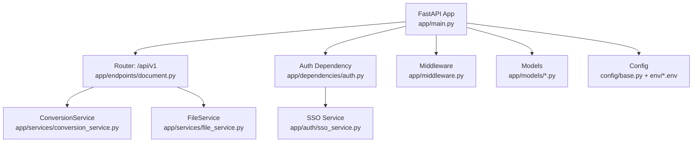
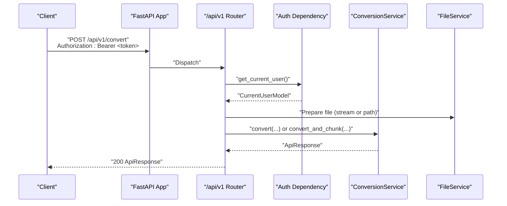
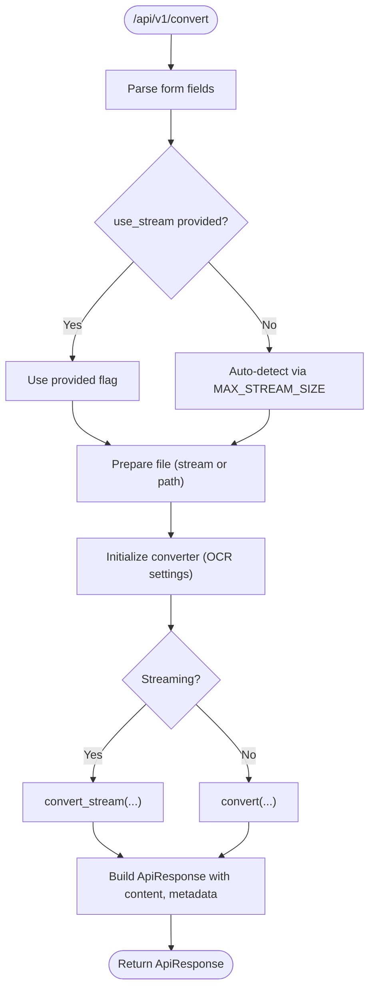
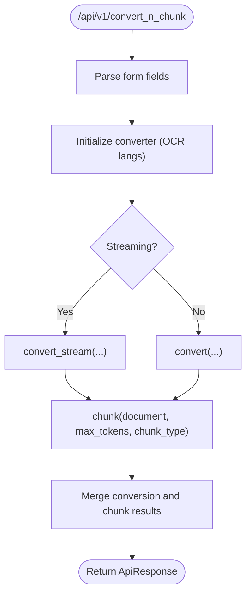
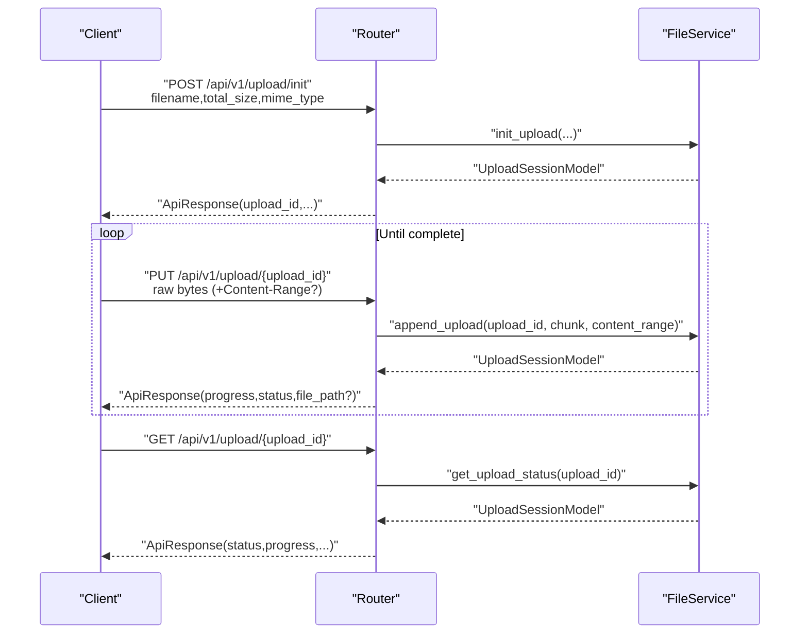
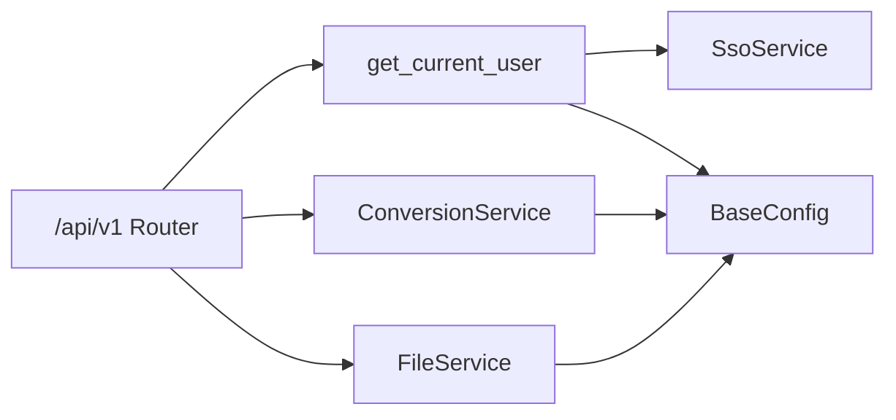

# API Reference

<cite>
**Referenced Files in This Document**
- [app/main.py](file://app/main.py)
- [app/endpoints/document.py](file://app/endpoints/document.py)
- [app/models/api_response.py](file://app/models/api_response.py)
- [app/models/error_model.py](file://app/models/error_model.py)
- [app/models/document_model.py](file://app/models/document_model.py)
- [app/services/conversion_service.py](file://app/services/conversion_service.py)
- [app/services/file_service.py](file://app/services/file_service.py)
- [app/dependencies/auth.py](file://app/dependencies/auth.py)
- [app/auth/jwt.py](file://app/auth/jwt.py)
- [app/auth/sso_service.py](file://app/auth/sso_service.py)
- [app/middleware.py](file://app/middleware.py)
- [config/base.py](file://config/base.py)
- [env/dev.env](file://env/dev.env)
- [env/prod.env](file://env/prod.env)
</cite>

## Table of Contents
1. [Introduction](#introduction)
2. [Project Structure](#project-structure)
3. [Core Components](#core-components)
4. [Architecture Overview](#architecture-overview)
5. [Detailed Component Analysis](#detailed-component-analysis)
6. [Dependency Analysis](#dependency-analysis)
7. [Performance Considerations](#performance-considerations)
8. [Troubleshooting Guide](#troubleshooting-guide)
9. [Conclusion](#conclusion)
10. [Appendices](#appendices)

## Introduction
This document describes the Docling API REST endpoints for document processing. It covers:
- Authentication and authorization
- Endpoint catalog: conversion, combined conversion-chunking, and resumable uploads
- Request/response schemas and standardized ApiResponse format
- Error handling and response structures
- Content-type requirements, supported formats, and size limits
- Practical examples for common use cases
- CORS configuration, security headers, and monitoring endpoints

## Project Structure
The API is implemented with FastAPI and organized by concerns:
- Application lifecycle and middleware registration
- Document processing endpoints
- Models for responses, errors, and document processing
- Services for conversion and file handling
- Authentication via SSO and JWT utilities
- Configuration and environment-specific settings

**Diagram sources**
- [app/main.py:73-100](file://app/main.py#L73-L100)
- [app/endpoints/document.py:15-19](file://app/endpoints/document.py#L15-L19)
- [app/services/conversion_service.py:89-96](file://app/services/conversion_service.py#L89-L96)
- [app/services/file_service.py:23-34](file://app/services/file_service.py#L23-L34)
- [app/dependencies/auth.py:23-26](file://app/dependencies/auth.py#L23-L26)
- [app/auth/sso_service.py:8-17](file://app/auth/sso_service.py#L8-L17)
- [app/middleware.py:7-45](file://app/middleware.py#L7-L45)
- [config/base.py:9-57](file://config/base.py#L9-L57)
- [env/dev.env:1-14](file://env/dev.env#L1-L14)
- [env/prod.env:1-14](file://env/prod.env#L1-L14)

**Section sources**
- [app/main.py:73-100](file://app/main.py#L73-L100)
- [app/endpoints/document.py:15-19](file://app/endpoints/document.py#L15-L19)
- [config/base.py:9-57](file://config/base.py#L9-L57)

## Core Components
- Authentication and Authorization
  - Bearer token validation via SSO introspection. When disabled, a mock user is returned for development.
  - Token extraction supports Authorization header or fallback parsing.
- Standardized Response Format
  - ApiResponse wraps success/error responses with a consistent structure and optional pagination fields.
  - Error responses use a dedicated ErrorResponse model for serialization.
- Document Processing
  - ConversionService integrates Docling to extract text and tables from PDFs, images, DOCX, PPTX, XLSX, HTML, ASCIIDOC, CSV, MD.
  - FileService validates and streams uploads, supports resumable uploads with Content-Range.
- Middleware
  - CorrelationIdMiddleware injects and propagates X-Request-ID.
  - LoggerMiddleware attaches request-scoped logging.

**Section sources**
- [app/dependencies/auth.py:23-129](file://app/dependencies/auth.py#L23-L129)
- [app/auth/sso_service.py:50-53](file://app/auth/sso_service.py#L50-L53)
- [app/models/api_response.py:14-147](file://app/models/api_response.py#L14-L147)
- [app/models/error_model.py:8-13](file://app/models/error_model.py#L8-L13)
- [app/services/conversion_service.py:89-132](file://app/services/conversion_service.py#L89-L132)
- [app/services/file_service.py:35-163](file://app/services/file_service.py#L35-L163)
- [app/middleware.py:7-99](file://app/middleware.py#L7-L99)

## Architecture Overview
The API enforces authentication at the router level and delegates processing to services. Responses are standardized using ApiResponse.

**Diagram sources**
- [app/endpoints/document.py:101-160](file://app/endpoints/document.py#L101-L160)
- [app/dependencies/auth.py:23-129](file://app/dependencies/auth.py#L23-L129)
- [app/services/conversion_service.py:133-174](file://app/services/conversion_service.py#L133-L174)
- [app/services/file_service.py:43-98](file://app/services/file_service.py#L43-L98)

## Detailed Component Analysis

### Authentication and Authorization
- Method: Bearer token via Authorization header.
- Validation: SSO introspection to verify token activity and extract user claims.
- Behavior:
  - When DISABLE_AUTH is true, a mock user is returned.
  - Missing or inactive tokens result in 401 Unauthorized.
- Headers:
  - WWW-Authenticate: Bearer on authentication failures.
- SSO Integration:
  - SsoService exposes introspect_token and other flows.
  - JWT utilities provide token creation/decoding helpers.

**Section sources**
- [app/dependencies/auth.py:23-129](file://app/dependencies/auth.py#L23-L129)
- [app/auth/sso_service.py:50-53](file://app/auth/sso_service.py#L50-L53)
- [app/auth/jwt.py:31-56](file://app/auth/jwt.py#L31-L56)
- [env/dev.env:14](file://env/dev.env#L14)
- [env/prod.env:14](file://env/prod.env#L14)

### Standardized ApiResponse Format
- Fields:
  - status: 0 for success, 4 for error
  - data: string, dict, list of dicts, or Pydantic model
  - error_message: present only on error
  - total_elements, page, page_size, total_pages: pagination hints
  - error_type: error classification
  - timestamp: UTC timestamp
- Validation:
  - Data type constraints enforced at model level.
  - error_message presence validated against status.
- Serialization:
  - to_dict excludes None values and normalizes timestamp.

**Section sources**
- [app/models/api_response.py:14-147](file://app/models/api_response.py#L14-L147)

### Error Response Structures
- ErrorResponseModel:
  - success: false
  - error: error message
  - details: optional
- Global exception handlers:
  - ErrorResponse mapped to 400 with ApiResponse.error.
  - Generic Exception mapped to 500 with ApiResponse.error.

**Section sources**
- [app/models/error_model.py:8-13](file://app/models/error_model.py#L8-L13)
- [app/main.py:135-159](file://app/main.py#L135-L159)

### Endpoints

#### GET /
- Purpose: Root health/status summary.
- Auth: Not protected by default; logged for observability.
- Response: ApiResponse with app metadata and status.

**Section sources**
- [app/main.py:101-113](file://app/main.py#L101-L113)

#### GET /health
- Purpose: Health check endpoint.
- Response: ApiResponse with status, timestamp, converter status, environment.

**Section sources**
- [app/main.py:116-130](file://app/main.py#L116-L130)

#### POST /api/v1/convert
- Purpose: Convert a document to plaintext, markdown, HTML, or chunking format.
- Authentication: Required (Bearer token).
- Request
  - Content-Type: multipart/form-data
  - Body fields:
    - file: optional UploadFile (direct upload)
    - upload_id: optional string (previously uploaded session)
    - use_stream: optional boolean (auto if omitted)
    - enable_ocr: string ("true"/"false")
    - output_type: enum (plaintext | markdown | html | chunking)
- Behavior
  - If upload_id provided, uses previously uploaded file and schedules cleanup.
  - Decides streaming vs file-based based on use_stream or MAX_STREAM_SIZE.
  - Initializes converter with OCR settings and performs conversion.
- Response: ApiResponse with content, processing_time, metadata, and streaming_used flag.

**Section sources**
- [app/endpoints/document.py:101-160](file://app/endpoints/document.py#L101-L160)
- [app/services/conversion_service.py:133-174](file://app/services/conversion_service.py#L133-L174)
- [config/base.py:24](file://config/base.py#L24)

#### POST /api/v1/convert_n_chunk
- Purpose: Convert and chunk a document into token-limited segments.
- Authentication: Required (Bearer token).
- Request
  - Content-Type: multipart/form-data
  - Body fields:
    - file: optional UploadFile
    - upload_id: optional string
    - use_stream: optional boolean
    - enable_ocr: string ("true"/"false")
    - ocr_langs: string (comma-separated)
    - max_tokens: integer (default from settings)
    - output_type: enum (plaintext | markdown | html | chunking)
    - chunk_type: enum (hierarchical | hybrid | page)
- Behavior
  - Initializes converter with OCR languages.
  - Performs conversion and chunking; returns combined result or conversion-only on chunking failure.
- Response: ApiResponse with conversion and chunks, total_chunks, processing_time, streaming_used.

**Section sources**
- [app/endpoints/document.py:162-231](file://app/endpoints/document.py#L162-L231)
- [app/services/conversion_service.py:345-410](file://app/services/conversion_service.py#L345-L410)
- [config/base.py:21](file://config/base.py#L21)

#### POST /api/v1/upload/init
- Purpose: Initialize a resumable upload session.
- Authentication: Required (Bearer token).
- Request
  - Content-Type: application/x-www-form-urlencoded
  - Form fields:
    - filename: string
    - total_size: integer (bytes, required, >= 1)
    - mime_type: optional string
- Response: ApiResponse with upload_id, filename, sizes, progress, status, and message.

**Section sources**
- [app/endpoints/document.py:238-277](file://app/endpoints/document.py#L238-L277)
- [app/services/file_service.py:194-220](file://app/services/file_service.py#L194-L220)
- [config/base.py:23](file://config/base.py#L23)

#### PUT /api/v1/upload/{upload_id}
- Purpose: Append a chunk to an existing session.
- Authentication: Required (Bearer token).
- Request
  - Content-Type: application/octet-stream (raw binary)
  - Headers:
    - Content-Range: optional "bytes {start}-{end}/{total}"
- Response: ApiResponse with upload_id, received_size, total_size, progress, status, and file_path if completed.

**Section sources**
- [app/endpoints/document.py:279-324](file://app/endpoints/document.py#L279-L324)
- [app/services/file_service.py:222-324](file://app/services/file_service.py#L222-L324)

#### GET /api/v1/upload/{upload_id}
- Purpose: Retrieve the status of a resumable upload session.
- Authentication: Required (Bearer token).
- Response: ApiResponse with upload_id, filename, sizes, progress, status, timestamps.

**Section sources**
- [app/endpoints/document.py:326-352](file://app/endpoints/document.py#L326-L352)
- [app/services/file_service.py:326-329](file://app/services/file_service.py#L326-L329)

### Request/Response Schemas

#### ApiResponse
- Success shape: ApiResponse.success(data, pagination fields)
- Error shape: ApiResponse.error(error_message, error_type, data)
- Fields: status, data, error_message, total_elements, page, page_size, total_pages, error_type, timestamp

**Section sources**
- [app/models/api_response.py:14-147](file://app/models/api_response.py#L14-L147)

#### Error Response
- ErrorResponseModel: success=false, error, details (optional)

**Section sources**
- [app/models/error_model.py:8-13](file://app/models/error_model.py#L8-L13)

#### Document Processing Models
- OutputType: plaintext | markdown | html | chunking
- ChunkType: hierarchical | hybrid | page
- UploadStatusEnum: in_progress | completed | failed
- UploadSessionModel: identifiers, paths, sizes, status, timestamps

**Section sources**
- [app/models/document_model.py:9-74](file://app/models/document_model.py#L9-L74)

### Processing Logic and Data Flow

#### Conversion Flow

**Diagram sources**
- [app/endpoints/document.py:101-160](file://app/endpoints/document.py#L101-L160)
- [app/services/conversion_service.py:133-174](file://app/services/conversion_service.py#L133-L174)

#### Combined Conversion and Chunking Flow

**Diagram sources**
- [app/endpoints/document.py:162-231](file://app/endpoints/document.py#L162-L231)
- [app/services/conversion_service.py:345-410](file://app/services/conversion_service.py#L345-L410)

#### Resumable Upload Flow

**Diagram sources**
- [app/endpoints/document.py:238-352](file://app/endpoints/document.py#L238-L352)
- [app/services/file_service.py:194-324](file://app/services/file_service.py#L194-L324)

## Dependency Analysis
- Router-level dependency:
  - All /api/v1 endpoints depend on get_current_user, enforcing Bearer token validation.
- Service dependencies:
  - ConversionService depends on Docling and thread pool executor.
  - FileService depends on magic for MIME detection and aiofiles for async IO.
- Configuration:
  - BaseConfig defines defaults for formats, sizes, threading, OCR, CORS, and SSO/JWT settings.
  - Environment files override defaults per deployment.

**Diagram sources**
- [app/endpoints/document.py:18](file://app/endpoints/document.py#L18)
- [app/dependencies/auth.py:23-129](file://app/dependencies/auth.py#L23-L129)
- [app/auth/sso_service.py:50-53](file://app/auth/sso_service.py#L50-L53)
- [app/services/conversion_service.py:89-132](file://app/services/conversion_service.py#L89-L132)
- [app/services/file_service.py:23-34](file://app/services/file_service.py#L23-L34)
- [config/base.py:9-57](file://config/base.py#L9-L57)

**Section sources**
- [app/endpoints/document.py:18](file://app/endpoints/document.py#L18)
- [app/dependencies/auth.py:23-129](file://app/dependencies/auth.py#L23-L129)
- [app/services/conversion_service.py:89-132](file://app/services/conversion_service.py#L89-L132)
- [app/services/file_service.py:23-34](file://app/services/file_service.py#L23-L34)
- [config/base.py:9-57](file://config/base.py#L9-L57)

## Performance Considerations
- Streaming vs File-based Conversion
  - Auto-selection occurs when file size <= MAX_STREAM_SIZE; otherwise file-based conversion is used.
  - Streaming avoids disk writes and reduces latency for small files.
- Thread Pool Executor
  - ConversionService uses a shared ThreadPoolExecutor to offload CPU-bound conversion tasks.
- Chunk Size and Limits
  - UPLOAD_CHUNK_SIZE controls read/write chunk size for uploads and streaming.
  - MAX_FILE_SIZE caps upload sizes across multiple paths.
- OCR and Languages
  - enable_ocr toggles OCR processing; ocr_langs influences accuracy and cost.
- Tokenization for Chunking
  - Chunking uses a tokenizer with max_tokens to bound chunk sizes.

**Section sources**
- [app/endpoints/document.py:27-41](file://app/endpoints/document.py#L27-L41)
- [app/services/conversion_service.py:70-87](file://app/services/conversion_service.py#L70-L87)
- [app/services/file_service.py:35-163](file://app/services/file_service.py#L35-L163)
- [config/base.py:23-26](file://config/base.py#L23-L26)

## Troubleshooting Guide
- Authentication Failures
  - 401 Unauthorized indicates missing or invalid token; ensure Authorization: Bearer header is present and active.
  - When DISABLE_AUTH=true, expect a mock user in development.
- Upload Issues
  - 413 Payload Too Large: file exceeds MAX_FILE_SIZE; reduce file size or switch to resumable uploads.
  - Unsupported file type: MIME not in SUPPORTED_FORMATS; verify file type and extension.
  - Resumable session not found or not completed: use upload_id only after completion.
- Conversion Errors
  - ConversionService returns ApiResponse.error on failures; inspect error_message and consider enabling OCR or adjusting chunk parameters.
- Global Exceptions
  - Unhandled exceptions return 500 with standardized error response.

**Section sources**
- [app/dependencies/auth.py:38-90](file://app/dependencies/auth.py#L38-L90)
- [app/services/file_service.py:40-98](file://app/services/file_service.py#L40-L98)
- [app/services/conversion_service.py:169-173](file://app/services/conversion_service.py#L169-L173)
- [app/main.py:135-159](file://app/main.py#L135-L159)

## Conclusion
The Docling API provides robust, standards-compliant endpoints for document conversion and chunking, with resumable uploads, centralized authentication via SSO, and a unified ApiResponse format. Configuration is environment-driven, enabling flexible deployments from development to production.

## Appendices

### Authentication Methods
- Bearer Token via SSO Introspection
  - Extract token from Authorization header or request context.
  - Validate via SsoService.introspect_token; require active=True.
- JWT Utilities
  - Token creation and decoding helpers available for internal use.

**Section sources**
- [app/dependencies/auth.py:23-129](file://app/dependencies/auth.py#L23-L129)
- [app/auth/jwt.py:18-56](file://app/auth/jwt.py#L18-L56)
- [app/auth/sso_service.py:50-53](file://app/auth/sso_service.py#L50-L53)

### Rate Limiting
- Not implemented in the current codebase. Consider deploying an external rate limiter or adding middleware if needed.

### Content-Type Requirements
- /api/v1/convert: multipart/form-data
- /api/v1/convert_n_chunk: multipart/form-data
- /api/v1/upload/init: application/x-www-form-urlencoded
- /api/v1/upload/{upload_id}: application/octet-stream (raw binary)

**Section sources**
- [app/endpoints/document.py:101-160](file://app/endpoints/document.py#L101-L160)
- [app/endpoints/document.py:238-277](file://app/endpoints/document.py#L238-L277)
- [app/endpoints/document.py:279-324](file://app/endpoints/document.py#L279-L324)

### Supported File Formats and Size Limits
- Supported formats: controlled by SUPPORTED_FORMATS; defaults include PDF and plain text; dev env extends to many office, image, XML formats.
- Max file size: MAX_FILE_SIZE bytes (200 MB default).
- Max stream size: MAX_STREAM_SIZE bytes (50 MB default); determines auto-streaming behavior.

**Section sources**
- [config/base.py:19](file://config/base.py#L19)
- [env/dev.env:2](file://env/dev.env#L2)
- [config/base.py:23-24](file://config/base.py#L23-L24)

### CORS Configuration
- Origins: configured via CORS_ORIGINS; defaults to "*" in base settings.
- Credentials, methods, and headers are allowed broadly.

**Section sources**
- [app/main.py:87-95](file://app/main.py#L87-L95)
- [config/base.py:36](file://config/base.py#L36)

### Security Headers and Monitoring
- Security Headers
  - X-Request-ID propagated via CorrelationIdMiddleware in both request and response.
- Monitoring Endpoints
  - GET / (root) and GET /health exposed for availability checks.

**Section sources**
- [app/middleware.py:20-45](file://app/middleware.py#L20-L45)
- [app/main.py:101-130](file://app/main.py#L101-L130)

### Practical Examples

#### Example: Convert a PDF to Markdown
- Endpoint: POST /api/v1/convert
- Headers: Authorization: Bearer <token>
- Body: multipart/form-data with file=<PDF>
- Response: ApiResponse with content and metadata

#### Example: Convert and Chunk a Document
- Endpoint: POST /api/v1/convert_n_chunk
- Body fields: file=<document>, max_tokens=512, chunk_type=hybrid, enable_ocr=false
- Response: ApiResponse with conversion and chunks

#### Example: Resumable Upload Workflow
- Init: POST /api/v1/upload/init with filename, total_size, mime_type
- Upload: PUT /api/v1/upload/{upload_id} with raw bytes and optional Content-Range
- Status: GET /api/v1/upload/{upload_id}
- Convert: POST /api/v1/convert with upload_id

**Section sources**
- [app/endpoints/document.py:101-160](file://app/endpoints/document.py#L101-L160)
- [app/endpoints/document.py:162-231](file://app/endpoints/document.py#L162-L231)
- [app/endpoints/document.py:238-352](file://app/endpoints/document.py#L238-L352)