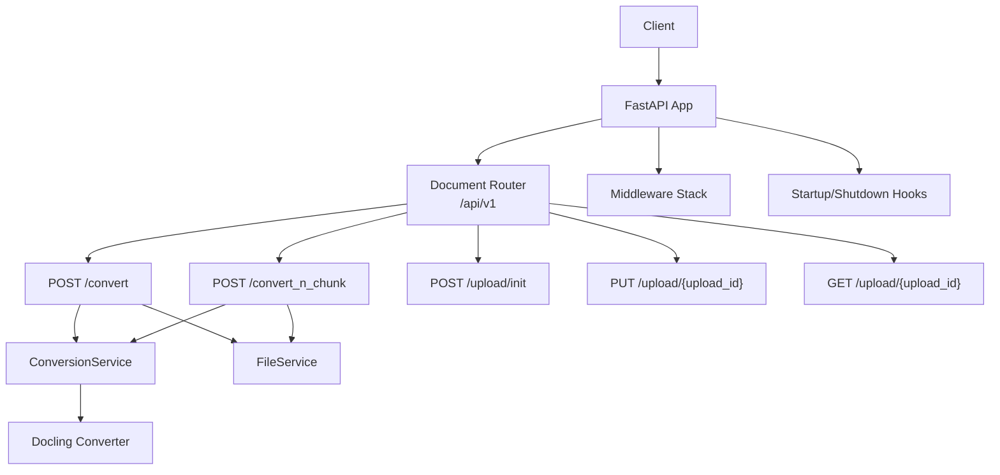
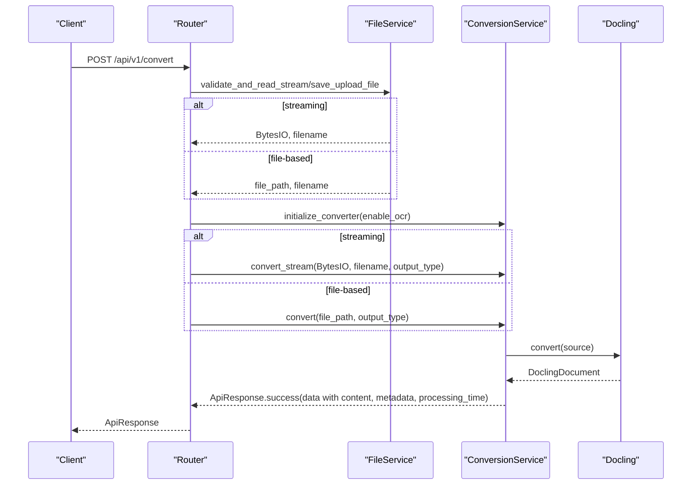
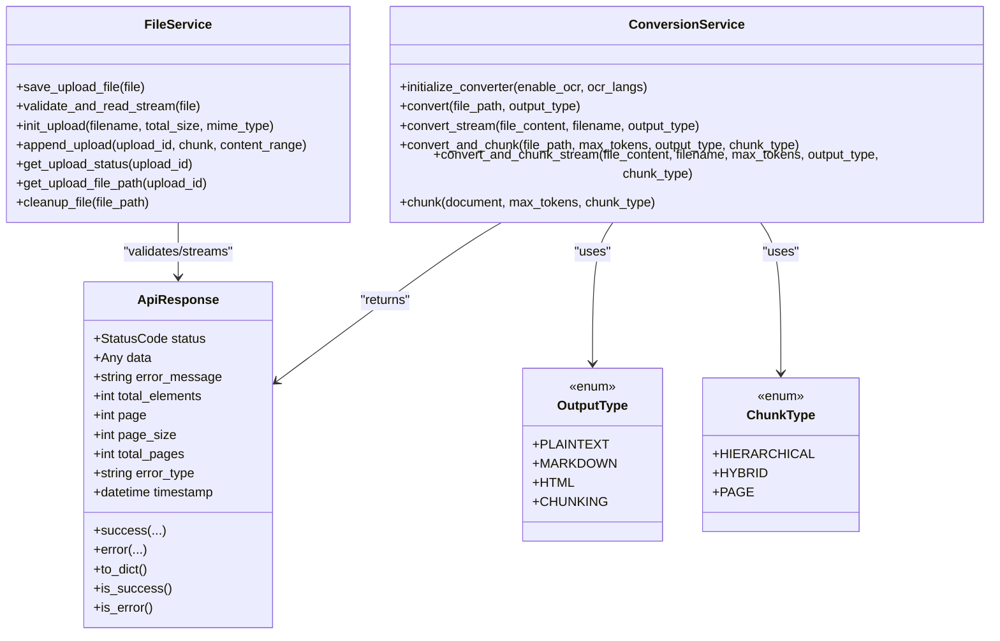
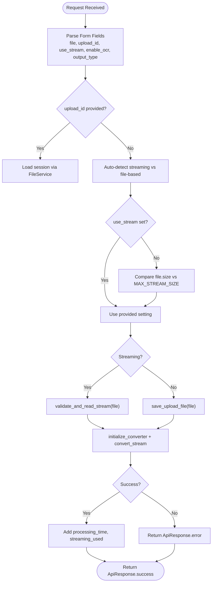
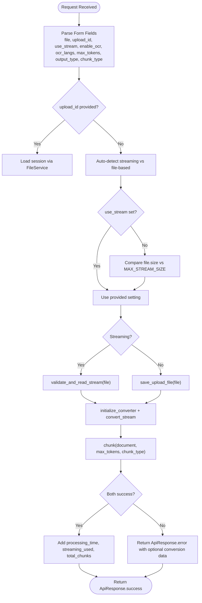
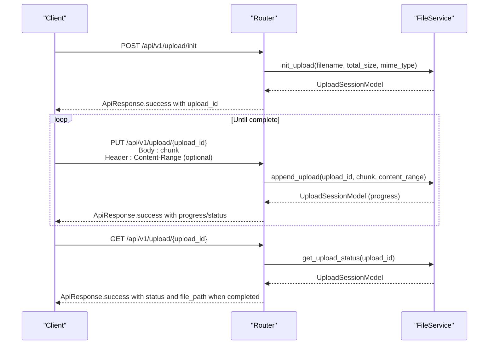
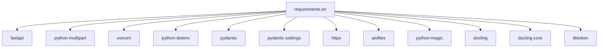

# Document Processing Endpoints

<cite>
**Referenced Files in This Document**
- [app/endpoints/document.py](file://app/endpoints/document.py)
- [app/services/conversion_service.py](file://app/services/conversion_service.py)
- [app/services/file_service.py](file://app/services/file_service.py)
- [app/models/api_response.py](file://app/models/api_response.py)
- [app/models/document_model.py](file://app/models/document_model.py)
- [app/main.py](file://app/main.py)
- [config/base.py](file://config/base.py)
- [requirements.txt](file://requirements.txt)
</cite>

## Table of Contents
1. [Introduction](#introduction)
2. [Project Structure](#project-structure)
3. [Core Components](#core-components)
4. [Architecture Overview](#architecture-overview)
5. [Detailed Component Analysis](#detailed-component-analysis)
6. [Dependency Analysis](#dependency-analysis)
7. [Performance Considerations](#performance-considerations)
8. [Troubleshooting Guide](#troubleshooting-guide)
9. [Conclusion](#conclusion)
10. [Appendices](#appendices)

## Introduction
This document provides comprehensive API documentation for the document processing endpoints. It covers:
- Standard conversion endpoint for transforming documents into structured text or HTML
- Combined conversion and chunking endpoint for token-aware segmentation
- Resumable upload support for large files
- Streaming vs file-based processing modes
- Supported file formats and content-type requirements
- Standardized response format and error handling patterns
- Processing time metrics and practical usage examples

## Project Structure
The API is built with FastAPI and organized into modular components:
- Endpoints: route definitions and request handling
- Services: conversion and file management logic
- Models: response and request schemas
- Configuration: environment-driven settings
- Application lifecycle: startup/shutdown hooks and middleware

**Diagram sources**
- [app/endpoints/document.py:101-231](file://app/endpoints/document.py#L101-L231)
- [app/services/conversion_service.py:89-478](file://app/services/conversion_service.py#L89-L478)
- [app/services/file_service.py:23-347](file://app/services/file_service.py#L23-L347)
- [app/main.py:49-160](file://app/main.py#L49-L160)

**Section sources**
- [app/endpoints/document.py:101-231](file://app/endpoints/document.py#L101-L231)
- [app/main.py:49-160](file://app/main.py#L49-L160)

## Core Components
- Document endpoints module: defines conversion and chunking routes, streaming detection, and resumable upload integration
- Conversion service: orchestrates Docling-based conversion, chunking, and thread-pool execution
- File service: validates, streams, saves, and manages resumable uploads
- Standardized response model: ApiResponse with consistent fields and validation
- Document models: enums for output and chunk types, upload session model
- Configuration: environment-driven limits and defaults

Key responsibilities:
- Endpoint routing and parameter parsing
- Streaming vs file-based decision logic
- OCR enablement and language configuration
- Chunking strategies and token limits
- Resumable upload lifecycle management
- Unified response and error handling

**Section sources**
- [app/endpoints/document.py:101-231](file://app/endpoints/document.py#L101-L231)
- [app/services/conversion_service.py:89-478](file://app/services/conversion_service.py#L89-L478)
- [app/services/file_service.py:23-347](file://app/services/file_service.py#L23-L347)
- [app/models/api_response.py:14-147](file://app/models/api_response.py#L14-L147)
- [app/models/document_model.py:9-74](file://app/models/document_model.py#L9-L74)
- [config/base.py:9-57](file://config/base.py#L9-L57)

## Architecture Overview
The endpoints integrate with services and configuration to deliver robust document processing:
- Streaming detection prioritizes memory usage thresholds
- ConversionService initializes a shared Docling converter and executes CPU-bound tasks in a thread pool
- FileService handles validation, streaming, and resumable uploads
- ApiResponse standardizes success and error responses with timestamps and pagination fields

**Diagram sources**
- [app/endpoints/document.py:101-160](file://app/endpoints/document.py#L101-L160)
- [app/services/conversion_service.py:89-265](file://app/services/conversion_service.py#L89-L265)
- [app/services/file_service.py:110-163](file://app/services/file_service.py#L110-L163)

## Detailed Component Analysis

### Standard Conversion Endpoint: POST /api/v1/convert
Purpose:
- Convert uploaded documents to plaintext, markdown, or HTML
- Supports streaming for small files and file-based processing for larger ones
- Optional OCR enablement and resumable upload usage

Parameters:
- file: multipart/form-data file upload (optional if upload_id provided)
- upload_id: string UUID of a completed resumable upload session (optional if file provided)
- use_stream: boolean string ("true"/"false"/"1"/"yes") to force streaming or file-based mode; auto-detect if omitted
- enable_ocr: boolean string to enable OCR processing
- output_type: enum selecting output format (plaintext, markdown, html)

Behavior:
- Decides streaming vs file-based based on use_stream and file size vs MAX_STREAM_SIZE
- Validates file type and size via FileService
- Initializes ConversionService with OCR settings
- Converts document and enriches response with processing_time and streaming_used flags

Response:
- On success: ApiResponse.success with content, metadata, processing_time, streaming_used
- On failure: ApiResponse.error with error_message and optional error_type

Error handling:
- HTTP 400 for invalid requests (missing file, unsupported type)
- HTTP 413 for oversized files
- HTTP 404 for missing resumable upload sessions
- HTTP 500 for unexpected errors

Metrics:
- processing_time: total seconds elapsed for conversion
- streaming_used: boolean indicating chosen processing mode

Supported formats:
- PDF, DOCX, PPTX, XLSX, images (PNG/JPEG), HTML, CSV, Markdown, ASCIIDOC

Content-Type requirements:
- Multipart form for file uploads
- For resumable uploads, raw binary body accepted

Practical examples:
- Direct file upload: send multipart/form-data with file field
- Resumable upload: initialize session, upload chunks, then call /api/v1/convert with upload_id
- Streaming optimization: ensure file size ≤ MAX_STREAM_SIZE to use in-memory stream
- OCR language: enable_ocr=true with ocr_langs parameter in convert_n_chunk endpoint

**Section sources**
- [app/endpoints/document.py:101-160](file://app/endpoints/document.py#L101-L160)
- [app/services/conversion_service.py:133-174](file://app/services/conversion_service.py#L133-L174)
- [app/services/file_service.py:35-98](file://app/services/file_service.py#L35-L98)
- [config/base.py:23-25](file://config/base.py#L23-L25)

### Combined Conversion and Chunking Endpoint: POST /api/v1/convert_n_chunk
Purpose:
- Convert document and segment content into token-limited chunks
- Configure chunk size, chunking strategy, and OCR languages

Parameters:
- file: multipart/form-data file upload (optional if upload_id provided)
- upload_id: string UUID of a completed resumable upload session (optional if file provided)
- use_stream: boolean string to force streaming or file-based mode; auto-detect if omitted
- enable_ocr: boolean string to enable OCR processing
- ocr_langs: comma-separated list of OCR languages (e.g., "eng,id")
- max_tokens: integer token budget per chunk (default from settings)
- output_type: enum selecting output format (plaintext, markdown, html)
- chunk_type: enum selecting chunking strategy (hierarchical, hybrid, page)

Behavior:
- Similar streaming/file-based decision as /convert
- Initializes ConversionService with OCR languages
- Converts document and then chunks the resulting DoclingDocument
- Returns both conversion result and chunk list with token counts

Response:
- On success: ApiResponse.success with conversion content/metadata and chunks array
- On failure: ApiResponse.error with error_message; if chunking fails, conversion result may still be included

Metrics:
- processing_time: total seconds elapsed for conversion and chunking
- streaming_used: boolean indicating chosen processing mode
- total_chunks: count of generated chunks

Chunking strategies:
- hierarchical: hierarchical segmentation
- hybrid: token-aware contextualization
- page: page-level segmentation

**Section sources**
- [app/endpoints/document.py:162-231](file://app/endpoints/document.py#L162-L231)
- [app/services/conversion_service.py:266-478](file://app/services/conversion_service.py#L266-L478)
- [app/models/document_model.py:17-22](file://app/models/document_model.py#L17-L22)
- [config/base.py:21-22](file://config/base.py#L21-L22)

### Resumable Upload Endpoints
Purpose:
- Enable large file uploads with restart capability and progress tracking

Endpoints:
- POST /api/v1/upload/init: Initialize a resumable upload session
- PUT /api/v1/upload/{upload_id}: Append a chunk (supports Content-Range)
- GET /api/v1/upload/{upload_id}: Check upload status

Behavior:
- Session storage is maintained in memory with automatic pruning of expired sessions
- File type validation occurs upon completion
- Cleanup scheduled for completed or failed sessions

Usage flow:
- Initialize session with filename, total_size, optional mime_type
- Send chunks via PUT with optional Content-Range header
- Poll status via GET until completed
- Use upload_id in /api/v1/convert or /api/v1/convert_n_chunk

**Section sources**
- [app/endpoints/document.py:238-353](file://app/endpoints/document.py#L238-L353)
- [app/services/file_service.py:194-347](file://app/services/file_service.py#L194-L347)
- [config/base.py:23-25](file://config/base.py#L23-L25)

### Streaming vs File-Based Processing
Decision logic:
- use_stream explicitly set: honor the user’s choice
- use_stream None: auto-detect based on file size vs MAX_STREAM_SIZE
- Streaming path: validate and read into BytesIO without writing to disk
- File-based path: save to disk and schedule cleanup

Benefits:
- Streaming reduces disk I/O and latency for small files
- File-based avoids memory pressure for large files

**Section sources**
- [app/endpoints/document.py:27-41](file://app/endpoints/document.py#L27-L41)
- [app/endpoints/document.py:43-94](file://app/endpoints/document.py#L43-L94)
- [app/services/file_service.py:110-163](file://app/services/file_service.py#L110-L163)
- [config/base.py:24](file://config/base.py#L24)

### Standardized ApiResponse Format
Structure:
- status: 0 for success, 4 for error
- data: optional payload (string, dict, list of dicts, or model)
- error_message: present only when status indicates error
- error_type: optional error classification
- total_elements, page, page_size, total_pages: pagination fields
- timestamp: UTC timestamp of response

Validation:
- Data type constraints enforced
- Error message presence validated against status

Factory methods:
- ApiResponse.success(...) for successful responses
- ApiResponse.error(...) for error responses

Serialization:
- to_dict excludes None values and ensures timestamp is serialized

**Section sources**
- [app/models/api_response.py:14-147](file://app/models/api_response.py#L14-L147)

### Supported File Formats and Content-Type Requirements
Formats supported by Docling pipeline:
- PDF, DOCX, PPTX, XLSX, images (PNG/JPEG), HTML, CSV, Markdown, ASCIIDOC

Content-Type requirements:
- Direct uploads: multipart/form-data with file field
- Resumable chunks: raw binary body; optional Content-Range header

Validation:
- File type detection via python-magic
- Size checks against MAX_FILE_SIZE

**Section sources**
- [app/services/conversion_service.py:28-67](file://app/services/conversion_service.py#L28-L67)
- [app/services/file_service.py:35-98](file://app/services/file_service.py#L35-L98)
- [requirements.txt:11](file://requirements.txt#L11)

### Processing Time Metrics
Metrics included in successful responses:
- processing_time: total seconds for conversion or conversion+chunking
- streaming_used: boolean indicating chosen processing mode
- total_chunks: count of chunks (convert_n_chunk)
- metadata: page_count and file_type when available

**Section sources**
- [app/endpoints/document.py:142-150](file://app/endpoints/document.py#L142-L150)
- [app/endpoints/document.py:212-221](file://app/endpoints/document.py#L212-L221)
- [app/services/conversion_service.py:244-248](file://app/services/conversion_service.py#L244-L248)

## Architecture Overview

**Diagram sources**
- [app/models/api_response.py:14-147](file://app/models/api_response.py#L14-L147)
- [app/services/conversion_service.py:89-478](file://app/services/conversion_service.py#L89-L478)
- [app/services/file_service.py:23-347](file://app/services/file_service.py#L23-L347)
- [app/models/document_model.py:9-22](file://app/models/document_model.py#L9-L22)

## Detailed Component Analysis

### Endpoint Parameter Flow: POST /api/v1/convert

**Diagram sources**
- [app/endpoints/document.py:101-160](file://app/endpoints/document.py#L101-L160)
- [app/services/file_service.py:110-163](file://app/services/file_service.py#L110-L163)
- [app/services/conversion_service.py:133-174](file://app/services/conversion_service.py#L133-L174)

### Endpoint Parameter Flow: POST /api/v1/convert_n_chunk

**Diagram sources**
- [app/endpoints/document.py:162-231](file://app/endpoints/document.py#L162-L231)
- [app/services/file_service.py:110-163](file://app/services/file_service.py#L110-L163)
- [app/services/conversion_service.py:345-478](file://app/services/conversion_service.py#L345-L478)

### Resumable Upload Lifecycle

**Diagram sources**
- [app/endpoints/document.py:238-353](file://app/endpoints/document.py#L238-L353)
- [app/services/file_service.py:194-347](file://app/services/file_service.py#L194-L347)

## Dependency Analysis
External libraries and their roles:
- FastAPI: web framework and routing
- python-multipart: multipart/form-data parsing
- uvicorn: ASGI server
- python-dotenv: environment loading
- pydantic/pydantic-settings: configuration models
- httpx: HTTP client utilities
- aiofiles: asynchronous file I/O
- python-magic: MIME type detection
- docling/docling-core: document conversion and chunking
- tiktoken: token counting for chunking

**Diagram sources**
- [requirements.txt:1-15](file://requirements.txt#L1-L15)

**Section sources**
- [requirements.txt:1-15](file://requirements.txt#L1-L15)

## Performance Considerations
- Streaming threshold: MAX_STREAM_SIZE controls when to switch from in-memory to file-based processing
- Thread pool: ConversionService uses a shared ThreadPoolExecutor to offload CPU-intensive tasks
- OCR overhead: Enabling OCR increases processing time; specify ocr_langs to limit language detection
- Chunk sizing: max_tokens affects memory footprint and downstream token limits
- Concurrency: Tune THREAD_POOL_SIZE and CONVERTER_NUM_THREADS based on hardware resources

[No sources needed since this section provides general guidance]

## Troubleshooting Guide
Common issues and resolutions:
- Unsupported file type: Ensure file type is among supported formats; check Content-Type and file extension
- File too large: Reduce file size below MAX_FILE_SIZE or use resumable uploads
- Missing upload_id: Verify session completion and existence
- OCR failures: Confirm OCR languages are available and enable_ocr is set appropriately
- Chunking errors: Conversion may succeed even if chunking fails; inspect error_message and conversion data

Error handling patterns:
- HTTP 400 for bad requests (invalid parameters, unsupported type)
- HTTP 404 for missing resources (upload session)
- HTTP 413 for oversized files
- HTTP 500 for internal errors; ApiResponse.error wraps error details

**Section sources**
- [app/endpoints/document.py:154-160](file://app/endpoints/document.py#L154-L160)
- [app/endpoints/document.py:225-231](file://app/endpoints/document.py#L225-L231)
- [app/services/file_service.py:40-98](file://app/services/file_service.py#L40-L98)
- [app/models/api_response.py:109-122](file://app/models/api_response.py#L109-L122)

## Conclusion
The document processing endpoints provide a robust, production-ready solution for converting and chunking diverse document formats. They support streaming optimizations for small files, resumable uploads for large files, configurable OCR, and standardized responses with comprehensive metrics. By tuning parameters such as max_tokens, chunk_type, and OCR languages, users can balance quality, performance, and resource usage according to their specific use cases.

[No sources needed since this section summarizes without analyzing specific files]

## Appendices

### API Definitions

- POST /api/v1/convert
  - Parameters:
    - file: UploadFile (multipart/form-data)
    - upload_id: string (UUID)
    - use_stream: string ("true"/"false"/"1"/"yes"/"no"/"0")
    - enable_ocr: string ("true"/"false")
    - output_type: enum (plaintext/markdown/html)
  - Response: ApiResponse

- POST /api/v1/convert_n_chunk
  - Parameters:
    - file: UploadFile (multipart/form-data)
    - upload_id: string (UUID)
    - use_stream: string ("true"/"false"/"1"/"yes"/"no"/"0")
    - enable_ocr: string ("true"/"false")
    - ocr_langs: string ("lang1,lang2,...")
    - max_tokens: integer
    - output_type: enum (plaintext/markdown/html)
    - chunk_type: enum (hierarchical/hybrid/page)
  - Response: ApiResponse

- POST /api/v1/upload/init
  - Parameters:
    - filename: string
    - total_size: integer (bytes)
    - mime_type: string (optional)
  - Response: ApiResponse with upload_id

- PUT /api/v1/upload/{upload_id}
  - Body: raw binary chunk
  - Headers: Content-Range (optional)
  - Response: ApiResponse with progress and status

- GET /api/v1/upload/{upload_id}
  - Response: ApiResponse with upload status and file_path when completed

**Section sources**
- [app/endpoints/document.py:101-231](file://app/endpoints/document.py#L101-L231)
- [app/endpoints/document.py:238-353](file://app/endpoints/document.py#L238-L353)

### Practical Usage Examples

- Direct file upload (small file under MAX_STREAM_SIZE):
  - Use multipart/form-data with file field; enable_ocr=false; output_type=markdown
  - Expect streaming_used=true in response

- Large file upload:
  - Use POST /api/v1/upload/init to get upload_id
  - Send chunks via PUT /api/v1/upload/{upload_id} with Content-Range
  - Call /api/v1/convert with upload_id

- Streaming optimization:
  - Ensure file size ≤ MAX_STREAM_SIZE to force in-memory stream
  - Monitor processing_time and streaming_used in ApiResponse

- Chunking configurations:
  - Hybrid chunking with max_tokens=512 for LLM ingestion
  - Hierarchical chunking for structured extraction
  - Page chunking for page-aligned processing

**Section sources**
- [app/endpoints/document.py:27-41](file://app/endpoints/document.py#L27-L41)
- [app/endpoints/document.py:101-160](file://app/endpoints/document.py#L101-L160)
- [app/endpoints/document.py:162-231](file://app/endpoints/document.py#L162-L231)
- [config/base.py:21-25](file://config/base.py#L21-L25)