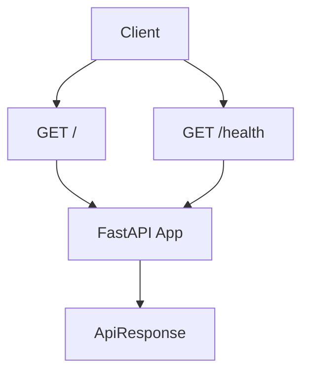
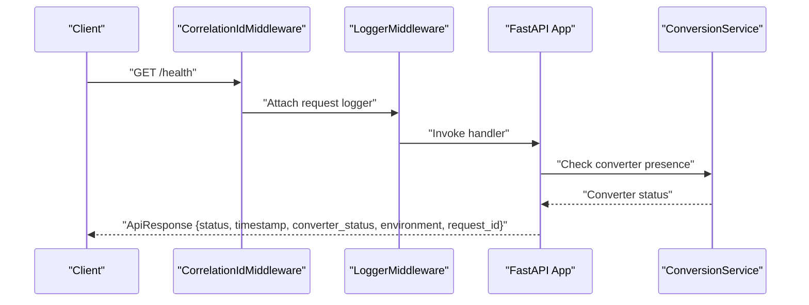
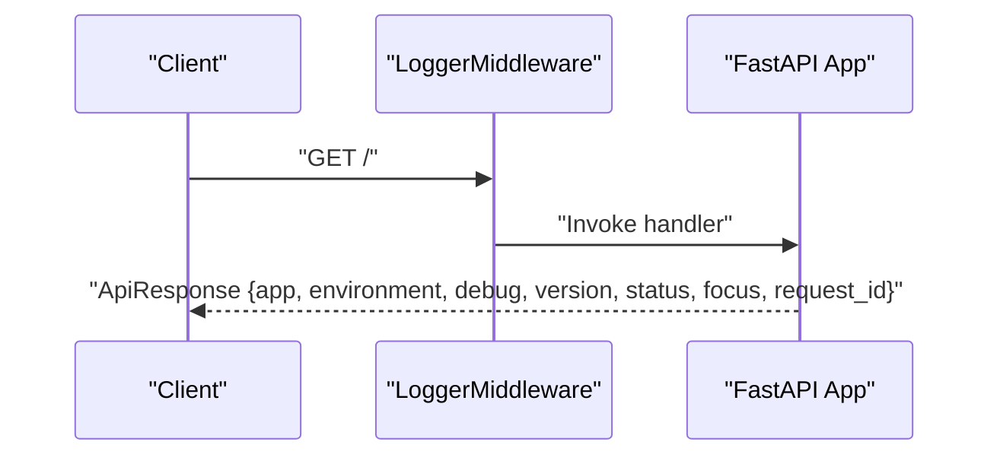
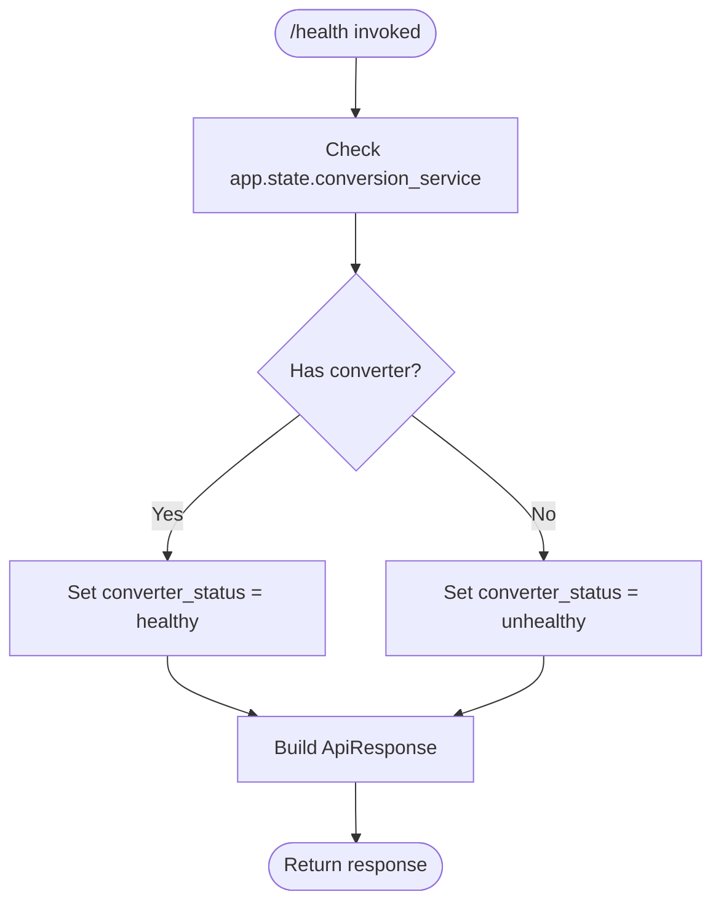
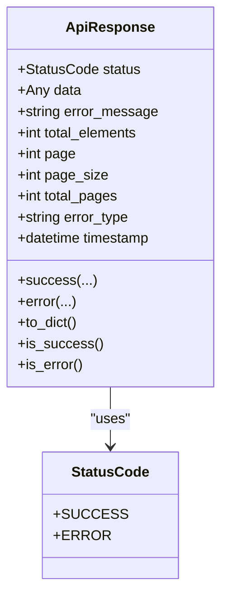
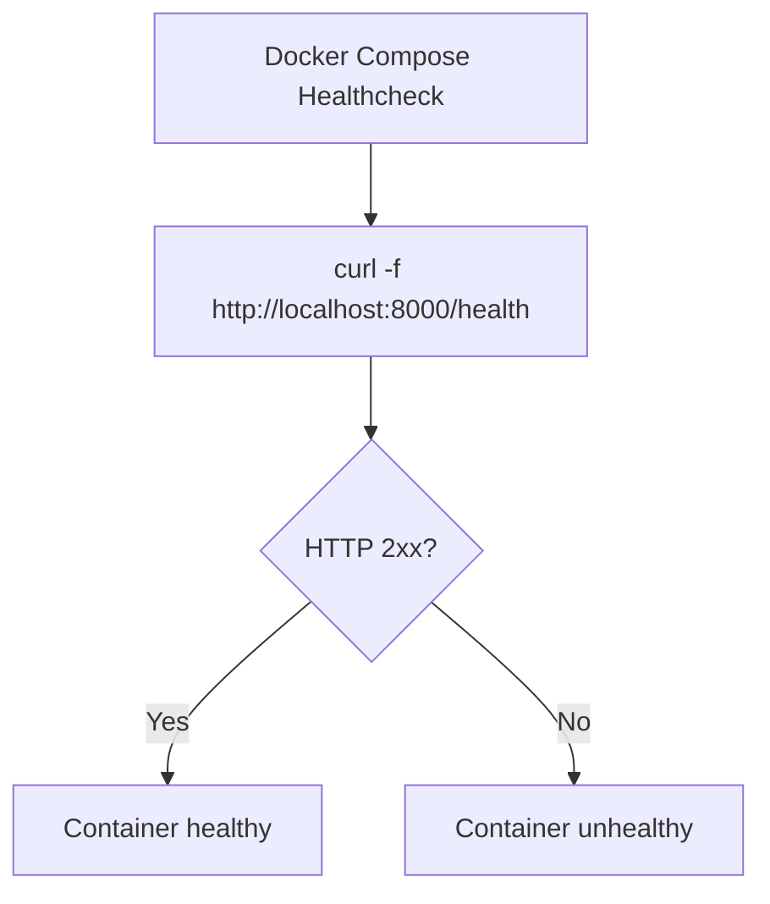
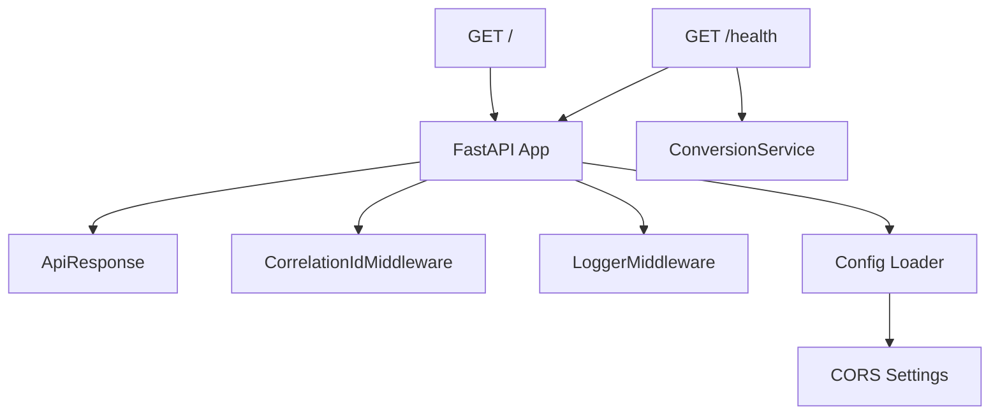

# System & Health Endpoints

<cite>
**Referenced Files in This Document**
- [app/main.py](file://app/main.py)
- [app/middleware.py](file://app/middleware.py)
- [app/models/api_response.py](file://app/models/api_response.py)
- [app/services/conversion_service.py](file://app/services/conversion_service.py)
- [config/base.py](file://config/base.py)
- [config/loader.py](file://config/loader.py)
- [docker-compose.yaml](file://docker-compose.yaml)
</cite>

## Table of Contents
1. [Introduction](#introduction)
2. [Project Structure](#project-structure)
3. [Core Components](#core-components)
4. [Architecture Overview](#architecture-overview)
5. [Detailed Component Analysis](#detailed-component-analysis)
6. [Dependency Analysis](#dependency-analysis)
7. [Performance Considerations](#performance-considerations)
8. [Troubleshooting Guide](#troubleshooting-guide)
9. [Conclusion](#conclusion)
10. [Appendices](#appendices)

## Introduction
This document provides API documentation for the system and health monitoring endpoints exposed by the application. It covers:
- Root endpoint (/) for service identification and basic runtime information
- Health endpoint (/health) for service availability and internal readiness checks
- Response formats for health checks and operational status indicators
- CORS configuration and security considerations for health endpoints
- Best practices for load balancer health probes and automated service discovery integration

## Project Structure
The system exposes two primary endpoints:
- GET /: Returns application metadata and operational status
- GET /health: Returns health status and internal readiness indicators

Both endpoints are implemented in the main application module and use a standardized response model. Middleware ensures correlation IDs and request logging are consistently applied.

**Diagram sources**
- [app/main.py:101-130](file://app/main.py#L101-L130)

**Section sources**
- [app/main.py:101-130](file://app/main.py#L101-L130)

## Core Components
- Root endpoint (/): Provides application identity, environment, debug mode, version, focus area, and runtime status. It also includes the correlation ID from request headers.
- Health endpoint (/health): Provides health status, timestamp, converter readiness, environment, and correlation ID. Converter readiness is derived from the shared conversion service initialized during application startup.

Key response model:
- ApiResponse: Standardized response envelope with status, optional error fields, and timestamp. The success factory method is used by both endpoints.

Middleware:
- CorrelationIdMiddleware: Generates and propagates correlation IDs via request and response headers.
- LoggerMiddleware: Attaches request-scoped logging to each request lifecycle.

Configuration:
- CORS: Controlled via environment variable for origins, credentials, methods, and headers.
- Environment selection: Dev/Test/Prod configuration via loader and environment files.

**Section sources**
- [app/main.py:101-130](file://app/main.py#L101-L130)
- [app/models/api_response.py:14-122](file://app/models/api_response.py#L14-L122)
- [app/middleware.py:7-44](file://app/middleware.py#L7-L44)
- [app/middleware.py:47-99](file://app/middleware.py#L47-L99)
- [config/base.py:35-36](file://config/base.py#L35-L36)
- [config/loader.py:9-51](file://config/loader.py#L9-L51)

## Architecture Overview
The health and root endpoints follow a consistent pattern:
- Route registration on the FastAPI application
- Request logging via middleware
- Standardized response using ApiResponse
- Health readiness depends on the presence of a properly initialized conversion service

**Diagram sources**
- [app/main.py:116-130](file://app/main.py#L116-L130)
- [app/middleware.py:7-44](file://app/middleware.py#L7-L44)
- [app/middleware.py:47-99](file://app/middleware.py#L47-L99)
- [app/services/conversion_service.py:89-132](file://app/services/conversion_service.py#L89-L132)

## Detailed Component Analysis

### Root Endpoint (/)
- Method: GET /
- Purpose: Service identification and runtime status
- Response: ApiResponse.success with:
  - app: Application name from settings
  - environment: Current environment
  - debug: Debug flag
  - version: API version
  - status: Operational status string
  - focus: Primary processing focus
  - request_id: Correlation ID from headers

Implementation highlights:
- Uses request dependency for logging
- Reads correlation ID from headers for traceability

**Diagram sources**
- [app/main.py:101-113](file://app/main.py#L101-L113)
- [app/middleware.py:47-99](file://app/middleware.py#L47-L99)

**Section sources**
- [app/main.py:101-113](file://app/main.py#L101-L113)

### Health Endpoint (/health)
- Method: GET /health
- Purpose: Availability and readiness check
- Response: ApiResponse.success with:
  - status: Always healthy for this endpoint
  - timestamp: Unix timestamp
  - converter_status: "healthy" if conversion service converter exists, otherwise "unhealthy"
  - environment: Current environment
  - request_id: Correlation ID from headers

Readiness logic:
- Health depends on the presence of a conversion service instance and its underlying converter. The service is initialized during application lifespan startup.

**Diagram sources**
- [app/main.py:116-130](file://app/main.py#L116-L130)
- [app/services/conversion_service.py:89-132](file://app/services/conversion_service.py#L89-L132)

**Section sources**
- [app/main.py:116-130](file://app/main.py#L116-L130)

### Response Format Specification
Standardized response envelope:
- Fields: status, data, error_message, total_elements, page, page_size, total_pages, error_type, timestamp
- Success factory: ApiResponse.success(data=...)
- Error factory: ApiResponse.error(error_message, error_type, data)
- Timestamp: UTC-aware timestamp included automatically

**Diagram sources**
- [app/models/api_response.py:14-122](file://app/models/api_response.py#L14-L122)

**Section sources**
- [app/models/api_response.py:14-122](file://app/models/api_response.py#L14-L122)

### CORS Settings
- Origins: Controlled by CORS_ORIGINS environment variable
- Credentials: Allowed
- Methods: All methods
- Headers: All headers
- Applied globally via FastAPI CORSMiddleware

Operational impact:
- Enables cross-origin requests from configured origins
- Health endpoints remain accessible across domains as permitted by configuration

**Section sources**
- [config/base.py:35-36](file://config/base.py#L35-L36)
- [app/main.py:87-95](file://app/main.py#L87-L95)

### Security Considerations for Health Endpoints
- Public accessibility: Health endpoints are unauthenticated and intended for monitoring systems
- Minimal risk surface: No sensitive data is returned; only operational metadata
- Production hardening:
  - Restrict CORS_ORIGINS to trusted domains in production
  - Consider rate limiting at reverse proxy or WAF level
  - Monitor repeated health probe traffic for anomaly detection

[No sources needed since this section provides general guidance]

### Monitoring Integration Patterns
- Prometheus-style metrics: Not implemented in the current codebase; health endpoints are suitable for simple liveness/readiness checks
- Load balancer health probes: Use GET /health against the service port
- Service discovery: Combine health endpoint probing with DNS/service registry entries

[No sources needed since this section provides general guidance]

### Automated Service Discovery Configurations
- Kubernetes-style probes: Use HTTP GET /health with appropriate thresholds
- Docker Compose healthcheck: The repository includes a healthcheck configuration that curls http://localhost:8000/health

**Diagram sources**
- [docker-compose.yaml:30-35](file://docker-compose.yaml#L30-L35)

**Section sources**
- [docker-compose.yaml:30-35](file://docker-compose.yaml#L30-L35)

## Dependency Analysis
- Root and health endpoints depend on:
  - FastAPI application instance
  - ApiResponse model for response formatting
  - CorrelationIdMiddleware and LoggerMiddleware for request tracing
  - ConversionService for readiness evaluation in /health
  - Configuration loader for environment and CORS settings

**Diagram sources**
- [app/main.py:101-130](file://app/main.py#L101-L130)
- [app/models/api_response.py:14-122](file://app/models/api_response.py#L14-L122)
- [app/middleware.py:7-44](file://app/middleware.py#L7-L44)
- [app/middleware.py:47-99](file://app/middleware.py#L47-L99)
- [app/services/conversion_service.py:89-132](file://app/services/conversion_service.py#L89-L132)
- [config/loader.py:9-51](file://config/loader.py#L9-L51)

**Section sources**
- [app/main.py:101-130](file://app/main.py#L101-L130)
- [app/models/api_response.py:14-122](file://app/models/api_response.py#L14-L122)
- [app/middleware.py:7-44](file://app/middleware.py#L7-L44)
- [app/middleware.py:47-99](file://app/middleware.py#L47-L99)
- [app/services/conversion_service.py:89-132](file://app/services/conversion_service.py#L89-L132)
- [config/loader.py:9-51](file://config/loader.py#L9-L51)

## Performance Considerations
- Health endpoint latency: Minimal overhead; primarily reads from memory and constructs a small response
- Converter readiness check: Quick existence check of the conversion service instance
- Logging: Request logging adds negligible overhead; ensure log levels are tuned appropriately in production

[No sources needed since this section provides general guidance]

## Troubleshooting Guide
Common scenarios:
- Health returns unhealthy:
  - Indicates conversion service converter is not initialized
  - Check application startup logs for initialization errors
  - Verify environment configuration and resource availability

- CORS issues accessing health endpoint:
  - Confirm CORS_ORIGINS includes the requesting origin
  - Validate that credentials and headers are allowed as configured

- Missing correlation ID:
  - Ensure clients propagate X-Request-ID or X-Correlation-ID headers
  - Verify middleware order and header injection behavior

**Section sources**
- [app/main.py:116-130](file://app/main.py#L116-L130)
- [app/middleware.py:7-44](file://app/middleware.py#L7-L44)
- [config/base.py:35-36](file://config/base.py#L35-L36)

## Conclusion
The system exposes two essential endpoints for operational visibility:
- GET /: Provides application identity and runtime status
- GET /health: Confirms service availability and internal readiness

Both leverage a standardized response model and middleware for consistent logging and correlation. Health checks integrate cleanly with container orchestration platforms and can be used for load balancer probes and automated discovery.

[No sources needed since this section summarizes without analyzing specific files]

## Appendices

### Endpoint Reference

- GET /
  - Description: Service identification and runtime status
  - Response: ApiResponse.success with app metadata and status
  - Example fields: app, environment, debug, version, status, focus, request_id

- GET /health
  - Description: Service availability and readiness check
  - Response: ApiResponse.success with health status and readiness indicator
  - Example fields: status, timestamp, converter_status, environment, request_id

**Section sources**
- [app/main.py:101-130](file://app/main.py#L101-L130)
- [app/models/api_response.py:14-122](file://app/models/api_response.py#L14-L122)