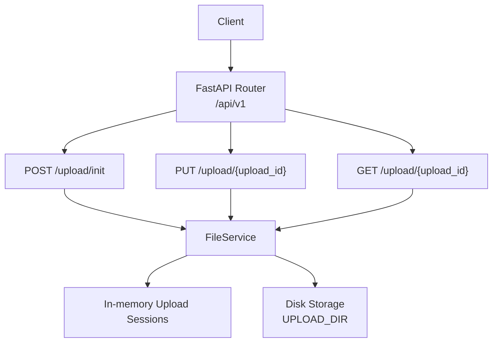
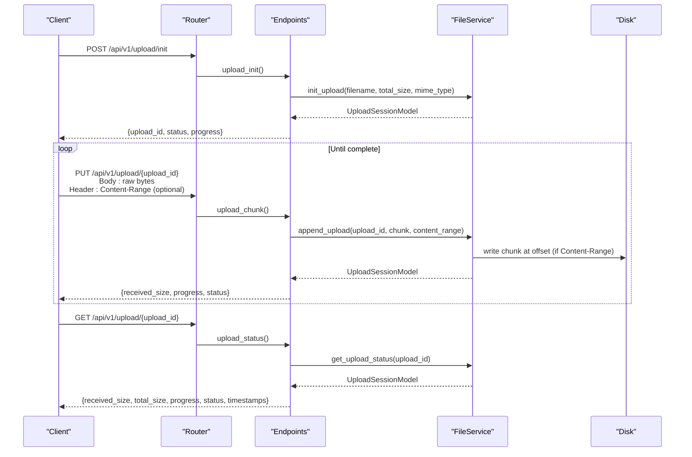
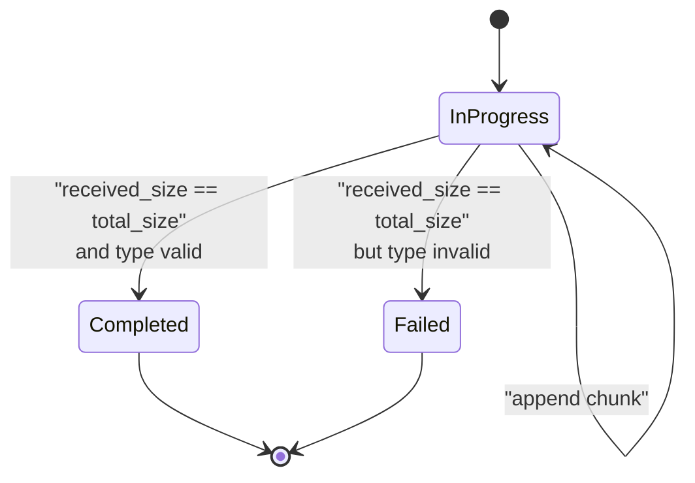
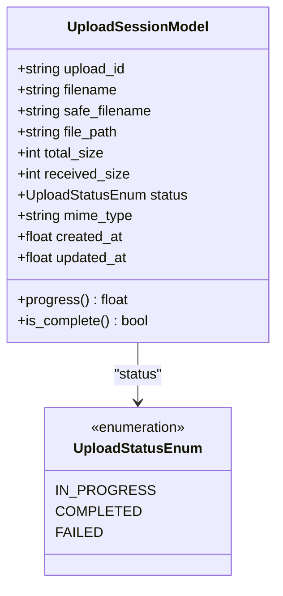
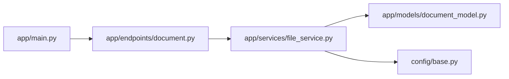

# Upload Management Endpoints

<cite>
**Referenced Files in This Document**
- [app/main.py](file://app/main.py)
- [app/endpoints/document.py](file://app/endpoints/document.py)
- [app/services/file_service.py](file://app/services/file_service.py)
- [app/models/document_model.py](file://app/models/document_model.py)
- [config/base.py](file://config/base.py)
- [test.rest](file://test.rest)
</cite>

## Table of Contents
1. [Introduction](#introduction)
2. [Project Structure](#project-structure)
3. [Core Components](#core-components)
4. [Architecture Overview](#architecture-overview)
5. [Detailed Component Analysis](#detailed-component-analysis)
6. [Dependency Analysis](#dependency-analysis)
7. [Performance Considerations](#performance-considerations)
8. [Troubleshooting Guide](#troubleshooting-guide)
9. [Conclusion](#conclusion)
10. [Appendices](#appendices)

## Introduction
This document describes the resumable upload management endpoints that enable clients to initialize upload sessions, send file chunks with optional Content-Range headers, and monitor progress. It covers the complete workflow from initialization through chunked uploads to completion, along with session lifecycle management, automatic cleanup, error handling, and best practices for chunk sizes and progress monitoring.

## Project Structure
The upload endpoints are implemented under the document module and backed by a file service that manages in-memory sessions and disk-backed files. Configuration defines storage locations and limits.

**Diagram sources**
- [app/endpoints/document.py:15-19](file://app/endpoints/document.py#L15-L19)
- [app/endpoints/document.py:238-352](file://app/endpoints/document.py#L238-L352)
- [app/services/file_service.py:23-34](file://app/services/file_service.py#L23-L34)
- [config/base.py:18-25](file://config/base.py#L18-L25)

**Section sources**
- [app/endpoints/document.py:15-19](file://app/endpoints/document.py#L15-L19)
- [app/endpoints/document.py:238-352](file://app/endpoints/document.py#L238-L352)
- [app/services/file_service.py:23-34](file://app/services/file_service.py#L23-L34)
- [config/base.py:18-25](file://config/base.py#L18-L25)

## Core Components
- Upload initialization endpoint: POST /api/v1/upload/init
- Chunk upload endpoint: PUT /api/v1/upload/{upload_id}
- Status endpoint: GET /api/v1/upload/{upload_id}
- FileService: manages upload sessions, writes chunks, validates types, and cleans up
- UploadSessionModel: tracks upload state and progress
- Configuration: upload directory, supported formats, size limits, and chunk sizes

**Section sources**
- [app/endpoints/document.py:238-352](file://app/endpoints/document.py#L238-L352)
- [app/services/file_service.py:194-347](file://app/services/file_service.py#L194-L347)
- [app/models/document_model.py:43-74](file://app/models/document_model.py#L43-L74)
- [config/base.py:18-25](file://config/base.py#L18-L25)

## Architecture Overview
The upload flow integrates FastAPI endpoints with a service layer that persists sessions in memory and writes data to disk. Sessions are pruned automatically after a period of inactivity. On completion, the service validates the file type against configured supported formats and transitions the session to completed or failed accordingly.

**Diagram sources**
- [app/endpoints/document.py:238-352](file://app/endpoints/document.py#L238-L352)
- [app/services/file_service.py:194-347](file://app/services/file_service.py#L194-L347)

## Detailed Component Analysis

### Endpoint: POST /api/v1/upload/init
Purpose:
- Initialize a resumable upload session with filename, total_size, and optional MIME type.
- Enforces maximum file size limit from configuration.
- Returns an upload_id and initial progress/status.

Key behaviors:
- Validates total_size against MAX_FILE_SIZE.
- Creates a new UploadSessionModel with a generated upload_id and sanitized filename.
- Stores session in memory and logs creation.

Response payload includes:
- upload_id, filename, total_size, received_size, status, progress, and a message instructing to send chunks.

Error handling:
- 413 if total_size exceeds MAX_FILE_SIZE.
- 500 for internal errors during initialization.

**Section sources**
- [app/endpoints/document.py:238-277](file://app/endpoints/document.py#L238-L277)
- [app/services/file_service.py:194-220](file://app/services/file_service.py#L194-L220)
- [config/base.py:23](file://config/base.py#L23)

### Endpoint: PUT /api/v1/upload/{upload_id}
Purpose:
- Append a chunk to an existing upload session.
- Supports raw binary body and optional Content-Range header for resumable, out-of-order uploads.

Behavior:
- Reads raw request body; rejects empty chunks.
- Parses Content-Range header if present (format: bytes {start}-{end}/{total}).
- Validates that Content-Range total matches session total_size.
- Writes chunk to disk at the correct offset if Content-Range is provided; otherwise appends.
- Updates received_size and progress; clamps received_size to total_size.
- On completion, validates file type against supported formats and sets status to completed or failed.
- Schedules cleanup for completed or failed sessions via background tasks.

Response payload includes:
- upload_id, received_size, total_size, progress, status, and file_path if completed.

Error handling:
- 400 for invalid Content-Range totals, empty chunk bodies, or attempts to modify non-in-progress sessions.
- 404 for missing sessions.
- 500 for internal errors during chunk append or validation.

**Section sources**
- [app/endpoints/document.py:279-324](file://app/endpoints/document.py#L279-L324)
- [app/services/file_service.py:222-324](file://app/services/file_service.py#L222-L324)

### Endpoint: GET /api/v1/upload/{upload_id}
Purpose:
- Retrieve the current status and progress of an upload session.

Behavior:
- Prunes expired sessions before returning status.
- Returns upload_id, filename, received_size, total_size, progress, status, and timestamps.

Error handling:
- 404 if the session does not exist.

**Section sources**
- [app/endpoints/document.py:326-352](file://app/endpoints/document.py#L326-L352)
- [app/services/file_service.py:326-329](file://app/services/file_service.py#L326-L329)

### Upload Session Lifecycle and Cleanup
- Initialization: creates a session with IN_PROGRESS status.
- Active phase: receives chunks; updates received_size and last update timestamp.
- Completion: when received_size reaches total_size, validates file type and transitions to COMPLETED or FAILED.
- Automatic pruning: removes expired sessions (default 2 hours of inactivity) and associated files.
- Cleanup: removes session and file on completion or failure.

**Diagram sources**
- [app/services/file_service.py:178-193](file://app/services/file_service.py#L178-L193)
- [app/services/file_service.py:287-324](file://app/services/file_service.py#L287-L324)
- [app/models/document_model.py:43-74](file://app/models/document_model.py#L43-L74)

**Section sources**
- [app/services/file_service.py:178-193](file://app/services/file_service.py#L178-L193)
- [app/services/file_service.py:340-347](file://app/services/file_service.py#L340-L347)
- [app/models/document_model.py:43-74](file://app/models/document_model.py#L43-L74)

### Data Model: UploadSessionModel
- Fields: upload_id, filename, safe_filename, file_path, total_size, received_size, status, mime_type, created_at, updated_at.
- Computed properties: progress (percentage), is_complete (received_size >= total_size).

**Diagram sources**
- [app/models/document_model.py:43-74](file://app/models/document_model.py#L43-L74)

**Section sources**
- [app/models/document_model.py:43-74](file://app/models/document_model.py#L43-L74)

### Complete Upload Workflow Example
Below is a step-by-step example of the complete workflow. Replace placeholders with actual values and use the provided request templates.

- Step 1: Initialize upload
  - Method: POST
  - Path: /api/v1/upload/init
  - Body: form-data with filename, total_size, optional mime_type
  - Response: includes upload_id

- Step 2: Upload chunk(s)
  - Method: PUT
  - Path: /api/v1/upload/{upload_id}
  - Headers: Content-Type: application/octet-stream; optional Content-Range: bytes {start}-{end}/{total}
  - Body: raw bytes of the chunk
  - Repeat until total_size is reached

- Step 3: Check status
  - Method: GET
  - Path: /api/v1/upload/{upload_id}
  - Response: progress, status, timestamps

- Step 4: Convert using the uploaded file
  - Method: POST
  - Path: /api/v1/convert
  - Body: form-data with upload_id and other conversion options

Reference template:
- See [test.rest:144-186](file://test.rest#L144-L186) for example requests and expected headers.

**Section sources**
- [app/endpoints/document.py:238-352](file://app/endpoints/document.py#L238-L352)
- [test.rest:144-186](file://test.rest#L144-L186)

## Dependency Analysis
- Router registration: The document router is included in the main application and mounted under /api/v1.
- Endpoints depend on FileService for session management and disk I/O.
- FileService depends on configuration for upload directory, supported formats, and limits.
- Endpoints return ApiResponse wrappers around session data.

**Diagram sources**
- [app/main.py:98](file://app/main.py#L98)
- [app/endpoints/document.py:15-19](file://app/endpoints/document.py#L15-L19)
- [app/services/file_service.py:23-34](file://app/services/file_service.py#L23-L34)
- [app/models/document_model.py:43-74](file://app/models/document_model.py#L43-L74)
- [config/base.py:18-25](file://config/base.py#L18-L25)

**Section sources**
- [app/main.py:98](file://app/main.py#L98)
- [app/endpoints/document.py:15-19](file://app/endpoints/document.py#L15-L19)
- [app/services/file_service.py:23-34](file://app/services/file_service.py#L23-L34)
- [app/models/document_model.py:43-74](file://app/models/document_model.py#L43-L74)
- [config/base.py:18-25](file://config/base.py#L18-L25)

## Performance Considerations
- Chunk size: The configuration defines an upload chunk size of 8KB. Adjust client-side chunk sizes to balance throughput and memory usage. Smaller chunks improve resilience but increase overhead; larger chunks improve throughput but reduce granularity.
- Streaming vs file-based: For small files, consider streaming to avoid disk I/O. The configuration includes a MAX_STREAM_SIZE threshold to decide when to stream versus save to disk.
- Concurrency: The service writes asynchronously to disk; ensure adequate I/O capacity for concurrent uploads.
- Cleanup: Automatic pruning prevents accumulation of stale sessions. Monitor disk usage and adjust prune thresholds if needed.

[No sources needed since this section provides general guidance]

## Troubleshooting Guide
Common issues and resolutions:
- 400 Bad Request
  - Empty chunk body: Ensure the request body is not empty.
  - Invalid Content-Range: Verify the header format is bytes {start}-{end}/{total} and total equals session total_size.
  - Attempting to modify non-in-progress sessions: Wait until the session becomes IN_PROGRESS or recreate the session.
- 404 Not Found
  - Upload session not found: Confirm the upload_id is correct and not expired.
- 413 Payload Too Large
  - total_size exceeds MAX_FILE_SIZE: Reduce file size or adjust configuration.
- 500 Internal Server Error
  - Errors during chunk append or validation: Inspect server logs for details; retry after addressing underlying causes.
- Progress not updating
  - Without Content-Range, received_size increments sequentially. With Content-Range, received_size reflects the highest byte offset processed.

Cleanup behavior:
- Completed or failed sessions are removed automatically via background tasks.
- Expired sessions (default 2 hours) are pruned periodically.

**Section sources**
- [app/endpoints/document.py:253-276](file://app/endpoints/document.py#L253-L276)
- [app/endpoints/document.py:298-323](file://app/endpoints/document.py#L298-L323)
- [app/services/file_service.py:178-193](file://app/services/file_service.py#L178-L193)
- [app/services/file_service.py:340-347](file://app/services/file_service.py#L340-L347)

## Conclusion
The resumable upload endpoints provide a robust mechanism for handling large file uploads with progress tracking, out-of-order chunking, and automatic cleanup. By following the guidelines for Content-Range formatting, chunk sizing, and progress monitoring, clients can reliably transfer files even under unstable network conditions.

[No sources needed since this section summarizes without analyzing specific files]

## Appendices

### API Definitions

- POST /api/v1/upload/init
  - Description: Initialize a resumable upload session.
  - Form fields:
    - filename: string, required
    - total_size: integer (bytes), required, must be >= 1
    - mime_type: string, optional
  - Response: ApiResponse with upload_id, filename, total_size, received_size, status, progress, and a message.
  - Errors: 413 if total_size exceeds MAX_FILE_SIZE; 500 on internal error.

- PUT /api/v1/upload/{upload_id}
  - Description: Upload or resume a chunk for an existing session.
  - Headers:
    - Content-Type: application/octet-stream
    - Content-Range: bytes {start}-{end}/{total} (optional)
  - Body: raw bytes of the chunk
  - Response: ApiResponse with upload_id, received_size, total_size, progress, status, and file_path if completed.
  - Errors: 400 for invalid Content-Range or empty chunk; 404 for missing session; 500 on internal error.

- GET /api/v1/upload/{upload_id}
  - Description: Get the status of a resumable upload session.
  - Response: ApiResponse with upload_id, filename, received_size, total_size, progress, status, created_at, updated_at.
  - Errors: 404 if session not found.

**Section sources**
- [app/endpoints/document.py:238-352](file://app/endpoints/document.py#L238-L352)
- [config/base.py:23](file://config/base.py#L23)

### Content-Range Header Formatting
- Format: bytes {start}-{end}/{total}
- Constraints:
  - start and end must be integers representing byte offsets.
  - total must equal the session’s total_size.
  - start must be less than or equal to end.
  - start must be less than total_size.

Validation:
- The service parses and validates Content-Range; mismatches trigger a 400 error.

**Section sources**
- [app/endpoints/document.py:288-289](file://app/endpoints/document.py#L288-L289)
- [app/services/file_service.py:247-260](file://app/services/file_service.py#L247-L260)

### Chunk Size Recommendations
- Default upload chunk size: 8KB.
- Practical guidance:
  - Network stability: Larger chunks (e.g., 64KB–256KB) for stable connections; smaller chunks (e.g., 8KB–32KB) for unreliable networks.
  - Memory constraints: Balance chunk size with available RAM to avoid buffering overhead.
  - Throughput: Measure and tune chunk size to maximize throughput while maintaining responsiveness.

**Section sources**
- [config/base.py:25](file://config/base.py#L25)

### Progress Monitoring Strategies
- Polling: Periodically call GET /api/v1/upload/{upload_id} to track received_size and progress.
- Backoff: Use exponential backoff to reduce server load during polling.
- Completion detection: When progress reaches 100% and status is COMPLETED, proceed with conversion using the upload_id.

**Section sources**
- [app/endpoints/document.py:326-352](file://app/endpoints/document.py#L326-L352)
- [app/models/document_model.py:63-68](file://app/models/document_model.py#L63-L68)