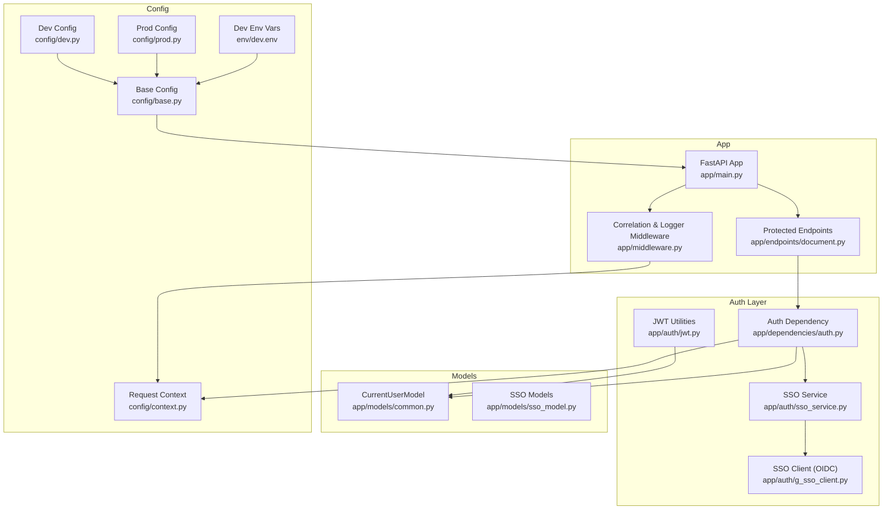
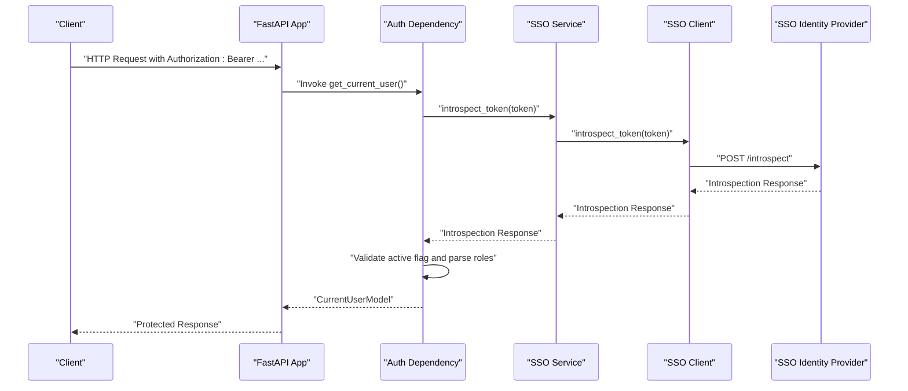
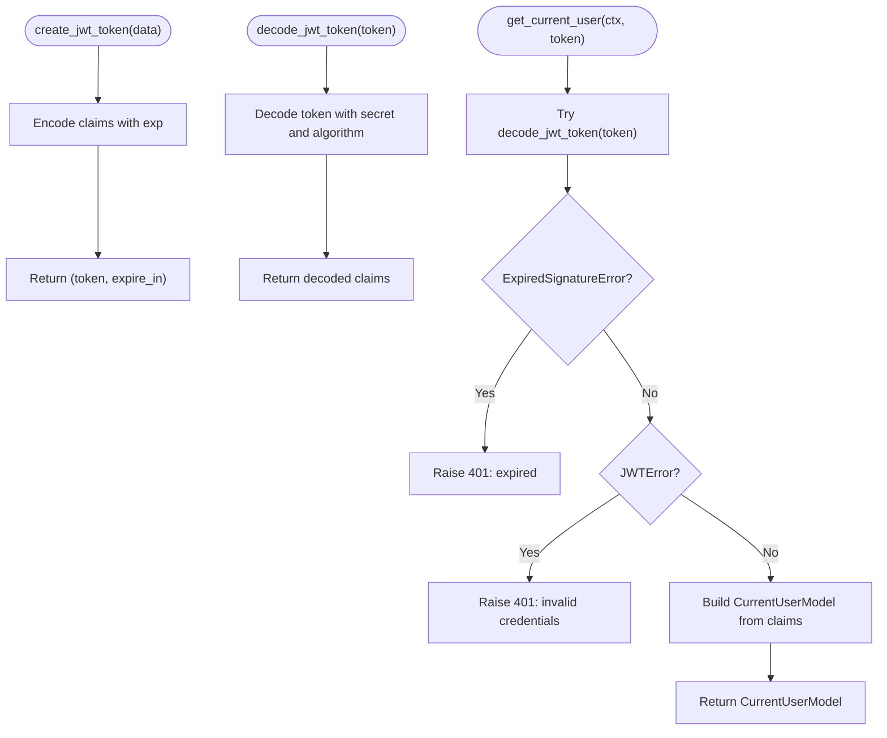
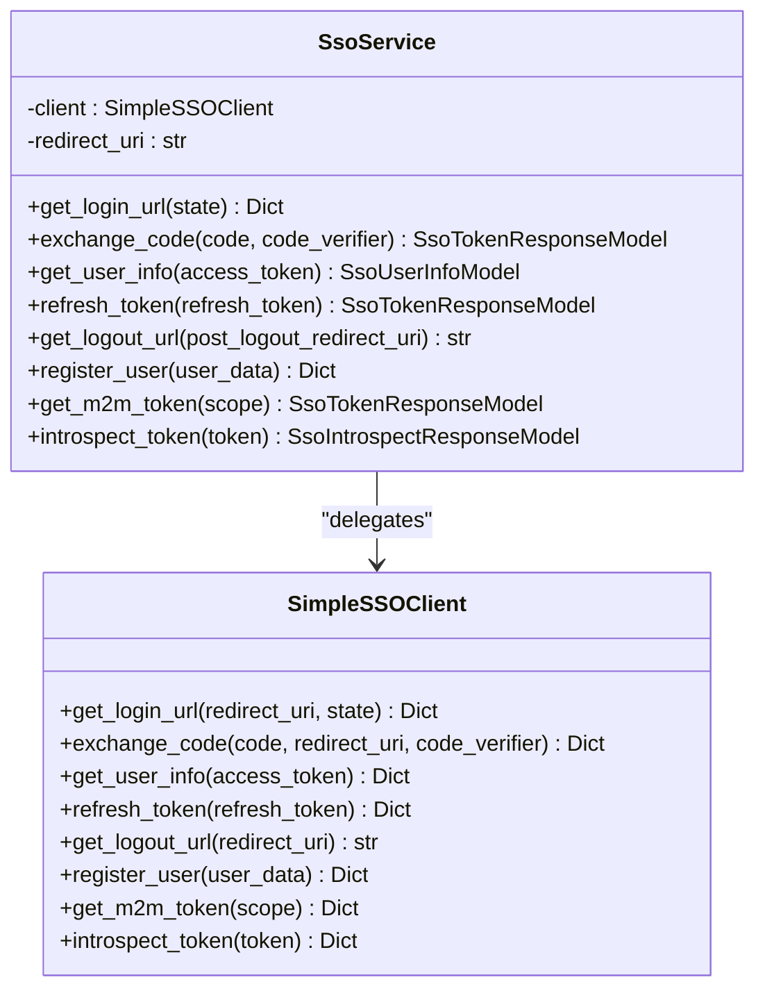
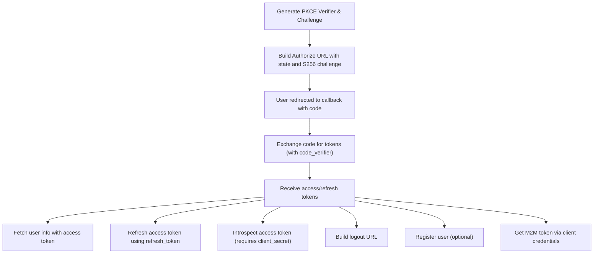
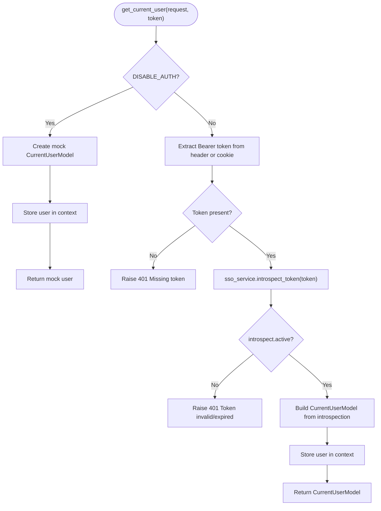
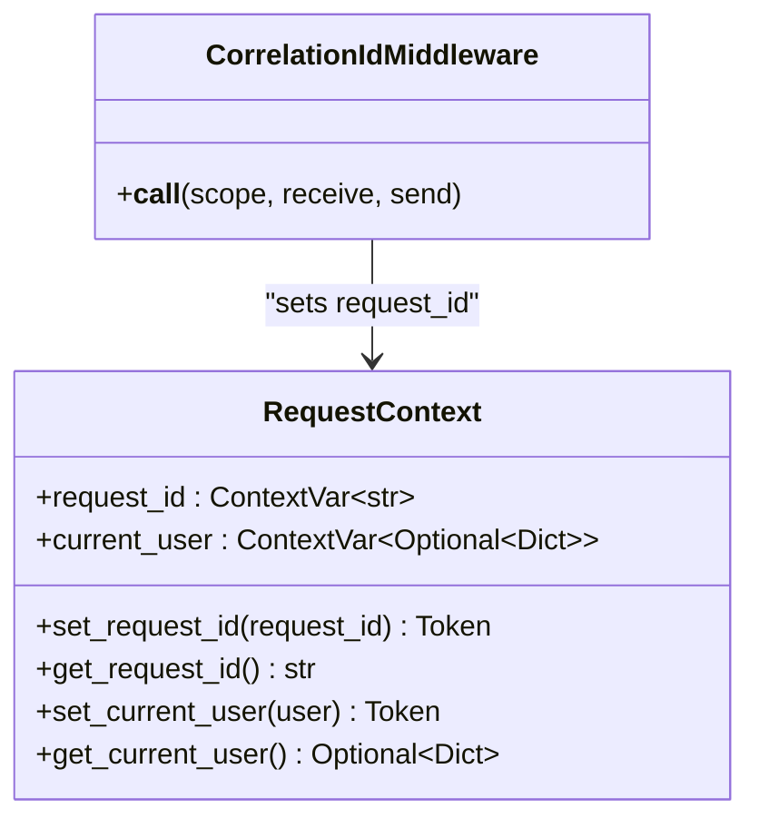
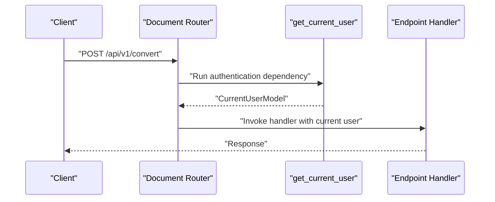
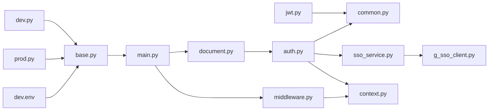

# Authentication & Security

<cite>
**Referenced Files in This Document**
- [jwt.py](file://app/auth/jwt.py)
- [sso_service.py](file://app/auth/sso_service.py)
- [g_sso_client.py](file://app/auth/g_sso_client.py)
- [auth.py](file://app/dependencies/auth.py)
- [context.py](file://config/context.py)
- [base.py](file://config/base.py)
- [dev.py](file://config/dev.py)
- [prod.py](file://config/prod.py)
- [dev.env](file://env/dev.env)
- [document.py](file://app/endpoints/document.py)
- [middleware.py](file://app/middleware.py)
- [main.py](file://app/main.py)
- [sso_model.py](file://app/models/sso_model.py)
- [common.py](file://app/models/common.py)
- [example_app.py](file://app/auth/example_app.py)
</cite>

## Table of Contents
1. [Introduction](#introduction)
2. [Project Structure](#project-structure)
3. [Core Components](#core-components)
4. [Architecture Overview](#architecture-overview)
5. [Detailed Component Analysis](#detailed-component-analysis)
6. [Dependency Analysis](#dependency-analysis)
7. [Performance Considerations](#performance-considerations)
8. [Security Considerations](#security-considerations)
9. [Practical Usage Examples](#practical-usage-examples)
10. [Troubleshooting Guide](#troubleshooting-guide)
11. [Conclusion](#conclusion)

## Introduction
This document explains the authentication and security system of the application with a focus on:
- JWT token generation and validation
- Single Sign-On (SSO) integration using OAuth2 with PKCE and token introspection
- Dependency injection for user context propagation
- Practical usage of authentication middleware and protected endpoints
- Security considerations including token expiration, refresh token management, and CORS configuration
- Troubleshooting common authentication and SSO integration issues

## Project Structure
The authentication and security features are primarily implemented under:
- app/auth: JWT utilities and SSO client/service
- app/dependencies: FastAPI dependency for SSO-based authentication
- config: Environment-driven security settings and request context
- app/endpoints: Protected routes using the authentication dependency
- app/middleware: Request correlation and logging middleware

**Diagram sources**
- [jwt.py:1-59](file://app/auth/jwt.py#L1-L59)
- [sso_service.py:1-59](file://app/auth/sso_service.py#L1-L59)
- [g_sso_client.py:1-223](file://app/auth/g_sso_client.py#L1-L223)
- [auth.py:1-129](file://app/dependencies/auth.py#L1-L129)
- [common.py:1-53](file://app/models/common.py#L1-L53)
- [sso_model.py:1-61](file://app/models/sso_model.py#L1-L61)
- [document.py:1-353](file://app/endpoints/document.py#L1-L353)
- [middleware.py:1-99](file://app/middleware.py#L1-L99)
- [main.py:1-160](file://app/main.py#L1-L160)
- [context.py:1-33](file://config/context.py#L1-L33)
- [base.py:1-57](file://config/base.py#L1-L57)
- [dev.py:1-12](file://config/dev.py#L1-L12)
- [prod.py:1-6](file://config/prod.py#L1-L6)
- [dev.env:1-14](file://env/dev.env#L1-L14)

**Section sources**
- [main.py:73-99](file://app/main.py#L73-L99)
- [middleware.py:7-45](file://app/middleware.py#L7-L45)
- [document.py:15-19](file://app/endpoints/document.py#L15-L19)

## Core Components
- JWT utilities: token creation and decoding, user extraction from JWT claims
- SSO service: orchestrates OAuth2 flows, PKCE, token exchange, user info retrieval, refresh, logout, M2M token acquisition, and token introspection
- SSO client: low-level OIDC client implementing PKCE, token exchange, user info, refresh, logout, registration, M2M token, and introspection
- Authentication dependency: validates bearer tokens via SSO introspection and populates request context
- Request context: stores request ID and current user across async boundaries
- Protected endpoints: apply the authentication dependency to enforce access control

**Section sources**
- [jwt.py:18-56](file://app/auth/jwt.py#L18-L56)
- [sso_service.py:8-54](file://app/auth/sso_service.py#L8-L54)
- [g_sso_client.py:12-223](file://app/auth/g_sso_client.py#L12-L223)
- [auth.py:23-128](file://app/dependencies/auth.py#L23-L128)
- [context.py:5-31](file://config/context.py#L5-L31)
- [document.py:15-19](file://app/endpoints/document.py#L15-L19)

## Architecture Overview
The system integrates two complementary authentication modes:
- JWT-based authentication for internal services or local flows
- SSO-based authentication for external identity providers with token introspection

**Diagram sources**
- [auth.py:74-90](file://app/dependencies/auth.py#L74-L90)
- [sso_service.py:50-53](file://app/auth/sso_service.py#L50-L53)
- [g_sso_client.py:199-222](file://app/auth/g_sso_client.py#L199-L222)

## Detailed Component Analysis

### JWT Utilities
Implements token creation and decoding, and extracts the current user from JWT claims. It relies on configuration for secret key, algorithm, and expiry duration.

Key behaviors:
- Encodes claims with an expiration timestamp
- Decodes tokens and raises appropriate exceptions on errors
- Builds a CurrentUserModel from decoded claims and request context

**Diagram sources**
- [jwt.py:18-56](file://app/auth/jwt.py#L18-L56)
- [common.py:8-18](file://app/models/common.py#L8-L18)

**Section sources**
- [jwt.py:11-24](file://app/auth/jwt.py#L11-L24)
- [jwt.py:27-46](file://app/auth/jwt.py#L27-L46)
- [jwt.py:48-56](file://app/auth/jwt.py#L48-L56)

### SSO Service
Provides a high-level interface to the SSO client:
- Login URL generation with PKCE and state
- Authorization code exchange for tokens
- User info retrieval
- Token refresh
- Logout URL construction
- M2M token acquisition
- Token introspection

**Diagram sources**
- [sso_service.py:8-54](file://app/auth/sso_service.py#L8-L54)
- [g_sso_client.py:12-223](file://app/auth/g_sso_client.py#L12-L223)

**Section sources**
- [sso_service.py:18-53](file://app/auth/sso_service.py#L18-L53)
- [sso_model.py:8-16](file://app/models/sso_model.py#L8-L16)
- [sso_model.py:18-32](file://app/models/sso_model.py#L18-L32)
- [sso_model.py:34-60](file://app/models/sso_model.py#L34-L60)

### SSO Client (OIDC)
Implements OAuth2/OIDC flows:
- PKCE challenge and verifier generation
- Authorization code exchange with PKCE
- User info retrieval
- Refresh token flow
- Logout URL composition
- Registration endpoint
- M2M token via client credentials
- Token introspection

**Diagram sources**
- [g_sso_client.py:38-72](file://app/auth/g_sso_client.py#L38-L72)
- [g_sso_client.py:74-97](file://app/auth/g_sso_client.py#L74-L97)
- [g_sso_client.py:99-115](file://app/auth/g_sso_client.py#L99-L115)
- [g_sso_client.py:117-138](file://app/auth/g_sso_client.py#L117-L138)
- [g_sso_client.py:140-147](file://app/auth/g_sso_client.py#L140-L147)
- [g_sso_client.py:149-170](file://app/auth/g_sso_client.py#L149-L170)
- [g_sso_client.py:172-197](file://app/auth/g_sso_client.py#L172-L197)
- [g_sso_client.py:199-222](file://app/auth/g_sso_client.py#L199-L222)

**Section sources**
- [g_sso_client.py:38-43](file://app/auth/g_sso_client.py#L38-L43)
- [g_sso_client.py:45-72](file://app/auth/g_sso_client.py#L45-L72)
- [g_sso_client.py:74-97](file://app/auth/g_sso_client.py#L74-L97)
- [g_sso_client.py:99-138](file://app/auth/g_sso_client.py#L99-L138)
- [g_sso_client.py:140-170](file://app/auth/g_sso_client.py#L140-L170)
- [g_sso_client.py:172-197](file://app/auth/g_sso_client.py#L172-L197)
- [g_sso_client.py:199-222](file://app/auth/g_sso_client.py#L199-L222)

### Authentication Dependency (SSO Introspection)
Validates incoming bearer tokens by calling the SSO provider’s introspection endpoint. It:
- Supports a bypass mode for development
- Extracts tokens from Authorization header or cookies
- Calls SSO introspection and enforces active tokens
- Builds a CurrentUserModel and stores user context

**Diagram sources**
- [auth.py:39-56](file://app/dependencies/auth.py#L39-L56)
- [auth.py:58-71](file://app/dependencies/auth.py#L58-L71)
- [auth.py:74-90](file://app/dependencies/auth.py#L74-L90)
- [auth.py:92-128](file://app/dependencies/auth.py#L92-L128)

**Section sources**
- [auth.py:23-128](file://app/dependencies/auth.py#L23-L128)
- [common.py:8-18](file://app/models/common.py#L8-L18)

### Request Context Propagation
The request context manages request-scoped variables (request ID and current user) using contextvars, enabling propagation across async boundaries.

**Diagram sources**
- [context.py:5-31](file://config/context.py#L5-L31)
- [middleware.py:15-44](file://app/middleware.py#L15-L44)

**Section sources**
- [context.py:5-31](file://config/context.py#L5-L31)
- [middleware.py:15-44](file://app/middleware.py#L15-L44)

### Protected Endpoints
Endpoints are protected by applying the authentication dependency at the router level, ensuring all routes require a valid token.

**Diagram sources**
- [document.py:15-19](file://app/endpoints/document.py#L15-L19)
- [auth.py:23-128](file://app/dependencies/auth.py#L23-L128)

**Section sources**
- [document.py:15-19](file://app/endpoints/document.py#L15-L19)

## Dependency Analysis
- The SSO service depends on the SSO client for HTTP interactions with the identity provider.
- The authentication dependency depends on the SSO service and request context.
- Protected endpoints depend on the authentication dependency.
- Middleware sets request context and enriches logs.

**Diagram sources**
- [jwt.py:1-59](file://app/auth/jwt.py#L1-L59)
- [sso_service.py:1-59](file://app/auth/sso_service.py#L1-L59)
- [g_sso_client.py:1-223](file://app/auth/g_sso_client.py#L1-L223)
- [auth.py:1-129](file://app/dependencies/auth.py#L1-L129)
- [common.py:1-53](file://app/models/common.py#L1-L53)
- [context.py:1-33](file://config/context.py#L1-L33)
- [document.py:1-353](file://app/endpoints/document.py#L1-L353)
- [middleware.py:1-99](file://app/middleware.py#L1-L99)
- [main.py:1-160](file://app/main.py#L1-L160)
- [base.py:1-57](file://config/base.py#L1-L57)
- [dev.py:1-12](file://config/dev.py#L1-L12)
- [prod.py:1-6](file://config/prod.py#L1-L6)
- [dev.env:1-14](file://env/dev.env#L1-L14)

**Section sources**
- [main.py:83-95](file://app/main.py#L83-L95)
- [middleware.py:7-45](file://app/middleware.py#L7-L45)

## Performance Considerations
- Token introspection adds latency; consider caching active tokens or using short-lived access tokens with robust refresh strategies.
- Avoid unnecessary SSL verification in production; the SSO client defaults to disabling verification for simplicity but should be enabled in production deployments.
- Use streaming for large uploads to reduce memory overhead while maintaining security checks.

[No sources needed since this section provides general guidance]

## Security Considerations

### Token Expiration and Validation
- Access tokens are validated via SSO introspection; inactive tokens trigger 401 responses.
- Roles and scopes are derived from introspection responses to enforce authorization.

**Section sources**
- [auth.py:84-102](file://app/dependencies/auth.py#L84-L102)

### Refresh Token Management
- The SSO client supports refreshing access tokens using a refresh token.
- Ensure refresh tokens are handled securely and rotated appropriately.

**Section sources**
- [g_sso_client.py:117-138](file://app/auth/g_sso_client.py#L117-L138)

### Secure Cookie Configuration
- Example applications demonstrate setting httponly cookies for tokens and PKCE verifier.
- Production deployments should configure secure, same-site, and secure flags for cookies.

**Section sources**
- [example_app.py:128-146](file://app/auth/example_app.py#L128-L146)

### CORS Configuration
- CORS middleware is configured from environment settings, allowing flexible origins and credentials.

**Section sources**
- [main.py:87-95](file://app/main.py#L87-L95)
- [base.py:35-36](file://config/base.py#L35-L36)

### Token Revocation and Session Management
- Token introspection determines validity; revoked or expired tokens are rejected.
- Logout URLs can terminate both local and SSO sessions.

**Section sources**
- [auth.py:84-90](file://app/dependencies/auth.py#L84-L90)
- [g_sso_client.py:140-147](file://app/auth/g_sso_client.py#L140-L147)
- [example_app.py:153-163](file://app/auth/example_app.py#L153-L163)

## Practical Usage Examples

### Authentication Middleware Usage
- Apply the authentication dependency at the router level to protect all endpoints under that router.

**Section sources**
- [document.py:15-19](file://app/endpoints/document.py#L15-L19)

### Protected Endpoint Implementation
- Define endpoints that accept the current user injected by the dependency.

**Section sources**
- [document.py:101-152](file://app/endpoints/document.py#L101-L152)

### User Context Extraction
- Access the current user from the dependency or request context for logging and authorization decisions.

**Section sources**
- [auth.py:116-128](file://app/dependencies/auth.py#L116-L128)
- [context.py:23-30](file://config/context.py#L23-L30)

### JWT Token Generation and Validation
- Use the JWT utilities to encode/decode tokens and extract user information.

**Section sources**
- [jwt.py:18-24](file://app/auth/jwt.py#L18-L24)
- [jwt.py:27-56](file://app/auth/jwt.py#L27-L56)

### SSO OAuth2 Flow with PKCE
- Generate login URL with PKCE, exchange authorization code for tokens, and fetch user info.

**Section sources**
- [g_sso_client.py:45-72](file://app/auth/g_sso_client.py#L45-L72)
- [g_sso_client.py:74-97](file://app/auth/g_sso_client.py#L74-L97)
- [g_sso_client.py:99-115](file://app/auth/g_sso_client.py#L99-L115)

### Token Introspection
- Validate tokens via SSO introspection to ensure active status and derive roles.

**Section sources**
- [sso_service.py:50-53](file://app/auth/sso_service.py#L50-L53)
- [auth.py:74-90](file://app/dependencies/auth.py#L74-L90)

## Troubleshooting Guide

### Authentication Failures
- Missing or malformed Authorization header: ensure Bearer token is present and correctly formatted.
- Token introspection unavailable: verify SSO connectivity and client credentials.

**Section sources**
- [auth.py:65-71](file://app/dependencies/auth.py#L65-L71)
- [auth.py:74-81](file://app/dependencies/auth.py#L74-L81)

### Token Validation Errors
- Expired or invalid tokens: check token expiry and re-authenticate.
- Scope/role parsing issues: confirm introspection response includes expected fields.

**Section sources**
- [jwt.py:41-46](file://app/auth/jwt.py#L41-L46)
- [auth.py:97-102](file://app/dependencies/auth.py#L97-L102)

### SSO Integration Issues
- PKCE mismatch: ensure the code_verifier matches the challenge used during authorization.
- M2M token requirements: client_secret is mandatory for M2M token requests.
- Introspection failures: client_secret is required for token introspection.

**Section sources**
- [g_sso_client.py:45-72](file://app/auth/g_sso_client.py#L45-L72)
- [g_sso_client.py:177-178](file://app/auth/g_sso_client.py#L177-L178)
- [g_sso_client.py:205-206](file://app/auth/g_sso_client.py#L205-L206)

### Environment and Configuration
- Development bypass: DISABLE_AUTH enables mock authentication for testing.
- Production readiness: disable development bypass and harden security settings.

**Section sources**
- [dev.py](file://config/dev.py#L11)
- [prod.py](file://config/prod.py#L6)
- [dev.env:13-14](file://env/dev.env#L13-L14)

## Conclusion
The application implements a robust authentication and security system combining JWT utilities and SSO-based token introspection. The dependency injection pattern ensures consistent user context propagation, while middleware provides request correlation and logging. The SSO client and service encapsulate OAuth2 flows with PKCE and token introspection, supporting modern identity provider integrations. Proper configuration of CORS, cookies, and environment settings is essential for production-grade security.