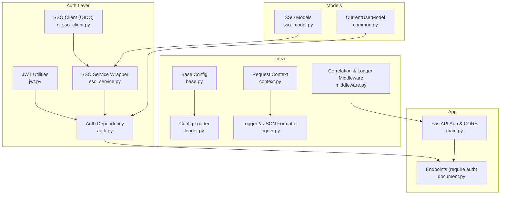
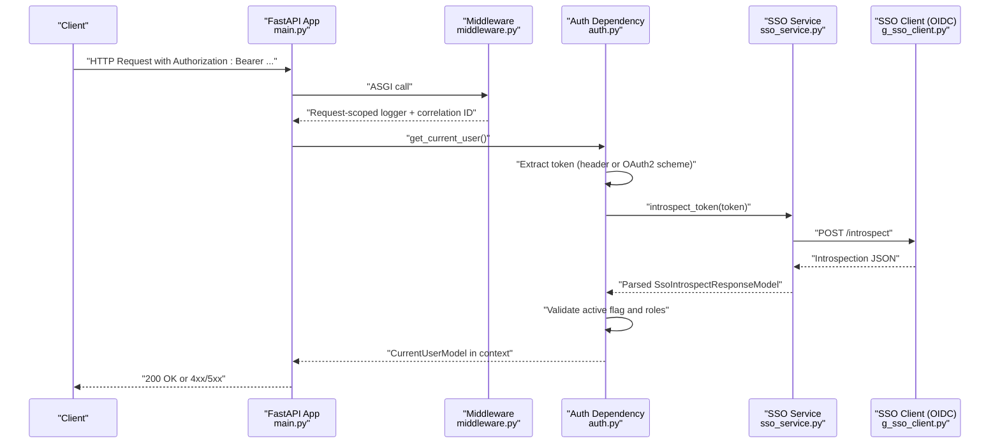
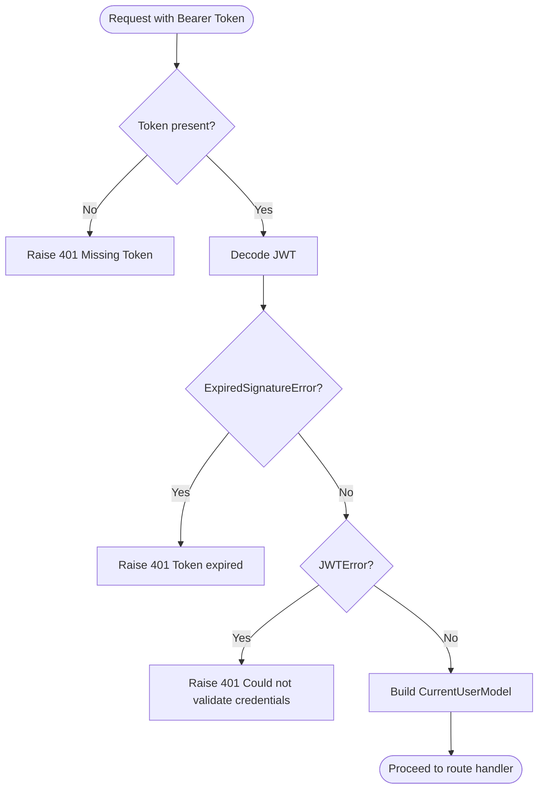
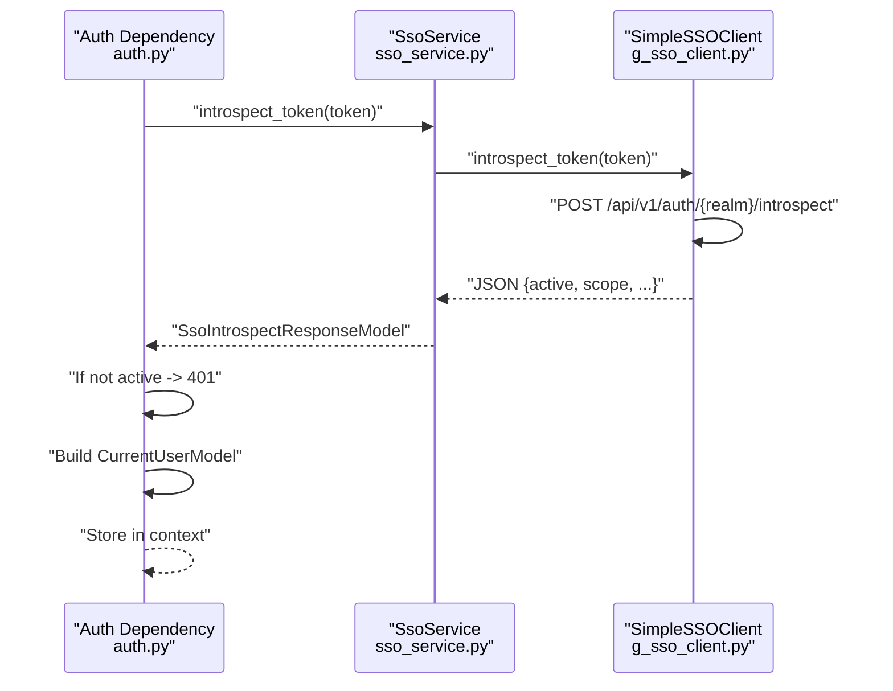
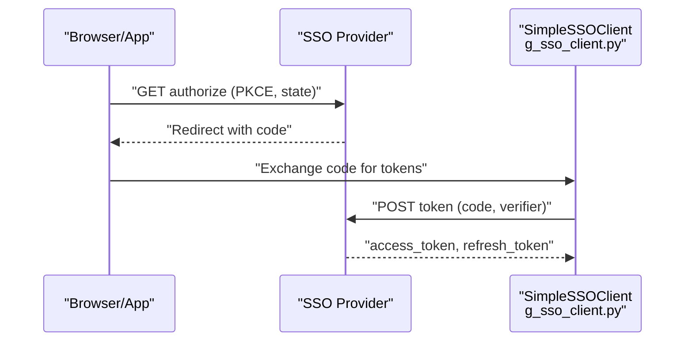
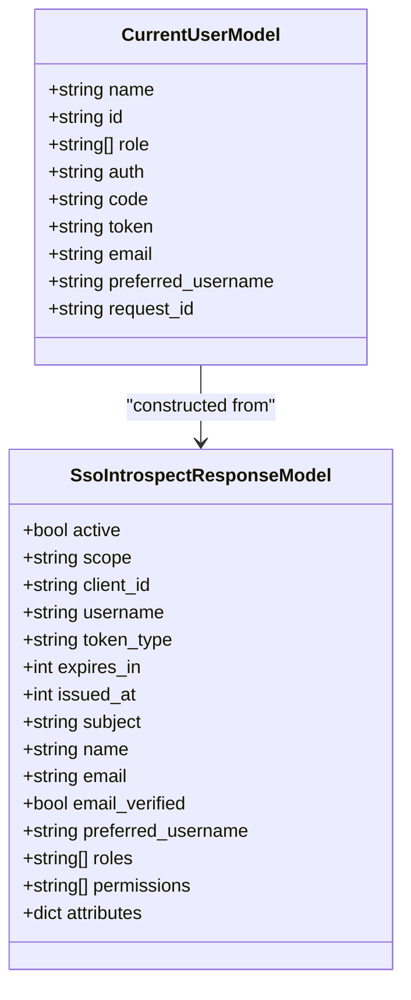
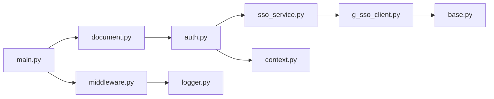

# Authentication Troubleshooting

<cite>
**Referenced Files in This Document**
- [jwt.py](file://app/auth/jwt.py)
- [sso_service.py](file://app/auth/sso_service.py)
- [g_sso_client.py](file://app/auth/g_sso_client.py)
- [auth.py](file://app/dependencies/auth.py)
- [common.py](file://app/models/common.py)
- [sso_model.py](file://app/models/sso_model.py)
- [base.py](file://config/base.py)
- [loader.py](file://config/loader.py)
- [logger.py](file://config/logger.py)
- [context.py](file://config/context.py)
- [middleware.py](file://app/middleware.py)
- [document.py](file://app/endpoints/document.py)
- [main.py](file://app/main.py)
- [error_model.py](file://app/models/error_model.py)
- [conftest.py](file://tests/conftest.py)
</cite>

## Table of Contents
1. [Introduction](#introduction)
2. [Project Structure](#project-structure)
3. [Core Components](#core-components)
4. [Architecture Overview](#architecture-overview)
5. [Detailed Component Analysis](#detailed-component-analysis)
6. [Dependency Analysis](#dependency-analysis)
7. [Performance Considerations](#performance-considerations)
8. [Troubleshooting Guide](#troubleshooting-guide)
9. [Conclusion](#conclusion)
10. [Appendices](#appendices)

## Introduction
This document provides comprehensive troubleshooting guidance for authentication and security issues in the system. It focuses on:
- Common authentication failure scenarios: token expiration, invalid signatures, and SSO integration problems
- Error propagation patterns and how authentication errors surface through the system
- Debugging techniques for JWT validation failures, OAuth2/OIDC flow issues, and token introspection problems
- Diagnostic steps for configuration issues, certificate problems, and network connectivity concerns
- Error codes and their meanings for different failure modes
- Resolution strategies for clock skew, SSO provider timeouts, and CORS policy conflicts
- Performance considerations and monitoring approaches for authentication operations
- Logging configuration recommendations for effective troubleshooting

## Project Structure
The authentication system spans several modules:
- JWT utilities and token validation
- SSO service wrapper and client implementation
- Dependency injection for enforcing authentication per route
- Request context and logging infrastructure
- Configuration loading and environment-specific settings
- Endpoint registration that enforces authentication globally

**Diagram sources**
- [jwt.py:1-59](file://app/auth/jwt.py#L1-L59)
- [sso_service.py:1-59](file://app/auth/sso_service.py#L1-L59)
- [g_sso_client.py:1-223](file://app/auth/g_sso_client.py#L1-L223)
- [auth.py:1-129](file://app/dependencies/auth.py#L1-L129)
- [common.py:1-53](file://app/models/common.py#L1-L53)
- [sso_model.py:1-61](file://app/models/sso_model.py#L1-L61)
- [base.py:1-57](file://config/base.py#L1-L57)
- [loader.py:1-51](file://config/loader.py#L1-L51)
- [context.py:1-33](file://config/context.py#L1-L33)
- [logger.py:1-110](file://config/logger.py#L1-L110)
- [middleware.py:1-99](file://app/middleware.py#L1-L99)
- [main.py:1-160](file://app/main.py#L1-L160)
- [document.py:1-353](file://app/endpoints/document.py#L1-L353)

**Section sources**
- [jwt.py:1-59](file://app/auth/jwt.py#L1-L59)
- [sso_service.py:1-59](file://app/auth/sso_service.py#L1-L59)
- [g_sso_client.py:1-223](file://app/auth/g_sso_client.py#L1-L223)
- [auth.py:1-129](file://app/dependencies/auth.py#L1-L129)
- [common.py:1-53](file://app/models/common.py#L1-L53)
- [sso_model.py:1-61](file://app/models/sso_model.py#L1-L61)
- [base.py:1-57](file://config/base.py#L1-L57)
- [loader.py:1-51](file://config/loader.py#L1-L51)
- [logger.py:1-110](file://config/logger.py#L1-L110)
- [context.py:1-33](file://config/context.py#L1-L33)
- [middleware.py:1-99](file://app/middleware.py#L1-L99)
- [main.py:1-160](file://app/main.py#L1-L160)
- [document.py:1-353](file://app/endpoints/document.py#L1-L353)

## Core Components
- JWT utilities: encode/decode tokens, expiration handling, and user extraction
- SSO service wrapper: orchestrates token exchange, user info retrieval, token refresh, logout, M2M token acquisition, and token introspection
- SSO client: implements OIDC flows (authorization, token exchange, PKCE, userinfo, refresh, logout, registration, M2M token, introspection)
- Authentication dependency: validates Bearer tokens via SSO introspection, builds the current user model, and stores it in request context
- Models: typed models for current user and SSO responses
- Configuration: environment variables for SSO and JWT settings, CORS, and auth bypass
- Logging and context: structured logging with request correlation and user context
- Middleware: request correlation ID propagation and request-scoped logging

Key implementation references:
- JWT creation and decoding: [jwt.py:18-28](file://app/auth/jwt.py#L18-L28)
- JWT user extraction and error mapping: [jwt.py:31-56](file://app/auth/jwt.py#L31-L56)
- SSO service methods: [sso_service.py:18-53](file://app/auth/sso_service.py#L18-L53)
- SSO client OIDC methods: [g_sso_client.py:74-222](file://app/auth/g_sso_client.py#L74-L222)
- Auth dependency flow and error handling: [auth.py:23-128](file://app/dependencies/auth.py#L23-L128)
- Current user model: [common.py:8-18](file://app/models/common.py#L8-L18)
- SSO response models: [sso_model.py:34-60](file://app/models/sso_model.py#L34-L60)
- Configuration settings: [base.py:42-52](file://config/base.py#L42-L52)
- Logger and context: [logger.py:8-110](file://config/logger.py#L8-L110), [context.py:5-33](file://config/context.py#L5-L33)
- Endpoint dependency binding: [document.py:15-19](file://app/endpoints/document.py#L15-L19)

**Section sources**
- [jwt.py:1-59](file://app/auth/jwt.py#L1-L59)
- [sso_service.py:1-59](file://app/auth/sso_service.py#L1-L59)
- [g_sso_client.py:1-223](file://app/auth/g_sso_client.py#L1-L223)
- [auth.py:1-129](file://app/dependencies/auth.py#L1-L129)
- [common.py:1-53](file://app/models/common.py#L1-L53)
- [sso_model.py:1-61](file://app/models/sso_model.py#L1-L61)
- [base.py:1-57](file://config/base.py#L1-L57)
- [logger.py:1-110](file://config/logger.py#L1-L110)
- [context.py:1-33](file://config/context.py#L1-L33)
- [document.py:1-353](file://app/endpoints/document.py#L1-L353)

## Architecture Overview
The authentication architecture enforces per-route protection via a dependency that performs token introspection against the SSO provider. Requests are correlated across services, and logs include request IDs and user context for traceability.

**Diagram sources**
- [auth.py:23-128](file://app/dependencies/auth.py#L23-L128)
- [sso_service.py:50-53](file://app/auth/sso_service.py#L50-L53)
- [g_sso_client.py:199-222](file://app/auth/g_sso_client.py#L199-L222)
- [middleware.py:55-99](file://app/middleware.py#L55-L99)
- [main.py:83-99](file://app/main.py#L83-L99)

## Detailed Component Analysis

### JWT Validation Flow
JWT validation occurs in two places:
- Direct JWT utilities for signing/encoding and decoding
- Auth dependency for introspection-based validation

**Diagram sources**
- [jwt.py:31-56](file://app/auth/jwt.py#L31-L56)

**Section sources**
- [jwt.py:18-56](file://app/auth/jwt.py#L18-L56)
- [common.py:8-18](file://app/models/common.py#L8-L18)

### SSO Introspection Flow
The dependency validates tokens by calling the SSO introspection endpoint and constructing a current user model from the response.

**Diagram sources**
- [auth.py:74-90](file://app/dependencies/auth.py#L74-L90)
- [sso_service.py:50-53](file://app/auth/sso_service.py#L50-L53)
- [g_sso_client.py:199-222](file://app/auth/g_sso_client.py#L199-L222)

**Section sources**
- [auth.py:23-128](file://app/dependencies/auth.py#L23-L128)
- [sso_service.py:1-59](file://app/auth/sso_service.py#L1-L59)
- [g_sso_client.py:1-223](file://app/auth/g_sso_client.py#L1-L223)
- [sso_model.py:34-60](file://app/models/sso_model.py#L34-L60)

### OIDC Authorization Code Flow (for reference)
Although the primary resource-server introspection is used, the client supports PKCE-based authorization code exchange.

**Diagram sources**
- [g_sso_client.py:45-97](file://app/auth/g_sso_client.py#L45-L97)

**Section sources**
- [g_sso_client.py:45-97](file://app/auth/g_sso_client.py#L45-L97)

### Object Model Relationships

**Diagram sources**
- [common.py:8-18](file://app/models/common.py#L8-L18)
- [sso_model.py:34-60](file://app/models/sso_model.py#L34-L60)

**Section sources**
- [common.py:1-53](file://app/models/common.py#L1-L53)
- [sso_model.py:1-61](file://app/models/sso_model.py#L1-L61)

## Dependency Analysis
- The document endpoints bind the authentication dependency globally, ensuring all routes require a validated token.
- The auth dependency depends on the SSO service, which encapsulates the SSO client.
- The SSO client depends on configuration values and context for request correlation.
- Logging and context propagate request IDs and user identity across the stack.

**Diagram sources**
- [document.py:15-19](file://app/endpoints/document.py#L15-L19)
- [auth.py:15-18](file://app/dependencies/auth.py#L15-L18)
- [sso_service.py:8-16](file://app/auth/sso_service.py#L8-L16)
- [g_sso_client.py:18-29](file://app/auth/g_sso_client.py#L18-L29)
- [context.py:5-33](file://config/context.py#L5-L33)
- [base.py:42-47](file://config/base.py#L42-L47)
- [middleware.py:1-99](file://app/middleware.py#L1-L99)
- [main.py:83-99](file://app/main.py#L83-L99)

**Section sources**
- [document.py:1-353](file://app/endpoints/document.py#L1-L353)
- [auth.py:1-129](file://app/dependencies/auth.py#L1-L129)
- [sso_service.py:1-59](file://app/auth/sso_service.py#L1-L59)
- [g_sso_client.py:1-223](file://app/auth/g_sso_client.py#L1-L223)
- [context.py:1-33](file://config/context.py#L1-L33)
- [base.py:1-57](file://config/base.py#L1-L57)
- [middleware.py:1-99](file://app/middleware.py#L1-L99)
- [main.py:1-160](file://app/main.py#L1-L160)

## Performance Considerations
- Token introspection adds latency; cache or reuse validated tokens when feasible at the application level.
- Use connection pooling and keep-alive for SSO client calls to reduce overhead.
- Monitor SSO provider response times and availability; configure timeouts and retries appropriately.
- Avoid unnecessary token exchanges; rely on refresh tokens only when needed.
- Keep JWT expiration short but refresh tokens long-lived to balance security and performance.
- Enable structured logging with correlation IDs to trace slow paths and bottlenecks.

[No sources needed since this section provides general guidance]

## Troubleshooting Guide

### Common Authentication Failure Scenarios and Diagnostics

- Missing Bearer Token
  - Symptom: 401 Unauthorized with missing token detail
  - Likely cause: Client did not include Authorization header or used wrong scheme
  - Action: Ensure Authorization header starts with "Bearer " and carries a non-empty token
  - References:
    - [auth.py:59-71](file://app/dependencies/auth.py#L59-L71)

- Token Not Active (Expired or Revoked)
  - Symptom: 401 Unauthorized with invalid/expired token detail
  - Likely causes: Token expired, revoked, or SSO provider reports inactive
  - Action: Renew token via refresh flow or re-authenticate; verify SSO provider status
  - References:
    - [auth.py:84-90](file://app/dependencies/auth.py#L84-L90)

- SSO Introspection Failure
  - Symptom: 503 Service Unavailable during introspection
  - Likely causes: SSO provider down, network issues, SSL/TLS misconfiguration
  - Action: Check SSO URL, certificates, and network connectivity; verify client secret presence for introspection
  - References:
    - [auth.py:74-81](file://app/dependencies/auth.py#L74-L81)
    - [g_sso_client.py:205-221](file://app/auth/g_sso_client.py#L205-L221)

- Invalid Signature or JWT Decoding Errors
  - Symptom: 401 Unauthorized with credential validation failure
  - Likely causes: Wrong JWT secret, algorithm mismatch, tampered token
  - Action: Verify JWT secret and algorithm match; ensure consistent signing
  - References:
    - [jwt.py:41-46](file://app/auth/jwt.py#L41-L46)

- Clock Skew in JWT Validation
  - Symptom: Frequent token expiration errors shortly after issuance
  - Likely causes: System clocks differ between client and server
  - Action: Configure tolerance window or synchronize NTP; avoid overly strict exp margins
  - References:
    - [jwt.py:27-28](file://app/auth/jwt.py#L27-L28)

- SSO Provider Timeouts
  - Symptom: Slow responses or timeouts during token exchange/userinfo/introspection
  - Action: Increase client timeouts; monitor provider health; retry with backoff
  - References:
    - [g_sso_client.py:91-92](file://app/auth/g_sso_client.py#L91-L92)
    - [g_sso_client.py:132-133](file://app/auth/g_sso_client.py#L132-L133)
    - [g_sso_client.py:216-217](file://app/auth/g_sso_client.py#L216-L217)

- CORS Policy Conflicts
  - Symptom: Preflight failures or blocked requests from browsers
  - Action: Align allowed origins, methods, and headers with SSO provider expectations
  - References:
    - [main.py:87-95](file://app/main.py#L87-L95)
    - [base.py:35-36](file://config/base.py#L35-L36)

- Certificate Problems
  - Symptom: SSL handshake failures or certificate validation errors
  - Action: Enable SSL verification in production; install CA bundles; validate cert chain
  - References:
    - [g_sso_client.py](file://app/auth/g_sso_client.py#L29)
    - [g_sso_client.py](file://app/auth/g_sso_client.py#L91)
    - [g_sso_client.py](file://app/auth/g_sso_client.py#L132)
    - [g_sso_client.py](file://app/auth/g_sso_client.py#L216)

- Authentication Configuration Issues
  - Symptom: Unexpected auth bypass or incorrect SSO settings
  - Action: Review environment variables and config loading; disable auth only for testing
  - References:
    - [base.py:42-47](file://config/base.py#L42-L47)
    - [base.py:50-52](file://config/base.py#L50-L52)
    - [loader.py:9-51](file://config/loader.py#L9-L51)
    - [conftest.py:14-17](file://tests/conftest.py#L14-L17)

### Error Codes and Meanings
- 401 Unauthorized
  - Missing authentication token
  - Token is invalid or expired
  - Credential validation failure (JWT signature/decoding)
- 503 Service Unavailable
  - Authentication service unavailable (SSO introspection failure)
- 400 Bad Request
  - Application-level errors surfaced via custom error handler
- 413 Payload Too Large
  - Upload size exceeded (not auth-specific, but can occur during protected operations)
- 404 Not Found
  - Upload session not found (not auth-specific, but can occur during protected operations)

References:
- [auth.py:67-90](file://app/dependencies/auth.py#L67-L90)
- [auth.py:77-81](file://app/dependencies/auth.py#L77-L81)
- [jwt.py:41-46](file://app/auth/jwt.py#L41-L46)
- [document.py:253-257](file://app/endpoints/document.py#L253-L257)
- [document.py:337-341](file://app/endpoints/document.py#L337-L341)
- [main.py:135-159](file://app/main.py#L135-L159)
- [error_model.py:8-12](file://app/models/error_model.py#L8-L12)

### Resolution Strategies
- Clock Skew
  - Adjust token lifetimes; ensure NTP synchronization; consider leeway in validation
  - Reference: [jwt.py:27-28](file://app/auth/jwt.py#L27-L28)

- SSO Provider Timeouts
  - Tune client timeouts; add retries; monitor provider SLA
  - Reference: [g_sso_client.py:91-92](file://app/auth/g_sso_client.py#L91-L92)

- CORS Policy Conflicts
  - Configure allowed origins/methods/headers to match SSO requirements
  - Reference: [main.py:87-95](file://app/main.py#L87-L95)

- Certificate Problems
  - Enable SSL verification; manage CA bundles; validate provider certs
  - Reference: [g_sso_client.py](file://app/auth/g_sso_client.py#L29)

- Auth Bypass Misconfiguration
  - Disable auth bypass in production; use environment-specific configs
  - References: [loader.py:38-40](file://config/loader.py#L38-L40), [conftest.py:14-17](file://tests/conftest.py#L14-L17)

### Debugging Techniques
- Enable structured logging with correlation IDs
  - Use request-scoped logger and inspect logs for request_id and user context
  - References: [logger.py:8-110](file://config/logger.py#L8-L110), [middleware.py:55-99](file://app/middleware.py#L55-L99), [context.py:5-33](file://config/context.py#L5-L33)

- Trace token introspection calls
  - Inspect logs around introspection failures and SSO client responses
  - References: [auth.py:74-81](file://app/dependencies/auth.py#L74-L81), [g_sso_client.py:216-222](file://app/auth/g_sso_client.py#L216-L222)

- Validate JWT configuration
  - Confirm secret key, algorithm, and expiration align with issuer
  - References: [base.py:50-52](file://config/base.py#L50-L52), [jwt.py:11-13](file://app/auth/jwt.py#L11-L13)

- Verify SSO settings
  - Confirm SSO URL, realm, client credentials, and redirect URI
  - References: [base.py:42-47](file://config/base.py#L42-L47), [sso_service.py:8-16](file://app/auth/sso_service.py#L8-L16)

- Endpoint-level auth enforcement
  - Ensure routes depend on the authentication dependency
  - Reference: [document.py:15-19](file://app/endpoints/document.py#L15-L19)

**Section sources**
- [auth.py:1-129](file://app/dependencies/auth.py#L1-L129)
- [jwt.py:1-59](file://app/auth/jwt.py#L1-L59)
- [sso_service.py:1-59](file://app/auth/sso_service.py#L1-L59)
- [g_sso_client.py:1-223](file://app/auth/g_sso_client.py#L1-L223)
- [base.py:1-57](file://config/base.py#L1-L57)
- [logger.py:1-110](file://config/logger.py#L1-L110)
- [middleware.py:1-99](file://app/middleware.py#L1-L99)
- [context.py:1-33](file://config/context.py#L1-L33)
- [document.py:1-353](file://app/endpoints/document.py#L1-L353)
- [main.py:1-160](file://app/main.py#L1-L160)
- [error_model.py:1-13](file://app/models/error_model.py#L1-L13)
- [loader.py:1-51](file://config/loader.py#L1-L51)
- [conftest.py:1-18](file://tests/conftest.py#L1-L18)

## Conclusion
This guide consolidates authentication troubleshooting across JWT validation and SSO-based introspection. By leveraging structured logging, correlation IDs, and environment-aware configuration, teams can quickly diagnose and resolve token expiration, signature validation, SSO timeouts, CORS, and certificate issues. Apply the recommended resolution strategies and monitor the system to maintain secure and reliable authentication.

[No sources needed since this section summarizes without analyzing specific files]

## Appendices

### Logging Configuration Recommendations
- Use JSON formatter in production for centralized log ingestion
- Attach request ID and user context to every log line
- Avoid logging sensitive token contents; mask or redact
- References:
  - [logger.py:23-48](file://config/logger.py#L23-L48)
  - [logger.py:50-80](file://config/logger.py#L50-L80)
  - [middleware.py:55-99](file://app/middleware.py#L55-L99)
  - [context.py:5-33](file://config/context.py#L5-L33)

### Monitoring Authentication Health
- Track 401/403 rates and token expiration patterns
- Monitor SSO introspection latency and error rates
- Alert on SSO provider downtime or certificate expiry
- References:
  - [auth.py:74-90](file://app/dependencies/auth.py#L74-L90)
  - [g_sso_client.py:216-222](file://app/auth/g_sso_client.py#L216-L222)