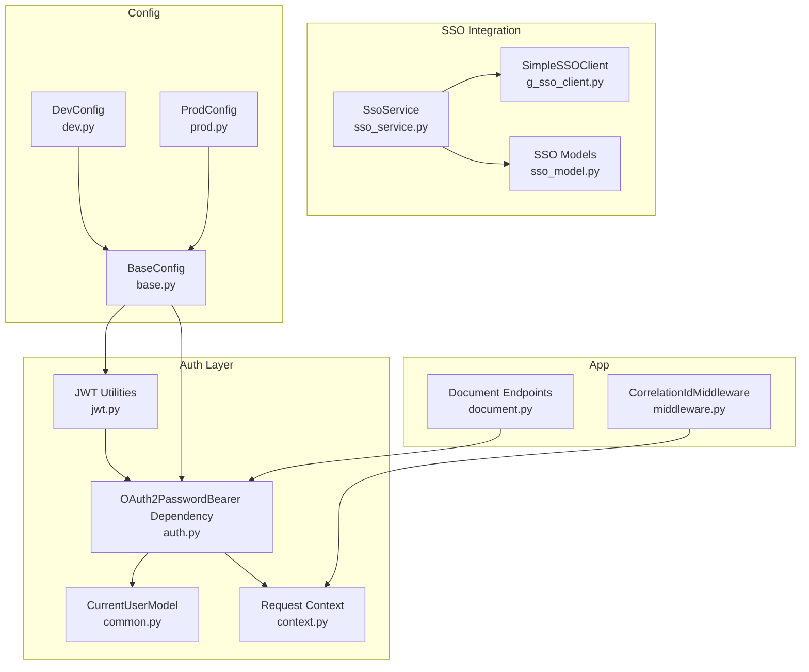
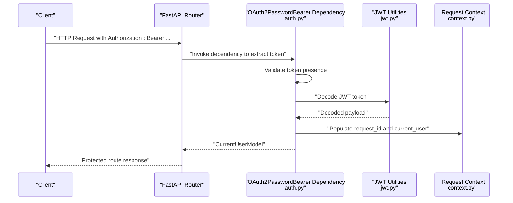
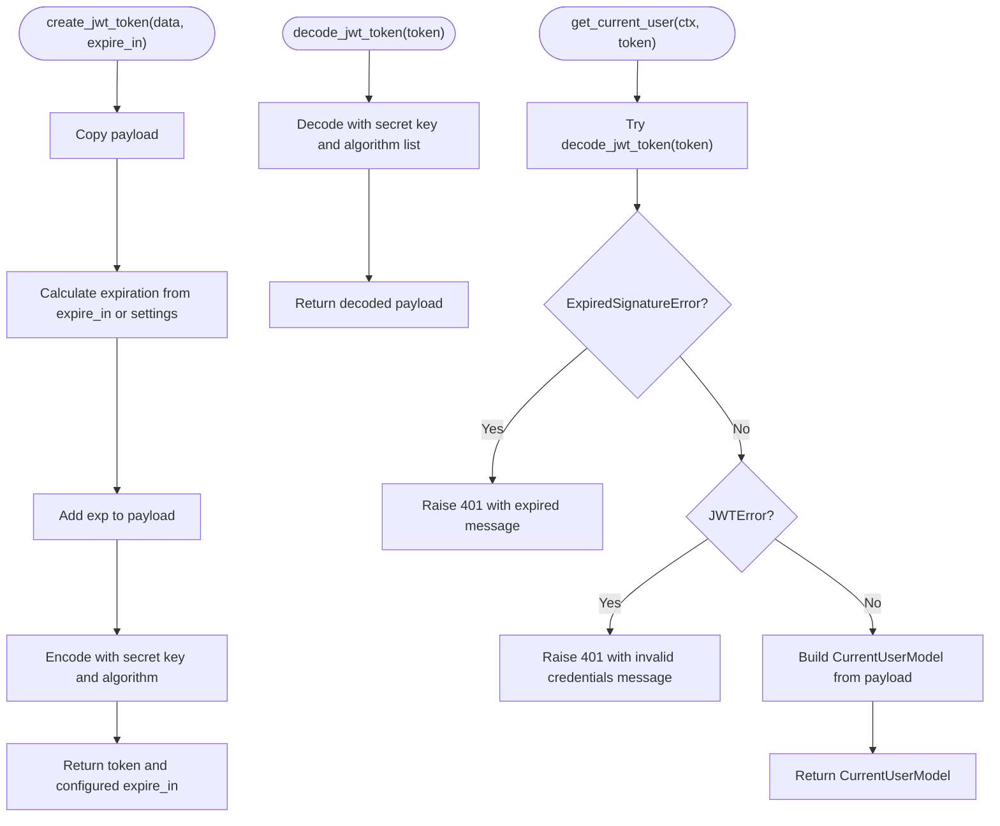
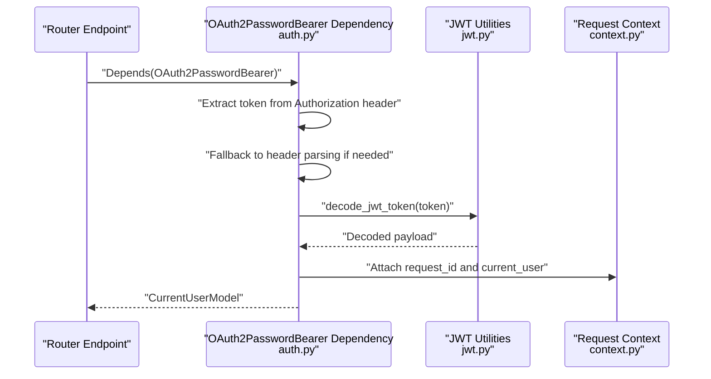
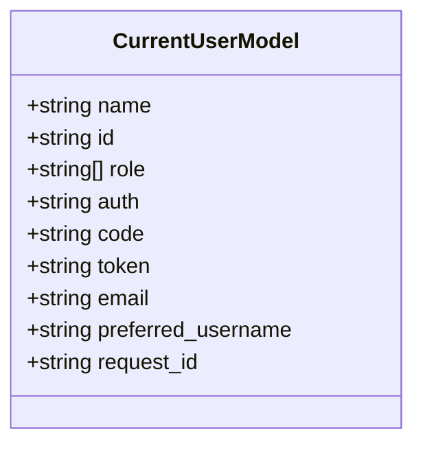
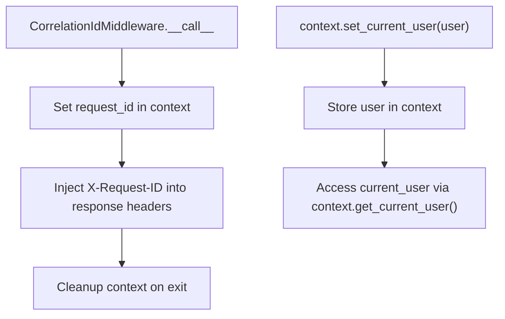
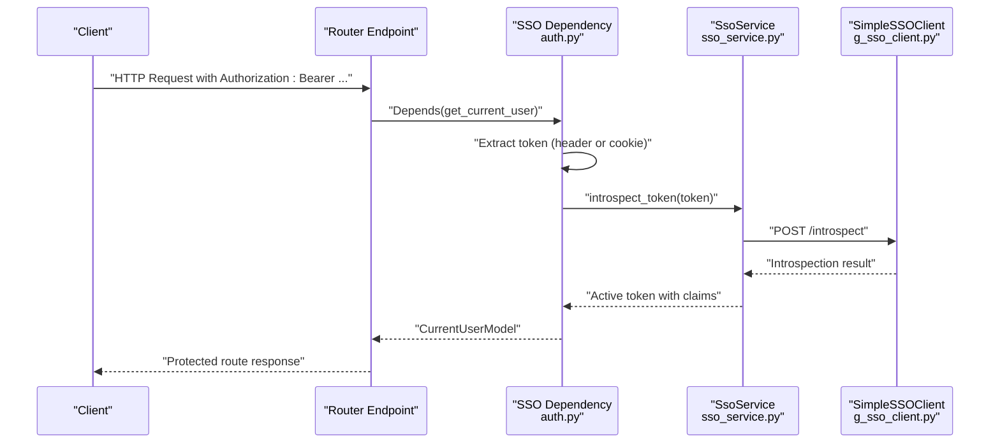
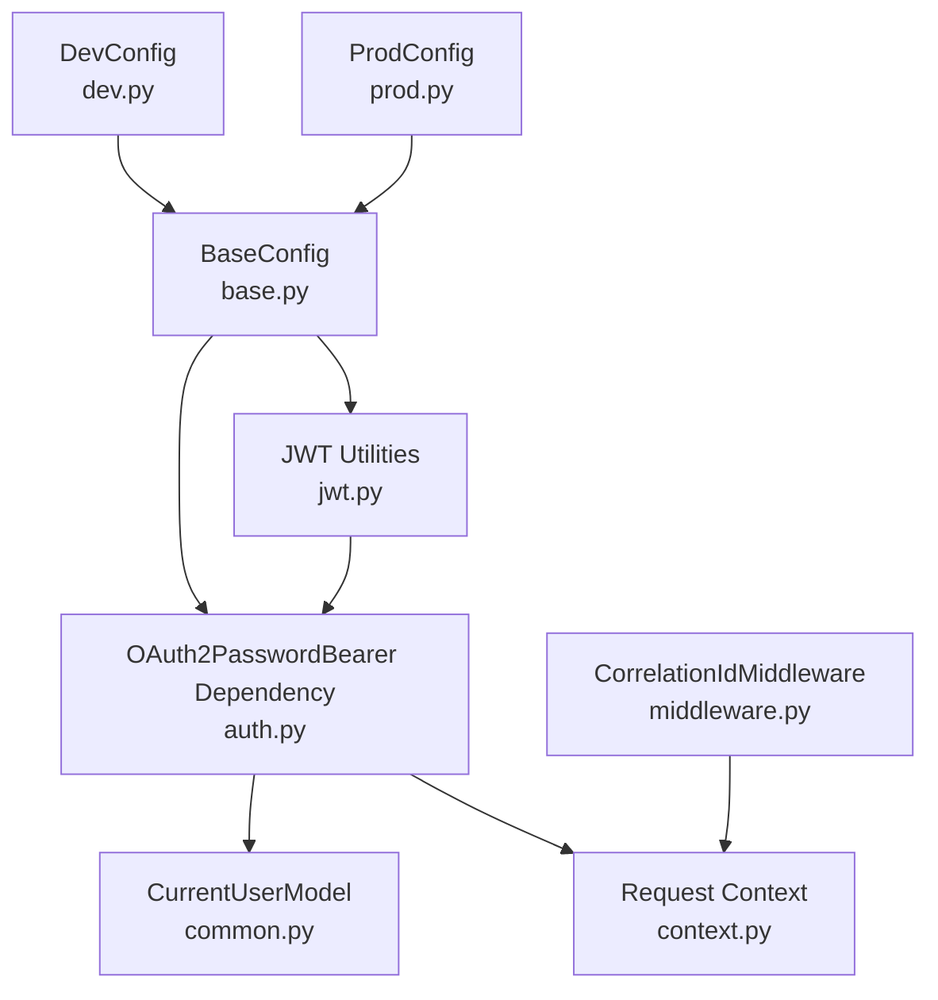

# JWT Authentication

<cite>
**Referenced Files in This Document**
- [jwt.py](file://app/auth/jwt.py)
- [auth.py](file://app/dependencies/auth.py)
- [common.py](file://app/models/common.py)
- [context.py](file://config/context.py)
- [sso_service.py](file://app/auth/sso_service.py)
- [g_sso_client.py](file://app/auth/g_sso_client.py)
- [sso_model.py](file://app/models/sso_model.py)
- [base.py](file://config/base.py)
- [dev.py](file://config/dev.py)
- [prod.py](file://config/prod.py)
- [middleware.py](file://app/middleware.py)
- [document.py](file://app/endpoints/document.py)
</cite>

## Table of Contents
1. [Introduction](#introduction)
2. [Project Structure](#project-structure)
3. [Core Components](#core-components)
4. [Architecture Overview](#architecture-overview)
5. [Detailed Component Analysis](#detailed-component-analysis)
6. [Dependency Analysis](#dependency-analysis)
7. [Performance Considerations](#performance-considerations)
8. [Troubleshooting Guide](#troubleshooting-guide)
9. [Conclusion](#conclusion)
10. [Appendices](#appendices)

## Introduction
This document explains the JWT authentication system used by the application. It covers token creation, encoding, expiration handling, and signature generation. It documents token validation mechanisms, including error handling for expired tokens and invalid signatures. It also details the OAuth2PasswordBearer dependency injection pattern and how it integrates with FastAPI’s security framework. The CurrentUserModel structure and how user context is propagated through the request lifecycle are explained. Practical examples of token generation, validation, and user context extraction are included. Configuration options such as jwt_secret_key, jwt_algorithm, and jwt_expired_in are documented along with security considerations and troubleshooting guidance.

## Project Structure
The JWT authentication system spans several modules:
- JWT utilities and OAuth2PasswordBearer integration live in the auth module.
- The dependency that validates tokens and builds the current user lives in the dependencies module.
- The CurrentUserModel defines the authenticated user structure.
- Request-scoped context is managed via a context manager.
- SSO integration provides an alternative authentication flow for resource servers.
- Configuration is centralized in the config module.

**Diagram sources**
- [jwt.py:1-59](file://app/auth/jwt.py#L1-L59)
- [auth.py:1-129](file://app/dependencies/auth.py#L1-L129)
- [common.py:1-53](file://app/models/common.py#L1-L53)
- [context.py:1-33](file://config/context.py#L1-L33)
- [sso_service.py:1-59](file://app/auth/sso_service.py#L1-L59)
- [g_sso_client.py:1-223](file://app/auth/g_sso_client.py#L1-L223)
- [sso_model.py:1-61](file://app/models/sso_model.py#L1-L61)
- [base.py:1-57](file://config/base.py#L1-L57)
- [dev.py:1-12](file://config/dev.py#L1-L12)
- [prod.py:1-6](file://config/prod.py#L1-L6)
- [middleware.py:1-99](file://app/middleware.py#L1-L99)
- [document.py:1-353](file://app/endpoints/document.py#L1-L353)

**Section sources**
- [jwt.py:1-59](file://app/auth/jwt.py#L1-L59)
- [auth.py:1-129](file://app/dependencies/auth.py#L1-L129)
- [common.py:1-53](file://app/models/common.py#L1-L53)
- [context.py:1-33](file://config/context.py#L1-L33)
- [sso_service.py:1-59](file://app/auth/sso_service.py#L1-L59)
- [g_sso_client.py:1-223](file://app/auth/g_sso_client.py#L1-L223)
- [sso_model.py:1-61](file://app/models/sso_model.py#L1-L61)
- [base.py:1-57](file://config/base.py#L1-L57)
- [dev.py:1-12](file://config/dev.py#L1-L12)
- [prod.py:1-6](file://config/prod.py#L1-L6)
- [middleware.py:1-99](file://app/middleware.py#L1-L99)
- [document.py:1-353](file://app/endpoints/document.py#L1-L353)

## Core Components
- JWT utilities: encode and decode JWT tokens, manage expiration, and integrate with OAuth2PasswordBearer.
- OAuth2PasswordBearer dependency: extracts the bearer token from the Authorization header and validates it.
- CurrentUserModel: standardized authenticated user representation.
- Request context: stores request-scoped identifiers and current user for logging and tracing.
- SSO service: alternative authentication flow for resource servers using token introspection.

Key responsibilities:
- Token creation: payload encoding, adding expiration, signing with secret and algorithm.
- Token validation: decoding with secret and algorithm, handling expired and invalid signatures.
- Dependency injection: OAuth2PasswordBearer dependency resolves the token and invokes validation.
- User context propagation: request ID and current user are attached to the request state and context.

**Section sources**
- [jwt.py:18-56](file://app/auth/jwt.py#L18-L56)
- [auth.py:23-128](file://app/dependencies/auth.py#L23-L128)
- [common.py:8-18](file://app/models/common.py#L8-L18)
- [context.py:5-30](file://config/context.py#L5-L30)

## Architecture Overview
The JWT authentication flow integrates with FastAPI’s dependency injection system. The OAuth2PasswordBearer dependency extracts the bearer token from the Authorization header. The dependency then decodes the JWT, validates it, and constructs a CurrentUserModel. Request-scoped context is populated with correlation IDs and current user information.

**Diagram sources**
- [auth.py:23-128](file://app/dependencies/auth.py#L23-L128)
- [jwt.py:27-56](file://app/auth/jwt.py#L27-L56)
- [context.py:13-30](file://config/context.py#L13-L30)

## Detailed Component Analysis

### JWT Utilities
The JWT utilities module encapsulates token creation and decoding, and integrates with OAuth2PasswordBearer.

- Token creation:
  - Payload copying and expiration calculation using minutes from configuration.
  - Encoding with secret key and algorithm.
  - Returning the token and configured expiration duration.
- Token decoding:
  - Decoding with secret key and algorithm list.
- Current user extraction:
  - Uses OAuth2PasswordBearer to resolve the token.
  - Validates decoded token and raises HTTP exceptions for expired or invalid tokens.
  - Constructs CurrentUserModel with fields extracted from the token payload and request context.

**Diagram sources**
- [jwt.py:18-56](file://app/auth/jwt.py#L18-L56)

**Section sources**
- [jwt.py:18-56](file://app/auth/jwt.py#L18-L56)

### OAuth2PasswordBearer Dependency Injection
The dependency extracts the bearer token from the Authorization header and validates it. It handles missing tokens and delegates validation to the JWT utilities.

- Token extraction:
  - Reads Authorization header and splits on "Bearer ".
  - Falls back to extracting token directly from the header if not prefixed.
- Validation:
  - Calls the JWT decode function.
  - Handles expired and invalid token errors with appropriate HTTP exceptions.
- Current user construction:
  - Builds CurrentUserModel from decoded payload and request context.

**Diagram sources**
- [auth.py:23-128](file://app/dependencies/auth.py#L23-L128)
- [jwt.py:27-56](file://app/auth/jwt.py#L27-L56)
- [context.py:13-30](file://config/context.py#L13-L30)

**Section sources**
- [auth.py:23-128](file://app/dependencies/auth.py#L23-L128)

### CurrentUserModel Structure
CurrentUserModel defines the authenticated user representation used across the application. It includes identity, roles, authentication metadata, and request context.

**Diagram sources**
- [common.py:8-18](file://app/models/common.py#L8-L18)

**Section sources**
- [common.py:8-18](file://app/models/common.py#L8-L18)

### Request Context Propagation
Request context manages request-scoped identifiers and current user information. Middleware sets correlation IDs and attaches a logger to the request state. The dependency stores current user information in context for downstream use.

**Diagram sources**
- [middleware.py:15-44](file://app/middleware.py#L15-L44)
- [context.py:13-30](file://config/context.py#L13-L30)

**Section sources**
- [middleware.py:15-44](file://app/middleware.py#L15-L44)
- [context.py:13-30](file://config/context.py#L13-L30)

### SSO-Based Authentication Alternative
While the JWT utilities provide a local JWT flow, the application also supports SSO-based authentication for resource servers. The dependency validates tokens via introspection against the SSO provider and constructs CurrentUserModel from the introspection response.

**Diagram sources**
- [auth.py:23-128](file://app/dependencies/auth.py#L23-L128)
- [sso_service.py:50-53](file://app/auth/sso_service.py#L50-L53)
- [g_sso_client.py:199-222](file://app/auth/g_sso_client.py#L199-L222)

**Section sources**
- [auth.py:23-128](file://app/dependencies/auth.py#L23-L128)
- [sso_service.py:50-53](file://app/auth/sso_service.py#L50-L53)
- [g_sso_client.py:199-222](file://app/auth/g_sso_client.py#L199-L222)

## Dependency Analysis
The JWT authentication system depends on configuration settings and FastAPI’s security components. The OAuth2PasswordBearer dependency relies on the JWT utilities for token validation. The dependency also interacts with request context for correlation IDs and current user storage.

**Diagram sources**
- [base.py:1-57](file://config/base.py#L1-L57)
- [dev.py:1-12](file://config/dev.py#L1-L12)
- [prod.py:1-6](file://config/prod.py#L1-L6)
- [jwt.py:11-13](file://app/auth/jwt.py#L11-L13)
- [auth.py:20-26](file://app/dependencies/auth.py#L20-L26)
- [common.py:8-18](file://app/models/common.py#L8-L18)
- [context.py:9-10](file://config/context.py#L9-L10)
- [middleware.py:29](file://app/middleware.py#L29)

**Section sources**
- [base.py:1-57](file://config/base.py#L1-L57)
- [dev.py:1-12](file://config/dev.py#L1-L12)
- [prod.py:1-6](file://config/prod.py#L1-L6)
- [jwt.py:11-13](file://app/auth/jwt.py#L11-L13)
- [auth.py:20-26](file://app/dependencies/auth.py#L20-L26)
- [common.py:8-18](file://app/models/common.py#L8-L18)
- [context.py:9-10](file://config/context.py#L9-L10)
- [middleware.py:29](file://app/middleware.py#L29)

## Performance Considerations
- Token decoding is lightweight and occurs per request; caching decoded tokens is unnecessary and potentially unsafe.
- Avoid excessive logging of sensitive token data; log only non-sensitive fields.
- Ensure the JWT secret key and algorithm are configured appropriately for the environment to minimize validation overhead.
- For SSO-based flows, token introspection adds network latency; consider connection pooling and timeouts.

[No sources needed since this section provides general guidance]

## Troubleshooting Guide
Common JWT validation errors and resolutions:
- Expired token:
  - Symptom: 401 Unauthorized with an expired token message.
  - Resolution: Regenerate a new token with an updated expiration.
- Invalid signature:
  - Symptom: 401 Unauthorized with an invalid credentials message.
  - Resolution: Verify the secret key and algorithm match the issuer; ensure the token was signed with the correct key.
- Missing Authorization header:
  - Symptom: 401 Unauthorized indicating a missing authentication token.
  - Resolution: Include a Bearer token in the Authorization header.
- Token introspection failures (SSO flow):
  - Symptom: 503 Service Unavailable during token validation.
  - Resolution: Check SSO availability and client credentials; ensure the introspection endpoint is reachable.

**Section sources**
- [jwt.py:41-46](file://app/auth/jwt.py#L41-L46)
- [auth.py:65-71](file://app/dependencies/auth.py#L65-L71)
- [auth.py:76-81](file://app/dependencies/auth.py#L76-L81)

## Conclusion
The JWT authentication system provides a robust, FastAPI-native solution for protecting routes. It leverages OAuth2PasswordBearer for seamless dependency injection, integrates with request context for correlation and user tracking, and offers clear error handling for common token validation issues. Configuration options allow tuning of secret keys, algorithms, and expiration durations. For resource server scenarios, SSO-based introspection provides an alternative that centralizes token validation with the identity provider.

[No sources needed since this section summarizes without analyzing specific files]

## Appendices

### Configuration Options
- jwt_secret_key: Secret key used to sign and verify JWT tokens.
- jwt_algorithm: Algorithm used for signing JWT tokens (e.g., HS256).
- jwt_expired_in: Token expiration duration in minutes.

Environment-specific behavior:
- Development disables authentication for testing convenience.
- Production enforces strict authentication and logging.

**Section sources**
- [base.py:49-52](file://config/base.py#L49-L52)
- [dev.py:11-12](file://config/dev.py#L11-L12)
- [prod.py:3-6](file://config/prod.py#L3-L6)

### Practical Examples
- Token generation:
  - Use the token creation function to encode a payload with an expiration and return the signed token and configured expiration duration.
- Token validation:
  - Use the dependency to extract and validate the bearer token; on success, construct a CurrentUserModel; on failure, raise appropriate HTTP exceptions.
- User context extraction:
  - Access the current user via the dependency; the request context carries correlation IDs and user metadata for logging and tracing.

**Section sources**
- [jwt.py:18-24](file://app/auth/jwt.py#L18-L24)
- [jwt.py:31-56](file://app/auth/jwt.py#L31-L56)
- [auth.py:23-128](file://app/dependencies/auth.py#L23-L128)
- [document.py:18](file://app/endpoints/document.py#L18)

### Security Considerations
- Token expiration:
  - Configure appropriate expiration durations to balance usability and security.
- Algorithm selection:
  - Prefer strong algorithms (e.g., HS256) and keep the secret key secure.
- Secure key management:
  - Store secret keys in environment variables and rotate them periodically.
- Transport security:
  - Use HTTPS to protect tokens in transit.
- SSO integration:
  - Ensure client credentials are properly configured and kept secret; validate tokens via introspection to offload validation to the identity provider.

**Section sources**
- [base.py:49-52](file://config/base.py#L49-L52)
- [g_sso_client.py:205-206](file://app/auth/g_sso_client.py#L205-L206)