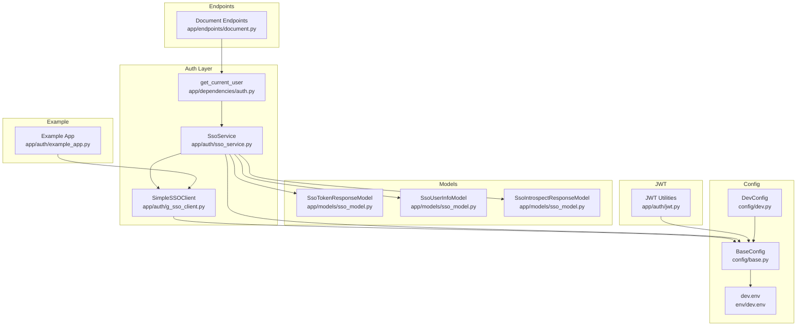
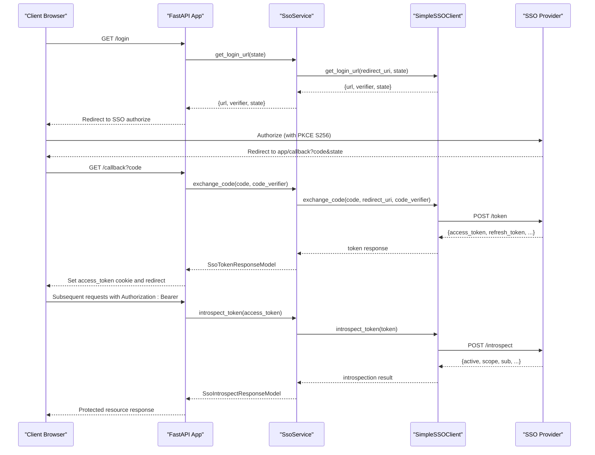
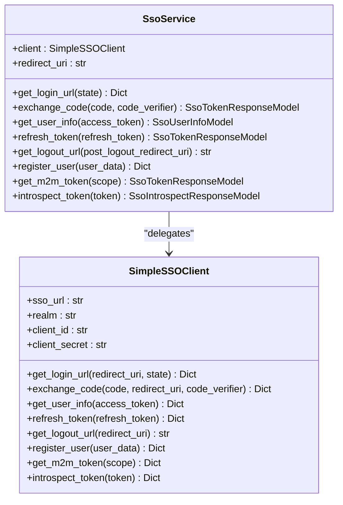
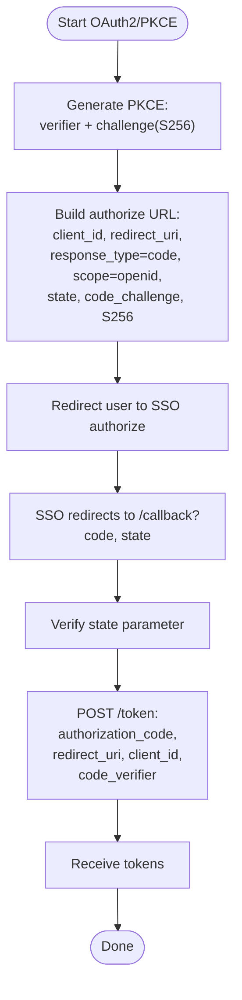
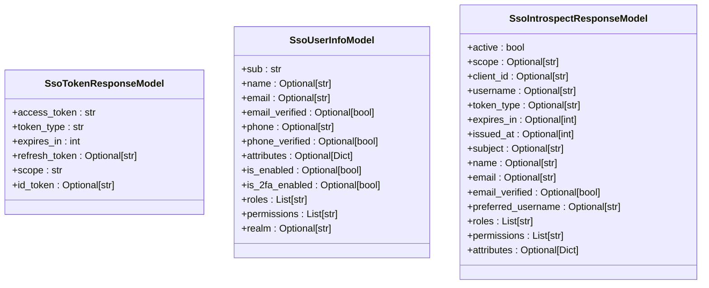
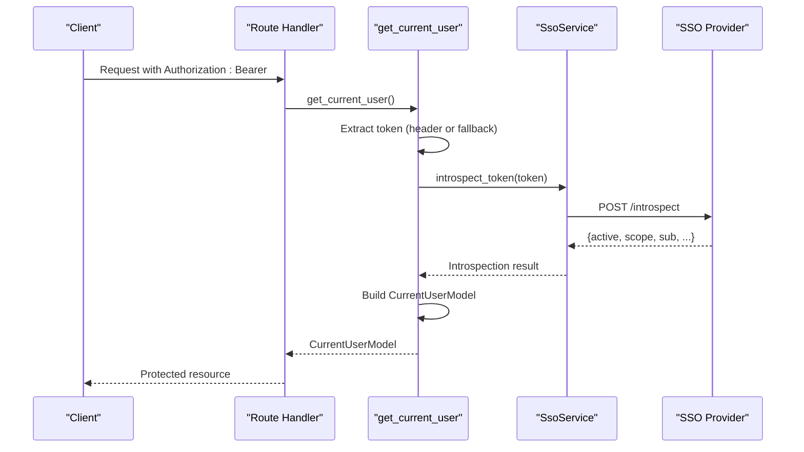
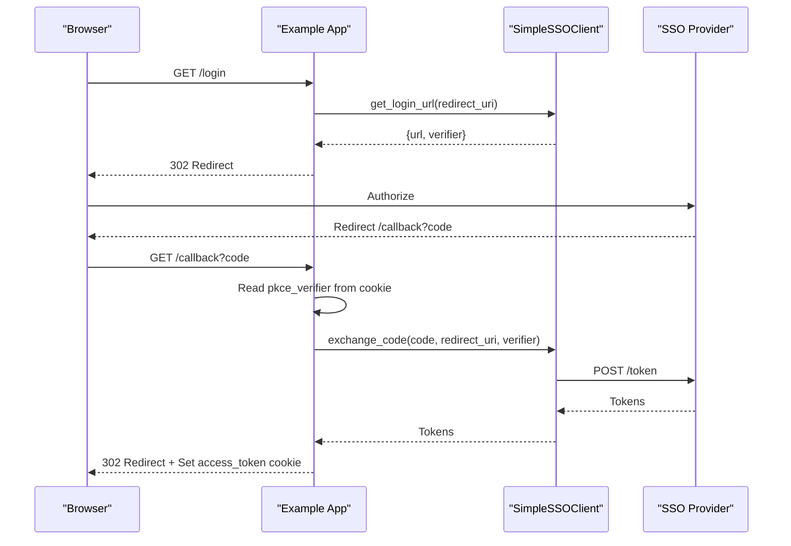
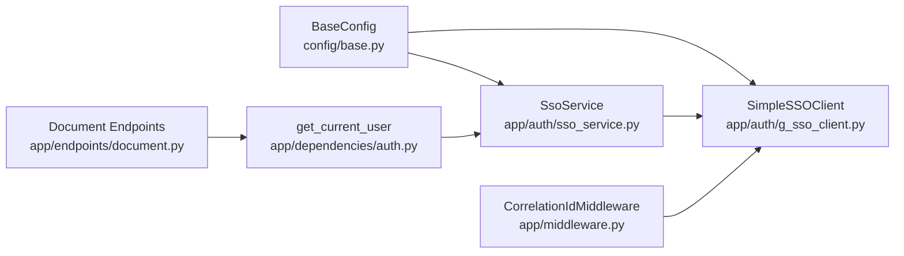

# SSO Integration

<cite>
**Referenced Files in This Document**
- [sso_service.py](file://app/auth/sso_service.py)
- [g_sso_client.py](file://app/auth/g_sso_client.py)
- [sso_model.py](file://app/models/sso_model.py)
- [jwt.py](file://app/auth/jwt.py)
- [example_app.py](file://app/auth/example_app.py)
- [auth.py](file://app/dependencies/auth.py)
- [document.py](file://app/endpoints/document.py)
- [base.py](file://config/base.py)
- [dev.py](file://config/dev.py)
- [dev.env](file://env/dev.env)
- [middleware.py](file://app/middleware.py)
- [main.py](file://app/main.py)
</cite>

## Table of Contents
1. [Introduction](#introduction)
2. [Project Structure](#project-structure)
3. [Core Components](#core-components)
4. [Architecture Overview](#architecture-overview)
5. [Detailed Component Analysis](#detailed-component-analysis)
6. [Dependency Analysis](#dependency-analysis)
7. [Performance Considerations](#performance-considerations)
8. [Troubleshooting Guide](#troubleshooting-guide)
9. [Conclusion](#conclusion)
10. [Appendices](#appendices)

## Introduction
This document describes the Single Sign-On (SSO) integration system implemented in the project. It covers the OAuth2 authorization flow with PKCE (Proof Key for Code Exchange) support, the SSO service abstraction over provider endpoints, the Google SSO client implementation, token and user data models, practical configuration and usage examples, and the relationship between SSO and JWT authentication. It also addresses security considerations and provides troubleshooting guidance for common integration issues.

## Project Structure
The SSO integration spans several modules:
- Authentication service and client: SSO service wrapper and low-level client
- Models: Pydantic models for token, user info, and introspection responses
- Dependencies: FastAPI dependency for resource server token introspection
- Endpoints: Protected routes that enforce SSO-based authentication
- Configuration: Environment-driven settings for SSO and JWT
- Example app: Standalone demo of the OAuth2/PKCE flow
- Middleware: Request correlation and logging

**Diagram sources**
- [sso_service.py:8-57](file://app/auth/sso_service.py#L8-L57)
- [g_sso_client.py:12-223](file://app/auth/g_sso_client.py#L12-L223)
- [sso_model.py:8-61](file://app/models/sso_model.py#L8-L61)
- [auth.py:23-129](file://app/dependencies/auth.py#L23-L129)
- [document.py:15-19](file://app/endpoints/document.py#L15-L19)
- [base.py:9-57](file://config/base.py#L9-L57)
- [dev.py:3-12](file://config/dev.py#L3-L12)
- [dev.env:1-14](file://env/dev.env#L1-L14)
- [jwt.py:18-28](file://app/auth/jwt.py#L18-L28)
- [example_app.py:121-164](file://app/auth/example_app.py#L121-L164)

**Section sources**
- [sso_service.py:8-57](file://app/auth/sso_service.py#L8-L57)
- [g_sso_client.py:12-223](file://app/auth/g_sso_client.py#L12-L223)
- [sso_model.py:8-61](file://app/models/sso_model.py#L8-L61)
- [auth.py:23-129](file://app/dependencies/auth.py#L23-L129)
- [document.py:15-19](file://app/endpoints/document.py#L15-L19)
- [base.py:9-57](file://config/base.py#L9-L57)
- [dev.py:3-12](file://config/dev.py#L3-L12)
- [dev.env:1-14](file://env/dev.env#L1-L14)
- [jwt.py:18-28](file://app/auth/jwt.py#L18-L28)
- [example_app.py:121-164](file://app/auth/example_app.py#L121-L164)

## Core Components
- SsoService: Provides a unified interface to the SSO provider by wrapping SimpleSSOClient. It handles login URL generation, authorization code exchange, user info retrieval, token refresh, logout URL construction, user registration, machine-to-machine (M2M) token acquisition, and token introspection. It derives redirect URIs from configuration and returns strongly typed models.
- SimpleSSOClient: Implements the OAuth2/OIDC flows against provider endpoints. It generates PKCE challenges, constructs authorize/token/userinfo/logout/introspect/register URLs, performs HTTP calls, and raises exceptions on non-200 responses. It attaches request correlation headers and supports optional SSL verification toggling.
- SSO Models: Pydantic models for token responses, user info, and introspection results, ensuring consistent data shapes across the application.
- Resource Server Dependency: get_current_user validates incoming Bearer tokens by calling SSO introspect and builds a CurrentUserModel for downstream use.
- JWT Utilities: Helper functions to encode/decode JWT tokens for local token issuance and validation within the service.
- Example App: Demonstrates a complete OAuth2/PKCE flow with cookie-based state/pkce storage and a simple protected route.

**Section sources**
- [sso_service.py:8-57](file://app/auth/sso_service.py#L8-L57)
- [g_sso_client.py:12-223](file://app/auth/g_sso_client.py#L12-L223)
- [sso_model.py:8-61](file://app/models/sso_model.py#L8-L61)
- [auth.py:23-129](file://app/dependencies/auth.py#L23-L129)
- [jwt.py:18-28](file://app/auth/jwt.py#L18-L28)
- [example_app.py:121-164](file://app/auth/example_app.py#L121-L164)

## Architecture Overview
The system integrates SSO at two layers:
- Frontend/OAuth2 flow: PKCE-based authorization code flow with a redirect URI and state parameter for CSRF protection.
- Backend/resource server: Bearer token introspection against the SSO provider to validate tokens and populate request context.

**Diagram sources**
- [sso_service.py:18-53](file://app/auth/sso_service.py#L18-L53)
- [g_sso_client.py:45-97](file://app/auth/g_sso_client.py#L45-L97)
- [auth.py:74-90](file://app/dependencies/auth.py#L74-L90)

**Section sources**
- [sso_service.py:18-53](file://app/auth/sso_service.py#L18-L53)
- [g_sso_client.py:45-97](file://app/auth/g_sso_client.py#L45-L97)
- [auth.py:74-90](file://app/dependencies/auth.py#L74-L90)

## Detailed Component Analysis

### SsoService
Responsibilities:
- Construct provider endpoints from configuration
- Generate login URLs with PKCE and state
- Exchange authorization codes for tokens
- Retrieve user info via access tokens
- Refresh tokens
- Build logout URLs
- Register users
- Obtain M2M tokens
- Introspect tokens for validation

Key behaviors:
- Redirect URI normalization and composition
- Strong typing via Pydantic models for all responses
- Delegation to SimpleSSOClient for HTTP operations

**Diagram sources**
- [sso_service.py:8-57](file://app/auth/sso_service.py#L8-L57)
- [g_sso_client.py:12-223](file://app/auth/g_sso_client.py#L12-L223)

**Section sources**
- [sso_service.py:8-57](file://app/auth/sso_service.py#L8-L57)

### SimpleSSOClient
Responsibilities:
- PKCE challenge generation (S256)
- OAuth2 authorize/token/userinfo/logout/introspect/register endpoints
- HTTP client calls with request correlation headers
- Error handling via exceptions on non-200 responses

PKCE flow:
- Generate code_verifier and code_challenge (SHA-256 + URL-safe base64)
- Include state parameter for CSRF protection
- Enforce code_verifier during token exchange

**Diagram sources**
- [g_sso_client.py:38-72](file://app/auth/g_sso_client.py#L38-L72)
- [g_sso_client.py:74-97](file://app/auth/g_sso_client.py#L74-L97)

**Section sources**
- [g_sso_client.py:38-72](file://app/auth/g_sso_client.py#L38-L72)
- [g_sso_client.py:74-97](file://app/auth/g_sso_client.py#L74-L97)

### SSO Models
Token response model: access_token, token_type, expires_in, refresh_token (optional), scope, id_token (optional)
User info model: sub, name, email, email_verified, phone, phone_verified, attributes, is_enabled, is_2fa_enabled, roles, permissions, realm
Introspection model: active, scope, client_id, username, token_type, exp (expires_in), iat (issued_at), sub (subject), plus extended user claims and attributes

**Diagram sources**
- [sso_model.py:8-61](file://app/models/sso_model.py#L8-L61)

**Section sources**
- [sso_model.py:8-61](file://app/models/sso_model.py#L8-L61)

### Resource Server Authentication (get_current_user)
Behavior:
- Extracts Bearer token from Authorization header or falls back to configured extraction
- Supports a bypass mode for development/testing
- Calls SSO introspect to validate token and determine active status
- Builds CurrentUserModel from introspection response, parsing roles from scope if needed
- Stores user context for downstream use

**Diagram sources**
- [auth.py:23-129](file://app/dependencies/auth.py#L23-L129)
- [sso_service.py:50-53](file://app/auth/sso_service.py#L50-L53)

**Section sources**
- [auth.py:23-129](file://app/dependencies/auth.py#L23-L129)
- [sso_service.py:50-53](file://app/auth/sso_service.py#L50-L53)

### JWT Authentication Utilities
Functions:
- create_jwt_token: Encodes a payload with expiration
- decode_jwt_token: Decodes and validates JWT signature
- get_current_user (FastAPI): Validates JWT bearer token and returns CurrentUserModel

Note: These utilities operate on locally managed JWT tokens, distinct from SSO access tokens validated via introspection.

**Section sources**
- [jwt.py:18-28](file://app/auth/jwt.py#L18-L28)
- [jwt.py:31-56](file://app/auth/jwt.py#L31-L56)

### Example App (OAuth2/PKCE Demo)
Highlights:
- Demonstrates PKCE flow end-to-end
- Generates login URL, stores pkce_verifier in a cookie, exchanges code for tokens, sets access_token cookie
- Includes protected route and logout behavior

**Diagram sources**
- [example_app.py:121-150](file://app/auth/example_app.py#L121-L150)
- [g_sso_client.py:45-97](file://app/auth/g_sso_client.py#L45-L97)

**Section sources**
- [example_app.py:121-150](file://app/auth/example_app.py#L121-L150)
- [g_sso_client.py:45-97](file://app/auth/g_sso_client.py#L45-L97)

## Dependency Analysis
- SsoService depends on SimpleSSOClient and configuration settings for SSO endpoints and credentials.
- SimpleSSOClient depends on configuration and uses httpx for HTTP calls.
- get_current_user depends on SsoService and Pydantic models for building the current user context.
- Endpoints depend on get_current_user to enforce SSO-based authentication.
- Middleware provides request correlation headers used by SimpleSSOClient.

**Diagram sources**
- [base.py:9-57](file://config/base.py#L9-L57)
- [sso_service.py:8-16](file://app/auth/sso_service.py#L8-L16)
- [g_sso_client.py:12-29](file://app/auth/g_sso_client.py#L12-L29)
- [auth.py:15-18](file://app/dependencies/auth.py#L15-L18)
- [document.py:8-18](file://app/endpoints/document.py#L8-L18)
- [middleware.py:7-44](file://app/middleware.py#L7-L44)

**Section sources**
- [base.py:9-57](file://config/base.py#L9-L57)
- [sso_service.py:8-16](file://app/auth/sso_service.py#L8-L16)
- [g_sso_client.py:12-29](file://app/auth/g_sso_client.py#L12-L29)
- [auth.py:15-18](file://app/dependencies/auth.py#L15-L18)
- [document.py:8-18](file://app/endpoints/document.py#L8-L18)
- [middleware.py:7-44](file://app/middleware.py#L7-L44)

## Performance Considerations
- Asynchronous HTTP client usage ensures non-blocking token exchange and introspection.
- Minimal model parsing overhead via Pydantic models.
- Avoid excessive introspection calls by caching validated tokens per request lifecycle when appropriate.
- Use HTTPS in production to protect tokens and cookies.

[No sources needed since this section provides general guidance]

## Troubleshooting Guide
Common issues and resolutions:
- Token introspection failures
  - Cause: SSO provider unavailable or client secret missing
  - Resolution: Verify SSO availability, configure client_secret for introspection, check network connectivity
  - Section sources
    - [auth.py:74-81](file://app/dependencies/auth.py#L74-L81)
    - [g_sso_client.py:205-222](file://app/auth/g_sso_client.py#L205-L222)

- Invalid or expired token
  - Cause: Token inactive or expired
  - Resolution: Trigger re-authentication flow; ensure token refresh logic is used when applicable
  - Section sources
    - [auth.py:84-90](file://app/dependencies/auth.py#L84-L90)

- Missing PKCE verifier or state mismatch
  - Cause: PKCE verifier not stored or state parameter not validated
  - Resolution: Store verifier in a secure session or cookie; validate state on callback
  - Section sources
    - [g_sso_client.py:52-53](file://app/auth/g_sso_client.py#L52-L53)
    - [example_app.py:132-150](file://app/auth/example_app.py#L132-L150)

- Redirect URI mismatch
  - Cause: Callback URL does not match registered redirect URI
  - Resolution: Ensure redirect_uri matches provider configuration and SsoService redirect URI composition
  - Section sources
    - [sso_service.py](file://app/auth/sso_service.py#L16)
    - [g_sso_client.py:78-86](file://app/auth/g_sso_client.py#L78-L86)

- SSL/TLS errors
  - Cause: Unverified certificates
  - Resolution: Enable SSL verification in production; review certificate configuration
  - Section sources
    - [g_sso_client.py](file://app/auth/g_sso_client.py#L29)

- Configuration mismatches
  - Cause: Incorrect SSO_URL, SSO_REALM, SSO_CLIENT_ID, SSO_CLIENT_SECRET, or SSO_REDIRECT_URI
  - Resolution: Align environment variables with provider settings; confirm dev/test overrides
  - Section sources
    - [base.py:42-47](file://config/base.py#L42-L47)
    - [dev.py:3-12](file://config/dev.py#L3-L12)
    - [dev.env:1-14](file://env/dev.env#L1-L14)

- Protected route access denied
  - Cause: Missing or invalid Bearer token
  - Resolution: Ensure Authorization header is present; verify token validity via introspection
  - Section sources
    - [auth.py:58-71](file://app/dependencies/auth.py#L58-L71)
    - [document.py](file://app/endpoints/document.py#L18)

## Conclusion
The SSO integration provides a robust, PKCE-enabled OAuth2 flow for user login and a secure resource server validation mechanism via token introspection. The SsoService abstracts provider specifics behind a unified interface, while Pydantic models ensure consistent data handling. Configuration is environment-driven, enabling flexible deployment across environments. The included examples and middleware facilitate secure, traceable operations.

[No sources needed since this section summarizes without analyzing specific files]

## Appendices

### Practical Configuration Examples
- Environment variables (selected)
  - SSO_URL: Base URL of the SSO provider
  - SSO_REALM: Realm or tenant identifier
  - SSO_CLIENT_ID: OAuth2 client identifier
  - SSO_CLIENT_SECRET: OAuth2 client secret (required for certain operations)
  - SSO_REDIRECT_URI: Application redirect URI used for callbacks
  - jwt_secret_key, jwt_algorithm, jwt_expired_in: JWT signing and expiration settings
- Development override
  - DISABLE_AUTH: Enables a mock user for testing without SSO

**Section sources**
- [base.py:42-52](file://config/base.py#L42-L52)
- [dev.py:3-12](file://config/dev.py#L3-L12)
- [dev.env:1-14](file://env/dev.env#L1-L14)

### OAuth2 Flow Implementation Notes
- PKCE S256 challenge generation and code_verifier enforcement
- State parameter generation and validation
- Token exchange using authorization_code + code_verifier
- User info retrieval via access token
- Logout URL construction with optional post_logout_redirect_uri

**Section sources**
- [g_sso_client.py:38-72](file://app/auth/g_sso_client.py#L38-L72)
- [g_sso_client.py:74-97](file://app/auth/g_sso_client.py#L74-L97)
- [g_sso_client.py:99-115](file://app/auth/g_sso_client.py#L99-L115)
- [g_sso_client.py:140-147](file://app/auth/g_sso_client.py#L140-L147)

### Token Validation Processes
- Resource server validation via introspect_token
- Role parsing from scope when roles list is empty
- Context population for downstream handlers

**Section sources**
- [auth.py:74-129](file://app/dependencies/auth.py#L74-L129)

### Relationship Between SSO and JWT
- SSO-based authentication: Bearer tokens validated via provider introspection
- Local JWT utilities: Separate token management for internal use (e.g., local session tokens)
- End-to-end: OAuth2/PKCE for user login; introspection for protected endpoints; optional local JWT for service-internal flows

**Section sources**
- [auth.py:23-129](file://app/dependencies/auth.py#L23-L129)
- [jwt.py:18-28](file://app/auth/jwt.py#L18-L28)