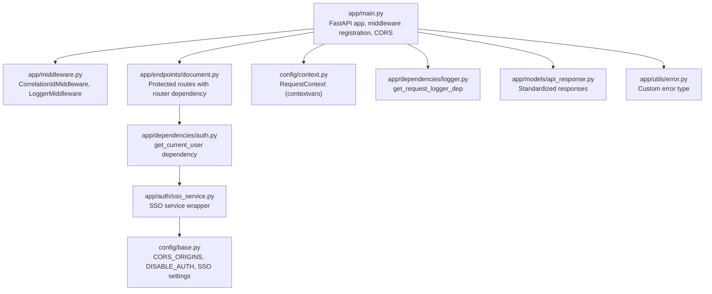
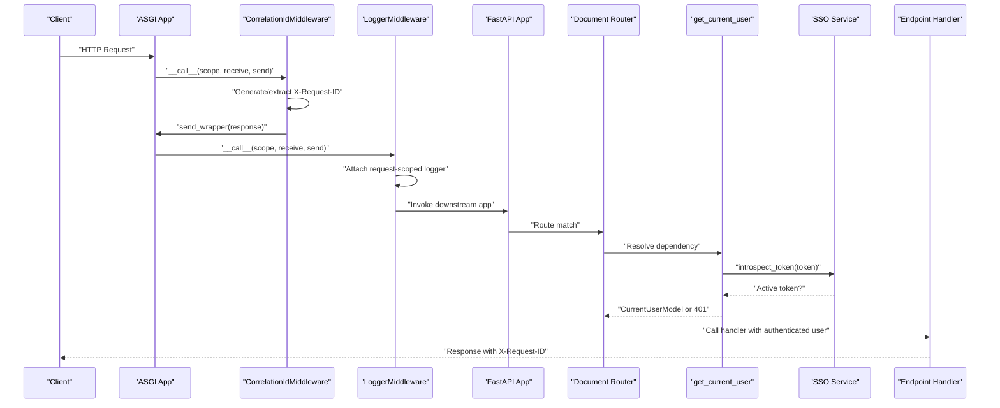
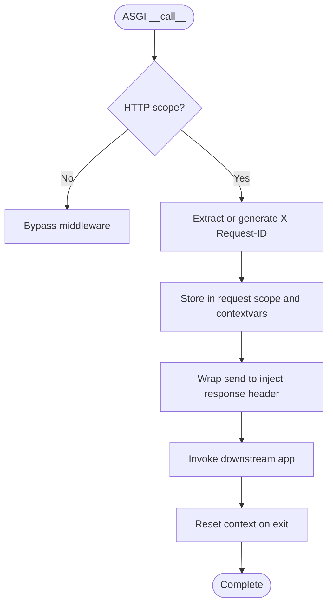
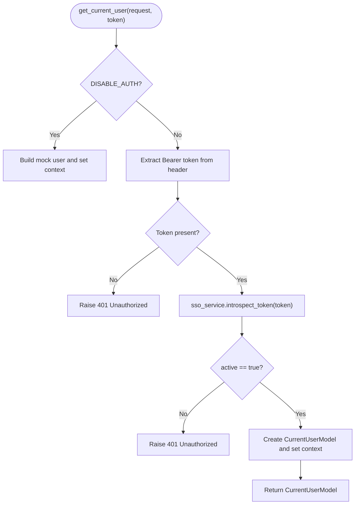
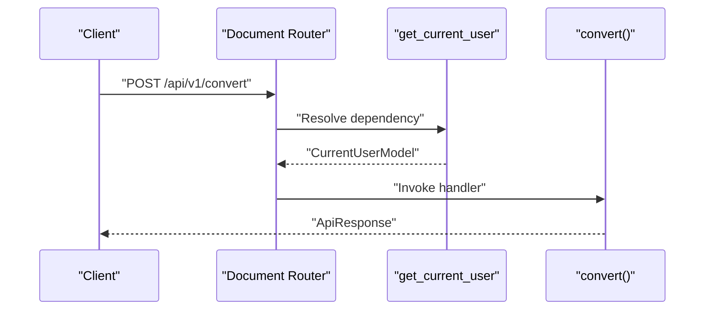
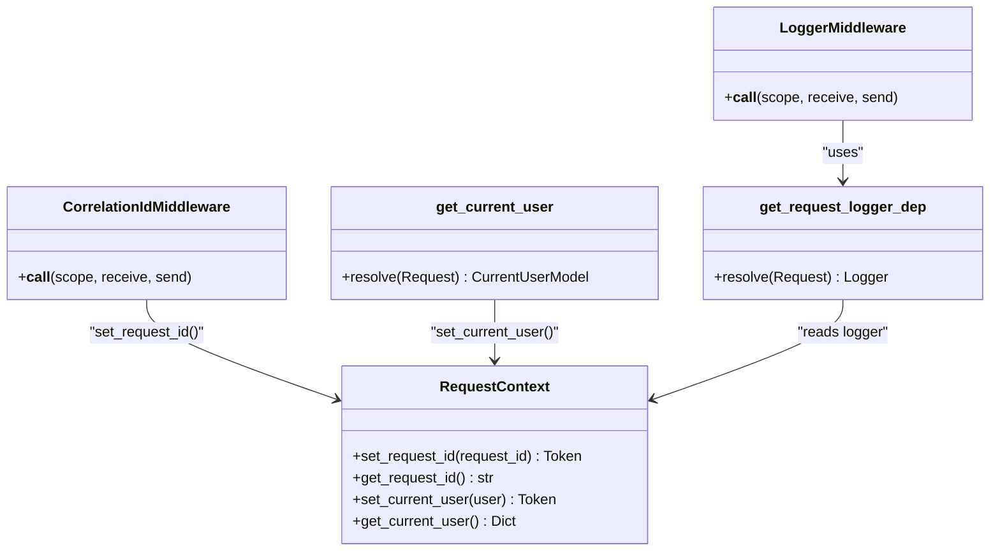
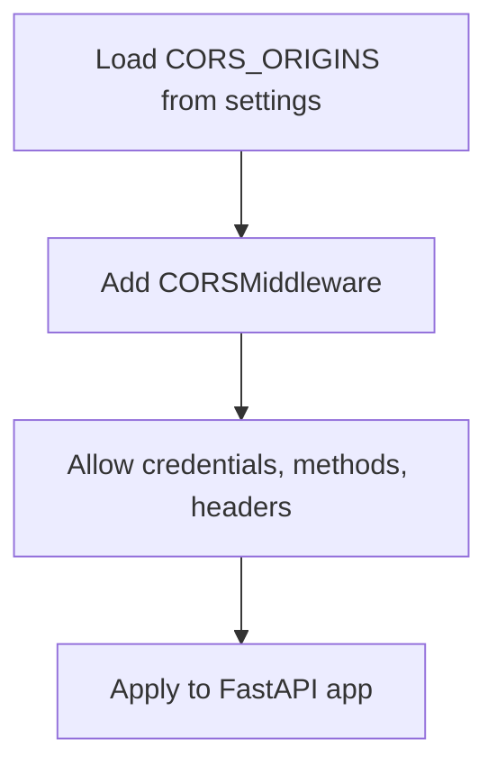
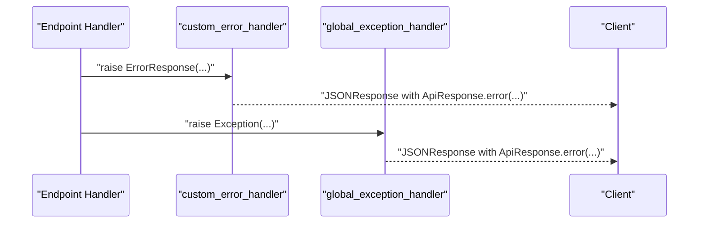
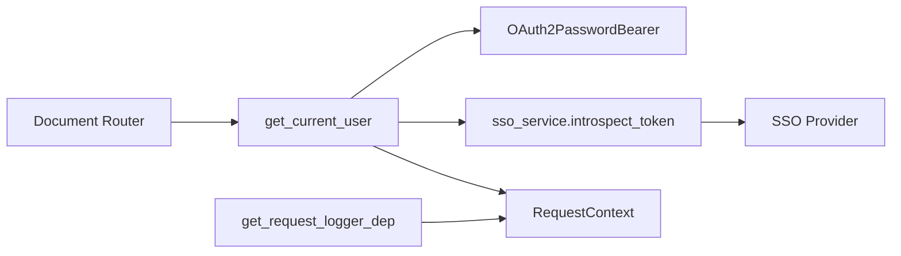

# Security Middleware

<cite>
**Referenced Files in This Document**
- [app/middleware.py](file://app/middleware.py)
- [app/dependencies/auth.py](file://app/dependencies/auth.py)
- [app/dependencies/logger.py](file://app/dependencies/logger.py)
- [app/endpoints/document.py](file://app/endpoints/document.py)
- [app/main.py](file://app/main.py)
- [config/context.py](file://config/context.py)
- [config/base.py](file://config/base.py)
- [config/dev.py](file://config/dev.py)
- [config/prod.py](file://config/prod.py)
- [config/test.py](file://config/test.py)
- [app/auth/jwt.py](file://app/auth/jwt.py)
- [app/auth/sso_service.py](file://app/auth/sso_service.py)
- [app/models/common.py](file://app/models/common.py)
- [app/models/sso_model.py](file://app/models/sso_model.py)
- [app/models/api_response.py](file://app/models/api_response.py)
- [app/utils/error.py](file://app/utils/error.py)
</cite>

## Table of Contents
1. [Introduction](#introduction)
2. [Project Structure](#project-structure)
3. [Core Components](#core-components)
4. [Architecture Overview](#architecture-overview)
5. [Detailed Component Analysis](#detailed-component-analysis)
6. [Dependency Analysis](#dependency-analysis)
7. [Performance Considerations](#performance-considerations)
8. [Troubleshooting Guide](#troubleshooting-guide)
9. [Conclusion](#conclusion)
10. [Appendices](#appendices)

## Introduction
This document explains the security middleware implementation, focusing on authentication dependency injection, FastAPI dependency integration, middleware configuration for protecting endpoints, correlation ID propagation, CORS policy, and error response formatting. It also provides practical examples for protected endpoints, custom authentication decorators, and request context management, along with guidance on extending the middleware for custom authentication schemes and integrating with external security systems.

## Project Structure
The security middleware spans several modules:
- Application entry and middleware registration
- Authentication dependency using SSO token introspection
- Request-scoped correlation ID and logger middleware
- CORS configuration
- Request context management via contextvars
- Error handling and standardized API responses

**Diagram sources**
- [app/main.py:83-95](file://app/main.py#L83-L95)
- [app/middleware.py:7-45](file://app/middleware.py#L7-L45)
- [app/endpoints/document.py:15-19](file://app/endpoints/document.py#L15-L19)
- [app/dependencies/auth.py:23-129](file://app/dependencies/auth.py#L23-L129)
- [app/auth/sso_service.py:8-59](file://app/auth/sso_service.py#L8-L59)
- [config/base.py:35-47](file://config/base.py#L35-L47)
- [config/context.py:5-33](file://config/context.py#L5-L33)
- [app/dependencies/logger.py:8-19](file://app/dependencies/logger.py#L8-L19)
- [app/models/api_response.py:14-123](file://app/models/api_response.py#L14-L123)
- [app/utils/error.py:4-17](file://app/utils/error.py#L4-L17)

**Section sources**
- [app/main.py:83-95](file://app/main.py#L83-L95)
- [app/middleware.py:7-45](file://app/middleware.py#L7-L45)
- [app/endpoints/document.py:15-19](file://app/endpoints/document.py#L15-L19)
- [app/dependencies/auth.py:23-129](file://app/dependencies/auth.py#L23-L129)
- [app/auth/sso_service.py:8-59](file://app/auth/sso_service.py#L8-L59)
- [config/base.py:35-47](file://config/base.py#L35-L47)
- [config/context.py:5-33](file://config/context.py#L5-L33)
- [app/dependencies/logger.py:8-19](file://app/dependencies/logger.py#L8-L19)
- [app/models/api_response.py:14-123](file://app/models/api_response.py#L14-L123)
- [app/utils/error.py:4-17](file://app/utils/error.py#L4-L17)

## Core Components
- CorrelationIdMiddleware: Generates or extracts a correlation ID, stores it in request scope, and injects it into response headers. Cleans up context after the request completes.
- LoggerMiddleware: Creates a request-scoped logger attached to the request state and logs request lifecycle events.
- get_current_user dependency: Validates Bearer tokens via SSO introspection, builds a CurrentUserModel, and stores user context for the request.
- RequestContext: Provides thread-safe request-scoped context using contextvars for correlation ID and current user.
- CORS configuration: Registered via FastAPI’s CORSMiddleware with origins loaded from settings.
- Standardized error handling: Custom ErrorResponse and exception handlers produce consistent JSON responses.

**Section sources**
- [app/middleware.py:7-45](file://app/middleware.py#L7-L45)
- [app/middleware.py:47-99](file://app/middleware.py#L47-L99)
- [app/dependencies/auth.py:23-129](file://app/dependencies/auth.py#L23-L129)
- [config/context.py:5-33](file://config/context.py#L5-L33)
- [app/main.py:87-95](file://app/main.py#L87-L95)
- [app/models/api_response.py:14-123](file://app/models/api_response.py#L14-L123)
- [app/utils/error.py:4-17](file://app/utils/error.py#L4-L17)

## Architecture Overview
The security middleware stack integrates at the ASGI level and FastAPI dependency level:
- ASGI middleware runs first to establish correlation ID and request-scoped logger.
- FastAPI dependency injection enforces authentication at the router or endpoint level.
- CORS is configured globally to control cross-origin behavior.
- Error handlers ensure consistent error responses.

**Diagram sources**
- [app/middleware.py:15-44](file://app/middleware.py#L15-L44)
- [app/middleware.py:55-99](file://app/middleware.py#L55-L99)
- [app/endpoints/document.py:15-19](file://app/endpoints/document.py#L15-L19)
- [app/dependencies/auth.py:23-129](file://app/dependencies/auth.py#L23-L129)
- [app/auth/sso_service.py:50-53](file://app/auth/sso_service.py#L50-L53)

## Detailed Component Analysis

### Correlation ID Propagation and Request Lifecycle
- CorrelationIdMiddleware:
  - Extracts or generates a correlation ID from request headers or UUID.
  - Stores it in the request scope and attaches it to response headers.
  - Wraps send to inject X-Request-ID into outgoing headers.
  - Cleans up context after request completion.
- LoggerMiddleware:
  - Builds a request-scoped logger and attaches it to request state.
  - Logs request start and completion with status code.
  - Captures exceptions and re-raises them after logging.

**Diagram sources**
- [app/middleware.py:15-44](file://app/middleware.py#L15-L44)
- [app/middleware.py:55-99](file://app/middleware.py#L55-L99)

**Section sources**
- [app/middleware.py:7-45](file://app/middleware.py#L7-L45)
- [app/middleware.py:47-99](file://app/middleware.py#L47-L99)
- [config/context.py:5-33](file://config/context.py#L5-L33)

### Authentication Dependency Injection Pattern
- OAuth2PasswordBearer scheme is used to extract the Bearer token.
- get_current_user validates the token via SSO introspection and constructs CurrentUserModel.
- DISABLE_AUTH setting allows bypassing authentication in development/testing.
- The authenticated user is stored in context for downstream use.

**Diagram sources**
- [app/dependencies/auth.py:23-129](file://app/dependencies/auth.py#L23-L129)
- [app/auth/sso_service.py:50-53](file://app/auth/sso_service.py#L50-L53)
- [config/base.py:40](file://config/base.py#L40)
- [config/dev.py:11](file://config/dev.py#L11)
- [config/test.py:11](file://config/test.py#L11)

**Section sources**
- [app/dependencies/auth.py:23-129](file://app/dependencies/auth.py#L23-L129)
- [app/auth/sso_service.py:8-59](file://app/auth/sso_service.py#L8-L59)
- [config/base.py:40](file://config/base.py#L40)
- [config/dev.py:11](file://config/dev.py#L11)
- [config/test.py:11](file://config/test.py#L11)

### Protected Endpoints and Router-Level Dependencies
- The document router declares a dependency on get_current_user, ensuring all endpoints under /api/v1 are authenticated by default.
- Individual endpoints can still override or add additional dependencies as needed.

**Diagram sources**
- [app/endpoints/document.py:15-19](file://app/endpoints/document.py#L15-L19)
- [app/endpoints/document.py:101-160](file://app/endpoints/document.py#L101-L160)

**Section sources**
- [app/endpoints/document.py:15-19](file://app/endpoints/document.py#L15-L19)
- [app/endpoints/document.py:101-160](file://app/endpoints/document.py#L101-L160)

### Request Context Management
- RequestContext uses contextvars to store request_id and current_user.
- CorrelationIdMiddleware sets request_id in context.
- get_current_user sets current_user context for the request.
- get_request_logger_dep retrieves or creates a request-scoped logger from request.state.

**Diagram sources**
- [config/context.py:5-33](file://config/context.py#L5-L33)
- [app/middleware.py:28-30](file://app/middleware.py#L28-L30)
- [app/middleware.py:64-71](file://app/middleware.py#L64-L71)
- [app/dependencies/auth.py:116-125](file://app/dependencies/auth.py#L116-L125)
- [app/dependencies/logger.py:8-19](file://app/dependencies/logger.py#L8-L19)

**Section sources**
- [config/context.py:5-33](file://config/context.py#L5-L33)
- [app/middleware.py:28-30](file://app/middleware.py#L28-L30)
- [app/middleware.py:64-71](file://app/middleware.py#L64-L71)
- [app/dependencies/auth.py:116-125](file://app/dependencies/auth.py#L116-L125)
- [app/dependencies/logger.py:8-19](file://app/dependencies/logger.py#L8-L19)

### CORS Configuration and Cross-Origin Policies
- CORS is configured via FastAPI’s CORSMiddleware with allow_origins loaded from settings.CORS_ORIGINS.
- Credentials, methods, and headers are permitted broadly for development; adjust in production.

**Diagram sources**
- [app/main.py:87-95](file://app/main.py#L87-L95)
- [config/base.py:35-36](file://config/base.py#L35-L36)

**Section sources**
- [app/main.py:87-95](file://app/main.py#L87-L95)
- [config/base.py:35-36](file://config/base.py#L35-L36)

### Error Response Formatting and Timeout Handling
- Custom ErrorResponse is handled by a dedicated exception handler returning a standardized JSON response.
- Global exception handler catches unhandled errors and returns a generic internal error response.
- There is no explicit timeout handling in the provided code; consider adding request timeouts at the ASGI or application layer if needed.

**Diagram sources**
- [app/main.py:135-159](file://app/main.py#L135-L159)
- [app/models/api_response.py:14-123](file://app/models/api_response.py#L14-L123)
- [app/utils/error.py:4-17](file://app/utils/error.py#L4-L17)

**Section sources**
- [app/main.py:135-159](file://app/main.py#L135-L159)
- [app/models/api_response.py:14-123](file://app/models/api_response.py#L14-L123)
- [app/utils/error.py:4-17](file://app/utils/error.py#L4-L17)

### Practical Examples

- Protected endpoints with router-level dependency:
  - See router definition and dependencies declaration.
  - Reference: [app/endpoints/document.py:15-19](file://app/endpoints/document.py#L15-L19)

- Using the authenticated user in an endpoint:
  - Example handler demonstrates receiving the authenticated user via dependency injection.
  - Reference: [app/endpoints/document.py:101-160](file://app/endpoints/document.py#L101-L160)

- Custom authentication decorator pattern:
  - Define a decorator that resolves get_current_user and raises 403 for insufficient roles.
  - Reference: [app/dependencies/auth.py:23-129](file://app/dependencies/auth.py#L23-L129)

- Request context usage:
  - Access correlation ID and current user from context.
  - References:
    - [config/context.py:18-30](file://config/context.py#L18-L30)
    - [app/dependencies/auth.py:48-56](file://app/dependencies/auth.py#L48-L56)

- Request-scoped logger:
  - Retrieve or create a logger bound to the request.
  - Reference: [app/dependencies/logger.py:8-19](file://app/dependencies/logger.py#L8-L19)

- JWT-based authentication (alternative scheme):
  - JWT token creation and decoding utilities.
  - Reference: [app/auth/jwt.py:18-59](file://app/auth/jwt.py#L18-L59)

**Section sources**
- [app/endpoints/document.py:15-19](file://app/endpoints/document.py#L15-L19)
- [app/endpoints/document.py:101-160](file://app/endpoints/document.py#L101-L160)
- [app/dependencies/auth.py:23-129](file://app/dependencies/auth.py#L23-L129)
- [config/context.py:18-30](file://config/context.py#L18-L30)
- [app/dependencies/logger.py:8-19](file://app/dependencies/logger.py#L8-L19)
- [app/auth/jwt.py:18-59](file://app/auth/jwt.py#L18-L59)

## Dependency Analysis
- Router-level dependency on get_current_user ensures all endpoints under the router are authenticated.
- get_current_user depends on OAuth2PasswordBearer and SSO introspection.
- SSO service encapsulates token introspection and user info retrieval.
- RequestContext provides request-scoped storage for correlation ID and current user.
- Logger dependency reads/writes from request.state to attach a request-scoped logger.

**Diagram sources**
- [app/endpoints/document.py:15-19](file://app/endpoints/document.py#L15-L19)
- [app/dependencies/auth.py:20-26](file://app/dependencies/auth.py#L20-L26)
- [app/dependencies/auth.py:74-81](file://app/dependencies/auth.py#L74-L81)
- [app/auth/sso_service.py:50-53](file://app/auth/sso_service.py#L50-L53)
- [config/context.py:5-33](file://config/context.py#L5-L33)
- [app/dependencies/logger.py:8-19](file://app/dependencies/logger.py#L8-L19)

**Section sources**
- [app/endpoints/document.py:15-19](file://app/endpoints/document.py#L15-L19)
- [app/dependencies/auth.py:20-26](file://app/dependencies/auth.py#L20-L26)
- [app/dependencies/auth.py:74-81](file://app/dependencies/auth.py#L74-L81)
- [app/auth/sso_service.py:50-53](file://app/auth/sso_service.py#L50-L53)
- [config/context.py:5-33](file://config/context.py#L5-L33)
- [app/dependencies/logger.py:8-19](file://app/dependencies/logger.py#L8-L19)

## Performance Considerations
- Middleware order matters: CorrelationIdMiddleware should precede LoggerMiddleware to ensure correlation ID availability for logging.
- Token introspection adds latency; consider caching introspection results or using local JWT validation where appropriate.
- Broad CORS settings simplify development but should be narrowed in production.
- Avoid heavy computation in middleware; keep correlation ID generation and logging lightweight.

[No sources needed since this section provides general guidance]

## Troubleshooting Guide
- Missing Bearer token:
  - get_current_user raises 401 Unauthorized with WWW-Authenticate header when no token is provided.
  - Reference: [app/dependencies/auth.py:65-71](file://app/dependencies/auth.py#L65-L71)

- Token inactive/expired:
  - get_current_user raises 401 Unauthorized when introspection indicates active=false.
  - Reference: [app/dependencies/auth.py:84-90](file://app/dependencies/auth.py#L84-L90)

- SSO service unavailable:
  - get_current_user raises 503 Service Unavailable during introspection failures.
  - Reference: [app/dependencies/auth.py:76-81](file://app/dependencies/auth.py#L76-L81)

- CORS issues:
  - Verify CORS_ORIGINS matches the client origin; ensure allow_credentials, allow_methods, and allow_headers align with client needs.
  - Reference: [app/main.py:87-95](file://app/main.py#L87-L95), [config/base.py:35-36](file://config/base.py#L35-L36)

- Error response inconsistencies:
  - Ensure custom errors are raised as ErrorResponse and handled by the registered exception handlers.
  - Reference: [app/main.py:135-159](file://app/main.py#L135-L159), [app/utils/error.py:4-17](file://app/utils/error.py#L4-L17)

**Section sources**
- [app/dependencies/auth.py:65-71](file://app/dependencies/auth.py#L65-L71)
- [app/dependencies/auth.py:84-90](file://app/dependencies/auth.py#L84-L90)
- [app/dependencies/auth.py:76-81](file://app/dependencies/auth.py#L76-L81)
- [app/main.py:87-95](file://app/main.py#L87-L95)
- [config/base.py:35-36](file://config/base.py#L35-L36)
- [app/main.py:135-159](file://app/main.py#L135-L159)
- [app/utils/error.py:4-17](file://app/utils/error.py#L4-L17)

## Conclusion
The security middleware leverages ASGI middleware for correlation ID propagation and request-scoped logging, combined with FastAPI dependency injection for robust authentication via SSO token introspection. CORS is centrally configured, and standardized error responses ensure consistent client handling. The design cleanly separates concerns and provides extension points for custom authentication schemes and external security integrations.

[No sources needed since this section summarizes without analyzing specific files]

## Appendices

### Extending Authentication for Custom Schemes
- Implement a new dependency similar to get_current_user that validates tokens via your chosen scheme.
- Store the authenticated user in context for downstream use.
- Reference patterns:
  - [app/dependencies/auth.py:23-129](file://app/dependencies/auth.py#L23-L129)
  - [config/context.py:23-30](file://config/context.py#L23-L30)

### Integrating with External Security Systems
- Wrap external APIs behind a service class (similar to SsoService) to centralize configuration and error handling.
- Reference:
  - [app/auth/sso_service.py:8-59](file://app/auth/sso_service.py#L8-L59)

### Environment-Specific Security Settings
- DISABLE_AUTH toggles authentication bypass for development/testing.
- CORS_ORIGINS controls allowed origins.
- SSO and JWT settings define external identity provider configuration.
- References:
  - [config/base.py:40](file://config/base.py#L40)
  - [config/base.py:35-36](file://config/base.py#L35-L36)
  - [config/base.py:42-52](file://config/base.py#L42-L52)
  - [config/dev.py:11](file://config/dev.py#L11)
  - [config/test.py:11](file://config/test.py#L11)
  - [config/prod.py:6](file://config/prod.py#L6)

**Section sources**
- [app/dependencies/auth.py:23-129](file://app/dependencies/auth.py#L23-L129)
- [config/context.py:23-30](file://config/context.py#L23-L30)
- [app/auth/sso_service.py:8-59](file://app/auth/sso_service.py#L8-L59)
- [config/base.py:40](file://config/base.py#L40)
- [config/base.py:35-36](file://config/base.py#L35-L36)
- [config/base.py:42-52](file://config/base.py#L42-L52)
- [config/dev.py:11](file://config/dev.py#L11)
- [config/test.py:11](file://config/test.py#L11)
- [config/prod.py:6](file://config/prod.py#L6)