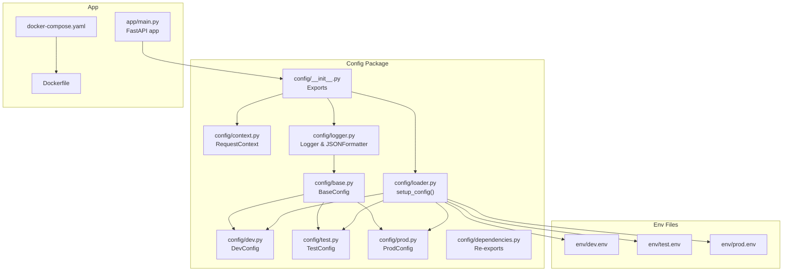
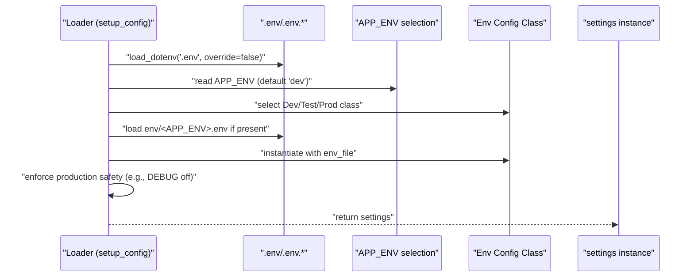
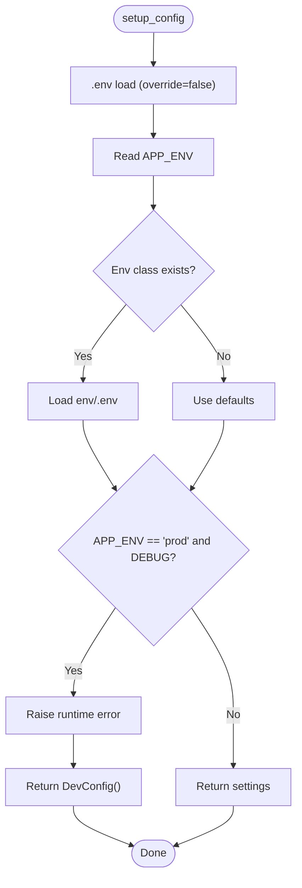
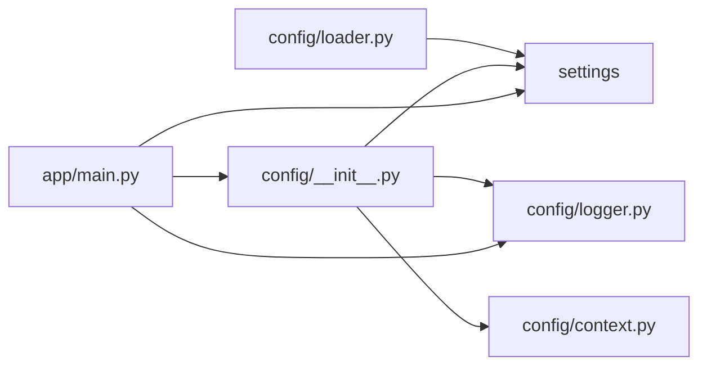

# Configuration Management

<cite>
**Referenced Files in This Document**
- [config/__init__.py](file://config/__init__.py)
- [config/base.py](file://config/base.py)
- [config/context.py](file://config/context.py)
- [config/loader.py](file://config/loader.py)
- [config/dev.py](file://config/dev.py)
- [config/test.py](file://config/test.py)
- [config/prod.py](file://config/prod.py)
- [env/dev.env](file://env/dev.env)
- [env/test.env](file://env/test.env)
- [env/prod.env](file://env/prod.env)
- [config/logger.py](file://config/logger.py)
- [config/dependencies.py](file://config/dependencies.py)
- [app/main.py](file://app/main.py)
- [Dockerfile](file://Dockerfile)
- [docker-compose.yaml](file://docker-compose.yaml)
</cite>

## Table of Contents
1. [Introduction](#introduction)
2. [Project Structure](#project-structure)
3. [Core Components](#core-components)
4. [Architecture Overview](#architecture-overview)
5. [Detailed Component Analysis](#detailed-component-analysis)
6. [Dependency Analysis](#dependency-analysis)
7. [Performance Considerations](#performance-considerations)
8. [Troubleshooting Guide](#troubleshooting-guide)
9. [Conclusion](#conclusion)
10. [Appendices](#appendices)

## Introduction
This document explains the configuration management system used by the application, focusing on environment-based settings, runtime configuration resolution, and context-aware configuration usage. It covers how configuration is loaded per environment, how defaults and environment-specific overrides are applied, and how logging and request context integrate with configuration. It also documents Docker-friendly deployment patterns, environment variable mapping, and operational guidance for validation, security, and troubleshooting.

## Project Structure
The configuration system is organized around a base configuration schema extended by environment-specific subclasses, a loader that selects the appropriate environment and loads .env files, and supporting modules for logging and request context.

**Diagram sources**
- [config/base.py:1-57](file://config/base.py#L1-L57)
- [config/dev.py:1-12](file://config/dev.py#L1-L12)
- [config/test.py:1-12](file://config/test.py#L1-L12)
- [config/prod.py:1-6](file://config/prod.py#L1-L6)
- [config/loader.py:1-51](file://config/loader.py#L1-L51)
- [config/context.py:1-33](file://config/context.py#L1-L33)
- [config/logger.py:1-110](file://config/logger.py#L1-L110)
- [config/__init__.py:1-15](file://config/__init__.py#L1-L15)
- [config/dependencies.py:1-7](file://config/dependencies.py#L1-L7)
- [env/dev.env:1-14](file://env/dev.env#L1-L14)
- [env/test.env:1-14](file://env/test.env#L1-L14)
- [env/prod.env:1-14](file://env/prod.env#L1-L14)
- [app/main.py:1-160](file://app/main.py#L1-L160)
- [docker-compose.yaml:1-42](file://docker-compose.yaml#L1-L42)
- [Dockerfile:1-94](file://Dockerfile#L1-L94)

**Section sources**
- [config/__init__.py:1-15](file://config/__init__.py#L1-L15)
- [config/base.py:1-57](file://config/base.py#L1-L57)
- [config/loader.py:1-51](file://config/loader.py#L1-L51)
- [config/context.py:1-33](file://config/context.py#L1-L33)
- [config/logger.py:1-110](file://config/logger.py#L1-L110)
- [env/dev.env:1-14](file://env/dev.env#L1-L14)
- [env/test.env:1-14](file://env/test.env#L1-L14)
- [env/prod.env:1-14](file://env/prod.env#L1-L14)
- [app/main.py:1-160](file://app/main.py#L1-L160)
- [docker-compose.yaml:1-42](file://docker-compose.yaml#L1-L42)
- [Dockerfile:1-94](file://Dockerfile#L1-L94)

## Core Components
- Base configuration schema defines all supported settings with defaults and environment variable binding via Pydantic settings.
- Environment-specific subclasses override base defaults for development, testing, and production.
- A loader function selects the environment, loads the corresponding .env file, validates safety constraints, and returns a typed settings instance.
- Logging integrates with configuration to set level, formatting, and suppression of noisy libraries.
- Request context provides request-scoped variables used by logging filters to enrich log entries.
- Application wiring imports the shared settings and uses it for startup messages, middleware configuration, and runtime behavior.

**Section sources**
- [config/base.py:1-57](file://config/base.py#L1-L57)
- [config/dev.py:1-12](file://config/dev.py#L1-L12)
- [config/test.py:1-12](file://config/test.py#L1-L12)
- [config/prod.py:1-6](file://config/prod.py#L1-L6)
- [config/loader.py:1-51](file://config/loader.py#L1-L51)
- [config/logger.py:1-110](file://config/logger.py#L1-L110)
- [config/context.py:1-33](file://config/context.py#L1-L33)
- [app/main.py:1-160](file://app/main.py#L1-L160)

## Architecture Overview
The configuration architecture follows a layered pattern:
- Base schema defines the canonical set of settings.
- Environment classes specialize defaults.
- Loader resolves the active environment, loads environment variables from .env, and enforces production safety checks.
- Logger and application code consume the resolved settings.

**Diagram sources**
- [config/loader.py:9-48](file://config/loader.py#L9-L48)
- [env/dev.env:1-14](file://env/dev.env#L1-L14)
- [env/test.env:1-14](file://env/test.env#L1-L14)
- [env/prod.env:1-14](file://env/prod.env#L1-L14)

## Detailed Component Analysis

### Base Configuration Schema
- Defines all configuration keys with defaults and environment variable binding semantics.
- Uses a configuration that allows extra fields and UTF-8 encoding for .env files.
- Includes keys for application identity, logging, document processing, performance/threading, CORS, security, SSO, and JWT.

**Section sources**
- [config/base.py:9-57](file://config/base.py#L9-L57)

### Environment-Specific Configurations
- Development: Enables debug logging, broad supported formats, and disables auth for local development.
- Testing: Reduces log verbosity and uses a dedicated upload directory.
- Production: Disables debug mode and auth by default, sets conservative logging.

These classes inherit defaults from the base and override selected keys.

**Section sources**
- [config/dev.py:1-12](file://config/dev.py#L1-L12)
- [config/test.py:1-12](file://config/test.py#L1-L12)
- [config/prod.py:1-6](file://config/prod.py#L1-L6)

### Configuration Loader and Environment Resolution
- Loads the initial .env file without overriding existing environment variables.
- Reads APP_ENV to select the environment class.
- Attempts to load env/<APP_ENV>.env; if missing, falls back to defaults.
- Enforces a production safety rule: raises an error if DEBUG is enabled in production.
- On failure, returns a development configuration as a safe fallback.

**Diagram sources**
- [config/loader.py:9-48](file://config/loader.py#L9-L48)

**Section sources**
- [config/loader.py:1-51](file://config/loader.py#L1-L51)

### Environment Variable Mapping and Precedence
- Initial bootstrap: .env is loaded first, preventing override of existing environment variables.
- Environment selection: APP_ENV determines which subclass is used.
- Environment file: env/<APP_ENV>.env is loaded for the active environment.
- Final resolution: environment variables already present in the process take precedence over .env values; otherwise, defaults apply.

Practical mapping examples:
- APP_NAME, APP_ENV, DEBUG, LOG_LEVEL are read from the environment or .env.
- Upload and processing settings (UPLOAD_DIR, SUPPORTED_FORMATS, MAX_FILE_SIZE, MAX_TOKENS, etc.) are mapped from env/<APP_ENV>.env.
- Security settings (SECRET_KEY, DISABLE_AUTH) are mapped similarly.
- CORS origins are parsed from a comma-separated string.

**Section sources**
- [config/loader.py:13-36](file://config/loader.py#L13-L36)
- [env/dev.env:1-14](file://env/dev.env#L1-L14)
- [env/test.env:1-14](file://env/test.env#L1-L14)
- [env/prod.env:1-14](file://env/prod.env#L1-L14)
- [config/base.py:12-52](file://config/base.py#L12-L52)

### Context-Aware Configuration Resolution
- The settings object is a singleton created at import time by the loader.
- Application code reads settings.UPLOAD_DIR, CORS_ORIGINS, DEBUG, and others directly.
- Logging integrates with settings to set level and formatter, and to suppress noisy libraries in production.

**Section sources**
- [config/__init__.py:1-15](file://config/__init__.py#L1-L15)
- [app/main.py:25-46](file://app/main.py#L25-L46)
- [app/main.py:73-95](file://app/main.py#L73-L95)
- [config/logger.py:50-80](file://config/logger.py#L50-L80)

### Logging Integration and Formatter Selection
- Root logger level is set from configuration.
- In production, logs are emitted as JSON with request context enrichment.
- In non-production, logs use a readable format with request ID and user context.
- Noisy third-party loggers are suppressed in production.

**Section sources**
- [config/logger.py:50-80](file://config/logger.py#L50-L80)
- [config/logger.py:23-48](file://config/logger.py#L23-L48)
- [config/context.py:5-30](file://config/context.py#L5-L30)

### Request Context System
- Provides request-scoped context variables for correlation ID and current user.
- Used by the logging filter to attach request_id and user attributes to log records.
- Supports async context switching automatically.

**Section sources**
- [config/context.py:1-33](file://config/context.py#L1-L33)
- [config/logger.py:8-22](file://config/logger.py#L8-L22)

### Docker-Friendly Configuration Patterns
- The loader reads env/<APP_ENV>.env; mounting a volume at /app/env enables dynamic configuration updates without rebuilding images.
- docker-compose sets APP_ENV and DOCLING_ENV and mounts volumes for uploads, data, output, and env.
- The runtime image exposes port 8000 and includes a health check against /health.

Operational tips:
- To change environment, set APP_ENV in the container environment or compose file.
- To inject secrets, mount env/prod.env with restricted permissions or use secrets management and map to env/prod.env.
- For GPU-enabled deployments, ensure the compose device reservation matches your runtime needs.

**Section sources**
- [config/loader.py:27-36](file://config/loader.py#L27-L36)
- [docker-compose.yaml:12-21](file://docker-compose.yaml#L12-L21)
- [docker-compose.yaml:23-29](file://docker-compose.yaml#L23-L29)
- [Dockerfile:78-94](file://Dockerfile#L78-L94)

## Dependency Analysis
The configuration module exports a single settings instance and a context singleton. The application imports these and uses them for startup, middleware, and logging.

**Diagram sources**
- [config/loader.py:50-51](file://config/loader.py#L50-L51)
- [config/__init__.py:1-15](file://config/__init__.py#L1-L15)
- [config/logger.py:1-110](file://config/logger.py#L1-L110)
- [config/context.py:1-33](file://config/context.py#L1-L33)
- [app/main.py:17-22](file://app/main.py#L17-L22)

**Section sources**
- [config/__init__.py:1-15](file://config/__init__.py#L1-L15)
- [config/loader.py:50-51](file://config/loader.py#L50-L51)
- [app/main.py:17-22](file://app/main.py#L17-L22)

## Performance Considerations
- Environment file loading occurs once during application boot; keep env files minimal and avoid excessive parsing overhead.
- Logging formatter selection is based on APP_ENV; production JSON formatting adds negligible overhead compared to console formatting.
- Request context variables are lightweight; avoid storing large objects in context to prevent memory bloat.

## Troubleshooting Guide
Common issues and resolutions:
- Configuration loading fails
  - Verify .env exists and is readable; the loader prints a warning when env/<APP_ENV>.env is missing and falls back to defaults.
  - Check for typos in APP_ENV; loader defaults to "dev".
  - Confirm environment variables are not being overridden by process environment in unexpected ways.
  - See [config/loader.py:13-36](file://config/loader.py#L13-L36).

- Production safety violation
  - The loader raises an error if DEBUG is enabled in production. Disable DEBUG or switch to a non-production environment.
  - See [config/loader.py:38-40](file://config/loader.py#L38-L40).

- Environment detection issues
  - Ensure APP_ENV is set in the container environment or compose file.
  - Confirm env/<APP_ENV>.env is mounted and accessible inside the container.
  - See [docker-compose.yaml:12-16](file://docker-compose.yaml#L12-L16) and [config/loader.py:27-36](file://config/loader.py#L27-L36).

- Setting precedence conflicts
  - Existing environment variables take precedence over .env values. If a setting behaves unexpectedly, check process environment variables.
  - See [config/loader.py:13](file://config/loader.py#L13).

- Logging anomalies
  - In production, logs are JSON-formatted; verify APP_ENV is set correctly.
  - Request context fields require middleware to populate request_id and user; ensure middleware is registered.
  - See [config/logger.py:64-71](file://config/logger.py#L64-L71) and [app/main.py:84-85](file://app/main.py#L84-L85).

- Upload directory problems
  - The application ensures the upload directory exists and sets permissions; check filesystem permissions and disk availability.
  - See [app/main.py:25-46](file://app/main.py#L25-L46).

- Health check failures
  - Confirm the container exposes port 8000 and the health endpoint responds.
  - See [Dockerfile:90-94](file://Dockerfile#L90-L94) and [docker-compose.yaml:30-35](file://docker-compose.yaml#L30-L35).

## Conclusion
The configuration management system provides a robust, environment-aware mechanism for loading and applying settings. It supports safe production defaults, flexible environment-specific overrides, and seamless integration with logging and request context. By leveraging .env files, environment variables, and Docker volumes, teams can operate consistently across development, testing, and production while maintaining security and observability.

## Appendices

### Configuration Options Reference
- Application identity and environment
  - APP_NAME: application name
  - APP_ENV: environment identifier
  - DEBUG: enable debug mode
  - LOG_LEVEL: logging level

- Document processing
  - UPLOAD_DIR: upload directory path
  - SUPPORTED_FORMATS: comma-separated MIME types
  - DEFAULT_OCR_LANGS: default OCR languages
  - MAX_TOKENS: token limit for processing
  - DEFAULT_CHUNK_TYPE: chunking strategy
  - MAX_FILE_SIZE: maximum file size in bytes
  - MAX_STREAM_SIZE: streaming threshold
  - UPLOAD_CHUNK_SIZE: chunk size for uploads

- Performance and threading
  - THREAD_POOL_SIZE: thread pool size
  - CONVERTER_NUM_THREADS: converter worker threads

- Features
  - ENABLE_TABLE_STRUCTURE: enable table extraction
  - ENABLE_CELL_MATCHING: enable cell matching

- CORS
  - CORS_ORIGINS: allowed origins

- Security
  - SECRET_KEY: application secret key
  - DISABLE_AUTH: disable authentication checks

- SSO
  - SSO_URL: SSO service URL
  - SSO_REALM: realm name
  - SSO_CLIENT_ID: client identifier
  - SSO_CLIENT_SECRET: client secret (optional)
  - SSO_REDIRECT_URI: redirect URI

- JWT
  - jwt_secret_key: signing key
  - jwt_algorithm: signing algorithm
  - jwt_expired_in: expiration in minutes

- Environment-specific behavior
  - Dev: DEBUG=on, LOG_LEVEL=DEBUG, DISABLE_AUTH=on
  - Test: LOG_LEVEL=CRITICAL, UPLOAD_DIR=test_uploads, DISABLE_AUTH=on
  - Prod: DEBUG=off, LOG_LEVEL=WARNING, DISABLE_AUTH=off

**Section sources**
- [config/base.py:12-52](file://config/base.py#L12-L52)
- [config/dev.py:3-12](file://config/dev.py#L3-L12)
- [config/test.py:3-12](file://config/test.py#L3-L12)
- [config/prod.py:3-6](file://config/prod.py#L3-L6)