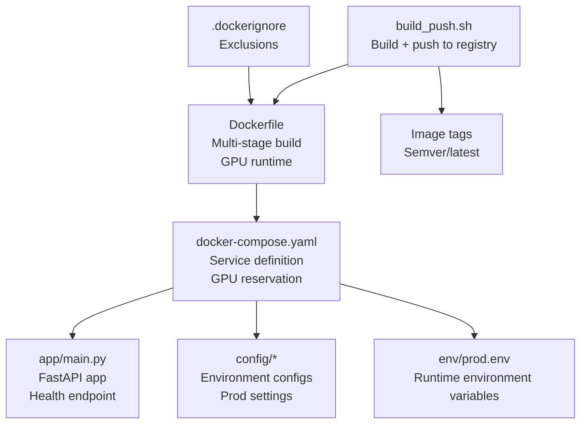
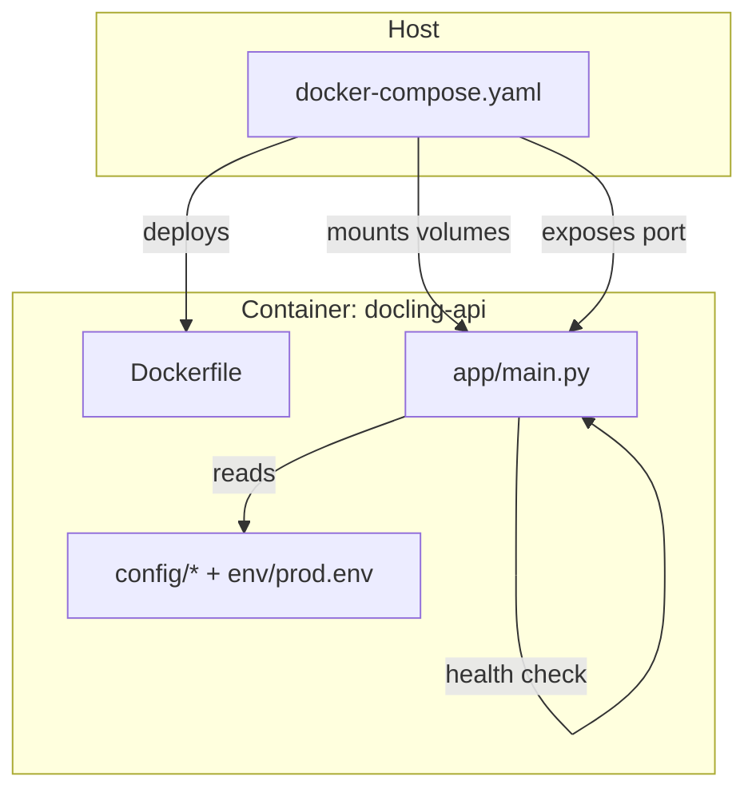
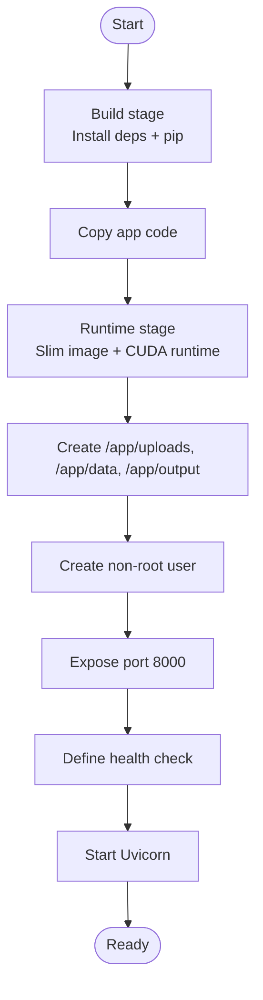
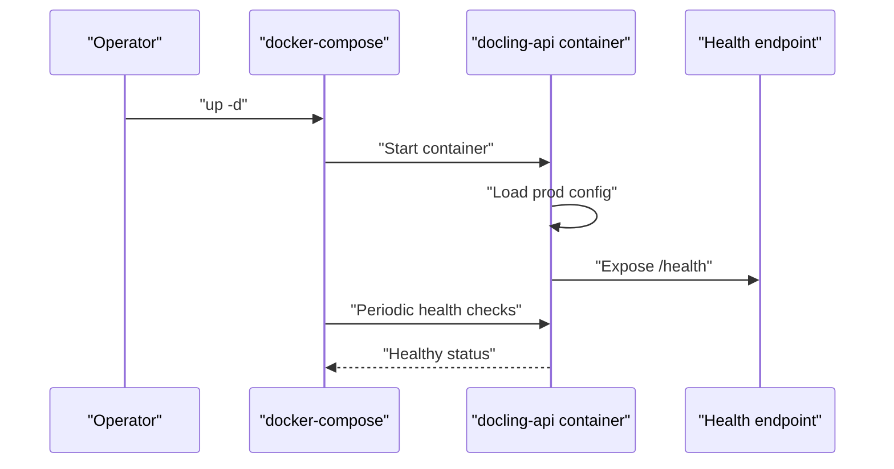
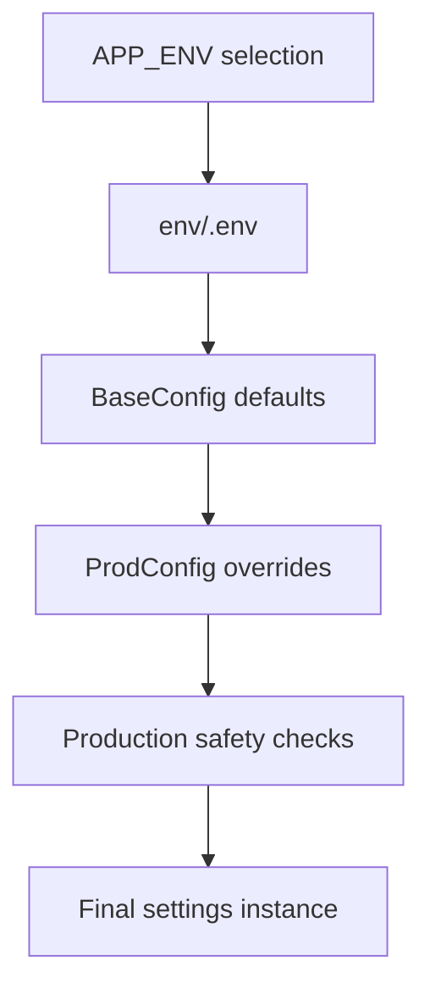
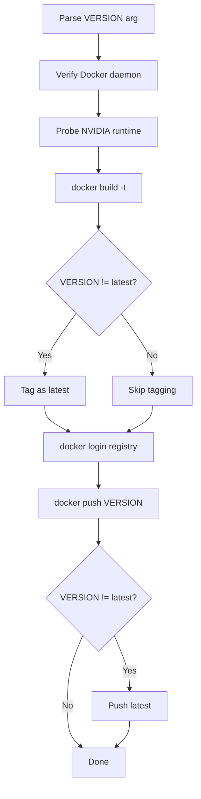
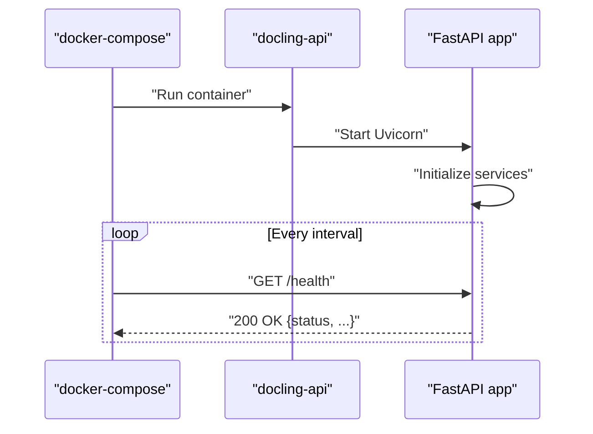
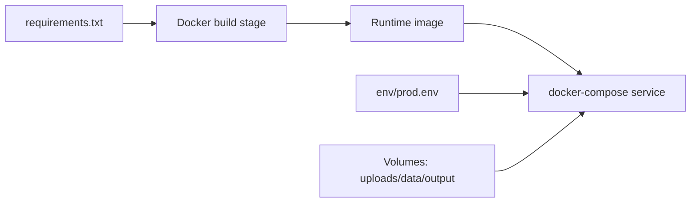

# Deployment Guide

<cite>
**Referenced Files in This Document**
- [Dockerfile](file://Dockerfile)
- [docker-compose.yaml](file://docker-compose.yaml)
- [build_push.sh](file://build_push.sh)
- [.dockerignore](file://.dockerignore)
- [requirements.txt](file://requirements.txt)
- [run.sh](file://run.sh)
- [app/main.py](file://app/main.py)
- [config/base.py](file://config/base.py)
- [config/prod.py](file://config/prod.py)
- [config/loader.py](file://config/loader.py)
- [env/prod.env](file://env/prod.env)
- [pytest.ini](file://pytest.ini)
- [tests/conftest.py](file://tests/conftest.py)
</cite>

## Table of Contents
1. [Introduction](#introduction)
2. [Project Structure](#project-structure)
3. [Core Components](#core-components)
4. [Architecture Overview](#architecture-overview)
5. [Detailed Component Analysis](#detailed-component-analysis)
6. [Dependency Analysis](#dependency-analysis)
7. [Performance Considerations](#performance-considerations)
8. [Troubleshooting Guide](#troubleshooting-guide)
9. [Conclusion](#conclusion)
10. [Appendices](#appendices)

## Introduction
This deployment guide provides production-ready strategies for building, packaging, orchestrating, and operating the Docling Document Processing API. It covers containerization with a multi-stage Docker build, docker-compose orchestration for GPU-enabled deployments, security hardening, resource allocation, scaling, CI/CD integration via a build and push script, infrastructure sizing, health checks, monitoring, security posture (TLS, certificates, and network segmentation), troubleshooting, backup and disaster recovery, and maintenance windows.

## Project Structure
The repository is organized around a FastAPI application with environment-specific configuration, a production-focused Dockerfile, a docker-compose definition, and a build/publish automation script. Key deployment-relevant artifacts include:
- Container image definition and optimization
- Orchestration with GPU device reservations
- Production configuration and environment variables
- Health checks and lifecycle hooks
- CI/CD automation for image builds and pushes

**Diagram sources**
- [Dockerfile:1-94](file://Dockerfile#L1-L94)
- [docker-compose.yaml:1-42](file://docker-compose.yaml#L1-L42)
- [app/main.py:116-131](file://app/main.py#L116-L131)
- [config/base.py:1-57](file://config/base.py#L1-L57)
- [config/prod.py:1-6](file://config/prod.py#L1-L6)
- [env/prod.env:1-14](file://env/prod.env#L1-L14)
- [build_push.sh:1-73](file://build_push.sh#L1-L73)
- [.dockerignore:1-42](file://.dockerignore#L1-L42)

**Section sources**
- [Dockerfile:1-94](file://Dockerfile#L1-L94)
- [docker-compose.yaml:1-42](file://docker-compose.yaml#L1-L42)
- [build_push.sh:1-73](file://build_push.sh#L1-L73)
- [.dockerignore:1-42](file://.dockerignore#L1-L42)

## Core Components
- Container image: Multi-stage build with CUDA runtime and slimmed production image, non-root user, health checks, and exposed port.
- Orchestration: docker-compose service with GPU device reservations, volume mounts for persistent data, environment injection, and health checks.
- Configuration: Environment-specific settings and production-safe defaults.
- Automation: Single-script build-and-push with registry login and tagging.
- Local development: Convenience script for local runs outside containers.

**Section sources**
- [Dockerfile:1-94](file://Dockerfile#L1-L94)
- [docker-compose.yaml:1-42](file://docker-compose.yaml#L1-L42)
- [config/base.py:1-57](file://config/base.py#L1-L57)
- [config/prod.py:1-6](file://config/prod.py#L1-L6)
- [build_push.sh:1-73](file://build_push.sh#L1-L73)
- [run.sh:1-17](file://run.sh#L1-L17)

## Architecture Overview
The production runtime consists of the API containerized with GPU support, orchestrated by docker-compose. The service exposes a health endpoint and relies on mounted volumes for uploads, data, and output. The configuration loader selects production settings and validates safety constraints.

**Diagram sources**
- [docker-compose.yaml:3-38](file://docker-compose.yaml#L3-L38)
- [Dockerfile:45-94](file://Dockerfile#L45-L94)
- [app/main.py:116-131](file://app/main.py#L116-L131)
- [config/loader.py:9-51](file://config/loader.py#L9-L51)
- [env/prod.env:1-14](file://env/prod.env#L1-L14)

## Detailed Component Analysis

### Containerization and Multi-Stage Build
- Build stage installs Python and system dependencies, creates a virtual environment, and installs Python dependencies.
- Runtime stage reuses installed packages and copies application code, sets up runtime directories, creates a non-root user, exposes port 8000, defines a health check, and starts Uvicorn as the application command.
- GPU runtime is inherited from a CUDA base image suitable for GPU-accelerated workloads.

**Diagram sources**
- [Dockerfile:2-41](file://Dockerfile#L2-L41)
- [Dockerfile:42-94](file://Dockerfile#L42-L94)

**Section sources**
- [Dockerfile:1-94](file://Dockerfile#L1-L94)

### docker-compose Orchestration
- Service definition builds from the repository root using the provided Dockerfile and runs under a dedicated container name.
- Environment variables and environment file are injected for production.
- Persistent volumes are mounted for uploads, data, and output directories; an env directory is mounted for configuration.
- GPU device reservation is configured via NVIDIA runtime capabilities.
- Health checks mirror the container’s health check configuration.
- Network is attached to an externally managed network named dbr0.

**Diagram sources**
- [docker-compose.yaml:3-38](file://docker-compose.yaml#L3-L38)
- [app/main.py:116-131](file://app/main.py#L116-L131)

**Section sources**
- [docker-compose.yaml:1-42](file://docker-compose.yaml#L1-L42)

### Configuration and Environment Management
- Base configuration defines defaults for document processing, threading, CORS, security, and SSO/JWT settings.
- Production configuration disables debug and sets appropriate log level.
- Loader selects environment dynamically, loads environment-specific .env files, and enforces production safety (e.g., disallowing DEBUG in prod).
- Production environment variables include upload directories, supported formats, OCR languages, concurrency settings, and security keys.

**Diagram sources**
- [config/loader.py:9-51](file://config/loader.py#L9-L51)
- [config/base.py:1-57](file://config/base.py#L1-L57)
- [config/prod.py:1-6](file://config/prod.py#L1-L6)
- [env/prod.env:1-14](file://env/prod.env#L1-L14)

**Section sources**
- [config/base.py:1-57](file://config/base.py#L1-L57)
- [config/prod.py:1-6](file://config/prod.py#L1-L6)
- [config/loader.py:9-51](file://config/loader.py#L9-L51)
- [env/prod.env:1-14](file://env/prod.env#L1-L14)

### Build and Push Automation
- The script accepts a version argument (defaults to latest), verifies Docker availability, optionally checks GPU runtime availability, builds the image, tags as latest if applicable, logs into the registry, pushes images, and prints helpful commands for pulling and running.

**Diagram sources**
- [build_push.sh:1-73](file://build_push.sh#L1-L73)

**Section sources**
- [build_push.sh:1-73](file://build_push.sh#L1-L73)

### Health Checks and Lifecycle
- The container defines a health check probing the /health endpoint.
- The application exposes a /health endpoint returning status, timestamp, converter status, environment, and request ID.
- docker-compose mirrors the health check configuration.

**Diagram sources**
- [Dockerfile:90-92](file://Dockerfile#L90-L92)
- [docker-compose.yaml:30-35](file://docker-compose.yaml#L30-L35)
- [app/main.py:116-131](file://app/main.py#L116-L131)

**Section sources**
- [Dockerfile:90-92](file://Dockerfile#L90-L92)
- [docker-compose.yaml:30-35](file://docker-compose.yaml#L30-L35)
- [app/main.py:116-131](file://app/main.py#L116-L131)

### Local Development Alternative
- A convenience script sets up a virtual environment, installs dependencies, ensures an upload directory, and runs the application with hot reload on port 8000.

**Section sources**
- [run.sh:1-17](file://run.sh#L1-L17)

## Dependency Analysis
- Application dependencies are declared in requirements.txt and installed during the build stage.
- The runtime image inherits CUDA libraries and system dependencies required for GPU-enabled operations.
- docker-compose depends on the built image and mounts persistent volumes and environment files.

**Diagram sources**
- [requirements.txt:1-15](file://requirements.txt#L1-L15)
- [Dockerfile:34-41](file://Dockerfile#L34-L41)
- [docker-compose.yaml:17-21](file://docker-compose.yaml#L17-L21)
- [env/prod.env:1-14](file://env/prod.env#L1-L14)

**Section sources**
- [requirements.txt:1-15](file://requirements.txt#L1-L15)
- [Dockerfile:34-41](file://Dockerfile#L34-L41)
- [docker-compose.yaml:17-21](file://docker-compose.yaml#L17-L21)
- [env/prod.env:1-14](file://env/prod.env#L1-L14)

## Performance Considerations
- GPU acceleration: The image uses a CUDA runtime base and docker-compose reserves a GPU device; ensure the host has compatible drivers and runtime.
- Concurrency: Production environment variables configure thread pools and chunking; tune based on workload characteristics.
- Storage: Mount persistent volumes for uploads, data, and output to avoid container-local ephemeral storage.
- Networking: Use an external network segment (e.g., dbr0) for isolation and controlled ingress/egress.

[No sources needed since this section provides general guidance]

## Troubleshooting Guide
Common issues and remedies:
- Docker daemon not running: The build script checks Docker availability and exits early if not available.
- NVIDIA runtime missing: The build script probes GPU availability and warns if not present; the compose service requires GPU devices.
- Health check failures: Verify the /health endpoint responds and that the application initialized services.
- Permission errors on volumes: Ensure mounted directories exist and have appropriate permissions; the runtime image creates directories with safe modes.
- Production misconfiguration: The loader prevents DEBUG in production; confirm environment variables and .env files are correct.

**Section sources**
- [build_push.sh:21-31](file://build_push.sh#L21-L31)
- [docker-compose.yaml:23-29](file://docker-compose.yaml#L23-L29)
- [app/main.py:116-131](file://app/main.py#L116-L131)
- [config/loader.py:38-40](file://config/loader.py#L38-L40)

## Conclusion
This guide outlines a production-ready deployment strategy for the Docling API, covering containerization with multi-stage builds, orchestration with GPU support, secure configuration management, CI/CD automation, and operational practices. By following the outlined steps and leveraging the provided scripts and configurations, teams can reliably deploy, monitor, and scale the service in production.

[No sources needed since this section summarizes without analyzing specific files]

## Appendices

### A. Production Environment Setup Checklist
- Registry credentials configured for automated pushes.
- Host with NVIDIA drivers and container runtime supporting GPUs.
- External network segment (e.g., dbr0) provisioned and secured.
- Persistent storage mounted for uploads, data, and output.
- Environment files populated with production secrets and settings.

**Section sources**
- [build_push.sh:45-49](file://build_push.sh#L45-L49)
- [docker-compose.yaml:39-41](file://docker-compose.yaml#L39-L41)
- [docker-compose.yaml:17-21](file://docker-compose.yaml#L17-L21)
- [env/prod.env:1-14](file://env/prod.env#L1-L14)

### B. Infrastructure Requirements
- CPU: Minimum cores proportional to expected concurrent conversions; scale out horizontally.
- Memory: Allocate per container based on document sizes and thread pool settings; enable swap cautiously.
- Storage: Provision sufficient disk for uploads, temporary processing, and outputs; monitor growth.
- Network: Allow outbound HTTPS for external services; restrict inbound traffic to necessary ports; segment with firewall rules.

[No sources needed since this section provides general guidance]

### C. Monitoring and Observability
- Use the /health endpoint for liveness/readiness probes.
- Integrate container logs and structured logs from the application.
- Add metrics collection for throughput, latency, and GPU utilization.

**Section sources**
- [Dockerfile:90-92](file://Dockerfile#L90-L92)
- [app/main.py:116-131](file://app/main.py#L116-L131)

### D. Security Hardening
- TLS termination and certificates: Terminate TLS at an edge proxy/load balancer; manage certificates via a secure secret store and mount them to the proxy or use ACME automation.
- Certificate management: Automate renewal and rotation; avoid embedding long-lived certs in images.
- Network segmentation: Place the service behind a private network; enforce egress policies; isolate sensitive data volumes.
- Secrets handling: Store secrets in a vault; inject via environment variables or secrets mounts; never commit secrets to repositories.

[No sources needed since this section provides general guidance]

### E. Backup and Disaster Recovery
- Back up persistent volumes regularly; snapshot or replicate offsite.
- Maintain immutable image versions; track image digests for reproducible rollbacks.
- Document restore procedures for volumes and environment files.

[No sources needed since this section provides general guidance]

### F. Maintenance Windows
- Schedule rolling updates to minimize downtime; leverage health checks for safe handoff.
- Plan capacity expansions during low-traffic periods; validate GPU and storage capacity.

[No sources needed since this section provides general guidance]

### G. Example Commands
- Build and push with a semantic version:
  - [build_push.sh:33-58](file://build_push.sh#L33-L58)
- Deploy with docker-compose:
  - [docker-compose.yaml:22](file://docker-compose.yaml#L22)
- Pull the published image:
  - [build_push.sh:67-68](file://build_push.sh#L67-L68)

**Section sources**
- [build_push.sh:33-68](file://build_push.sh#L33-L68)
- [docker-compose.yaml:22](file://docker-compose.yaml#L22)

### H. CI/CD Integration Patterns
- Trigger the build script on version tags; publish images to the registry.
- Gate deployments with health checks and smoke tests.
- Use immutable tags and promote images across environments.

**Section sources**
- [build_push.sh:1-73](file://build_push.sh#L1-L73)
- [pytest.ini:1-11](file://pytest.ini#L1-L11)
- [tests/conftest.py:1-18](file://tests/conftest.py#L1-L18)