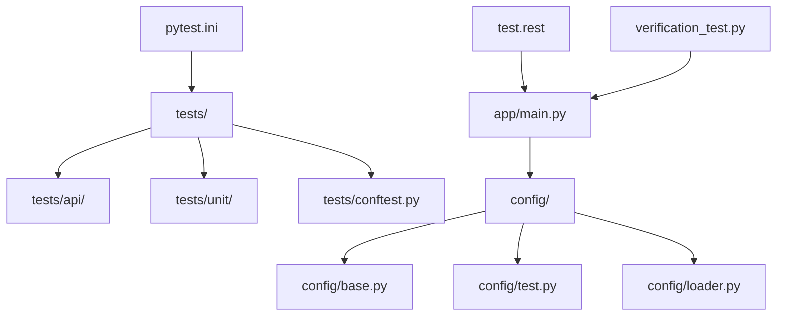
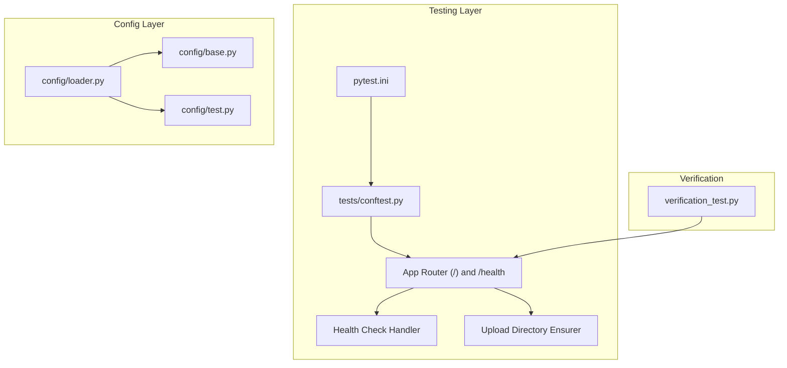
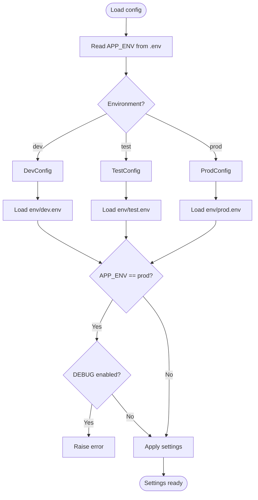
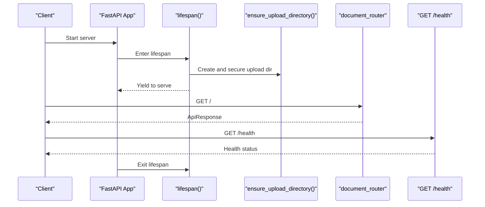
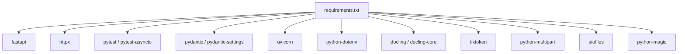

# Development & Testing

<cite>
**Referenced Files in This Document**
- [pytest.ini](file://pytest.ini)
- [tests/conftest.py](file://tests/conftest.py)
- [test.rest](file://test.rest)
- [verification_test.py](file://verification_test.py)
- [config/base.py](file://config/base.py)
- [config/test.py](file://config/test.py)
- [config/loader.py](file://config/loader.py)
- [app/main.py](file://app/main.py)
- [requirements.txt](file://requirements.txt)
</cite>

## Table of Contents
1. [Introduction](#introduction)
2. [Project Structure](#project-structure)
3. [Core Components](#core-components)
4. [Architecture Overview](#architecture-overview)
5. [Detailed Component Analysis](#detailed-component-analysis)
6. [Dependency Analysis](#dependency-analysis)
7. [Performance Considerations](#performance-considerations)
8. [Troubleshooting Guide](#troubleshooting-guide)
9. [Conclusion](#conclusion)
10. [Appendices](#appendices)

## Introduction
This document describes the development and testing framework for local development setup and quality assurance. It explains pytest configuration, test fixtures, and environment initialization through conftest.py. It documents the test suite organization (API tests, unit tests, and integration tests), verification testing with test.rest, and manual workflows. Implementation details include test database setup, mock services, and test data management. Local development practices such as hot reload, debugging, and IDE setup are covered. Practical examples show how to write new tests, run suites, and interpret results. Continuous integration, code coverage, and automated pipelines are addressed. Troubleshooting guidance covers environment issues, dependency conflicts, and flaky tests. Code quality standards, linting, and pre-commit hooks are included.

## Project Structure
The repository organizes tests under a dedicated tests directory with separate folders for API and unit tests. Configuration is environment-aware and loaded dynamically at runtime. The FastAPI application initializes lifecycle hooks and registers middleware and routers.

**Diagram sources**
- [tests/conftest.py:1-18](file://tests/conftest.py#L1-L18)
- [config/base.py:1-57](file://config/base.py#L1-L57)
- [config/test.py:1-12](file://config/test.py#L1-L12)
- [config/loader.py:1-51](file://config/loader.py#L1-L51)
- [app/main.py:1-160](file://app/main.py#L1-L160)
- [pytest.ini:1-11](file://pytest.ini#L1-L11)
- [test.rest:1-226](file://test.rest#L1-L226)
- [verification_test.py:1-27](file://verification_test.py#L1-L27)

**Section sources**
- [pytest.ini:1-11](file://pytest.ini#L1-L11)
- [tests/conftest.py:1-18](file://tests/conftest.py#L1-L18)
- [config/base.py:1-57](file://config/base.py#L1-L57)
- [config/test.py:1-12](file://config/test.py#L1-L12)
- [config/loader.py:1-51](file://config/loader.py#L1-L51)
- [app/main.py:1-160](file://app/main.py#L1-L160)
- [test.rest:1-226](file://test.rest#L1-L226)
- [verification_test.py:1-27](file://verification_test.py#L1-L27)

## Core Components
- Pytest configuration: Defines discovery patterns, asyncio mode, warnings filter, and default options.
- Test fixtures: Provides an asynchronous HTTP client and environment mocks for tests.
- Configuration loader: Loads environment-specific settings and validates production safety.
- Application lifecycle: Initializes upload directories, shared services, and routes.
- Verification runner: Validates core module imports during local checks.

Key implementation references:
- Pytest configuration and discovery: [pytest.ini:1-11](file://pytest.ini#L1-L11)
- Test fixtures and autouse mocks: [tests/conftest.py:1-18](file://tests/conftest.py#L1-L18)
- Environment configuration classes: [config/base.py:1-57](file://config/base.py#L1-L57), [config/test.py:1-12](file://config/test.py#L1-L12)
- Loader and environment selection: [config/loader.py:1-51](file://config/loader.py#L1-L51)
- Application startup and middleware: [app/main.py:1-160](file://app/main.py#L1-L160)
- Verification runner: [verification_test.py:1-27](file://verification_test.py#L1-L27)

**Section sources**
- [pytest.ini:1-11](file://pytest.ini#L1-L11)
- [tests/conftest.py:1-18](file://tests/conftest.py#L1-L18)
- [config/base.py:1-57](file://config/base.py#L1-L57)
- [config/test.py:1-12](file://config/test.py#L1-L12)
- [config/loader.py:1-51](file://config/loader.py#L1-L51)
- [app/main.py:1-160](file://app/main.py#L1-L160)
- [verification_test.py:1-27](file://verification_test.py#L1-L27)

## Architecture Overview
The testing architecture integrates pytest fixtures with an in-process FastAPI application for API tests. Environment configuration is selected at runtime and applied globally. The verification script ensures core modules import successfully.

**Diagram sources**
- [pytest.ini:1-11](file://pytest.ini#L1-L11)
- [tests/conftest.py:1-18](file://tests/conftest.py#L1-L18)
- [app/main.py:101-130](file://app/main.py#L101-L130)
- [config/base.py:1-57](file://config/base.py#L1-L57)
- [config/test.py:1-12](file://config/test.py#L1-L12)
- [config/loader.py:1-51](file://config/loader.py#L1-L51)
- [verification_test.py:1-27](file://verification_test.py#L1-L27)

## Detailed Component Analysis

### Pytest Configuration and Discovery
- Async mode enabled for async tests.
- Test discovery rooted at tests/, with file/class/function patterns.
- Verbose output and short tracebacks.
- Deprecation and user warnings filtered to reduce noise.

Practical usage:
- Run all tests with verbose output and short tracebacks.
- Extend patterns to discover additional test modules if added.

**Section sources**
- [pytest.ini:1-11](file://pytest.ini#L1-L11)

### Test Fixtures and Environment Initialization
- Async HTTP client fixture for API tests.
- Autouse fixture to mock settings for testing:
  - Disable authentication.
  - Set upload directory to a test-specific path.

Test data and mocks:
- Use the async client fixture to send requests to the in-app router.
- The mock ensures predictable behavior without external dependencies.

**Section sources**
- [tests/conftest.py:1-18](file://tests/conftest.py#L1-L18)

### Configuration Loading and Environment Selection
- Environment determined by APP_ENV with dev/test/prod mapping.
- Environment-specific .env files are loaded when present.
- Production guard prevents DEBUG from being enabled in production.
- Defaults are applied if environment files are missing.

**Diagram sources**
- [config/loader.py:9-51](file://config/loader.py#L9-L51)
- [config/base.py:9-57](file://config/base.py#L9-L57)
- [config/test.py:1-12](file://config/test.py#L1-12)

**Section sources**
- [config/loader.py:1-51](file://config/loader.py#L1-L51)
- [config/base.py:1-57](file://config/base.py#L1-L57)
- [config/test.py:1-12](file://config/test.py#L1-L12)

### Application Lifecycle and Middleware
- Startup ensures upload directory exists and sets permissions.
- Shared conversion service initialized at startup.
- Health endpoint reports converter status.
- CORS, correlation ID, and request logging middleware are registered.

**Diagram sources**
- [app/main.py:49-81](file://app/main.py#L49-L81)
- [app/main.py:101-130](file://app/main.py#L101-L130)

**Section sources**
- [app/main.py:1-160](file://app/main.py#L1-L160)

### Verification Testing with test.rest
- Predefined requests for root, health, conversions, and resumable upload flows.
- Variables for host, tokens, and file paths.
- Supports both local and remote endpoints.

Manual workflow:
- Open test.rest in a REST client supporting .rest files.
- Adjust host and token variables as needed.
- Execute requests to validate API contracts and flows.

**Section sources**
- [test.rest:1-226](file://test.rest#L1-L226)

### Module Import Verification
- verification_test.py attempts to import core modules and exits with appropriate status codes.
- Useful for catching import-time errors early.

**Section sources**
- [verification_test.py:1-27](file://verification_test.py#L1-L27)

### Test Suite Organization
- tests/api/: API tests using the async client fixture.
- tests/unit/: Unit tests for isolated components.
- tests/conftest.py: Shared fixtures and environment mocks.

Execution patterns:
- Discover and run tests under tests/ with pytest.
- Use verbose output and short tracebacks for quick feedback.

**Section sources**
- [pytest.ini:1-11](file://pytest.ini#L1-L11)
- [tests/conftest.py:1-18](file://tests/conftest.py#L1-L18)

## Dependency Analysis
Runtime and test dependencies are declared in requirements.txt. These include FastAPI, HTTP testing, async support, configuration loading, and document processing libraries.

**Diagram sources**
- [requirements.txt:1-15](file://requirements.txt#L1-L15)

**Section sources**
- [requirements.txt:1-15](file://requirements.txt#L1-L15)

## Performance Considerations
- Async client fixture reduces overhead for API tests.
- Test configuration disables auth and sets minimal logging to improve speed.
- Startup initializes a shared conversion service once per process to avoid repeated warm-ups.

Recommendations:
- Prefer async fixtures for I/O-bound tests.
- Keep test uploads small and deterministic.
- Reuse fixtures to minimize repeated setup.

**Section sources**
- [tests/conftest.py:1-18](file://tests/conftest.py#L1-L18)
- [config/test.py:1-12](file://config/test.py#L1-L12)
- [app/main.py:49-81](file://app/main.py#L49-L81)

## Troubleshooting Guide
Common issues and resolutions:
- Import failures: Use verification_test.py to diagnose import errors and stack traces.
- Environment mismatch: Ensure APP_ENV matches an existing env/<name>.env or rely on defaults.
- Upload directory permissions: The application creates and secures the upload directory; confirm filesystem permissions.
- Authentication prompts: The test environment disables auth via a mock; verify the mock is active.
- Slow tests: Use pytest’s verbose and short traceback options to quickly identify failures; refactor slow fixtures.

**Section sources**
- [verification_test.py:1-27](file://verification_test.py#L1-L27)
- [config/loader.py:1-51](file://config/loader.py#L1-L51)
- [app/main.py:25-46](file://app/main.py#L25-L46)
- [tests/conftest.py:13-18](file://tests/conftest.py#L13-L18)
- [pytest.ini:1-11](file://pytest.ini#L1-L11)

## Conclusion
The development and testing framework emphasizes fast, reliable, and maintainable quality assurance. Pytest is configured for async workflows and concise reporting. Environment-aware configuration supports local and CI-friendly setups. The API test harness uses an in-app HTTP client and environment mocks. Manual verification is supported via test.rest. The verification script helps catch import-time issues early. Following the practices and recommendations herein will keep tests stable, fast, and aligned with CI expectations.

## Appendices

### Practical Examples

- Writing a new API test:
  - Place the test under tests/api/.
  - Use the async client fixture to call endpoints.
  - Assert response status and payload structure.

- Running the test suite:
  - Execute pytest from the repository root to discover and run tests under tests/.

- Interpreting results:
  - Verbose output highlights failing tests quickly.
  - Short tracebacks reduce noise while preserving key failure info.

- Adding unit tests:
  - Place tests under tests/unit/.
  - Use pytest fixtures and mocks to isolate units.

- Running verification:
  - Execute verification_test.py to validate core imports.

**Section sources**
- [pytest.ini:1-11](file://pytest.ini#L1-L11)
- [tests/conftest.py:1-18](file://tests/conftest.py#L1-L18)
- [verification_test.py:1-27](file://verification_test.py#L1-L27)

### Continuous Integration and Coverage
- Automated pipelines:
  - Configure CI to install dependencies from requirements.txt.
  - Run pytest with the repository’s default options.
  - Capture logs and artifacts for failed runs.
- Code coverage:
  - Integrate coverage collection in CI jobs.
  - Enforce minimum thresholds per policy.
- Pre-commit hooks:
  - Lint and type-check staged changes before committing.
  - Run pytest locally to catch regressions early.

[No sources needed since this section provides general guidance]