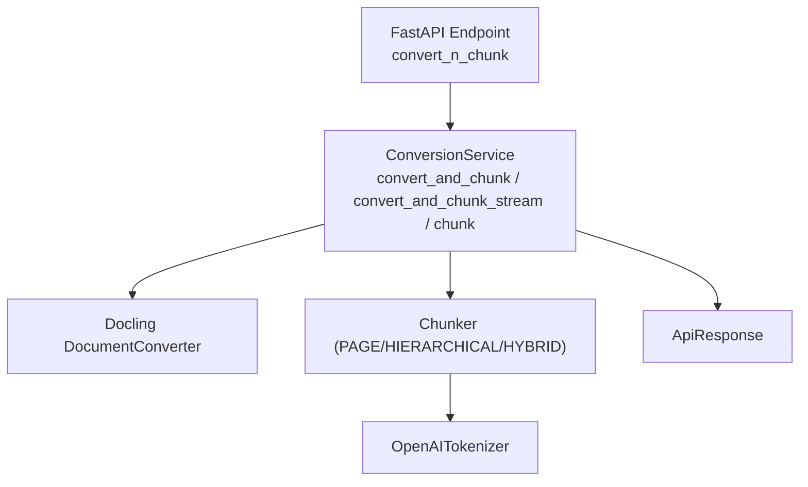
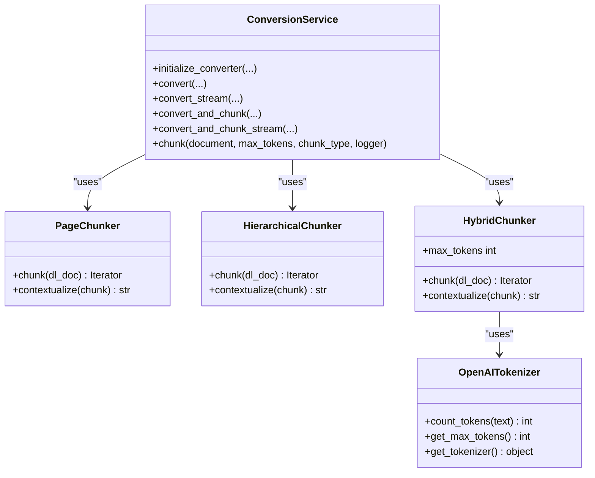
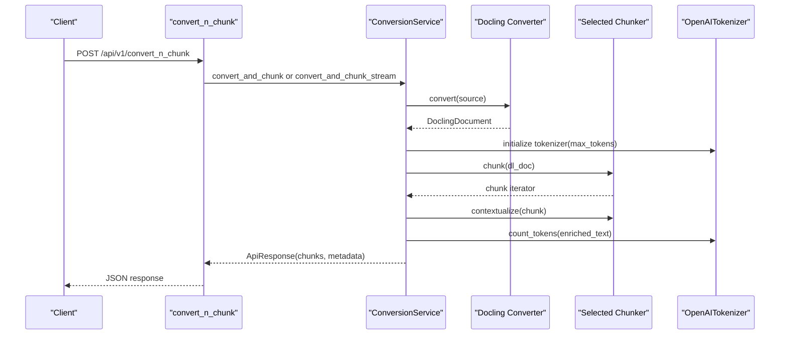
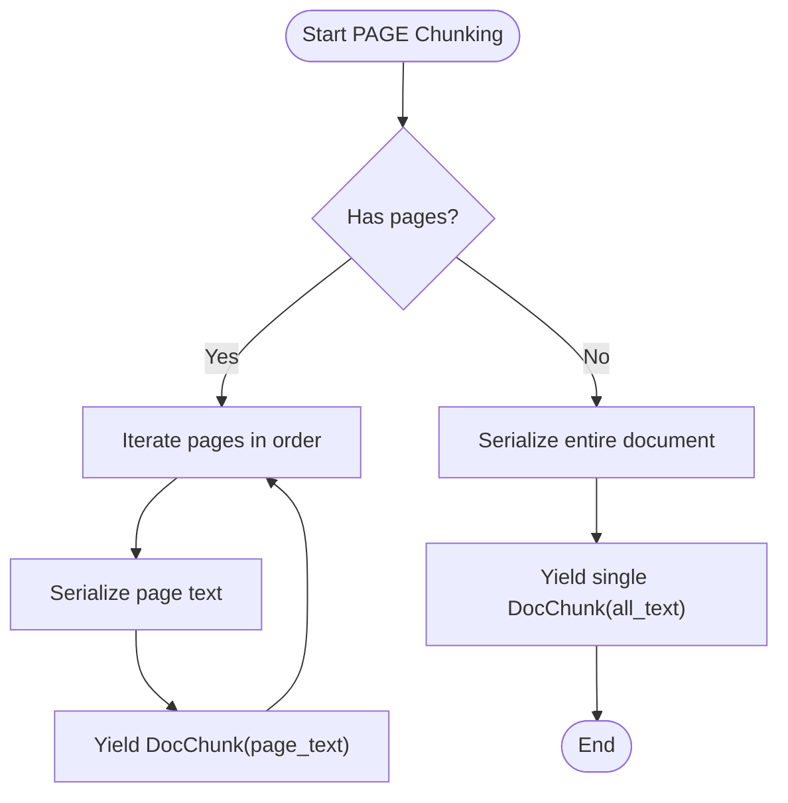
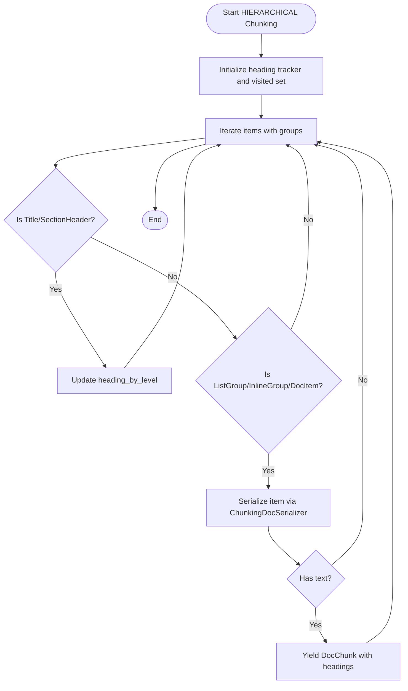
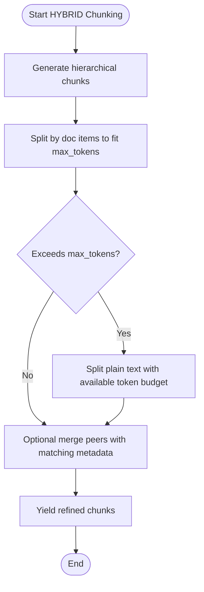
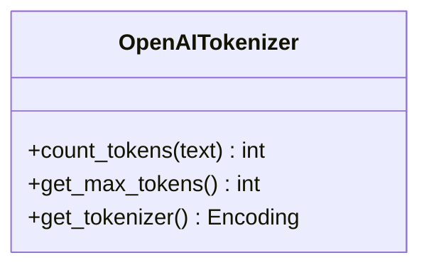
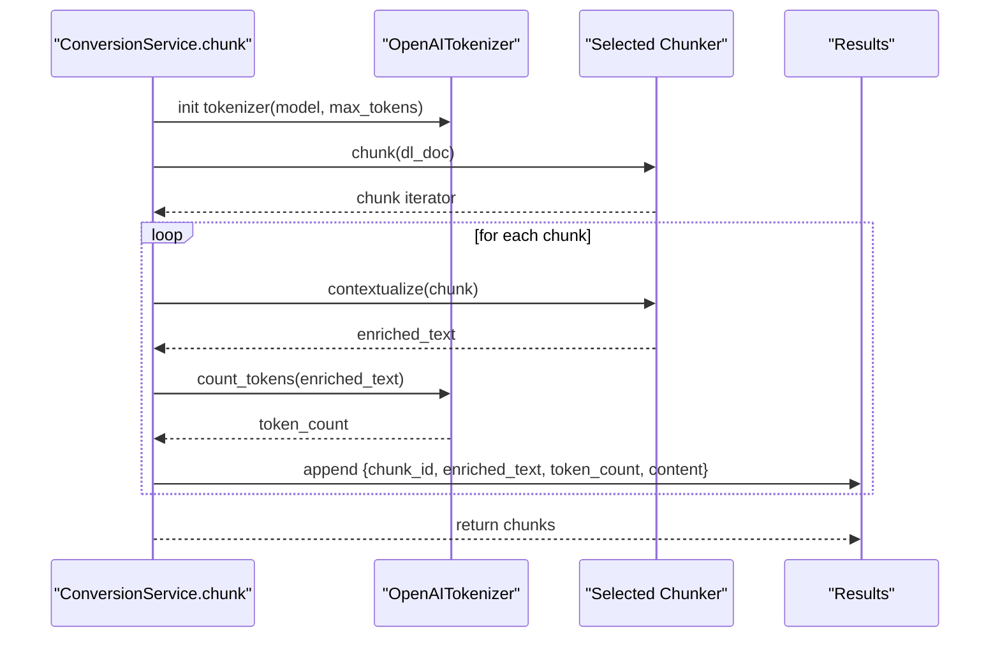
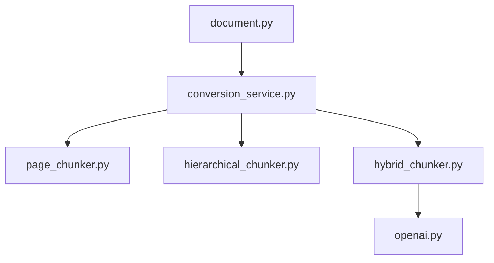

# Chunking System

<cite>
**Referenced Files in This Document**
- [conversion_service.py](file://app/services/conversion_service.py)
- [document.py](file://app/endpoints/document.py)
- [page_chunker.py](file://lib/python3.12/site-packages/docling_core/transforms/chunker/page_chunker.py)
- [hierarchical_chunker.py](file://lib/python3.12/site-packages/docling_core/transforms/chunker/hierarchical_chunker.py)
- [hybrid_chunker.py](file://lib/python3.12/site-packages/docling_core/transforms/chunker/hybrid_chunker.py)
- [openai.py](file://lib/python3.12/site-packages/docling_core/transforms/chunker/tokenizer/openai.py)
- [document_model.py](file://app/models/document_model.py)
- [base.py](file://config/base.py)
</cite>

## Table of Contents
1. [Introduction](#introduction)
2. [Project Structure](#project-structure)
3. [Core Components](#core-components)
4. [Architecture Overview](#architecture-overview)
5. [Detailed Component Analysis](#detailed-component-analysis)
6. [Dependency Analysis](#dependency-analysis)
7. [Performance Considerations](#performance-considerations)
8. [Troubleshooting Guide](#troubleshooting-guide)
9. [Conclusion](#conclusion)
10. [Appendices](#appendices)

## Introduction
This document explains the chunking system implemented in the application, focusing on the ChunkerService architecture and the chunking algorithmic strategies. It covers the chunking methods exposed by the service, the three chunking strategies (PAGE, HIERARCHICAL, HYBRID), the OpenAI tokenizer integration, contextualization, and the end-to-end workflows for converting and chunking documents. Practical guidance is included for configuring chunk sizes, selecting chunk types, and optimizing performance across different document types and use cases.

## Project Structure
The chunking system spans the FastAPI endpoints, the conversion service, and the docling-core chunkers and tokenizers. The endpoint orchestrates conversion and chunking, the service encapsulates the chunking logic and integrates with docling-core chunkers, and the chunkers implement the strategies with a shared tokenizer interface.

**Diagram sources**
- [document.py:162-230](file://app/endpoints/document.py#L162-L230)
- [conversion_service.py:266-478](file://app/services/conversion_service.py#L266-L478)
- [openai.py:16-35](file://lib/python3.12/site-packages/docling_core/transforms/chunker/tokenizer/openai.py#L16-L35)

**Section sources**
- [document.py:162-230](file://app/endpoints/document.py#L162-L230)
- [conversion_service.py:266-478](file://app/services/conversion_service.py#L266-L478)

## Core Components
- ConversionService: Provides asynchronous conversion and chunking methods, initializes the Docling converter, and coordinates chunk generation with configurable strategies and token limits.
- Chunkers:
  - PageChunker: Produces one chunk per page.
  - HierarchicalChunker: Preserves document structure and headings.
  - HybridChunker: Token-aware refinement atop hierarchical chunking.
- OpenAITokenizer: Integrates OpenAI’s tokenizer for token counting and enforcing max token limits.

Key responsibilities:
- chunk(): Iterates over chunks, enriches text, counts tokens, and returns structured results.
- convert_and_chunk(): Converts a file path to a Docling document, then chunks it.
- convert_and_chunk_stream(): Converts an in-memory stream to a Docling document, then chunks it.

**Section sources**
- [conversion_service.py:266-478](file://app/services/conversion_service.py#L266-L478)
- [page_chunker.py:17-60](file://lib/python3.12/site-packages/docling_core/transforms/chunker/page_chunker.py#L17-L60)
- [hierarchical_chunker.py:119-202](file://lib/python3.12/site-packages/docling_core/transforms/chunker/hierarchical_chunker.py#L119-L202)
- [hybrid_chunker.py:53-327](file://lib/python3.12/site-packages/docling_core/transforms/chunker/hybrid_chunker.py#L53-L327)
- [openai.py:16-35](file://lib/python3.12/site-packages/docling_core/transforms/chunker/tokenizer/openai.py#L16-L35)

## Architecture Overview
The chunking architecture is layered:
- Endpoint layer validates inputs and routes to the appropriate conversion and chunking method.
- Service layer manages conversion and delegates chunking to the selected chunker strategy.
- Chunker layer implements the chosen strategy and uses a tokenizer to enforce token limits.
- Tokenizer layer provides token counting and maximum token enforcement.

**Diagram sources**
- [conversion_service.py:89-132](file://app/services/conversion_service.py#L89-L132)
- [page_chunker.py:17-60](file://lib/python3.12/site-packages/docling_core/transforms/chunker/page_chunker.py#L17-L60)
- [hierarchical_chunker.py:119-202](file://lib/python3.12/site-packages/docling_core/transforms/chunker/hierarchical_chunker.py#L119-L202)
- [hybrid_chunker.py:53-327](file://lib/python3.12/site-packages/docling_core/transforms/chunker/hybrid_chunker.py#L53-L327)
- [openai.py:16-35](file://lib/python3.12/site-packages/docling_core/transforms/chunker/tokenizer/openai.py#L16-L35)

## Detailed Component Analysis

### Chunking Methods
- chunk(document, max_tokens, chunk_type, logger)
  - Initializes OpenAITokenizer with a model-specific encoding and the configured max_tokens.
  - Selects the chunker based on chunk_type (PAGE, HIERARCHICAL, HYBRID).
  - Iterates over chunker.chunk(), enriches each chunk with contextualization, counts tokens, and returns a structured list of chunks with metadata.
- convert_and_chunk(file_path, max_tokens, output_type, chunk_type, logger)
  - Converts a file path to a Docling document, then calls chunk() with the resulting document.
- convert_and_chunk_stream(file_content, filename, max_tokens, output_type, chunk_type, logger)
  - Converts an in-memory stream to a Docling document, then calls chunk() with the resulting document.

**Diagram sources**
- [document.py:162-230](file://app/endpoints/document.py#L162-L230)
- [conversion_service.py:266-478](file://app/services/conversion_service.py#L266-L478)
- [openai.py:16-35](file://lib/python3.12/site-packages/docling_core/transforms/chunker/tokenizer/openai.py#L16-L35)

**Section sources**
- [conversion_service.py:266-478](file://app/services/conversion_service.py#L266-L478)
- [document.py:162-230](file://app/endpoints/document.py#L162-L230)

### Chunking Strategies

#### PAGE-based Chunking
- Strategy: One chunk per page.
- Behavior: Serializes each page individually and yields a DocChunk per page. If no pages exist, treats the entire document as a single chunk.
- Use cases: When page boundaries are meaningful (e.g., scanned PDFs), or when strict page-level segmentation is desired.

**Diagram sources**
- [page_chunker.py:24-60](file://lib/python3.12/site-packages/docling_core/transforms/chunker/page_chunker.py#L24-L60)

**Section sources**
- [page_chunker.py:17-60](file://lib/python3.12/site-packages/docling_core/transforms/chunker/page_chunker.py#L17-L60)

#### HIERARCHICAL Chunking
- Strategy: Preserves document structure and headings.
- Behavior: Walks document items with groups, tracks headings by level, and yields chunks that include relevant headings and captions. Excludes items marked as excluded by the serializer.
- Use cases: When preserving semantic structure (headings, lists, tables) is important for downstream retrieval or summarization.

**Diagram sources**
- [hierarchical_chunker.py:139-202](file://lib/python3.12/site-packages/docling_core/transforms/chunker/hierarchical_chunker.py#L139-L202)

**Section sources**
- [hierarchical_chunker.py:119-202](file://lib/python3.12/site-packages/docling_core/transforms/chunker/hierarchical_chunker.py#L119-L202)

#### HYBRID Chunking with OpenAI Tokenizer
- Strategy: Token-aware refinement atop hierarchical chunking.
- Workflow:
  - Generate hierarchical chunks.
  - Split each chunk by document items to fit within max_tokens.
  - If remaining text exceeds capacity, split using a plain-text splitter guided by available token budget.
  - Optionally merge adjacent chunks with matching metadata to reduce fragmentation.
- Token counting: Uses OpenAITokenizer to compute token counts for enriched text and to enforce max_tokens.
- Use cases: When token limits are strict (e.g., LLM prompts) and structure preservation is still desired.

**Diagram sources**
- [hybrid_chunker.py:298-327](file://lib/python3.12/site-packages/docling_core/transforms/chunker/hybrid_chunker.py#L298-L327)
- [openai.py:24-35](file://lib/python3.12/site-packages/docling_core/transforms/chunker/tokenizer/openai.py#L24-L35)

**Section sources**
- [hybrid_chunker.py:53-327](file://lib/python3.12/site-packages/docling_core/transforms/chunker/hybrid_chunker.py#L53-L327)
- [openai.py:16-35](file://lib/python3.12/site-packages/docling_core/transforms/chunker/tokenizer/openai.py#L16-L35)

### OpenAITokenizer Configuration and Token Counting
- Initialization: Created with a model-specific encoding and a max_tokens limit.
- Token counting: Encodes text and returns the number of tokens.
- Integration: Used by HybridChunker for splitting and by ConversionService for enrich-and-count workflows.

**Diagram sources**
- [openai.py:16-35](file://lib/python3.12/site-packages/docling_core/transforms/chunker/tokenizer/openai.py#L16-L35)

**Section sources**
- [openai.py:16-35](file://lib/python3.12/site-packages/docling_core/transforms/chunker/tokenizer/openai.py#L16-L35)

### Contextualization and Enriched Text Processing
- Each chunk is contextualized before token counting. This enriches the chunk text with surrounding context (e.g., headings) to improve downstream tasks.
- The enriched text is then tokenized to compute the token count for the chunk.

**Section sources**
- [conversion_service.py:306-316](file://app/services/conversion_service.py#L306-L316)
- [hierarchical_chunker.py:192-201](file://lib/python3.12/site-packages/docling_core/transforms/chunker/hierarchical_chunker.py#L192-L201)
- [hybrid_chunker.py:134-136](file://lib/python3.12/site-packages/docling_core/transforms/chunker/hybrid_chunker.py#L134-L136)

### Chunk Generation Workflow
- Input: DoclingDocument.
- Steps:
  - Initialize tokenizer with max_tokens.
  - Select chunker by chunk_type.
  - Iterate chunks from chunker.chunk().
  - For each chunk: contextualize, count tokens, and append to results.
- Output: List of chunks with chunk_id, enriched_text, token_count, and content.

**Diagram sources**
- [conversion_service.py:285-320](file://app/services/conversion_service.py#L285-L320)
- [openai.py:24-35](file://lib/python3.12/site-packages/docling_core/transforms/chunker/tokenizer/openai.py#L24-L35)

**Section sources**
- [conversion_service.py:266-343](file://app/services/conversion_service.py#L266-L343)

### Practical Examples and Configuration
- Parameter configuration:
  - max_tokens: Controls token budget per chunk. Defaults to settings.MAX_TOKENS.
  - chunk_type: Choose among PAGE, HIERARCHICAL, HYBRID.
  - output_type: Controls conversion output format (Markdown by default).
  - enable_ocr and ocr_langs: Configure OCR behavior during conversion.
- Chunk type selection:
  - PAGE: Best for page-aligned workflows.
  - HIERARCHICAL: Best for structure-preserving retrieval.
  - HYBRID: Best for strict token budgets with structure awareness.
- Integration with conversion workflows:
  - convert_and_chunk(file_path, ...): Converts a file path then chunks.
  - convert_and_chunk_stream(BytesIO, ...): Converts an in-memory stream then chunks.

**Section sources**
- [document.py:162-230](file://app/endpoints/document.py#L162-L230)
- [conversion_service.py:345-478](file://app/services/conversion_service.py#L345-L478)
- [document_model.py:17-22](file://app/models/document_model.py#L17-L22)
- [base.py:21-22](file://config/base.py#L21-L22)

## Dependency Analysis
- Endpoint depends on ConversionService and passes user-configured parameters.
- ConversionService depends on Docling DocumentConverter for conversion and on chunkers for chunking.
- HybridChunker depends on OpenAITokenizer for token counting and splitting.
- PageChunker and HierarchicalChunker depend on serializers to produce text and metadata.

**Diagram sources**
- [document.py:162-230](file://app/endpoints/document.py#L162-L230)
- [conversion_service.py:266-478](file://app/services/conversion_service.py#L266-L478)
- [page_chunker.py:17-60](file://lib/python3.12/site-packages/docling_core/transforms/chunker/page_chunker.py#L17-L60)
- [hierarchical_chunker.py:119-202](file://lib/python3.12/site-packages/docling_core/transforms/chunker/hierarchical_chunker.py#L119-L202)
- [hybrid_chunker.py:53-327](file://lib/python3.12/site-packages/docling_core/transforms/chunker/hybrid_chunker.py#L53-L327)
- [openai.py:16-35](file://lib/python3.12/site-packages/docling_core/transforms/chunker/tokenizer/openai.py#L16-L35)

**Section sources**
- [conversion_service.py:266-478](file://app/services/conversion_service.py#L266-L478)

## Performance Considerations
- Thread pool utilization: ConversionService uses a shared ThreadPoolExecutor to offload blocking conversion and chunking work.
- Streaming vs file-based conversion: The endpoint chooses streaming for small files and file-based for larger ones to balance memory usage.
- Token budget tuning:
  - Lower max_tokens increases chunk granularity and reduces context loss risk.
  - Higher max_tokens reduces chunk count but risks exceeding model limits.
- Chunker choice:
  - PAGE: Minimal overhead, good for page-aligned tasks.
  - HIERARCHICAL: Moderate overhead, preserves structure.
  - HYBRID: Highest overhead due to token-aware splitting and optional merging; best for strict token budgets.
- Memory considerations:
  - Streaming avoids writing large files to disk.
  - Token counting and contextualization add CPU overhead proportional to chunk count and text length.
- Environment tuning:
  - Adjust THREAD_POOL_SIZE and CONVERTER_NUM_THREADS for throughput.
  - Tune MAX_STREAM_SIZE to balance streaming and disk-based conversion thresholds.

[No sources needed since this section provides general guidance]

## Troubleshooting Guide
- Chunking failures:
  - The service logs errors and returns ApiResponse.error with details. In convert_and_chunk, if chunking fails, the endpoint returns conversion results with empty chunks and zero totals.
- Tokenizer availability:
  - HybridChunker requires extras for chunking; ensure the proper installation is available.
- Endpoint-level errors:
  - The endpoint catches exceptions and returns HTTP 500 with a detailed message.

**Section sources**
- [conversion_service.py:339-343](file://app/services/conversion_service.py#L339-L343)
- [conversion_service.py:384-398](file://app/services/conversion_service.py#L384-L398)
- [document.py:225-230](file://app/endpoints/document.py#L225-L230)

## Conclusion
The chunking system provides a flexible, token-aware pipeline for transforming documents into manageable chunks. By selecting the appropriate chunker strategy—PAGE for page-level segmentation, HIERARCHICAL for structure preservation, or HYBRID for token-aware chunking—the system supports diverse downstream applications. Proper configuration of max_tokens, chunk_type, and conversion parameters enables efficient processing across varied document types and use cases.

[No sources needed since this section summarizes without analyzing specific files]

## Appendices

### API and Model References
- ChunkType enumeration defines supported chunking strategies.
- OutputType controls conversion output format.
- Base configuration exposes defaults for chunking and performance tuning.

**Section sources**
- [document_model.py:17-22](file://app/models/document_model.py#L17-L22)
- [base.py:21-29](file://config/base.py#L21-L29)