# Conversion Service

<cite>
**Referenced Files in This Document**
- [conversion_service.py](file://app/services/conversion_service.py)
- [base_service.py](file://app/services/base_service.py)
- [document_model.py](file://app/models/document_model.py)
- [document.py](file://app/endpoints/document.py)
- [base.py](file://config/base.py)
- [main.py](file://app/main.py)
- [api_response.py](file://app/models/api_response.py)
</cite>

## Table of Contents
1. [Introduction](#introduction)
2. [Project Structure](#project-structure)
3. [Core Components](#core-components)
4. [Architecture Overview](#architecture-overview)
5. [Detailed Component Analysis](#detailed-component-analysis)
6. [Dependency Analysis](#dependency-analysis)
7. [Performance Considerations](#performance-considerations)
8. [Troubleshooting Guide](#troubleshooting-guide)
9. [Conclusion](#conclusion)

## Introduction
This document explains the ConversionService class and the broader document conversion architecture. It focuses on the singleton-style sharing of a DocumentConverter instance, thread pool executor management, asynchronous conversion workflows, and the factory function that configures the converter for multiple input formats. It also covers conversion methods (convert, convert_stream, and the underlying synchronous implementation), DocumentStream usage for memory-efficient processing, error handling and graceful fallbacks, thread safety considerations, resource cleanup, and integration with the BaseService parent class.

## Project Structure
The conversion service sits within the application’s service layer and integrates with FastAPI endpoints and configuration. The key files involved are:
- ConversionService implementation and factory
- BaseService parent class for logging context
- Output and chunking enums
- FastAPI endpoints orchestrating conversions
- Application lifecycle managing the singleton converter
- Standardized API response wrapper

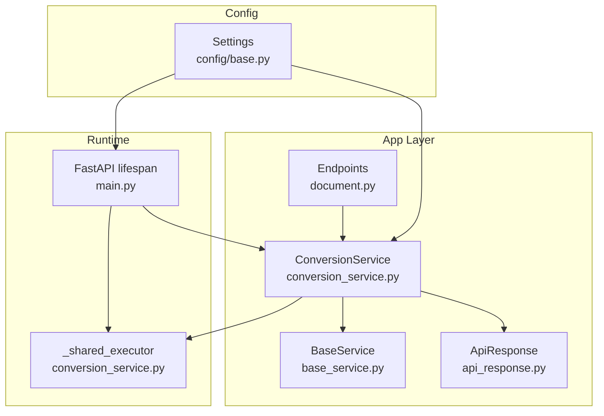

**Diagram sources**
- [document.py:100-160](file://app/endpoints/document.py#L100-L160)
- [conversion_service.py:89-132](file://app/services/conversion_service.py#L89-L132)
- [base_service.py:6-29](file://app/services/base_service.py#L6-L29)
- [api_response.py:14-147](file://app/models/api_response.py#L14-L147)
- [base.py:9-57](file://config/base.py#L9-L57)
- [main.py:49-71](file://app/main.py#L49-L71)

**Section sources**
- [conversion_service.py:1-478](file://app/services/conversion_service.py#L1-L478)
- [base_service.py:1-29](file://app/services/base_service.py#L1-L29)
- [document_model.py:1-74](file://app/models/document_model.py#L1-L74)
- [document.py:1-353](file://app/endpoints/document.py#L1-L353)
- [base.py:1-57](file://config/base.py#L1-L57)
- [main.py:1-160](file://app/main.py#L1-L160)
- [api_response.py:1-193](file://app/models/api_response.py#L1-L193)

## Core Components
- ConversionService: Provides async conversion and chunking APIs backed by a shared thread pool and a pre-configured DocumentConverter instance.
- create_document_converter(): Factory that builds a DocumentConverter configured for multiple input formats, OCR languages, and accelerator threads.
- Thread pool management: Singleton thread pool via get_shared_executor() and shutdown_shared_executor().
- BaseService integration: Centralized logging with request context propagation.
- Output and chunking models: Enums and response wrappers for consistent API behavior.

Key responsibilities:
- Async orchestration of CPU-bound conversion tasks via ThreadPoolExecutor.
- Memory-efficient streaming via DocumentStream for small-to-medium files.
- Graceful fallbacks when converter initialization fails.
- Unified response envelope for clients.

**Section sources**
- [conversion_service.py:28-67](file://app/services/conversion_service.py#L28-L67)
- [conversion_service.py:73-87](file://app/services/conversion_service.py#L73-L87)
- [conversion_service.py:89-132](file://app/services/conversion_service.py#L89-L132)
- [conversion_service.py:133-217](file://app/services/conversion_service.py#L133-L217)
- [conversion_service.py:219-264](file://app/services/conversion_service.py#L219-L264)
- [conversion_service.py:266-343](file://app/services/conversion_service.py#L266-L343)
- [conversion_service.py:345-478](file://app/services/conversion_service.py#L345-L478)
- [base_service.py:6-29](file://app/services/base_service.py#L6-L29)
- [document_model.py:9-22](file://app/models/document_model.py#L9-L22)
- [api_response.py:14-147](file://app/models/api_response.py#L14-L147)

## Architecture Overview
The system initializes a singleton ConversionService during application startup. The service maintains a shared ThreadPoolExecutor and a lazily initialized DocumentConverter. Requests are served asynchronously; CPU-intensive work is offloaded to the thread pool. Endpoints decide between file-based and stream-based conversion depending on file size thresholds.

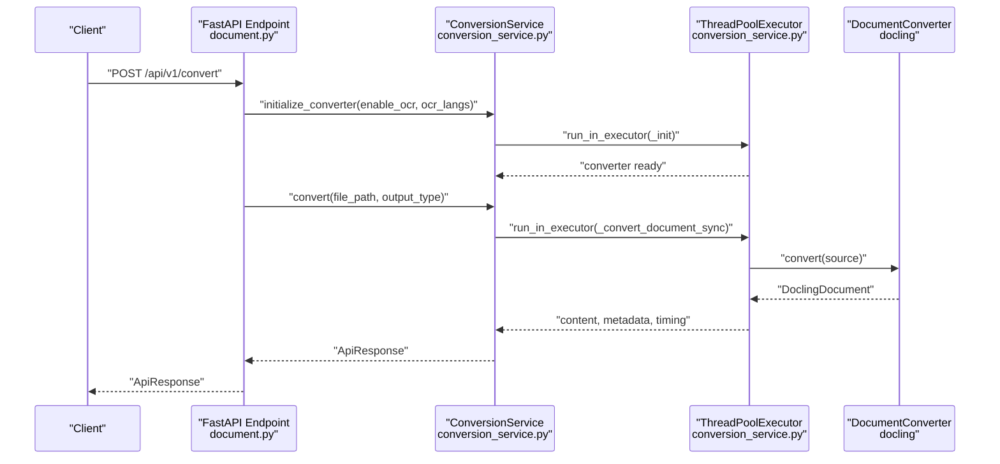

**Diagram sources**
- [document.py:101-153](file://app/endpoints/document.py#L101-L153)
- [conversion_service.py:97-132](file://app/services/conversion_service.py#L97-L132)
- [conversion_service.py:133-174](file://app/services/conversion_service.py#L133-L174)
- [conversion_service.py:219-264](file://app/services/conversion_service.py#L219-L264)

## Detailed Component Analysis

### ConversionService class
ConversionService extends BaseService and encapsulates:
- Shared thread pool executor management
- Converter initialization and fallback
- Conversion methods for file path and stream
- Chunking utilities and combined conversion+chunking workflows

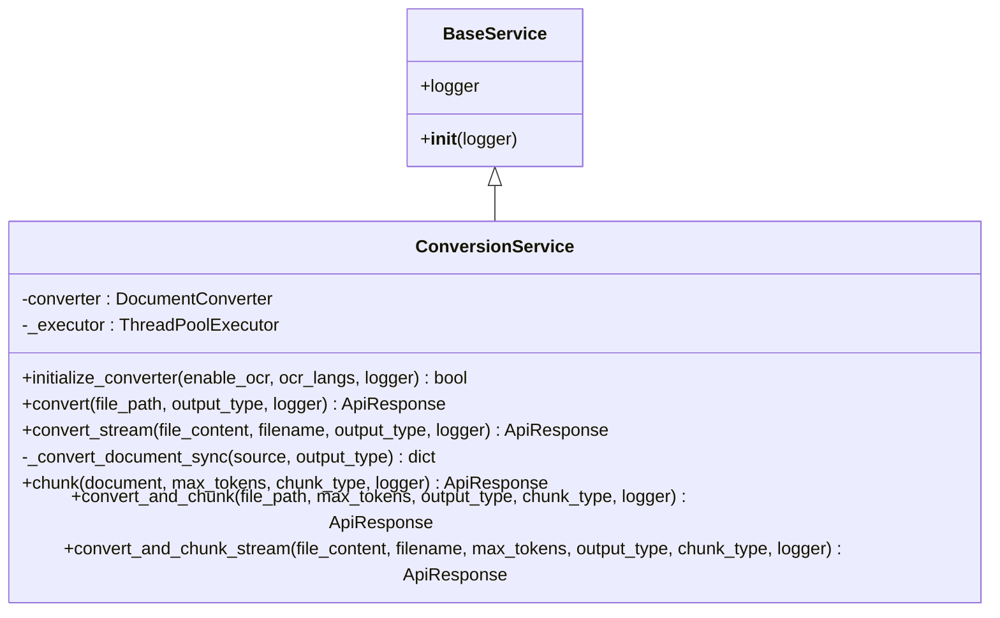

**Diagram sources**
- [base_service.py:6-29](file://app/services/base_service.py#L6-L29)
- [conversion_service.py:89-478](file://app/services/conversion_service.py#L89-L478)

**Section sources**
- [conversion_service.py:89-132](file://app/services/conversion_service.py#L89-L132)
- [conversion_service.py:133-217](file://app/services/conversion_service.py#L133-L217)
- [conversion_service.py:219-264](file://app/services/conversion_service.py#L219-L264)
- [conversion_service.py:266-343](file://app/services/conversion_service.py#L266-L343)
- [conversion_service.py:345-478](file://app/services/conversion_service.py#L345-L478)
- [base_service.py:6-29](file://app/services/base_service.py#L6-L29)

### Singleton-style DocumentConverter sharing
- A single ConversionService instance is stored in app.state during startup.
- The service holds a converter instance and reuses it across requests.
- If converter initialization fails, a fallback to a minimal DocumentConverter is attempted.

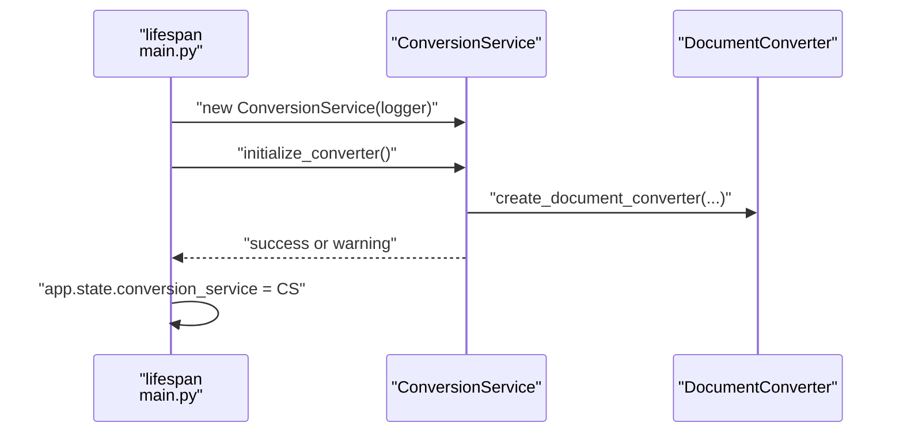

**Diagram sources**
- [main.py:49-71](file://app/main.py#L49-L71)
- [conversion_service.py:97-132](file://app/services/conversion_service.py#L97-L132)
- [conversion_service.py:28-67](file://app/services/conversion_service.py#L28-L67)

**Section sources**
- [main.py:49-71](file://app/main.py#L49-L71)
- [conversion_service.py:97-132](file://app/services/conversion_service.py#L97-L132)

### Thread pool executor management
- A module-level shared ThreadPoolExecutor is created once and reused.
- The executor is shut down gracefully on application exit.
- Conversion and chunking tasks are submitted to this executor to avoid blocking the event loop.

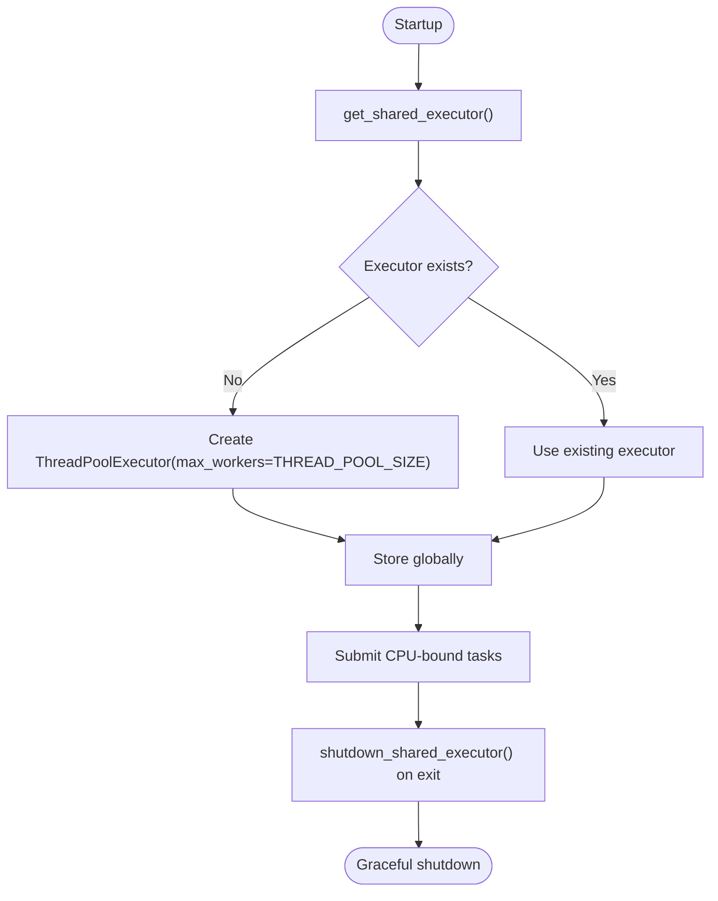

**Diagram sources**
- [conversion_service.py:70-87](file://app/services/conversion_service.py#L70-L87)
- [main.py:68-70](file://app/main.py#L68-L70)
- [base.py:27-29](file://config/base.py#L27-L29)

**Section sources**
- [conversion_service.py:70-87](file://app/services/conversion_service.py#L70-L87)
- [main.py:68-70](file://app/main.py#L68-L70)
- [base.py:27-29](file://config/base.py#L27-L29)

### Factory function create_document_converter()
- Builds a DocumentConverter configured for multiple input formats (PDF, DOCX, HTML, PPTX, XLSX, ASCIIDOC, CSV, MD).
- Applies PDF pipeline options including OCR enablement, table structure, cell matching, OCR languages, and accelerator threads.
- Uses settings for defaults and tunables.

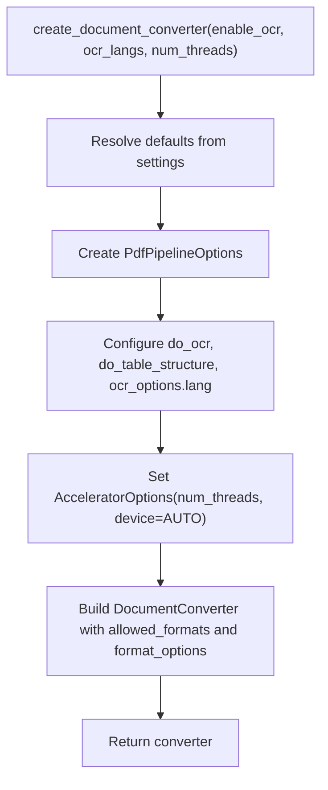

**Diagram sources**
- [conversion_service.py:28-67](file://app/services/conversion_service.py#L28-L67)
- [base.py:17-33](file://config/base.py#L17-L33)

**Section sources**
- [conversion_service.py:28-67](file://app/services/conversion_service.py#L28-L67)
- [base.py:17-33](file://config/base.py#L17-L33)

### Conversion methods: convert() and convert_stream()
- convert(): Accepts a file path, initializes the converter if needed, and performs synchronous conversion via the thread pool. Returns a standardized ApiResponse.
- convert_stream(): Accepts an in-memory BytesIO stream and a filename, wraps it as a DocumentStream, and delegates to the same synchronous implementation.

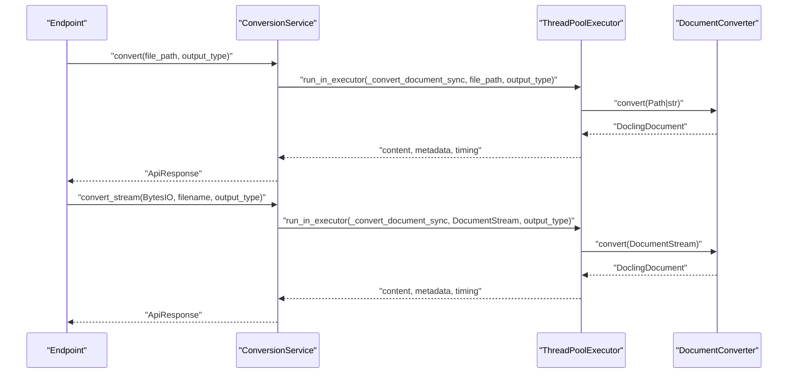

**Diagram sources**
- [conversion_service.py:133-174](file://app/services/conversion_service.py#L133-L174)
- [conversion_service.py:175-217](file://app/services/conversion_service.py#L175-L217)
- [conversion_service.py:219-264](file://app/services/conversion_service.py#L219-L264)

**Section sources**
- [conversion_service.py:133-174](file://app/services/conversion_service.py#L133-L174)
- [conversion_service.py:175-217](file://app/services/conversion_service.py#L175-L217)
- [conversion_service.py:219-264](file://app/services/conversion_service.py#L219-L264)

### Synchronous implementation: _convert_document_sync()
- Measures processing time.
- Ensures converter availability (lazy creation if absent).
- Converts the source and exports content according to OutputType.
- Aggregates metadata (page count, file type).
- Returns a structured dictionary suitable for ApiResponse construction.

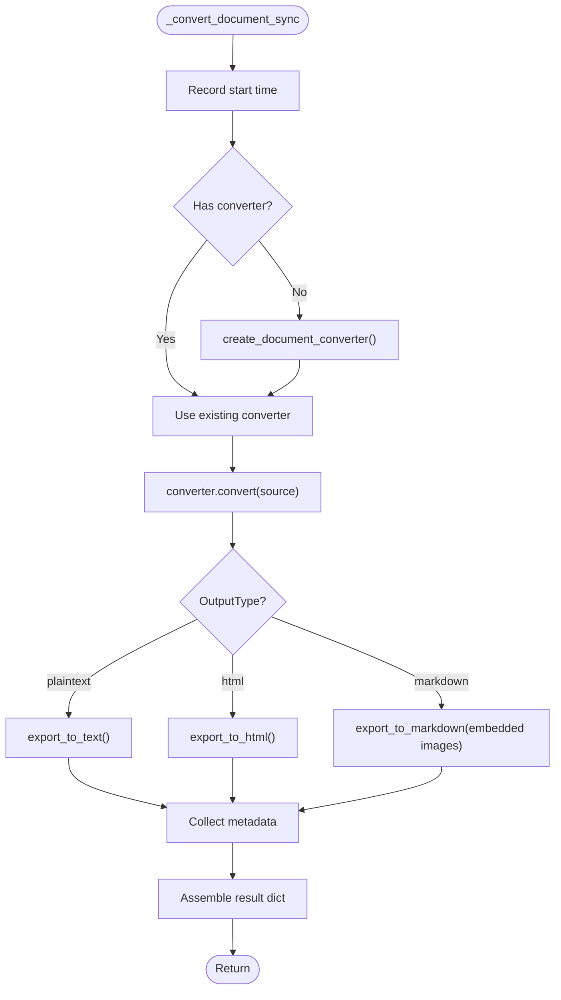

**Diagram sources**
- [conversion_service.py:219-264](file://app/services/conversion_service.py#L219-L264)

**Section sources**
- [conversion_service.py:219-264](file://app/services/conversion_service.py#L219-L264)

### Chunking and combined workflows
- chunk(): Token-aware chunking using hierarchical, hybrid, or page strategies with a tokenizer.
- convert_and_chunk() and convert_and_chunk_stream(): Full pipelines combining conversion and chunking, with graceful degradation if chunking fails.

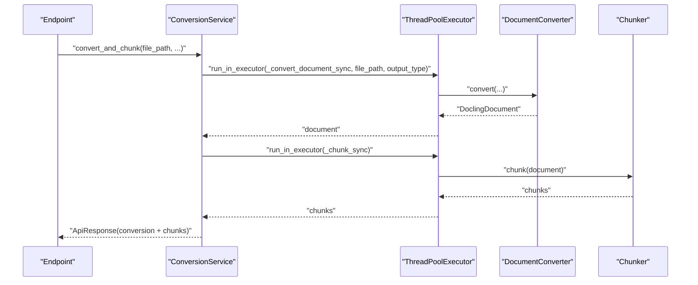

**Diagram sources**
- [conversion_service.py:266-343](file://app/services/conversion_service.py#L266-L343)
- [conversion_service.py:345-478](file://app/services/conversion_service.py#L345-L478)

**Section sources**
- [conversion_service.py:266-343](file://app/services/conversion_service.py#L266-L343)
- [conversion_service.py:345-478](file://app/services/conversion_service.py#L345-L478)

### DocumentStream usage for memory efficiency
- For small files, the endpoint chooses streaming to avoid writing to disk.
- DocumentStream is constructed with a filename and BytesIO, enabling conversion without filesystem I/O.
- The conversion path remains identical, ensuring consistent behavior.

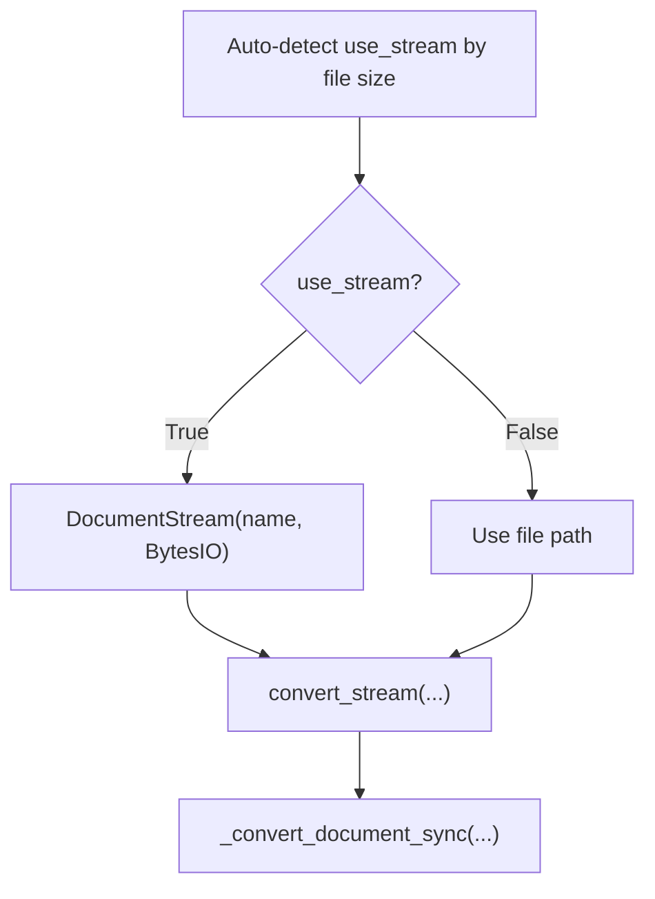

**Diagram sources**
- [document.py:27-41](file://app/endpoints/document.py#L27-L41)
- [document.py:125-140](file://app/endpoints/document.py#L125-L140)
- [conversion_service.py:175-217](file://app/services/conversion_service.py#L175-L217)

**Section sources**
- [document.py:27-41](file://app/endpoints/document.py#L27-L41)
- [document.py:125-140](file://app/endpoints/document.py#L125-L140)
- [conversion_service.py:175-217](file://app/services/conversion_service.py#L175-L217)

### Error handling and graceful fallbacks
- Converter initialization failure triggers a fallback to a minimal DocumentConverter.
- Conversion exceptions are caught and returned as ApiResponse errors.
- Chunking failures are handled separately; conversion results may still be returned when chunking fails.

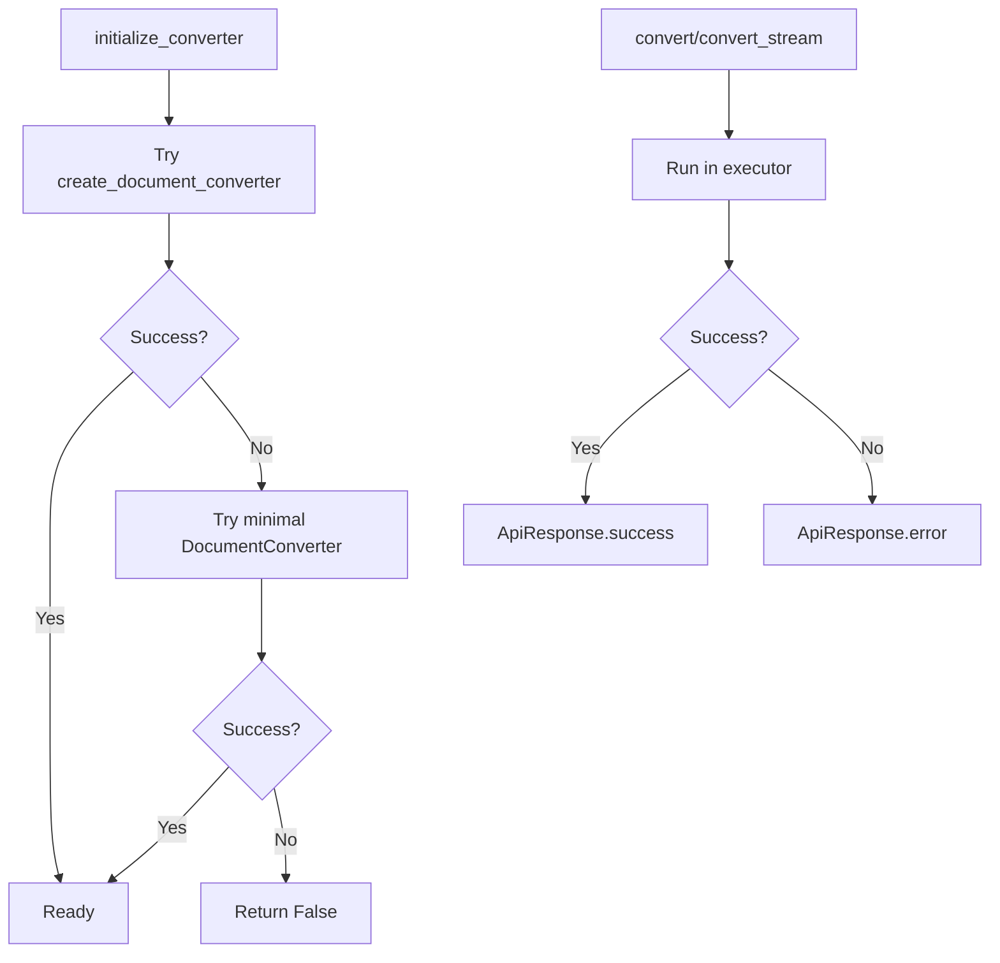

**Diagram sources**
- [conversion_service.py:97-132](file://app/services/conversion_service.py#L97-L132)
- [conversion_service.py:133-174](file://app/services/conversion_service.py#L133-L174)
- [conversion_service.py:345-478](file://app/services/conversion_service.py#L345-L478)

**Section sources**
- [conversion_service.py:97-132](file://app/services/conversion_service.py#L97-L132)
- [conversion_service.py:133-174](file://app/services/conversion_service.py#L133-L174)
- [conversion_service.py:345-478](file://app/services/conversion_service.py#L345-L478)

### Practical examples
- Converter initialization: Called from endpoints with user-provided OCR flags and languages.
- Conversion execution: Choose convert() for file paths or convert_stream() for in-memory streams.
- Performance optimization: Tune THREAD_POOL_SIZE and CONVERTER_NUM_THREADS via settings; prefer streaming for small files below MAX_STREAM_SIZE.

Example references:
- [document.py:101-153](file://app/endpoints/document.py#L101-L153)
- [document.py:162-231](file://app/endpoints/document.py#L162-L231)
- [base.py:27-33](file://config/base.py#L27-L33)

**Section sources**
- [document.py:101-153](file://app/endpoints/document.py#L101-L153)
- [document.py:162-231](file://app/endpoints/document.py#L162-L231)
- [base.py:27-33](file://config/base.py#L27-L33)

## Dependency Analysis
- ConversionService depends on:
  - BaseService for logging context
  - DocumentConverter from docling for conversion
  - ThreadPoolExecutor for concurrency
  - Settings for configuration
  - ApiResponse for response envelopes
- Endpoints depend on ConversionService and FileService for preparation and routing decisions.

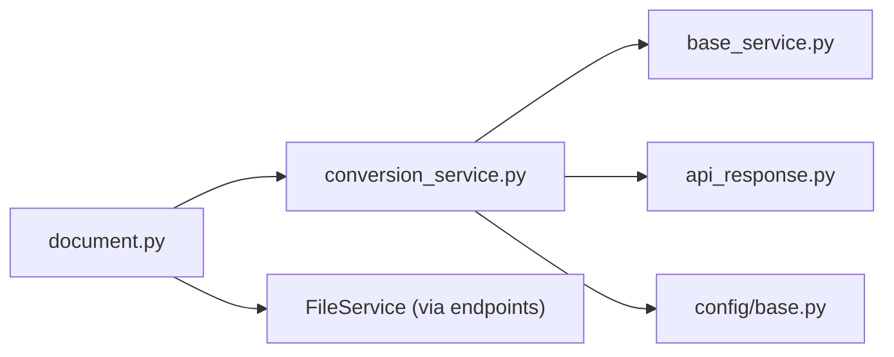

**Diagram sources**
- [document.py:101-153](file://app/endpoints/document.py#L101-L153)
- [conversion_service.py:89-132](file://app/services/conversion_service.py#L89-L132)
- [base_service.py:6-29](file://app/services/base_service.py#L6-L29)
- [api_response.py:14-147](file://app/models/api_response.py#L14-L147)
- [base.py:9-57](file://config/base.py#L9-L57)

**Section sources**
- [document.py:101-153](file://app/endpoints/document.py#L101-L153)
- [conversion_service.py:89-132](file://app/services/conversion_service.py#L89-L132)
- [base_service.py:6-29](file://app/services/base_service.py#L6-L29)
- [api_response.py:14-147](file://app/models/api_response.py#L14-L147)
- [base.py:9-57](file://config/base.py#L9-L57)

## Performance Considerations
- Use the shared thread pool to avoid per-request overhead.
- Prefer streaming for small files to reduce disk I/O.
- Tune THREAD_POOL_SIZE and CONVERTER_NUM_THREADS to match CPU cores and workload.
- Use convert_and_chunk or convert_and_chunk_stream to minimize repeated conversions.
- Monitor processing_time and page_count metadata for observability.

[No sources needed since this section provides general guidance]

## Troubleshooting Guide
Common issues and resolutions:
- Converter initialization failure: The service attempts a fallback to a minimal DocumentConverter. If both fail, initialization returns False; handle accordingly in callers.
- Conversion errors: Exceptions are captured and returned as ApiResponse.error; inspect error_message for details.
- Chunking failures: The combined methods still return conversion results with empty chunks and a warning in logs.
- Health checks: Use the /health endpoint to verify converter status.

**Section sources**
- [conversion_service.py:97-132](file://app/services/conversion_service.py#L97-L132)
- [conversion_service.py:133-174](file://app/services/conversion_service.py#L133-L174)
- [conversion_service.py:345-478](file://app/services/conversion_service.py#L345-L478)
- [main.py:116-130](file://app/main.py#L116-L130)

## Conclusion
The ConversionService provides a robust, async-first document conversion pipeline built on a shared thread pool and a pre-configured DocumentConverter. It supports multiple input formats, OCR configuration, and memory-efficient streaming. The design emphasizes graceful fallbacks, standardized responses, and maintainable integration with BaseService and FastAPI endpoints.