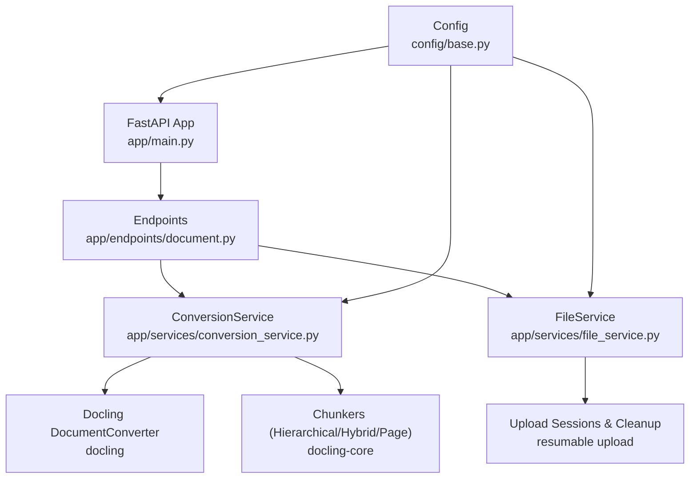
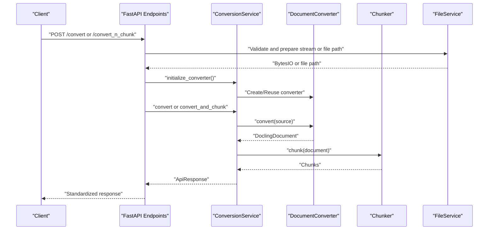
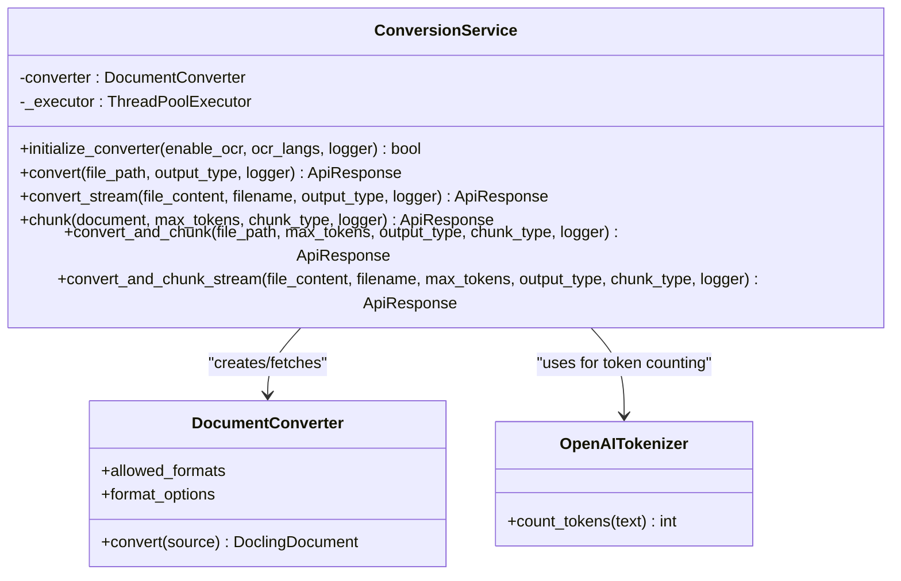
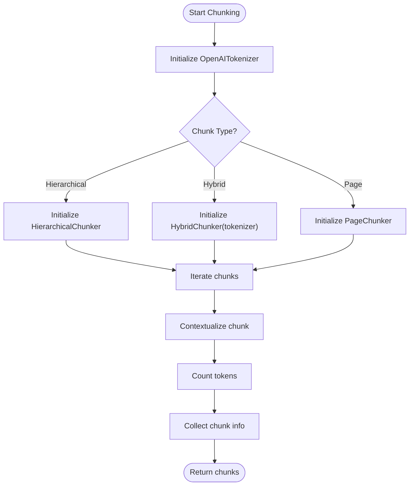
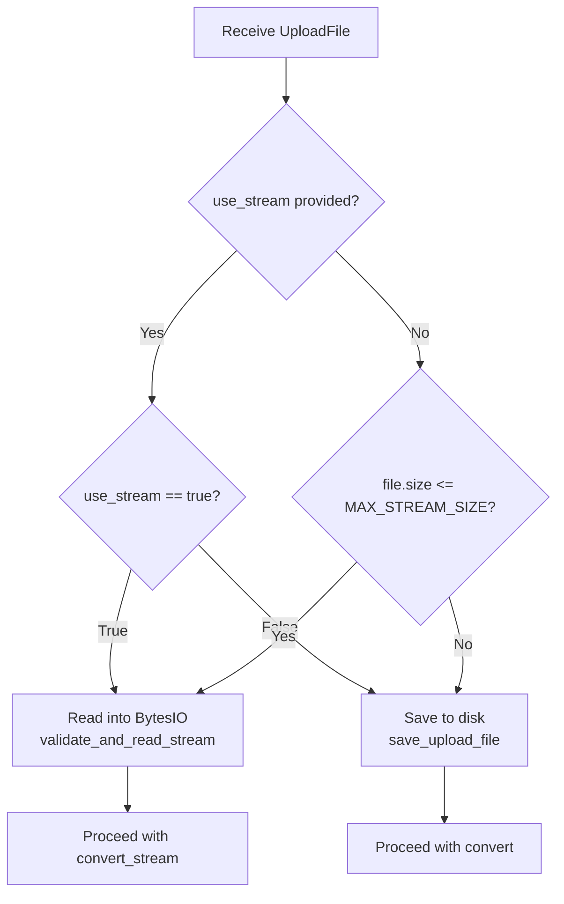
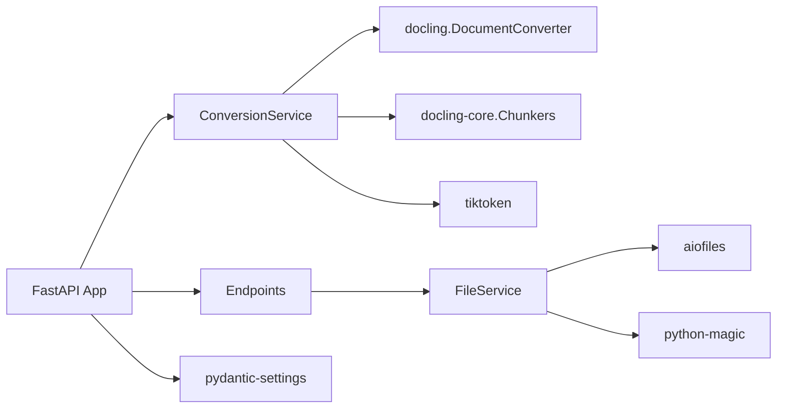

# Document Processing Engine

<cite>
**Referenced Files in This Document**
- [app/main.py](file://app/main.py)
- [app/services/conversion_service.py](file://app/services/conversion_service.py)
- [app/services/file_service.py](file://app/services/file_service.py)
- [app/endpoints/document.py](file://app/endpoints/document.py)
- [app/models/document_model.py](file://app/models/document_model.py)
- [app/models/api_response.py](file://app/models/api_response.py)
- [app/services/base_service.py](file://app/services/base_service.py)
- [config/base.py](file://config/base.py)
- [env/dev.env](file://env/dev.env)
- [requirements.txt](file://requirements.txt)
- [tests/conftest.py](file://tests/conftest.py)
</cite>

## Table of Contents
1. [Introduction](#introduction)
2. [Project Structure](#project-structure)
3. [Core Components](#core-components)
4. [Architecture Overview](#architecture-overview)
5. [Detailed Component Analysis](#detailed-component-analysis)
6. [Dependency Analysis](#dependency-analysis)
7. [Performance Considerations](#performance-considerations)
8. [Troubleshooting Guide](#troubleshooting-guide)
9. [Conclusion](#conclusion)
10. [Appendices](#appendices)

## Introduction
This document explains the document processing engine built around a production-grade FastAPI service that converts and chunks diverse document formats into structured text. It focuses on:
- Singleton-style ConversionService lifecycle and thread-pool management
- Factory-based DocumentConverter creation supporting PDF, DOCX, PPTX, XLSX, images, HTML, CSV, Markdown, and ASCIIDOC
- Intelligent text extraction via OCR and table structure detection
- Streaming versus file-based processing strategies with memory and disk fallbacks
- Chunking system with hierarchical, hybrid, page-based, and token-aware strategies
- Practical examples of conversion and chunking pipelines, plus robust error handling and graceful degradation

## Project Structure
The system is organized into clear layers:
- Application entrypoint initializes the singleton ConversionService and registers routes
- Endpoints orchestrate conversion and chunking requests, selecting streaming or file-based processing
- Services encapsulate file handling, conversion, and chunking logic
- Models define request/response contracts and enumerations
- Configuration defines environment-driven behavior and limits

**Diagram sources**
- [app/main.py:49-71](file://app/main.py#L49-L71)
- [app/endpoints/document.py:100-231](file://app/endpoints/document.py#L100-L231)
- [app/services/conversion_service.py:89-478](file://app/services/conversion_service.py#L89-L478)
- [app/services/file_service.py:23-347](file://app/services/file_service.py#L23-L347)
- [config/base.py:9-57](file://config/base.py#L9-L57)

**Section sources**
- [app/main.py:49-71](file://app/main.py#L49-L71)
- [app/endpoints/document.py:100-231](file://app/endpoints/document.py#L100-L231)
- [app/services/conversion_service.py:89-478](file://app/services/conversion_service.py#L89-L478)
- [app/services/file_service.py:23-347](file://app/services/file_service.py#L23-L347)
- [config/base.py:9-57](file://config/base.py#L9-L57)

## Core Components
- ConversionService: Singleton-like service managing a shared thread pool and a lazily initialized DocumentConverter. Provides conversion, chunking, and combined conversion-chunking operations for both streaming and file-based inputs.
- DocumentConverter factory: Creates a converter configured for multiple input formats and OCR/table options, with accelerator settings.
- FileService: Validates, streams, saves, and cleans up uploads; supports resumable uploads with range writes and expiry pruning.
- Endpoints: Expose conversion and chunking APIs, decide streaming vs file-based based on thresholds, and integrate with the singleton ConversionService.
- Models: Define output types, chunk types, and upload session models.
- BaseService: Provides request-scoped logging with preserved context.

Key implementation highlights:
- Thread pool reuse via a module-level executor and a shared executor getter/shutdown
- Converter initialization with fallback to default settings if advanced initialization fails
- Token-aware chunking with OpenAI tokenizer integration
- Streaming conversion using Docling’s DocumentStream to avoid disk writes
- Resumable upload sessions with automatic cleanup and expiry

**Section sources**
- [app/services/conversion_service.py:89-132](file://app/services/conversion_service.py#L89-L132)
- [app/services/conversion_service.py:28-67](file://app/services/conversion_service.py#L28-L67)
- [app/services/conversion_service.py:266-343](file://app/services/conversion_service.py#L266-L343)
- [app/services/conversion_service.py:133-174](file://app/services/conversion_service.py#L133-L174)
- [app/services/conversion_service.py:175-218](file://app/services/conversion_service.py#L175-L218)
- [app/services/file_service.py:35-98](file://app/services/file_service.py#L35-L98)
- [app/services/file_service.py:110-163](file://app/services/file_service.py#L110-L163)
- [app/endpoints/document.py:27-41](file://app/endpoints/document.py#L27-L41)
- [app/endpoints/document.py:43-94](file://app/endpoints/document.py#L43-L94)
- [app/models/document_model.py:9-22](file://app/models/document_model.py#L9-L22)
- [app/services/base_service.py:6-29](file://app/services/base_service.py#L6-L29)

## Architecture Overview
The engine follows a request-driven flow:
- FastAPI app initializes a singleton ConversionService at startup
- Endpoints receive requests, validate and prepare inputs (stream or file path)
- ConversionService performs conversion and optional chunking using a shared thread pool
- Responses are standardized via ApiResponse

**Diagram sources**
- [app/endpoints/document.py:100-231](file://app/endpoints/document.py#L100-L231)
- [app/services/conversion_service.py:89-478](file://app/services/conversion_service.py#L89-L478)
- [app/services/file_service.py:23-347](file://app/services/file_service.py#L23-L347)

## Detailed Component Analysis

### ConversionService: Singleton Pattern and Factory
- Singleton-like lifecycle: Created once at app startup and stored in app.state for global access
- Shared thread pool: Ensures CPU-bound conversion tasks are executed concurrently without per-request overhead
- Converter factory: Builds a DocumentConverter with:
  - Allowed formats: PDF, DOCX, PPTX, XLSX, images, HTML, CSV, Markdown, ASCIIDOC
  - Pipeline options: OCR enablement, languages, table structure detection, accelerator threads
- Conversion methods:
  - convert: file-path based conversion
  - convert_stream: in-memory BytesIO conversion using DocumentStream
  - convert_and_chunk / convert_and_chunk_stream: combined conversion and chunking
- Chunking methods:
  - chunk: token-aware chunking with configurable chunk types (hierarchical, hybrid, page)
  - Uses OpenAITokenizer with tiktoken for token counting and contextualization

**Diagram sources**
- [app/services/conversion_service.py:89-478](file://app/services/conversion_service.py#L89-L478)

**Section sources**
- [app/main.py:58-64](file://app/main.py#L58-L64)
- [app/services/conversion_service.py:28-67](file://app/services/conversion_service.py#L28-L67)
- [app/services/conversion_service.py:89-132](file://app/services/conversion_service.py#L89-L132)
- [app/services/conversion_service.py:133-218](file://app/services/conversion_service.py#L133-L218)
- [app/services/conversion_service.py:266-343](file://app/services/conversion_service.py#L266-L343)

### DocumentConverter Factory Creation
- Creates a converter with:
  - InputFormat list covering PDF, DOCX, PPTX, XLSX, images, HTML, CSV, Markdown, ASCIIDOC
  - PDF pipeline options enabling OCR and table structure extraction
  - Accelerator options controlling thread count and device selection
- Supports runtime overrides for OCR enablement and languages

Implementation references:
- [create_document_converter:28-67](file://app/services/conversion_service.py#L28-L67)

**Section sources**
- [app/services/conversion_service.py:28-67](file://app/services/conversion_service.py#L28-L67)
- [config/base.py:31-33](file://config/base.py#L31-L33)
- [env/dev.env:2-11](file://env/dev.env#L2-L11)

### ChunkerService Integration and Strategies
- Token-aware chunking via OpenAITokenizer and tiktoken
- Chunk types:
  - Hierarchical: preserves document hierarchy
  - Hybrid: balances hierarchy and token limits
  - Page: splits by page boundaries
- Each chunk is contextualized and token counts computed

**Diagram sources**
- [app/services/conversion_service.py:266-343](file://app/services/conversion_service.py#L266-L343)

**Section sources**
- [app/services/conversion_service.py:288-319](file://app/services/conversion_service.py#L288-L319)
- [app/models/document_model.py:17-22](file://app/models/document_model.py#L17-L22)

### Streaming vs File-Based Processing
- Decision logic:
  - use_stream flag takes precedence
  - If not provided, auto-select based on file size vs MAX_STREAM_SIZE
- Streaming path:
  - Reads upload into BytesIO, validates type/size, and passes to DocumentStream
  - No disk writes; suitable for smaller files
- File-based path:
  - Saves upload to disk, cleans up after processing
  - Suitable for larger files

**Diagram sources**
- [app/endpoints/document.py:27-41](file://app/endpoints/document.py#L27-L41)
- [app/endpoints/document.py:43-94](file://app/endpoints/document.py#L43-L94)
- [app/services/file_service.py:110-163](file://app/services/file_service.py#L110-L163)
- [app/services/file_service.py:35-98](file://app/services/file_service.py#L35-L98)

**Section sources**
- [app/endpoints/document.py:27-41](file://app/endpoints/document.py#L27-L41)
- [app/endpoints/document.py:43-94](file://app/endpoints/document.py#L43-L94)
- [app/services/file_service.py:110-163](file://app/services/file_service.py#L110-L163)
- [app/services/file_service.py:35-98](file://app/services/file_service.py#L35-L98)
- [config/base.py:24](file://config/base.py#L24)

### Multi-format Support and Workflows
Supported formats and their processing:
- PDF: OCR-enabled pipeline with table structure extraction
- DOCX/PPTX/XLSX: Native format support via Docling
- Images: OCR processing with configurable languages
- HTML/CSV/Markdown/ASCIIDOC: Text extraction and formatting

Workflows:
- Conversion: source -> DocumentConverter -> DoclingDocument -> export to plaintext/html/markdown
- Chunking: DoclingDocument -> chunker -> contextualized chunks with token counts

References:
- [create_document_converter:28-67](file://app/services/conversion_service.py#L28-L67)
- [OutputType enum:9-14](file://app/models/document_model.py#L9-L14)
- [Allowed formats:50-61](file://app/services/conversion_service.py#L50-L61)

**Section sources**
- [app/services/conversion_service.py:28-67](file://app/services/conversion_service.py#L28-L67)
- [app/models/document_model.py:9-14](file://app/models/document_model.py#L9-L14)

### OCR Integration and Table Structure Extraction
- OCR enablement and languages controlled by pipeline options
- Table structure detection and cell matching enabled via settings
- Accelerator options tune concurrency for CPU/GPU acceleration

References:
- [OCR/table pipeline options:40-47](file://app/services/conversion_service.py#L40-L47)
- [OCR languages and table settings:32-33](file://config/base.py#32-L33)
- [OCR langs env](file://env/dev.env#L3)

**Section sources**
- [app/services/conversion_service.py:40-47](file://app/services/conversion_service.py#L40-L47)
- [config/base.py:32-33](file://config/base.py#L32-L33)
- [env/dev.env:3](file://env/dev.env#L3)

### Metadata Preservation and Content Formatting
- Conversion exports content in requested format (plaintext, html, markdown)
- Embedded image mode for markdown preserves image references
- Basic metadata includes page count and inferred file type

References:
- [Export logic and metadata:235-248](file://app/services/conversion_service.py#L235-L248)

**Section sources**
- [app/services/conversion_service.py:235-248](file://app/services/conversion_service.py#L235-L248)

### Resumable Uploads and Disk-Based Fallback
- Resumable upload sessions with:
  - Initialization with total size and MIME type
  - Range-aware chunk writing
  - Completion validation and cleanup
- Automatic pruning of expired sessions
- Fallback to disk-based processing when streaming is not feasible

References:
- [Resumable upload flow:238-353](file://app/endpoints/document.py#L238-L353)
- [FileService resumable logic:194-347](file://app/services/file_service.py#L194-L347)

**Section sources**
- [app/endpoints/document.py:238-353](file://app/endpoints/document.py#L238-L353)
- [app/services/file_service.py:194-347](file://app/services/file_service.py#L194-L347)

## Dependency Analysis
External libraries and their roles:
- docling: Core document conversion engine
- docling-core: Chunking transforms (hierarchical, hybrid, page)
- tiktoken: Token counting for chunk sizing
- python-magic: MIME-type detection for validation
- aiofiles: Asynchronous file I/O for uploads
- fastapi: Web framework and routing
- pydantic/pydantic-settings: Configuration models and environment loading

**Diagram sources**
- [requirements.txt:1-15](file://requirements.txt#L1-L15)
- [app/services/conversion_service.py:10-20](file://app/services/conversion_service.py#L10-L20)
- [app/services/file_service.py:11-13](file://app/services/file_service.py#L11-L13)

**Section sources**
- [requirements.txt:1-15](file://requirements.txt#L1-L15)
- [app/services/conversion_service.py:10-20](file://app/services/conversion_service.py#L10-L20)
- [app/services/file_service.py:11-13](file://app/services/file_service.py#L11-L13)

## Performance Considerations
- Thread pool reuse: A shared ThreadPoolExecutor avoids per-request overhead and controls concurrency
- Converter pre-warming: Converter initialization at startup reduces first-request latency
- Streaming threshold: MAX_STREAM_SIZE prevents memory pressure for large uploads
- Token-aware chunking: Limits chunk sizes to target max_tokens, reducing downstream processing costs
- Accelerator tuning: CONVERTER_NUM_THREADS balances throughput and resource usage

Practical tips:
- Increase THREAD_POOL_SIZE and CONVERTER_NUM_THREADS for multi-core servers
- Tune MAX_STREAM_SIZE to balance memory vs disk usage
- Prefer hybrid chunking for balanced retrieval accuracy and token limits

**Section sources**
- [app/main.py:58-64](file://app/main.py#L58-L64)
- [app/services/conversion_service.py:73-86](file://app/services/conversion_service.py#L73-L86)
- [config/base.py:24-29](file://config/base.py#L24-L29)

## Troubleshooting Guide
Common issues and strategies:
- Converter initialization failures:
  - Primary initialization attempts advanced settings; falls back to default settings
  - Check logs for detailed failure messages
- Unsupported or corrupted documents:
  - Conversion errors are captured and returned via ApiResponse.error
  - Chunking failures are handled gracefully; conversion result may still be returned
- Large uploads:
  - Streaming disabled automatically when file exceeds MAX_FILE_SIZE
  - Use resumable uploads for unreliable networks
- Memory pressure:
  - Reduce MAX_STREAM_SIZE or force file-based processing
  - Monitor thread pool utilization and adjust THREAD_POOL_SIZE

Operational checks:
- Health endpoint reports converter status
- Logging includes request context and processing metrics

**Section sources**
- [app/services/conversion_service.py:107-131](file://app/services/conversion_service.py#L107-L131)
- [app/endpoints/document.py:154-160](file://app/endpoints/document.py#L154-L160)
- [app/endpoints/document.py:225-231](file://app/endpoints/document.py#L225-L231)
- [app/main.py:116-131](file://app/main.py#L116-L131)

## Conclusion
The document processing engine combines a singleton ConversionService with a robust factory-based DocumentConverter to support a wide range of formats. It offers flexible processing modes (streaming vs file-based), intelligent OCR and table extraction, and configurable chunking strategies. The design emphasizes reliability, performance, and operational simplicity through shared executors, resumable uploads, and standardized responses.

## Appendices

### Practical Examples

- Conversion pipeline execution:
  - Endpoint: POST /api/v1/convert
  - Options: enable_ocr, output_type, use_stream, upload_id
  - Behavior: Selects streaming or file-based path; returns standardized ApiResponse

- Chunking algorithm selection:
  - Endpoint: POST /api/v1/convert_n_chunk
  - Options: max_tokens, chunk_type (hierarchical/hybrid/page), output_type
  - Behavior: Converts then chunks; returns chunks with token counts

- Performance optimization techniques:
  - Increase CONVERTER_NUM_THREADS for CPU-bound conversions
  - Adjust MAX_STREAM_SIZE to control memory footprint
  - Use hybrid chunking for balanced token limits

References:
- [Conversion endpoint:101-160](file://app/endpoints/document.py#L101-L160)
- [Conversion and chunking endpoint:162-231](file://app/endpoints/document.py#L162-L231)
- [Chunking implementation:266-343](file://app/services/conversion_service.py#L266-L343)

**Section sources**
- [app/endpoints/document.py:101-231](file://app/endpoints/document.py#L101-L231)
- [app/services/conversion_service.py:266-343](file://app/services/conversion_service.py#L266-L343)