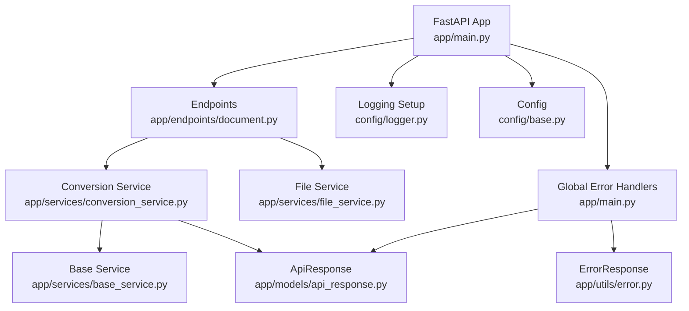
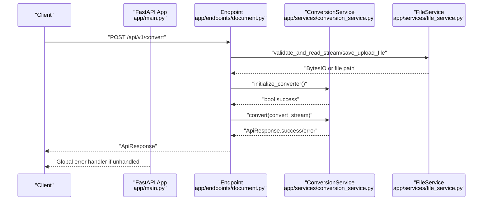
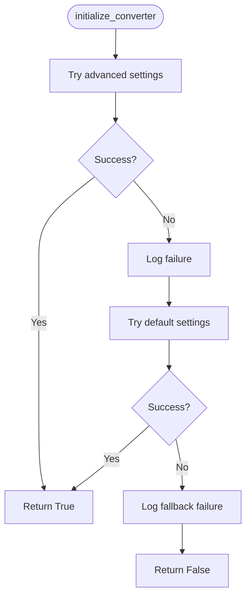
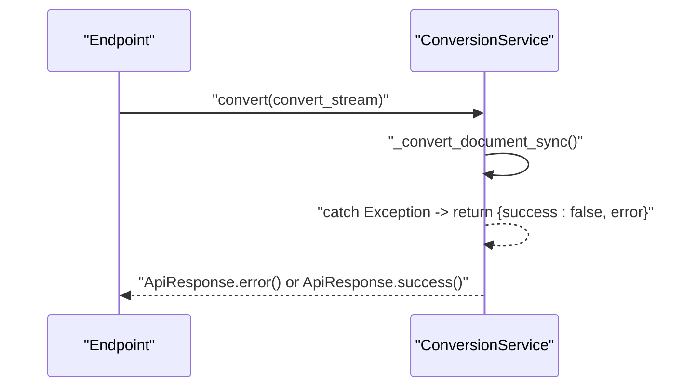
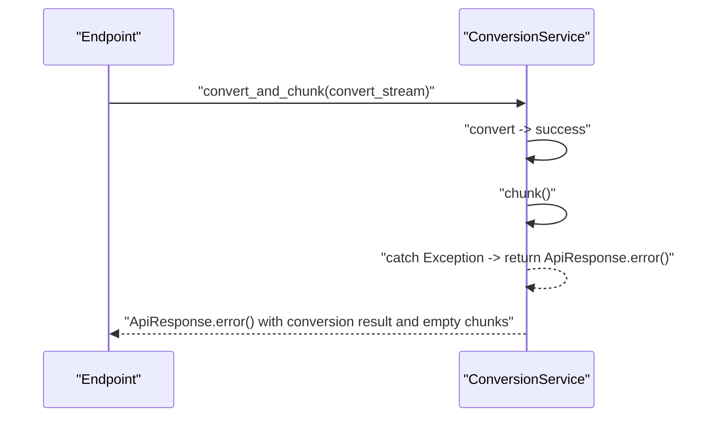
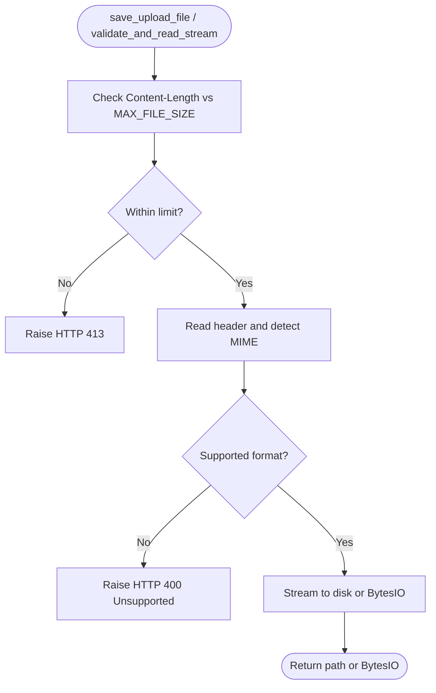
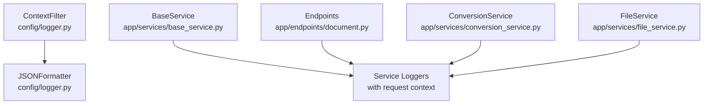
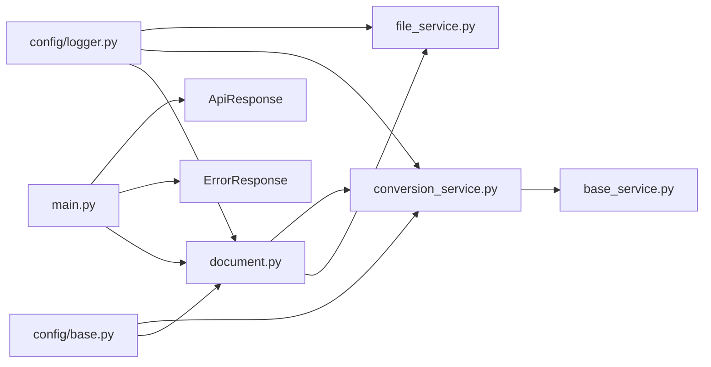

# Error Handling & Recovery

<cite>
**Referenced Files in This Document**
- [app/main.py](file://app/main.py)
- [app/endpoints/document.py](file://app/endpoints/document.py)
- [app/services/conversion_service.py](file://app/services/conversion_service.py)
- [app/services/file_service.py](file://app/services/file_service.py)
- [app/services/base_service.py](file://app/services/base_service.py)
- [app/models/api_response.py](file://app/models/api_response.py)
- [app/models/error_model.py](file://app/models/error_model.py)
- [app/utils/error.py](file://app/utils/error.py)
- [config/base.py](file://config/base.py)
- [config/logger.py](file://config/logger.py)
</cite>

## Table of Contents
1. [Introduction](#introduction)
2. [Project Structure](#project-structure)
3. [Core Components](#core-components)
4. [Architecture Overview](#architecture-overview)
5. [Detailed Component Analysis](#detailed-component-analysis)
6. [Dependency Analysis](#dependency-analysis)
7. [Performance Considerations](#performance-considerations)
8. [Troubleshooting Guide](#troubleshooting-guide)
9. [Conclusion](#conclusion)

## Introduction
This document explains the error handling and recovery mechanisms in the document processing engine. It covers exception catching, error categorization, graceful degradation, fallback strategies for converter initialization, conversion, and chunking failures, standardized error response formatting, propagation through the conversion pipeline, and logging strategies for debugging and monitoring. It also details specific error scenarios such as unsupported file formats, corrupted documents, OCR processing failures, and resource exhaustion conditions, along with practical examples and recovery workflows.

## Project Structure
The error handling spans several layers:
- Application lifecycle and global error handlers
- Endpoint orchestration with request-scoped logging
- File service for upload validation and streaming
- Conversion service for converter initialization, conversion, and chunking
- Shared logging and configuration for environment-aware behavior

**Diagram sources**
- [app/main.py:133-159](file://app/main.py#L133-L159)
- [app/endpoints/document.py:101-230](file://app/endpoints/document.py#L101-L230)
- [app/services/conversion_service.py:89-478](file://app/services/conversion_service.py#L89-L478)
- [app/services/file_service.py:23-347](file://app/services/file_service.py#L23-L347)
- [app/services/base_service.py:6-29](file://app/services/base_service.py#L6-L29)
- [app/models/api_response.py:14-193](file://app/models/api_response.py#L14-L193)
- [app/utils/error.py:4-17](file://app/utils/error.py#L4-L17)
- [config/logger.py:50-110](file://config/logger.py#L50-L110)
- [config/base.py:9-57](file://config/base.py#L9-L57)

**Section sources**
- [app/main.py:49-159](file://app/main.py#L49-L159)
- [app/endpoints/document.py:1-353](file://app/endpoints/document.py#L1-L353)
- [app/services/conversion_service.py:1-478](file://app/services/conversion_service.py#L1-L478)
- [app/services/file_service.py:1-347](file://app/services/file_service.py#L1-L347)
- [app/services/base_service.py:1-29](file://app/services/base_service.py#L1-L29)
- [app/models/api_response.py:1-193](file://app/models/api_response.py#L1-L193)
- [app/models/error_model.py:1-13](file://app/models/error_model.py#L1-L13)
- [app/utils/error.py:1-17](file://app/utils/error.py#L1-L17)
- [config/base.py:1-57](file://config/base.py#L1-L57)
- [config/logger.py:1-110](file://config/logger.py#L1-L110)

## Core Components
- Global error handlers: Catch typed and unhandled exceptions, produce standardized error responses.
- ApiResponse: Standardized success/error response model with validation and factory methods.
- ConversionService: Converter initialization with fallback, conversion execution, and chunking with graceful degradation.
- FileService: File validation, streaming, and resumable upload with explicit HTTP exceptions for unsupported or oversized files.
- Logging: Structured JSON logging with request context and user identity for observability.

Key responsibilities:
- Centralized error formatting via ApiResponse.error()
- Propagation of errors from endpoints to clients
- Graceful degradation: chunking failure returns conversion result with empty chunks
- Fallback initialization for converter when advanced settings fail

**Section sources**
- [app/main.py:133-159](file://app/main.py#L133-L159)
- [app/models/api_response.py:89-122](file://app/models/api_response.py#L89-L122)
- [app/services/conversion_service.py:97-132](file://app/services/conversion_service.py#L97-L132)
- [app/services/conversion_service.py:133-173](file://app/services/conversion_service.py#L133-L173)
- [app/services/conversion_service.py:266-343](file://app/services/conversion_service.py#L266-L343)
- [app/services/conversion_service.py:345-410](file://app/services/conversion_service.py#L345-L410)
- [app/services/conversion_service.py:412-478](file://app/services/conversion_service.py#L412-L478)
- [app/services/file_service.py:35-98](file://app/services/file_service.py#L35-L98)
- [app/services/file_service.py:110-163](file://app/services/file_service.py#L110-L163)
- [config/logger.py:50-110](file://config/logger.py#L50-L110)

## Architecture Overview
The error handling architecture ensures:
- Typed exceptions are handled early with structured responses
- Unhandled exceptions are captured globally and returned as internal server errors
- Conversion and chunking failures are surfaced with clear error messages
- Logging includes request IDs and user context for traceability

**Diagram sources**
- [app/endpoints/document.py:101-160](file://app/endpoints/document.py#L101-L160)
- [app/services/conversion_service.py:97-173](file://app/services/conversion_service.py#L97-L173)
- [app/services/file_service.py:110-163](file://app/services/file_service.py#L110-L163)
- [app/main.py:133-159](file://app/main.py#L133-L159)

## Detailed Component Analysis

### Global Error Handling and Response Formatting
- Custom ErrorResponse is handled with status 400 and ApiResponse.error() including error_type and optional data payload.
- Unhandled exceptions are captured and returned as ApiResponse.error() with error_type INTERNAL_ERROR.
- ApiResponse.error() factory method standardizes error responses with status, error_message, error_type, and optional data.

Practical example references:
- [Custom error handler:135-146](file://app/main.py#L135-L146)
- [Global exception handler:149-159](file://app/main.py#L149-L159)
- [ApiResponse.error() factory:110-122](file://app/models/api_response.py#L110-L122)

**Section sources**
- [app/main.py:133-159](file://app/main.py#L133-L159)
- [app/models/api_response.py:89-122](file://app/models/api_response.py#L89-L122)
- [app/utils/error.py:4-17](file://app/utils/error.py#L4-L17)

### Converter Initialization Failures and Fallbacks
- Converter creation is attempted with user-specified OCR settings and pipeline options.
- On failure, a fallback initializes a minimal DocumentConverter.
- If both attempts fail, initialization returns False and downstream operations fall back to on-demand initialization.

**Diagram sources**
- [app/services/conversion_service.py:97-132](file://app/services/conversion_service.py#L97-L132)

**Section sources**
- [app/services/conversion_service.py:97-132](file://app/services/conversion_service.py#L97-L132)

### Conversion Errors and Graceful Degradation
- Conversion runs in a thread pool executor; synchronous conversion returns a dict with success flag and error message on failure.
- On conversion failure, ApiResponse.error() is returned with the underlying error message.
- On success, ApiResponse.success() wraps content, processing_time, and metadata.

**Diagram sources**
- [app/services/conversion_service.py:133-173](file://app/services/conversion_service.py#L133-L173)
- [app/services/conversion_service.py:219-264](file://app/services/conversion_service.py#L219-L264)

**Section sources**
- [app/services/conversion_service.py:133-173](file://app/services/conversion_service.py#L133-L173)
- [app/services/conversion_service.py:219-264](file://app/services/conversion_service.py#L219-L264)

### Chunking Failures and Recovery
- Chunking initializes a tokenizer and a chunker based on type.
- On chunking failure, the exception is logged and ApiResponse.error() is returned.
- Combined conversion-and-chunk operations continue with conversion result only when chunking fails, returning empty chunks and conversion metadata.

**Diagram sources**
- [app/services/conversion_service.py:345-410](file://app/services/conversion_service.py#L345-L410)
- [app/services/conversion_service.py:412-478](file://app/services/conversion_service.py#L412-L478)

**Section sources**
- [app/services/conversion_service.py:266-343](file://app/services/conversion_service.py#L266-L343)
- [app/services/conversion_service.py:345-410](file://app/services/conversion_service.py#L345-L410)
- [app/services/conversion_service.py:412-478](file://app/services/conversion_service.py#L412-L478)

### Unsupported File Formats and Resource Exhaustion
- FileService validates MIME types using magic bytes and rejects unsupported formats with HTTP 400.
- Size limits are enforced via Content-Length checks and streaming/file reads; oversized files trigger HTTP 413.
- Resumable upload sessions track progress and clamp received_size to total_size; unsupported types at completion cause session failure.

**Diagram sources**
- [app/services/file_service.py:35-98](file://app/services/file_service.py#L35-L98)
- [app/services/file_service.py:110-163](file://app/services/file_service.py#L110-L163)

**Section sources**
- [app/services/file_service.py:35-98](file://app/services/file_service.py#L35-L98)
- [app/services/file_service.py:110-163](file://app/services/file_service.py#L110-L163)

### OCR Processing Failures
- OCR is configured via pipeline options; failures surface as exceptions caught during conversion or chunking.
- The system logs OCR-related errors and returns ApiResponse.error() with the underlying message.
- If OCR initialization fails during converter creation, fallback initialization is attempted.

Note: OCR failures are part of broader conversion errors; the system relies on upstream libraries to raise meaningful exceptions.

**Section sources**
- [app/services/conversion_service.py:28-67](file://app/services/conversion_service.py#L28-L67)
- [app/services/conversion_service.py:97-132](file://app/services/conversion_service.py#L97-L132)
- [app/services/conversion_service.py:258-264](file://app/services/conversion_service.py#L258-L264)

### Logging Strategies for Debugging and Monitoring
- ContextFilter injects request_id, user_id, and username into log records.
- JSONFormatter emits structured logs in production; development uses colored console logs.
- All services inherit request-scoped loggers via BaseService, ensuring consistent context propagation.
- Health endpoint reports converter status for monitoring.

**Diagram sources**
- [config/logger.py:8-48](file://config/logger.py#L8-L48)
- [config/logger.py:50-110](file://config/logger.py#L50-L110)
- [app/services/base_service.py:11-29](file://app/services/base_service.py#L11-L29)
- [app/endpoints/document.py:116-160](file://app/endpoints/document.py#L116-L160)
- [app/services/conversion_service.py:133-173](file://app/services/conversion_service.py#L133-L173)
- [app/services/file_service.py:35-98](file://app/services/file_service.py#L35-L98)

**Section sources**
- [config/logger.py:50-110](file://config/logger.py#L50-L110)
- [app/services/base_service.py:6-29](file://app/services/base_service.py#L6-L29)
- [app/endpoints/document.py:116-160](file://app/endpoints/document.py#L116-L160)
- [app/services/conversion_service.py:133-173](file://app/services/conversion_service.py#L133-L173)
- [app/services/file_service.py:35-98](file://app/services/file_service.py#L35-L98)

## Dependency Analysis
- Endpoints depend on FileService for validation and ConversionService for processing.
- ConversionService depends on BaseService for logging and uses a shared ThreadPoolExecutor.
- Global error handlers depend on ApiResponse and ErrorResponse for consistent error responses.
- Configuration drives behavior such as MAX_FILE_SIZE, MAX_STREAM_SIZE, THREAD_POOL_SIZE, and OCR languages.

**Diagram sources**
- [app/endpoints/document.py:101-230](file://app/endpoints/document.py#L101-L230)
- [app/services/conversion_service.py:89-478](file://app/services/conversion_service.py#L89-L478)
- [app/services/file_service.py:23-347](file://app/services/file_service.py#L23-L347)
- [app/services/base_service.py:6-29](file://app/services/base_service.py#L6-L29)
- [app/main.py:133-159](file://app/main.py#L133-L159)
- [app/models/api_response.py:14-193](file://app/models/api_response.py#L14-L193)
- [app/utils/error.py:4-17](file://app/utils/error.py#L4-L17)
- [config/base.py:9-57](file://config/base.py#L9-L57)
- [config/logger.py:50-110](file://config/logger.py#L50-L110)

**Section sources**
- [app/endpoints/document.py:101-230](file://app/endpoints/document.py#L101-L230)
- [app/services/conversion_service.py:89-478](file://app/services/conversion_service.py#L89-L478)
- [app/services/file_service.py:23-347](file://app/services/file_service.py#L23-L347)
- [app/services/base_service.py:6-29](file://app/services/base_service.py#L6-L29)
- [app/main.py:133-159](file://app/main.py#L133-L159)
- [app/models/api_response.py:14-193](file://app/models/api_response.py#L14-L193)
- [app/utils/error.py:4-17](file://app/utils/error.py#L4-L17)
- [config/base.py:9-57](file://config/base.py#L9-L57)
- [config/logger.py:50-110](file://config/logger.py#L50-L110)

## Performance Considerations
- Thread pool sizing is configurable and used for CPU-bound conversion tasks; ensure THREAD_POOL_SIZE and CONVERTER_NUM_THREADS align with hardware resources.
- Streaming thresholds (MAX_STREAM_SIZE) reduce disk I/O for small files; large files are written to disk to avoid memory pressure.
- Chunking uses tokenizers and chunkers; failures are logged and gracefully degraded to conversion-only results.

[No sources needed since this section provides general guidance]

## Troubleshooting Guide
Common scenarios and recovery steps:
- Unsupported file format
  - Symptom: HTTP 400 with unsupported MIME type.
  - Action: Verify SUPPORTED_FORMATS and file headers; retry with supported types.
  - Reference: [FileService validation:48-64](file://app/services/file_service.py#L48-L64), [FileService streaming validation:126-138](file://app/services/file_service.py#L126-L138)

- File too large
  - Symptom: HTTP 413 during upload or streaming.
  - Action: Reduce file size or use resumable upload; adjust MAX_FILE_SIZE if appropriate.
  - Reference: [FileService size enforcement:40-46](file://app/services/file_service.py#L40-L46), [Streaming size enforcement:114-120](file://app/services/file_service.py#L114-L120)

- Converter initialization failure
  - Symptom: Converter not ready; fallback initialization attempted.
  - Action: Retry request; check OCR languages and pipeline options; monitor logs for detailed errors.
  - Reference: [Converter fallback:107-131](file://app/services/conversion_service.py#L107-L131)

- Conversion error
  - Symptom: ApiResponse.error() with conversion failure.
  - Action: Inspect logs for underlying exception; retry with corrected OCR settings or file.
  - Reference: [Conversion error handling:169-173](file://app/services/conversion_service.py#L169-L173), [Sync conversion error path:258-264](file://app/services/conversion_service.py#L258-L264)

- Chunking error
  - Symptom: Chunking fails but conversion succeeds.
  - Action: Retry chunking with different chunk_type or max_tokens; system returns conversion result with empty chunks.
  - Reference: [Chunking error handling:339-343](file://app/services/conversion_service.py#L339-L343), [Graceful degradation:384-398](file://app/services/conversion_service.py#L384-L398)

- OCR processing failures
  - Symptom: OCR-related exceptions during conversion.
  - Action: Adjust OCR languages or disable OCR; check external OCR backend availability.
  - Reference: [OCR pipeline options:40-47](file://app/services/conversion_service.py#L40-L47), [Fallback initialization:119-131](file://app/services/conversion_service.py#L119-L131)

- Resource exhaustion
  - Symptom: Out-of-memory or thread pool saturation.
  - Action: Scale THREAD_POOL_SIZE and CONVERTER_NUM_THREADS; reduce max_tokens or batch sizes.
  - Reference: [Thread pool configuration:27-29](file://config/base.py#L27-L29), [Executor usage:73-95](file://app/services/conversion_service.py#L73-L95)

Monitoring and alerting:
- Use JSON logs in production for centralized log aggregation.
- Track error_type and error_message from ApiResponse.error() for alerting.
- Monitor health endpoint for converter_status and environment.

**Section sources**
- [app/services/file_service.py:35-98](file://app/services/file_service.py#L35-L98)
- [app/services/file_service.py:110-163](file://app/services/file_service.py#L110-L163)
- [app/services/conversion_service.py:97-132](file://app/services/conversion_service.py#L97-L132)
- [app/services/conversion_service.py:133-173](file://app/services/conversion_service.py#L133-L173)
- [app/services/conversion_service.py:258-264](file://app/services/conversion_service.py#L258-L264)
- [app/services/conversion_service.py:266-343](file://app/services/conversion_service.py#L266-L343)
- [app/services/conversion_service.py:345-410](file://app/services/conversion_service.py#L345-L410)
- [config/base.py:27-29](file://config/base.py#L27-L29)
- [config/logger.py:50-110](file://config/logger.py#L50-L110)

## Conclusion
The document processing engine implements robust error handling with:
- Consistent error response formatting via ApiResponse.error()
- Early handling of typed exceptions and graceful degradation
- Fallback mechanisms for converter initialization and chunking
- Comprehensive logging with request context for debugging and monitoring
- Clear pathways for unsupported formats, oversized files, OCR failures, and resource constraints

These patterns ensure resilient operations and actionable diagnostics across the conversion pipeline.