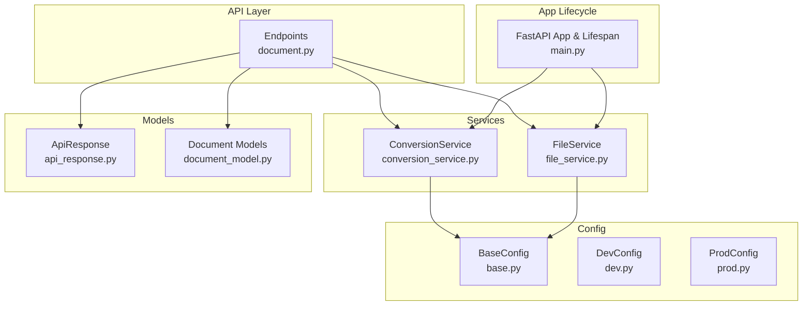
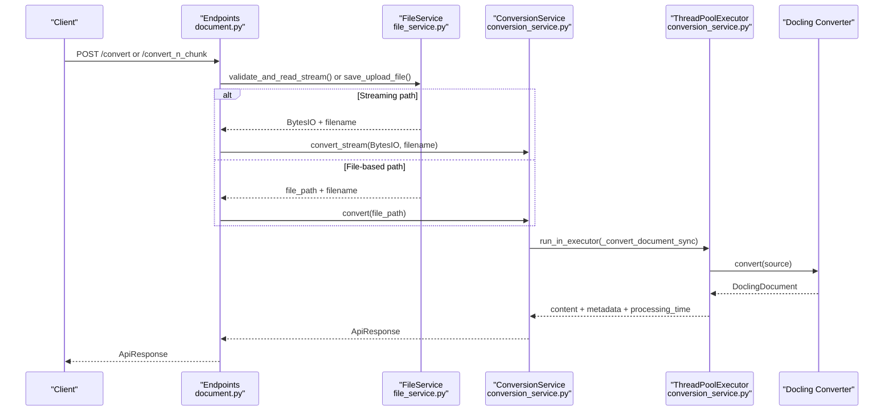
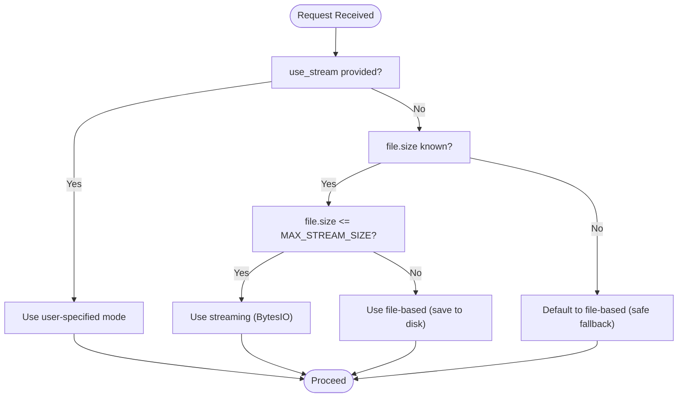
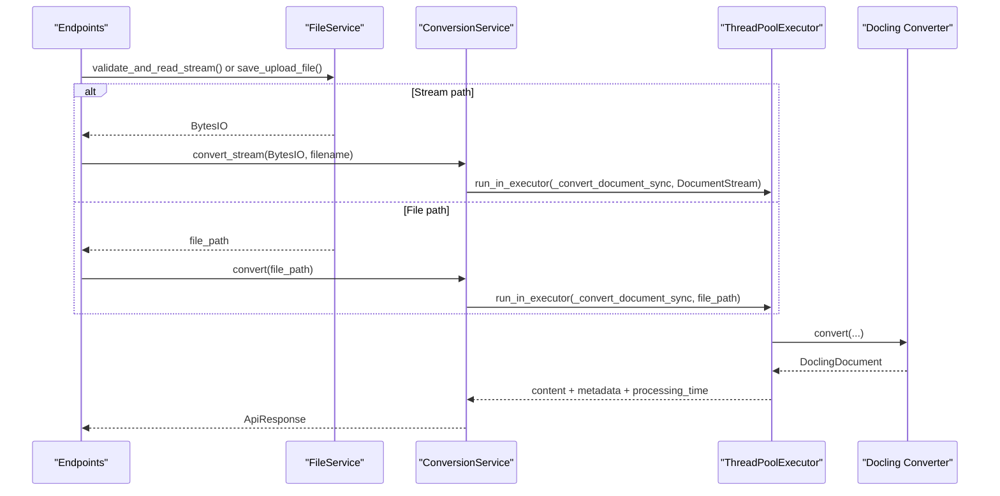
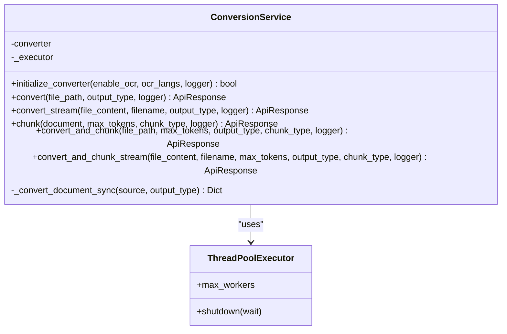
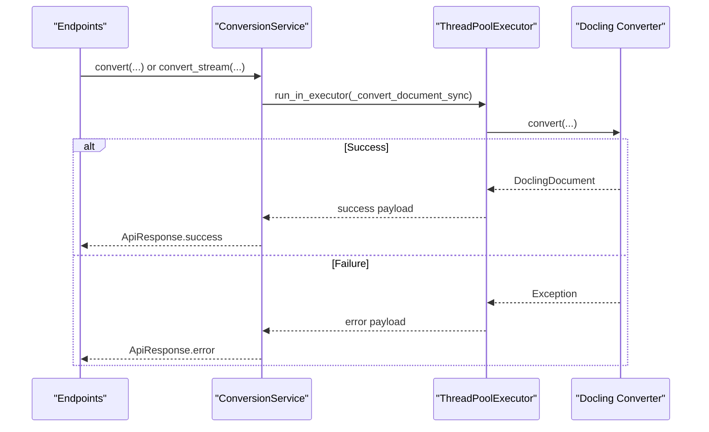
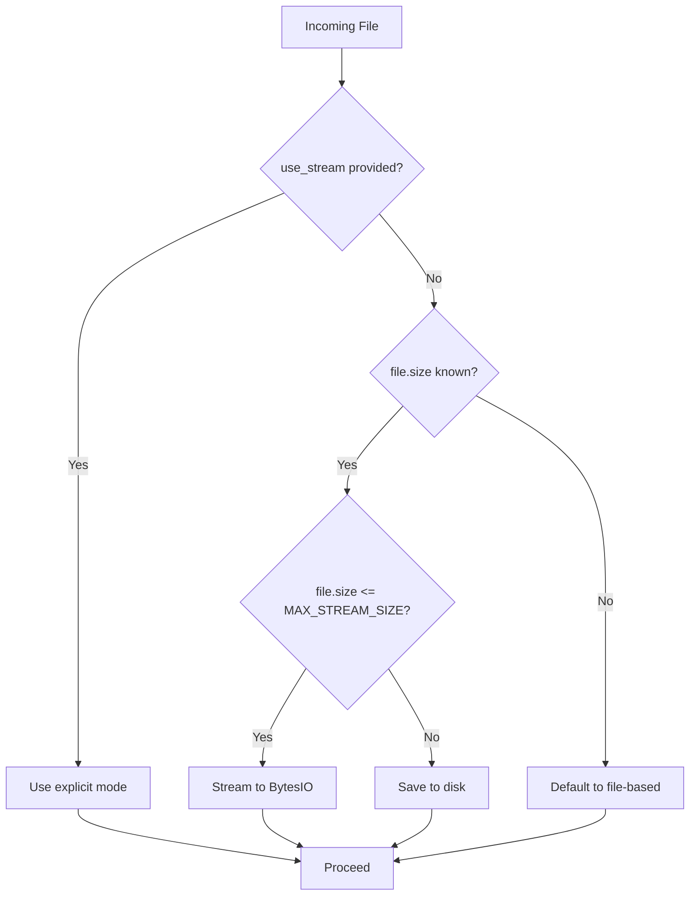
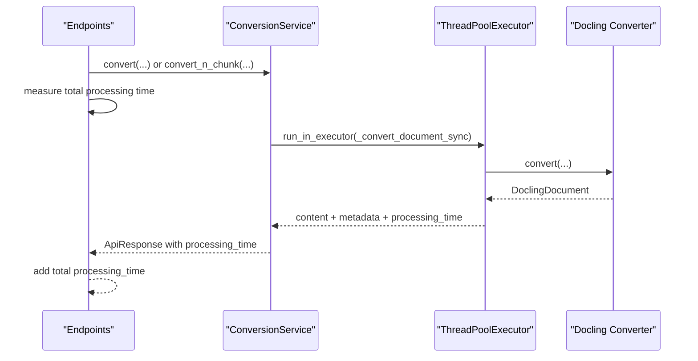
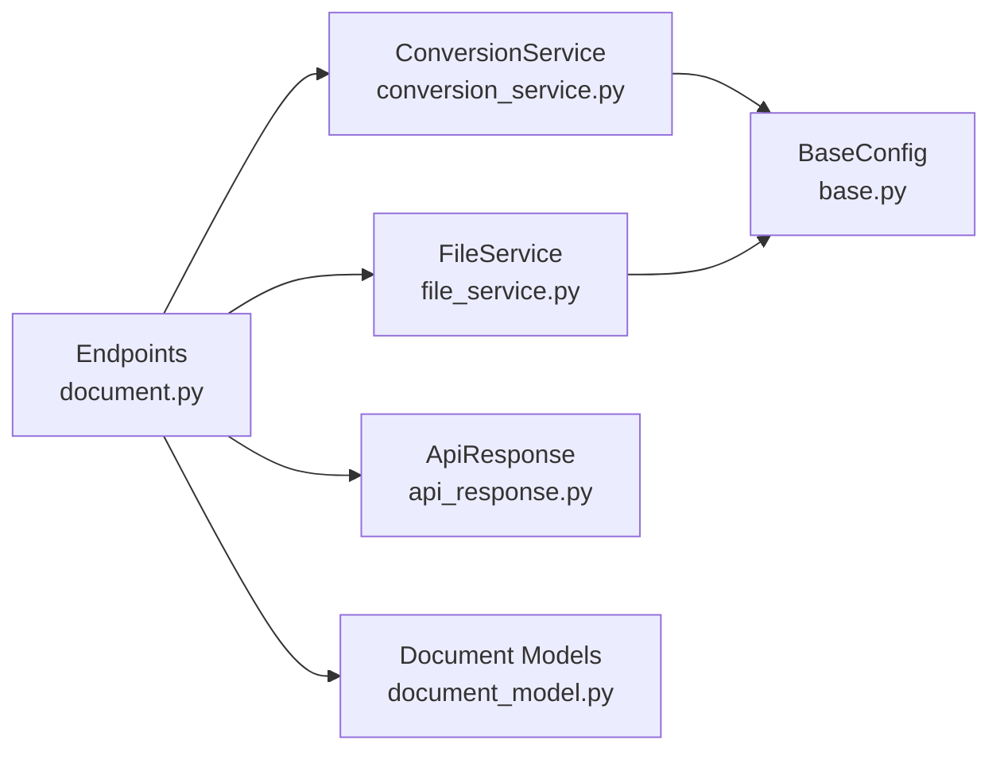

# Processing Strategies

<cite>
**Referenced Files in This Document**
- [conversion_service.py](file://app/services/conversion_service.py)
- [document.py](file://app/endpoints/document.py)
- [file_service.py](file://app/services/file_service.py)
- [base.py](file://config/base.py)
- [dev.py](file://config/dev.py)
- [prod.py](file://config/prod.py)
- [main.py](file://app/main.py)
- [api_response.py](file://app/models/api_response.py)
- [document_model.py](file://app/models/document_model.py)
- [context.py](file://config/context.py)
- [error.py](file://app/utils/error.py)
</cite>

## Table of Contents
1. [Introduction](#introduction)
2. [Project Structure](#project-structure)
3. [Core Components](#core-components)
4. [Architecture Overview](#architecture-overview)
5. [Detailed Component Analysis](#detailed-component-analysis)
6. [Dependency Analysis](#dependency-analysis)
7. [Performance Considerations](#performance-considerations)
8. [Troubleshooting Guide](#troubleshooting-guide)
9. [Conclusion](#conclusion)
10. [Appendices](#appendices)

## Introduction
This document explains the document processing strategies implemented in the system, focusing on streaming versus file-based processing, memory optimization, CPU-bound operation handling, and async execution patterns. It covers how the system decides between in-memory streaming and disk-based processing, how thread pools are configured and used, and how processing time, metadata, and performance monitoring are handled. Practical guidance is included for choosing the right processing method, optimizing resource usage, and integrating with the broader conversion workflow.

## Project Structure
The processing pipeline spans endpoints, services, configuration, and models. Key areas:
- Endpoints orchestrate requests and decide between streaming and file-based processing.
- Services encapsulate conversion, chunking, and file management.
- Configuration defines thresholds and limits for memory/disk usage and threading.
- Models define request/response shapes and enums for processing options.

**Diagram sources**
- [document.py:1-353](file://app/endpoints/document.py#L1-L353)
- [conversion_service.py:1-478](file://app/services/conversion_service.py#L1-L478)
- [file_service.py:1-347](file://app/services/file_service.py#L1-L347)
- [base.py:1-57](file://config/base.py#L1-L57)
- [dev.py:1-12](file://config/dev.py#L1-L12)
- [prod.py:1-6](file://config/prod.py#L1-L6)
- [main.py:1-160](file://app/main.py#L1-L160)
- [api_response.py:1-193](file://app/models/api_response.py#L1-L193)
- [document_model.py:1-74](file://app/models/document_model.py#L1-L74)

**Section sources**
- [document.py:1-353](file://app/endpoints/document.py#L1-L353)
- [conversion_service.py:1-478](file://app/services/conversion_service.py#L1-L478)
- [file_service.py:1-347](file://app/services/file_service.py#L1-L347)
- [base.py:1-57](file://config/base.py#L1-L57)
- [main.py:1-160](file://app/main.py#L1-L160)

## Core Components
- Streaming vs file-based processing decision logic in endpoints.
- ConversionService orchestrating Docling conversion and chunking with thread pool execution.
- FileService validating, streaming, and managing temporary files and resumable uploads.
- Configuration-driven thresholds for memory/disk usage and thread sizing.
- ApiResponse and model enums for standardized responses and processing options.

Key responsibilities:
- Endpoints: parse request parameters, decide stream vs file, prepare source, and call services.
- ConversionService: initialize converters, run CPU-bound tasks off the event loop, export content, and measure processing time.
- FileService: validate file types/sizes, stream into memory buffers, persist to disk for large files, manage resumable sessions.
- Config: define limits and thread counts.
- Models: define output formats and chunking strategies.

**Section sources**
- [document.py:27-94](file://app/endpoints/document.py#L27-L94)
- [conversion_service.py:89-478](file://app/services/conversion_service.py#L89-L478)
- [file_service.py:23-347](file://app/services/file_service.py#L23-L347)
- [base.py:17-30](file://config/base.py#L17-L30)
- [document_model.py:9-22](file://app/models/document_model.py#L9-L22)
- [api_response.py:14-147](file://app/models/api_response.py#L14-L147)

## Architecture Overview
The system uses an async-first design with explicit offloading of CPU-bound operations to a shared thread pool. Endpoints accept either direct uploads or resumable uploads, then select streaming or file-based processing based on size thresholds. ConversionService initializes a Docling converter and performs conversion and chunking asynchronously. FileService validates and streams content into memory or writes to disk as needed.

**Diagram sources**
- [document.py:101-160](file://app/endpoints/document.py#L101-L160)
- [file_service.py:110-163](file://app/services/file_service.py#L110-L163)
- [conversion_service.py:175-264](file://app/services/conversion_service.py#L175-L264)
- [conversion_service.py:73-86](file://app/services/conversion_service.py#L73-L86)

## Detailed Component Analysis

### Streaming vs File-Based Processing Decision
The decision logic prioritizes explicit user choice, then auto-detection based on file size and a configurable threshold.

- Explicit override: If the client passes a flag, it is honored.
- Auto-detection: If unknown, files smaller than the configured threshold are streamed; larger ones are saved to disk.
- Resumable uploads: When an upload_id is provided, the system retrieves the stored file path and proceeds file-based.

Practical guidance:
- Prefer streaming for small files (< threshold) to minimize disk I/O and reduce latency.
- Prefer file-based for large files (> threshold) to avoid excessive memory usage.
- Always honor explicit user preference when provided.

**Section sources**
- [document.py:27-41](file://app/endpoints/document.py#L27-L41)
- [document.py:43-94](file://app/endpoints/document.py#L43-L94)
- [base.py:24](file://config/base.py#L24)

### DocumentStream vs File Path Processing Methods
- DocumentStream processing:
  - Uses an in-memory BytesIO buffer with a filename label.
  - Avoids writing to disk, reducing I/O overhead.
  - Suitable for small-to-medium files within memory limits.
- File path processing:
  - Saves the uploaded file to disk and passes the path to the converter.
  - Suitable for large files exceeding memory constraints.
  - Cleans up temporary files via background tasks.

**Diagram sources**
- [document.py:101-160](file://app/endpoints/document.py#L101-L160)
- [file_service.py:110-163](file://app/services/file_service.py#L110-L163)
- [conversion_service.py:175-264](file://app/services/conversion_service.py#L175-L264)

**Section sources**
- [conversion_service.py:175-217](file://app/services/conversion_service.py#L175-L217)
- [conversion_service.py:133-174](file://app/services/conversion_service.py#L133-L174)
- [file_service.py:110-163](file://app/services/file_service.py#L110-L163)

### Thread Pool Executor Configuration and CPU-bound Operation Handling
- Shared thread pool:
  - Created once and reused across requests.
  - Size controlled by configuration.
  - Initialized at app startup and shut down gracefully on exit.
- Offloading CPU-bound work:
  - Conversion and chunking are executed via run_in_executor to avoid blocking the event loop.
  - Initialization of the Docling converter is also offloaded to prevent startup delays.

**Diagram sources**
- [conversion_service.py:73-86](file://app/services/conversion_service.py#L73-L86)
- [conversion_service.py:89-132](file://app/services/conversion_service.py#L89-L132)
- [conversion_service.py:219-264](file://app/services/conversion_service.py#L219-L264)

**Section sources**
- [conversion_service.py:70-86](file://app/services/conversion_service.py#L70-L86)
- [conversion_service.py:97-132](file://app/services/conversion_service.py#L97-L132)
- [main.py:49-70](file://app/main.py#L49-L70)
- [base.py:28-29](file://config/base.py#L28-L29)

### Async Execution Patterns and Error Handling
- Async endpoints:
  - Endpoints are async and call async service methods.
  - CPU-bound tasks are executed via run_in_executor to remain responsive.
- Error handling:
  - Endpoints catch exceptions and return standardized ApiResponse errors.
  - ConversionService wraps synchronous conversion in try/catch and returns structured errors.
  - FileService validates types/sizes and raises HTTPException for invalid inputs.
  - Global exception handlers convert uncaught errors to ApiResponse.

**Diagram sources**
- [document.py:101-160](file://app/endpoints/document.py#L101-L160)
- [conversion_service.py:133-174](file://app/services/conversion_service.py#L133-L174)
- [conversion_service.py:175-217](file://app/services/conversion_service.py#L175-L217)
- [conversion_service.py:219-264](file://app/services/conversion_service.py#L219-L264)

**Section sources**
- [document.py:101-160](file://app/endpoints/document.py#L101-L160)
- [conversion_service.py:133-174](file://app/services/conversion_service.py#L133-L174)
- [conversion_service.py:175-217](file://app/services/conversion_service.py#L175-L217)
- [conversion_service.py:219-264](file://app/services/conversion_service.py#L219-L264)
- [api_response.py:14-147](file://app/models/api_response.py#L14-L147)
- [error.py:4-17](file://app/utils/error.py#L4-L17)

### Memory Optimization Strategies
- In-memory processing for small files:
  - Streaming uses BytesIO to avoid disk writes.
  - Validation checks file size against MAX_FILE_SIZE and MAX_STREAM_SIZE.
- Disk-based fallback for large files:
  - Files exceeding thresholds are saved to disk.
  - Temporary files are cleaned up via background tasks.
- Resource management:
  - Shared thread pool prevents thread proliferation.
  - Pre-warming of the converter reduces cold-start latency.
  - Resumable uploads minimize repeated transfers and disk usage.

**Diagram sources**
- [document.py:27-41](file://app/endpoints/document.py#L27-L41)
- [file_service.py:110-163](file://app/services/file_service.py#L110-L163)
- [base.py:24](file://config/base.py#L24)

**Section sources**
- [document.py:27-41](file://app/endpoints/document.py#L27-L41)
- [file_service.py:35-98](file://app/services/file_service.py#L35-L98)
- [file_service.py:110-163](file://app/services/file_service.py#L110-L163)
- [base.py:24](file://config/base.py#L24)

### Processing Time Measurement, Metadata Extraction, and Performance Monitoring
- Processing time:
  - Measured around the CPU-bound conversion step and aggregated in endpoints.
  - Returned in ApiResponse for both conversion and chunking operations.
- Metadata:
  - Basic metadata includes page count and file type derived from the source.
- Performance monitoring:
  - Logging includes processing_time and metadata for observability.
  - Health endpoint reports converter status.

**Diagram sources**
- [document.py:113-152](file://app/endpoints/document.py#L113-L152)
- [document.py:177-230](file://app/endpoints/document.py#L177-L230)
- [conversion_service.py:219-264](file://app/services/conversion_service.py#L219-L264)

**Section sources**
- [conversion_service.py:219-264](file://app/services/conversion_service.py#L219-L264)
- [document.py:113-152](file://app/endpoints/document.py#L113-L152)
- [document.py:177-230](file://app/endpoints/document.py#L177-L230)

### Practical Examples and Method Selection
- Small PDF under 50 MB:
  - Use streaming to avoid disk writes.
  - Endpoint auto-selects streaming; user can force via use_stream.
- Large PDF over 50 MB:
  - Use file-based processing to prevent memory pressure.
  - Endpoint auto-selects file-based; user can override.
- Resumable upload:
  - Use upload_id to reuse previously uploaded file; file-based processing is enforced.
- Chunking:
  - Choose chunk_type (page, hierarchical, hybrid) and max_tokens to balance chunk size and token limits.

**Section sources**
- [document.py:27-41](file://app/endpoints/document.py#L27-L41)
- [document.py:162-230](file://app/endpoints/document.py#L162-L230)
- [document_model.py:17-22](file://app/models/document_model.py#L17-L22)
- [base.py:24](file://config/base.py#L24)

### Graceful Degradation and Integration with Conversion Workflow
- Fallback initialization:
  - If advanced converter initialization fails, a default converter is used.
- Chunking failure handling:
  - If chunking fails, conversion results are still returned with warning.
- Cleanup:
  - Temporary files are removed via background tasks.
  - Shared thread pool is shut down on app termination.

**Section sources**
- [conversion_service.py:97-132](file://app/services/conversion_service.py#L97-L132)
- [conversion_service.py:345-410](file://app/services/conversion_service.py#L345-L410)
- [conversion_service.py:412-478](file://app/services/conversion_service.py#L412-L478)
- [main.py:68-70](file://app/main.py#L68-L70)

## Dependency Analysis
- Endpoints depend on FileService for preparation and ConversionService for processing.
- ConversionService depends on configuration for thresholds and thread counts.
- FileService depends on configuration for upload directory and limits.
- ApiResponse and models define the contract for responses and processing options.

**Diagram sources**
- [document.py:1-353](file://app/endpoints/document.py#L1-L353)
- [conversion_service.py:1-478](file://app/services/conversion_service.py#L1-L478)
- [file_service.py:1-347](file://app/services/file_service.py#L1-L347)
- [base.py:1-57](file://config/base.py#L1-L57)
- [api_response.py:1-193](file://app/models/api_response.py#L1-L193)
- [document_model.py:1-74](file://app/models/document_model.py#L1-L74)

**Section sources**
- [document.py:1-353](file://app/endpoints/document.py#L1-L353)
- [conversion_service.py:1-478](file://app/services/conversion_service.py#L1-L478)
- [file_service.py:1-347](file://app/services/file_service.py#L1-L347)
- [base.py:1-57](file://config/base.py#L1-L57)

## Performance Considerations
- Use streaming for small files to reduce disk I/O and latency.
- Use file-based processing for large files to avoid memory pressure.
- Tune THREAD_POOL_SIZE and CONVERTER_NUM_THREADS according to CPU cores and workload.
- Monitor processing_time and metadata to identify bottlenecks.
- Leverage resumable uploads to improve reliability and reduce bandwidth.

[No sources needed since this section provides general guidance]

## Troubleshooting Guide
Common issues and resolutions:
- File too large:
  - Endpoint returns 413; ensure file size respects MAX_FILE_SIZE and consider streaming threshold.
- Unsupported file type:
  - FileService validates MIME type; adjust SUPPORTED_FORMATS if needed.
- Conversion failures:
  - ConversionService logs and returns error; check logs for details.
- Chunking failures:
  - Chunking errors are logged; conversion results may still be returned with warning.
- Health check:
  - Health endpoint reports converter status; investigate initialization failures.

**Section sources**
- [file_service.py:35-98](file://app/services/file_service.py#L35-L98)
- [file_service.py:110-163](file://app/services/file_service.py#L110-L163)
- [conversion_service.py:219-264](file://app/services/conversion_service.py#L219-L264)
- [conversion_service.py:345-410](file://app/services/conversion_service.py#L345-L410)
- [main.py:116-131](file://app/main.py#L116-L131)

## Conclusion
The system balances streaming and file-based processing using explicit user preferences and size-based auto-detection. CPU-bound operations are offloaded to a shared thread pool to maintain responsiveness. Memory optimization is achieved through streaming for small files and disk-based fallback for large files, with robust cleanup and resumable upload support. Processing time, metadata, and standardized responses enable effective monitoring and troubleshooting.

[No sources needed since this section summarizes without analyzing specific files]

## Appendices

### Configuration Reference
- Thresholds and limits:
  - MAX_FILE_SIZE: maximum allowed file size.
  - MAX_STREAM_SIZE: threshold for auto-streaming.
  - UPLOAD_DIR: directory for temporary files.
- Threading:
  - THREAD_POOL_SIZE: size of the shared thread pool.
  - CONVERTER_NUM_THREADS: threads used by the Docling converter accelerator.
- OCR and chunking:
  - DEFAULT_OCR_LANGS: default OCR languages.
  - MAX_TOKENS: default tokens per chunk.
  - DEFAULT_CHUNK_TYPE: default chunking strategy.

**Section sources**
- [base.py:17-30](file://config/base.py#L17-L30)

### Enums and Models
- OutputType: plaintext, markdown, html, chunking.
- ChunkType: hierarchical, hybrid, page.
- ApiResponse: standardized success/error responses with timestamps.

**Section sources**
- [document_model.py:9-22](file://app/models/document_model.py#L9-L22)
- [api_response.py:14-147](file://app/models/api_response.py#L14-L147)