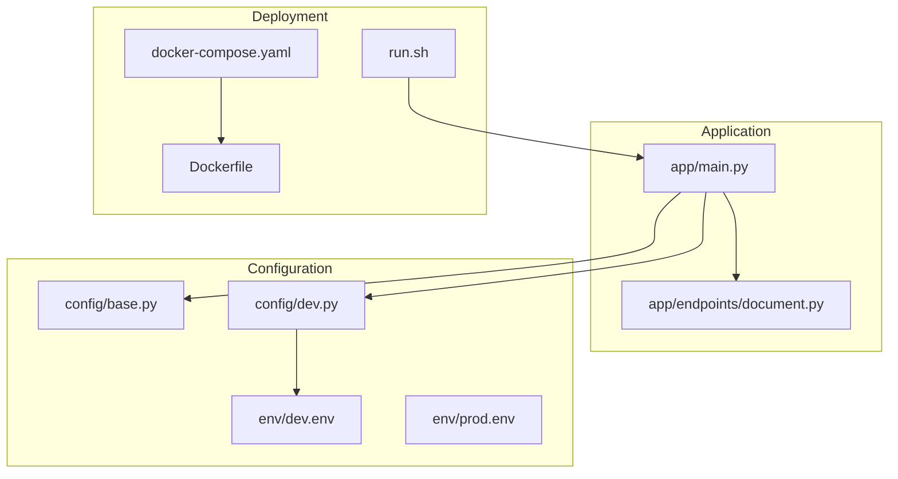
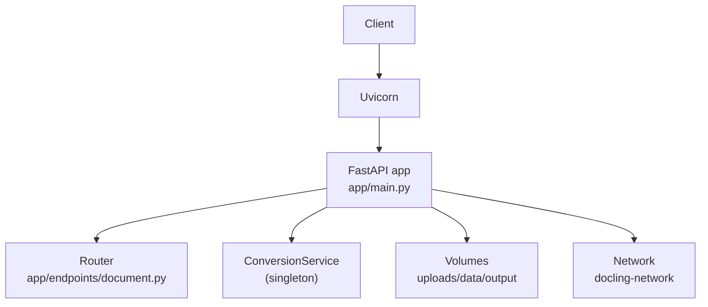
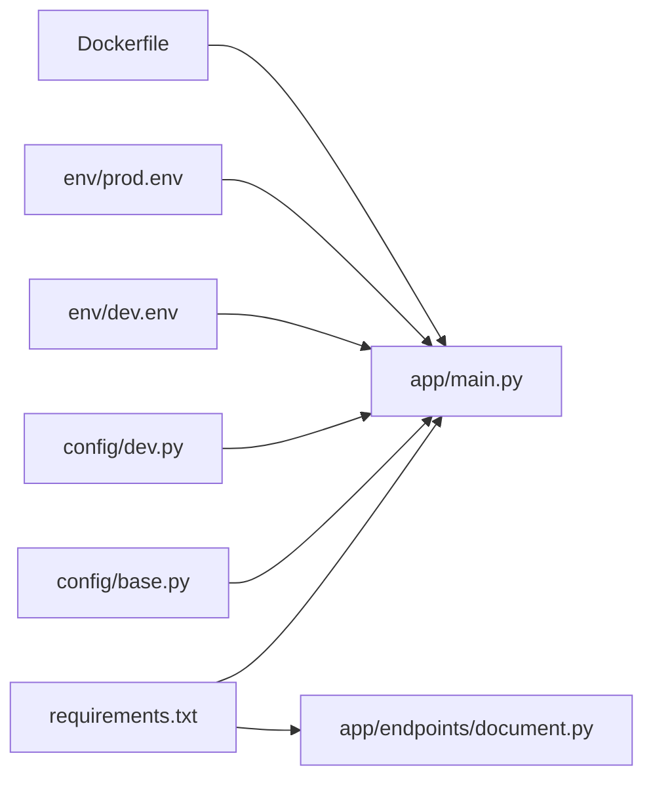

# Getting Started

<cite>
**Referenced Files in This Document**
- [README.md](file://README.md)
- [requirements.txt](file://requirements.txt)
- [run.sh](file://run.sh)
- [docker-compose.yaml](file://docker-compose.yaml)
- [Dockerfile](file://Dockerfile)
- [app/main.py](file://app/main.py)
- [app/endpoints/document.py](file://app/endpoints/document.py)
- [config/base.py](file://config/base.py)
- [config/dev.py](file://config/dev.py)
- [env/dev.env](file://env/dev.env)
- [env/prod.env](file://env/prod.env)
- [verification_test.py](file://verification_test.py)
</cite>

## Table of Contents
1. [Introduction](#introduction)
2. [Project Structure](#project-structure)
3. [Core Components](#core-components)
4. [Architecture Overview](#architecture-overview)
5. [Detailed Component Analysis](#detailed-component-analysis)
6. [Dependency Analysis](#dependency-analysis)
7. [Performance Considerations](#performance-considerations)
8. [Troubleshooting Guide](#troubleshooting-guide)
9. [Conclusion](#conclusion)
10. [Appendices](#appendices)

## Introduction
This guide helps you quickly install, configure, and run the Docling API service locally or via Docker. It covers:
- Prerequisites and environment setup
- Manual installation and local development
- Docker-based deployment
- First API calls to test conversion endpoints
- Quick verification steps
- Common setup issues and resolutions

## Project Structure
The repository is organized around a FastAPI application with modular components:
- Application entrypoint and lifecycle management
- Document processing endpoints
- Configuration and environment-specific settings
- Docker packaging and orchestration

**Diagram sources**
- [app/main.py:1-160](file://app/main.py#L1-L160)
- [app/endpoints/document.py:1-353](file://app/endpoints/document.py#L1-L353)
- [config/base.py:1-57](file://config/base.py#L1-L57)
- [config/dev.py:1-12](file://config/dev.py#L1-L12)
- [env/dev.env:1-14](file://env/dev.env#L1-L14)
- [env/prod.env:1-14](file://env/prod.env#L1-L14)
- [run.sh:1-17](file://run.sh#L1-L17)
- [docker-compose.yaml:1-42](file://docker-compose.yaml#L1-L42)
- [Dockerfile:1-94](file://Dockerfile#L1-L94)

**Section sources**
- [app/main.py:1-160](file://app/main.py#L1-L160)
- [app/endpoints/document.py:1-353](file://app/endpoints/document.py#L1-L353)
- [config/base.py:1-57](file://config/base.py#L1-L57)
- [config/dev.py:1-12](file://config/dev.py#L1-L12)
- [env/dev.env:1-14](file://env/dev.env#L1-L14)
- [env/prod.env:1-14](file://env/prod.env#L1-L14)
- [run.sh:1-17](file://run.sh#L1-L17)
- [docker-compose.yaml:1-42](file://docker-compose.yaml#L1-L42)
- [Dockerfile:1-94](file://Dockerfile#L1-L94)

## Core Components
- FastAPI application with lifecycle hooks, middleware, and routing
- Document processing endpoints for conversion and chunking
- Environment-aware configuration with defaults and overrides
- Dockerized runtime with GPU support and health checks

Key capabilities:
- Root and health endpoints for service availability
- Document conversion endpoints supporting streaming and resumable uploads
- Chunked conversion with configurable chunk sizes and OCR languages
- CORS and logging middleware
- Environment-specific settings for development and production

**Section sources**
- [app/main.py:73-160](file://app/main.py#L73-L160)
- [app/endpoints/document.py:101-231](file://app/endpoints/document.py#L101-L231)
- [config/base.py:9-57](file://config/base.py#L9-L57)
- [config/dev.py:3-12](file://config/dev.py#L3-L12)
- [env/dev.env:1-14](file://env/dev.env#L1-L14)
- [env/prod.env:1-14](file://env/prod.env#L1-L14)

## Architecture Overview
The service exposes HTTP endpoints via Uvicorn. It initializes a shared conversion service at startup and routes requests to document processing endpoints. Docker Compose provisions the service with GPU access and mounts persistent volumes for uploads, data, and output.

**Diagram sources**
- [app/main.py:49-81](file://app/main.py#L49-L81)
- [app/endpoints/document.py:15-19](file://app/endpoints/document.py#L15-L19)
- [docker-compose.yaml:3-38](file://docker-compose.yaml#L3-L38)

**Section sources**
- [app/main.py:49-81](file://app/main.py#L49-L81)
- [app/endpoints/document.py:15-19](file://app/endpoints/document.py#L15-L19)
- [docker-compose.yaml:3-38](file://docker-compose.yaml#L3-L38)

## Detailed Component Analysis

### Local Development Setup (Manual Installation)
Follow these steps to run the service locally using a virtual environment and the provided startup script.

- Prerequisites
  - Python 3.9+ is required. The Dockerfile installs Python 3.11, while the repository README indicates Python 3 usage for environment creation.
  - Ensure system dependencies for file type detection and graphics libraries are available (see Dockerfile for package list).

- Step-by-step process
  1. Create a virtual environment and activate it.
  2. Install dependencies from requirements.txt.
  3. Create the upload directory.
  4. Start the service with Uvicorn on port 8000.

- Verification
  - Access the root endpoint to confirm service availability.
  - Use the health endpoint to verify internal converter status.

- First API calls (examples)
  - Convert a document to Markdown using the conversion endpoint.
  - Convert and chunk a document with configurable chunk size and OCR languages.
  - Initiate a resumable upload session, upload a chunk, and check status.

Notes:
- The run.sh script automates virtual environment creation, dependency installation, upload directory creation, and service startup.
- The README.md provides a similar manual workflow.

**Section sources**
- [README.md:7-16](file://README.md#L7-L16)
- [run.sh:4-17](file://run.sh#L4-L17)
- [requirements.txt:1-15](file://requirements.txt#L1-L15)
- [app/main.py:25-47](file://app/main.py#L25-L47)
- [app/main.py:101-130](file://app/main.py#L101-L130)
- [app/endpoints/document.py:101-160](file://app/endpoints/document.py#L101-L160)
- [app/endpoints/document.py:162-231](file://app/endpoints/document.py#L162-L231)
- [app/endpoints/document.py:238-353](file://app/endpoints/document.py#L238-L353)

### Docker-Based Deployment
Use Docker Compose to build and run the service with GPU support and persistent volumes.

- Build and run
  - The compose file builds the image from the Dockerfile and runs the service on port 8000.
  - Persistent volumes are mounted for uploads, data, and output.
  - Health checks probe the /health endpoint.

- Environment configuration
  - Environment variables are loaded from env files.
  - Production environment sets stricter logging and authentication settings.

- Networking
  - The service joins an external network named dbr0.

**Section sources**
- [docker-compose.yaml:1-42](file://docker-compose.yaml#L1-L42)
- [Dockerfile:1-94](file://Dockerfile#L1-L94)
- [env/prod.env:1-14](file://env/prod.env#L1-L14)

### Configuration Setup
Environment-specific settings are defined in configuration modules and environment files.

- Base configuration defines defaults for:
  - Application name, environment, debug mode, logging level
  - Document processing parameters (upload directory, supported formats, OCR languages, chunking, file size limits)
  - Performance settings (thread pools)
  - CORS and security settings
  - SSO and JWT configuration

- Development configuration enables debug mode and sets development defaults.
- Environment files override base settings for development and production.

**Section sources**
- [config/base.py:9-57](file://config/base.py#L9-L57)
- [config/dev.py:3-12](file://config/dev.py#L3-L12)
- [env/dev.env:1-14](file://env/dev.env#L1-L14)
- [env/prod.env:1-14](file://env/prod.env#L1-L14)

### API Endpoints Overview
The document router exposes:
- Conversion endpoints for single-shot and chunked processing
- Resumable upload endpoints for initiating, uploading chunks, and checking status

These endpoints support streaming versus file-based processing depending on file size and configuration.

**Section sources**
- [app/endpoints/document.py:101-231](file://app/endpoints/document.py#L101-L231)
- [app/endpoints/document.py:238-353](file://app/endpoints/document.py#L238-L353)

## Dependency Analysis
The application depends on FastAPI, Uvicorn, Pydantic, Docling, and related libraries. The Dockerfile ensures system-level dependencies are present for GPU and graphics support.

**Diagram sources**
- [requirements.txt:1-15](file://requirements.txt#L1-L15)
- [app/main.py:17-22](file://app/main.py#L17-L22)
- [app/endpoints/document.py:10-13](file://app/endpoints/document.py#L10-L13)
- [config/base.py:9-57](file://config/base.py#L9-L57)
- [config/dev.py:3-12](file://config/dev.py#L3-L12)
- [env/dev.env:1-14](file://env/dev.env#L1-L14)
- [env/prod.env:1-14](file://env/prod.env#L1-L14)
- [Dockerfile:13-64](file://Dockerfile#L13-L64)

**Section sources**
- [requirements.txt:1-15](file://requirements.txt#L1-L15)
- [Dockerfile:13-64](file://Dockerfile#L13-L64)

## Performance Considerations
- Streaming vs file-based conversion: The service automatically chooses streaming for small files and file-based processing for larger ones based on configured thresholds.
- Thread pool sizing: Tune THREAD_POOL_SIZE and CONVERTER_NUM_THREADS according to CPU/GPU capacity and workload.
- Chunking: Configure max tokens and chunk type to balance memory usage and downstream processing throughput.
- GPU acceleration: The Dockerfile includes CUDA runtime images and device exposure for GPU-enabled conversions.

[No sources needed since this section provides general guidance]

## Troubleshooting Guide

Common issues and resolutions:
- Port conflicts
  - The service listens on port 8000. Change the port in the startup command or compose file if the port is already in use.
  - Verify the port binding in the compose file and ensure no conflicting containers are running.

- Dependency resolution problems
  - Ensure Python 3.9+ is installed and the virtual environment is activated before installing dependencies.
  - Re-run dependency installation if missing modules are reported.
  - Confirm system-level dependencies match those installed in the Dockerfile.

- Docker container networking
  - The service expects an external network named dbr0. Create or connect to the network before starting the service.
  - Verify the network exists and is reachable from the host.

- Health checks failing
  - The health endpoint probes /health. Confirm the service is running and accessible on port 8000.
  - Review logs for initialization errors during startup.

- Import failures during verification
  - The verification script attempts to import core modules. If imports fail, review Python path and module availability.
  - Ensure dependencies are installed and the working directory is correct.

Quick verification steps:
- Import verification: Run the verification script to confirm core modules load successfully.
- Root endpoint: Access the root endpoint to confirm service availability.
- Health endpoint: Call the health endpoint to verify internal converter status.

**Section sources**
- [docker-compose.yaml:39-42](file://docker-compose.yaml#L39-L42)
- [Dockerfile:88-94](file://Dockerfile#L88-L94)
- [verification_test.py:7-26](file://verification_test.py#L7-L26)
- [app/main.py:101-130](file://app/main.py#L101-L130)

## Conclusion
You now have the essentials to install, run, and verify the Docling API service either manually or via Docker. Use the provided endpoints to convert documents and chunk them for downstream processing. If you encounter issues, consult the troubleshooting section and adjust environment settings accordingly.

[No sources needed since this section summarizes without analyzing specific files]

## Appendices

### First API Calls (Examples)
- Convert a document to Markdown using the conversion endpoint.
- Convert and chunk a document with configurable chunk size and OCR languages.
- Initiate a resumable upload session, upload a chunk, and check status.

Notes:
- These examples assume the service is running on localhost:8000.
- Use the resumable upload endpoints when handling large files.

**Section sources**
- [app/endpoints/document.py:101-160](file://app/endpoints/document.py#L101-L160)
- [app/endpoints/document.py:162-231](file://app/endpoints/document.py#L162-L231)
- [app/endpoints/document.py:238-353](file://app/endpoints/document.py#L238-L353)