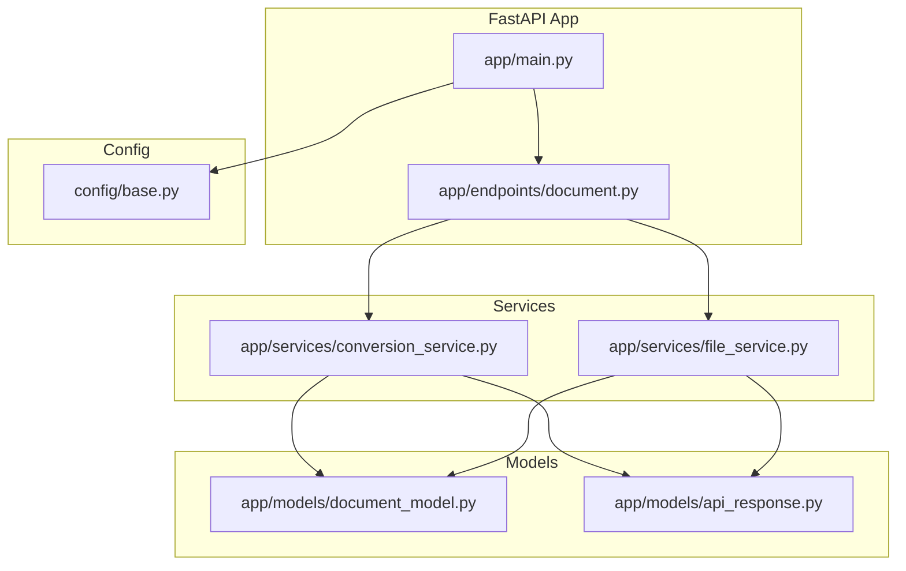
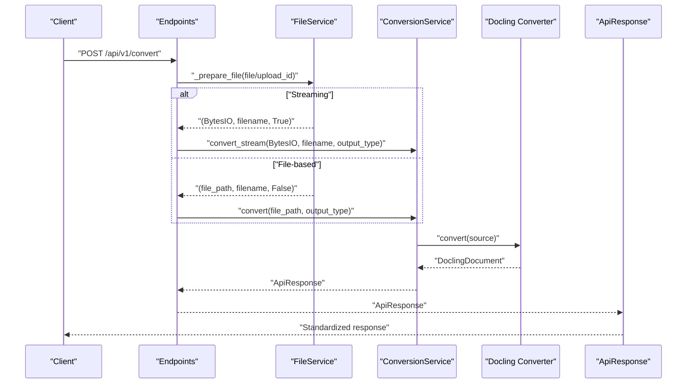
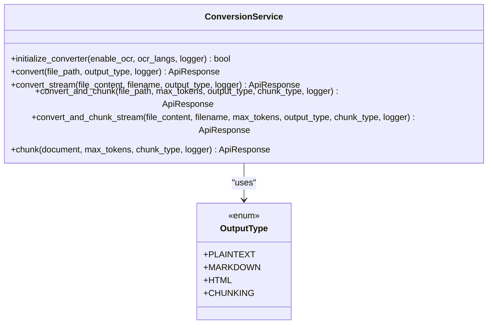
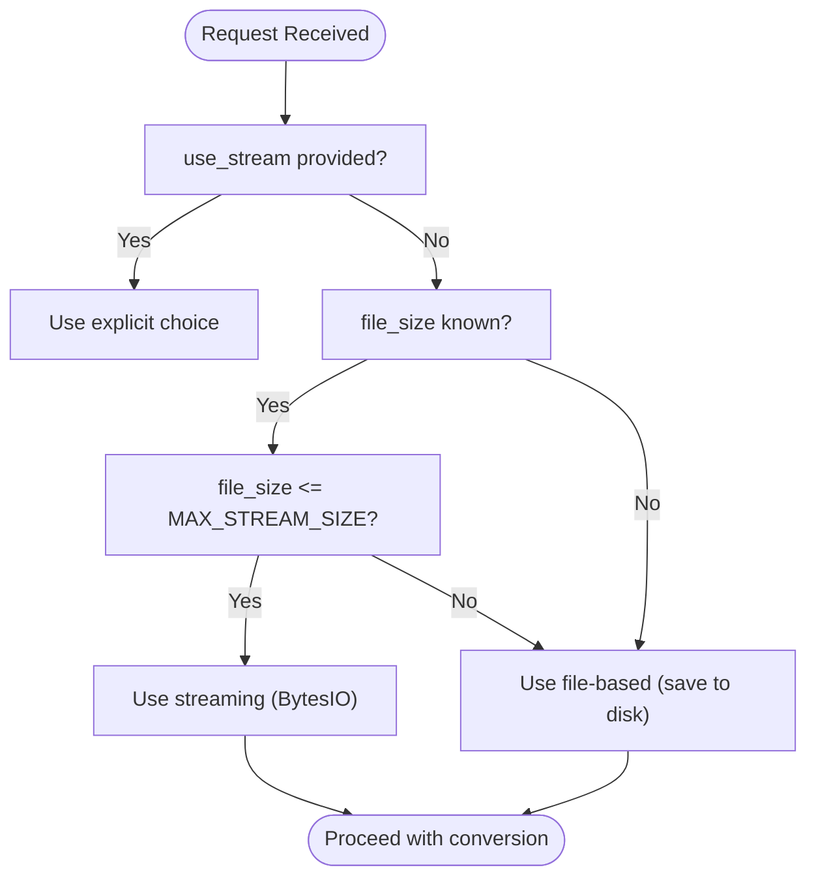
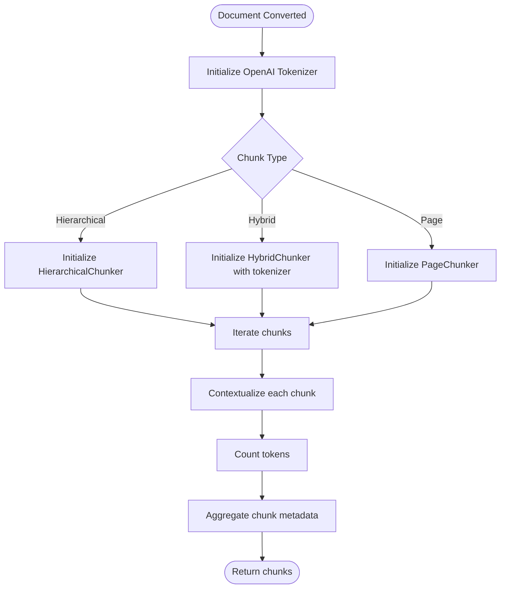
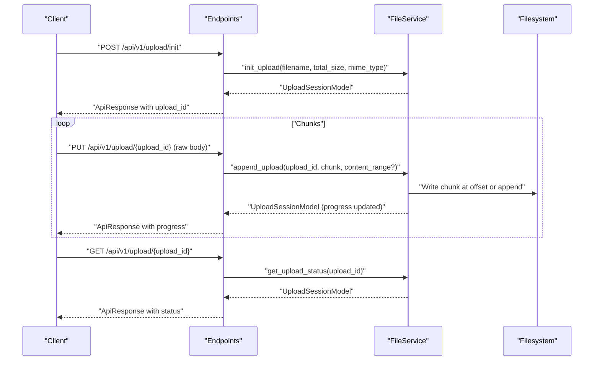
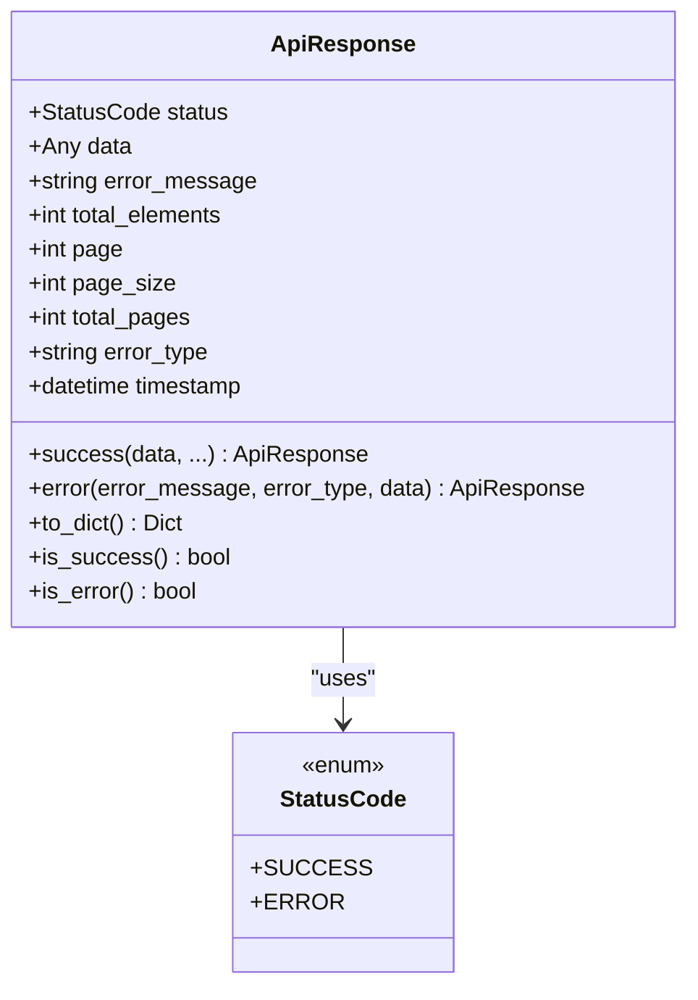
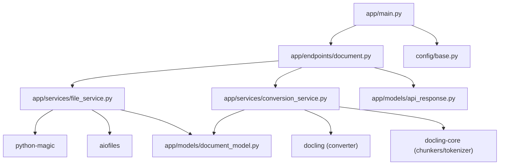

# Core Features & Capabilities

<cite>
**Referenced Files in This Document**
- [app/main.py](file://app/main.py)
- [app/endpoints/document.py](file://app/endpoints/document.py)
- [app/services/conversion_service.py](file://app/services/conversion_service.py)
- [app/services/file_service.py](file://app/services/file_service.py)
- [app/models/document_model.py](file://app/models/document_model.py)
- [app/models/api_response.py](file://app/models/api_response.py)
- [config/base.py](file://config/base.py)
- [app/services/base_service.py](file://app/services/base_service.py)
</cite>

## Table of Contents
1. [Introduction](#introduction)
2. [Project Structure](#project-structure)
3. [Core Components](#core-components)
4. [Architecture Overview](#architecture-overview)
5. [Detailed Component Analysis](#detailed-component-analysis)
6. [Dependency Analysis](#dependency-analysis)
7. [Performance Considerations](#performance-considerations)
8. [Troubleshooting Guide](#troubleshooting-guide)
9. [Conclusion](#conclusion)

## Introduction
This document explains the core features and capabilities of the document processing API, focusing on:
- Multi-format document conversion supporting PDF, DOCX, PPTX, XLSX, images, HTML, CSV, Markdown, and ASCIIDOC.
- Intelligent processing strategy that automatically selects between streaming and file-based conversion based on file size and memory constraints.
- Chunking system with hierarchical, hybrid, and page-based strategies, including token-aware chunking using OpenAI tokenizer.
- Resumable upload system with Content-Range support and session management.
- Standardized response formats and error handling patterns.
- Concrete examples from the codebase showing conversion workflows, chunking configurations, and upload progress tracking.
- Performance characteristics of different processing modes and how to choose the right approach.

## Project Structure
The API is organized around FastAPI endpoints, services, models, and configuration. Key areas:
- Endpoints: HTTP routes for conversion, chunking, and resumable uploads.
- Services: ConversionService for document conversion and chunking, FileService for upload and validation.
- Models: Output types, chunk types, upload session models, and standardized API response model.
- Configuration: Environment-driven settings for sizes, tokens, threading, and formats.

**Diagram sources**
- [app/main.py:1-160](file://app/main.py#L1-L160)
- [app/endpoints/document.py:1-353](file://app/endpoints/document.py#L1-L353)
- [app/services/conversion_service.py:1-478](file://app/services/conversion_service.py#L1-L478)
- [app/services/file_service.py:1-347](file://app/services/file_service.py#L1-L347)
- [app/models/document_model.py:1-74](file://app/models/document_model.py#L1-L74)
- [app/models/api_response.py:1-193](file://app/models/api_response.py#L1-L193)
- [config/base.py:1-57](file://config/base.py#L1-L57)

**Section sources**
- [app/main.py:1-160](file://app/main.py#L1-L160)
- [config/base.py:1-57](file://config/base.py#L1-L57)

## Core Components
- ConversionService: Creates and manages a shared Docling converter, performs conversion and chunking, and exposes async methods for streaming and file-based workflows.
- FileService: Handles file validation, streaming into memory, saving to disk, and resumable uploads with Content-Range support and session lifecycle.
- Endpoints: Provide conversion, chunking, and resumable upload APIs with standardized request/response patterns.
- Models: Define output types, chunk types, upload session state, and standardized ApiResponse structure.
- Configuration: Centralizes thresholds, limits, and defaults for streaming, chunking, and performance tuning.

**Section sources**
- [app/services/conversion_service.py:89-478](file://app/services/conversion_service.py#L89-L478)
- [app/services/file_service.py:23-347](file://app/services/file_service.py#L23-L347)
- [app/endpoints/document.py:101-353](file://app/endpoints/document.py#L101-L353)
- [app/models/document_model.py:9-74](file://app/models/document_model.py#L9-L74)
- [app/models/api_response.py:14-193](file://app/models/api_response.py#L14-L193)
- [config/base.py:17-34](file://config/base.py#L17-L34)

## Architecture Overview
The system integrates FastAPI routing with two primary processing paths:
- Streaming path: Reads uploads into memory (BytesIO) and converts without writing to disk.
- File-based path: Saves uploads to disk and converts from file path.

Chunking is token-aware and strategy-driven, with optional OCR and table extraction enabled by configuration.

**Diagram sources**
- [app/endpoints/document.py:101-160](file://app/endpoints/document.py#L101-L160)
- [app/services/file_service.py:43-98](file://app/services/file_service.py#L43-L98)
- [app/services/conversion_service.py:133-218](file://app/services/conversion_service.py#L133-L218)

## Detailed Component Analysis

### Multi-format Document Conversion
Supported formats include PDF, DOCX, PPTX, XLSX, images, HTML, CSV, Markdown, and ASCIIDOC. The converter is configured with pipeline options for OCR, table structure, and accelerator threads.

Key behaviors:
- Allowed formats are declared during converter creation.
- Pipeline options include OCR enablement, languages, and table structure settings.
- Output types are selected via an enum with export methods for plaintext, HTML, and Markdown.

**Diagram sources**
- [app/services/conversion_service.py:89-478](file://app/services/conversion_service.py#L89-L478)
- [app/models/document_model.py:9-15](file://app/models/document_model.py#L9-L15)

**Section sources**
- [app/services/conversion_service.py:28-67](file://app/services/conversion_service.py#L28-L67)
- [app/services/conversion_service.py:219-264](file://app/services/conversion_service.py#L219-L264)
- [app/models/document_model.py:9-15](file://app/models/document_model.py#L9-L15)

### Intelligent Processing Strategy: Streaming vs File-based
The system decides between streaming and file-based conversion based on:
- Explicit user choice via a form parameter.
- Automatic detection using a size threshold.

**Diagram sources**
- [app/endpoints/document.py:27-41](file://app/endpoints/document.py#L27-L41)
- [config/base.py:24](file://config/base.py#L24)

**Section sources**
- [app/endpoints/document.py:27-41](file://app/endpoints/document.py#L27-L41)
- [app/endpoints/document.py:43-94](file://app/endpoints/document.py#L43-L94)
- [config/base.py:24](file://config/base.py#L24)

### Chunking System: Hierarchical, Hybrid, and Page-based
Chunking is token-aware and strategy-driven:
- Tokenizer: OpenAI tokenizer integrated via tiktoken.
- Strategies:
  - Hierarchical: Builds a hierarchical structure of content.
  - Hybrid: Combines hierarchical and page-based strategies with contextualization.
  - Page: Chunks by page boundaries.
- Token limit: Controlled by a configurable maximum tokens per chunk.

**Diagram sources**
- [app/services/conversion_service.py:266-343](file://app/services/conversion_service.py#L266-L343)
- [app/services/conversion_service.py:288-299](file://app/services/conversion_service.py#L288-L299)

**Section sources**
- [app/services/conversion_service.py:266-343](file://app/services/conversion_service.py#L266-L343)
- [app/models/document_model.py:17-22](file://app/models/document_model.py#L17-L22)
- [config/base.py:21](file://config/base.py#L21)

### Resumable Upload System with Content-Range and Session Management
The resumable upload workflow supports:
- Initialization: Create an upload session with filename, total size, and optional MIME type.
- Chunking: Append binary chunks with optional Content-Range header for out-of-order delivery.
- Status: Query session progress and completion.
- Cleanup: Automatic cleanup of expired or failed sessions.

**Diagram sources**
- [app/endpoints/document.py:238-353](file://app/endpoints/document.py#L238-L353)
- [app/services/file_service.py:194-347](file://app/services/file_service.py#L194-L347)

**Section sources**
- [app/endpoints/document.py:238-353](file://app/endpoints/document.py#L238-L353)
- [app/services/file_service.py:194-347](file://app/services/file_service.py#L194-L347)

### Standardized Response Formats and Error Handling Patterns
All endpoints return a standardized ApiResponse with:
- status: 0 for success, 4 for error.
- data: constrained to string, dict, list of dicts, or Pydantic models.
- error_message: present only when status indicates error.
- timestamp: UTC timestamp for traceability.

Error handling:
- HTTP exceptions bubble up as structured errors.
- Global exception handler ensures unhandled exceptions are serialized consistently.
- Validation enforces data type constraints and error presence rules.

**Diagram sources**
- [app/models/api_response.py:14-193](file://app/models/api_response.py#L14-L193)

**Section sources**
- [app/models/api_response.py:14-193](file://app/models/api_response.py#L14-L193)
- [app/main.py:133-160](file://app/main.py#L133-L160)

### Example Workflows from the Codebase

- Conversion workflow (file-based):
  - Endpoint: [app/endpoints/document.py:101-160](file://app/endpoints/document.py#L101-L160)
  - Preparation: [_prepare_file:43-94](file://app/endpoints/document.py#L43-L94)
  - Conversion: [convert:133-174](file://app/services/conversion_service.py#L133-L174)

- Conversion workflow (streaming):
  - Endpoint: [app/endpoints/document.py:101-160](file://app/endpoints/document.py#L101-L160)
  - Streaming preparation: [_prepare_file:43-94](file://app/endpoints/document.py#L43-L94)
  - Conversion: [convert_stream:175-218](file://app/services/conversion_service.py#L175-L218)

- Chunking workflow:
  - Endpoint: [app/endpoints/document.py:162-231](file://app/endpoints/document.py#L162-L231)
  - Chunking: [chunk:266-343](file://app/services/conversion_service.py#L266-L343)

- Combined conversion and chunking (file-based):
  - Endpoint: [app/endpoints/document.py:162-231](file://app/endpoints/document.py#L162-L231)
  - Method: [convert_and_chunk:345-410](file://app/services/conversion_service.py#L345-L410)

- Combined conversion and chunking (streaming):
  - Endpoint: [app/endpoints/document.py:162-231](file://app/endpoints/document.py#L162-L231)
  - Method: [convert_and_chunk_stream:412-478](file://app/services/conversion_service.py#L412-L478)

- Resumable upload initialization:
  - Endpoint: [app/endpoints/document.py:238-277](file://app/endpoints/document.py#L238-L277)
  - Method: [init_upload:194-221](file://app/services/file_service.py#L194-L221)

- Resumable upload chunking:
  - Endpoint: [app/endpoints/document.py:279-324](file://app/endpoints/document.py#L279-L324)
  - Method: [append_upload:222-324](file://app/services/file_service.py#L222-L324)

- Upload status:
  - Endpoint: [app/endpoints/document.py:326-353](file://app/endpoints/document.py#L326-L353)
  - Method: [get_upload_status:326-330](file://app/services/file_service.py#L326-L330)

**Section sources**
- [app/endpoints/document.py:101-231](file://app/endpoints/document.py#L101-L231)
- [app/services/conversion_service.py:133-478](file://app/services/conversion_service.py#L133-L478)
- [app/services/file_service.py:194-347](file://app/services/file_service.py#L194-L347)

## Dependency Analysis
- Endpoints depend on FileService for upload preparation and ConversionService for conversion/chunking.
- ConversionService depends on Docling for conversion and docling-core for chunkers and tokenizers.
- FileService depends on python-magic for MIME type detection and aiofiles for async file I/O.
- Configuration drives thresholds and limits for streaming, chunking, and performance.

**Diagram sources**
- [app/endpoints/document.py:101-353](file://app/endpoints/document.py#L101-L353)
- [app/services/conversion_service.py:1-478](file://app/services/conversion_service.py#L1-L478)
- [app/services/file_service.py:1-347](file://app/services/file_service.py#L1-L347)
- [app/models/api_response.py:1-193](file://app/models/api_response.py#L1-L193)
- [app/models/document_model.py:1-74](file://app/models/document_model.py#L1-L74)
- [app/main.py:1-160](file://app/main.py#L1-L160)
- [config/base.py:1-57](file://config/base.py#L1-L57)

**Section sources**
- [app/endpoints/document.py:101-353](file://app/endpoints/document.py#L101-L353)
- [app/services/conversion_service.py:1-478](file://app/services/conversion_service.py#L1-L478)
- [app/services/file_service.py:1-347](file://app/services/file_service.py#L1-L347)
- [app/models/api_response.py:1-193](file://app/models/api_response.py#L1-L193)
- [app/models/document_model.py:1-74](file://app/models/document_model.py#L1-L74)
- [app/main.py:1-160](file://app/main.py#L1-L160)
- [config/base.py:1-57](file://config/base.py#L1-L57)

## Performance Considerations
- Streaming vs file-based:
  - Streaming reduces disk I/O and latency for small files under the streaming threshold.
  - File-based avoids memory pressure for large files and enables robust resumable uploads.
- Thread pool and converter threads:
  - Shared thread pool and converter threads improve throughput for CPU-bound tasks.
- Chunk size and token limits:
  - Adjust max_tokens to balance chunk granularity and downstream processing costs.
- OCR and table extraction:
  - Enabling OCR and table structure increases processing time but improves accuracy and completeness.

[No sources needed since this section provides general guidance]

## Troubleshooting Guide
Common issues and resolutions:
- File too large:
  - Symptom: 413 error on upload or streaming.
  - Cause: Exceeds MAX_FILE_SIZE or MAX_STREAM_SIZE.
  - Resolution: Use resumable upload or reduce file size.
- Unsupported file type:
  - Symptom: 400 error indicating unsupported MIME type.
  - Cause: File type not in SUPPORTED_FORMATS.
  - Resolution: Verify file type and extension; ensure magic detection matches supported formats.
- Upload session not found:
  - Symptom: 404 error on status or chunk append.
  - Cause: Expired or invalid upload_id.
  - Resolution: Initialize a new session; sessions expire after a fixed period.
- Chunking failures:
  - Symptom: Chunking returns error; conversion result may still be usable.
  - Cause: Chunker configuration or tokenizer issues.
  - Resolution: Retry with different chunk_type or adjust max_tokens.

**Section sources**
- [app/endpoints/document.py:253-257](file://app/endpoints/document.py#L253-L257)
- [app/services/file_service.py:40-47](file://app/services/file_service.py#L40-L47)
- [app/services/file_service.py:114-121](file://app/services/file_service.py#L114-L121)
- [app/services/file_service.py:235-245](file://app/services/file_service.py#L235-L245)
- [app/services/conversion_service.py:384-398](file://app/services/conversion_service.py#L384-L398)

## Conclusion
The API provides a production-ready foundation for multi-format document processing with intelligent streaming/file-based selection, robust chunking strategies, and resumable uploads. Standardized responses and error handling simplify integration, while configuration-driven thresholds and limits enable tuning for diverse deployment scenarios.