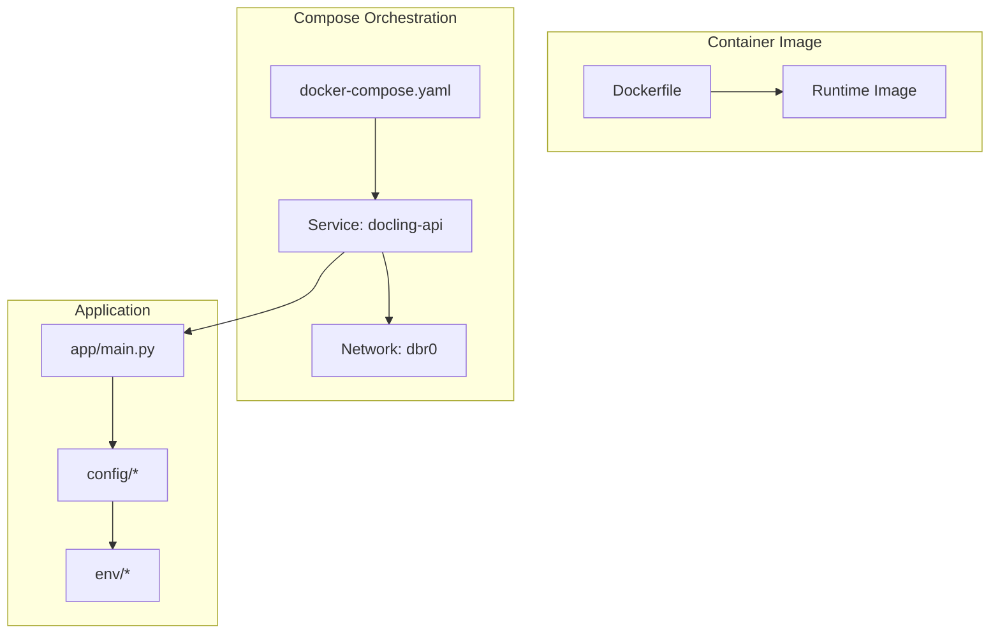
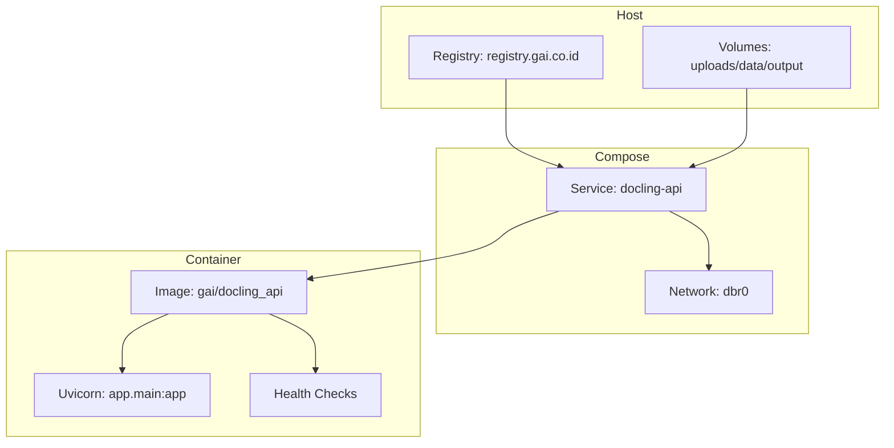
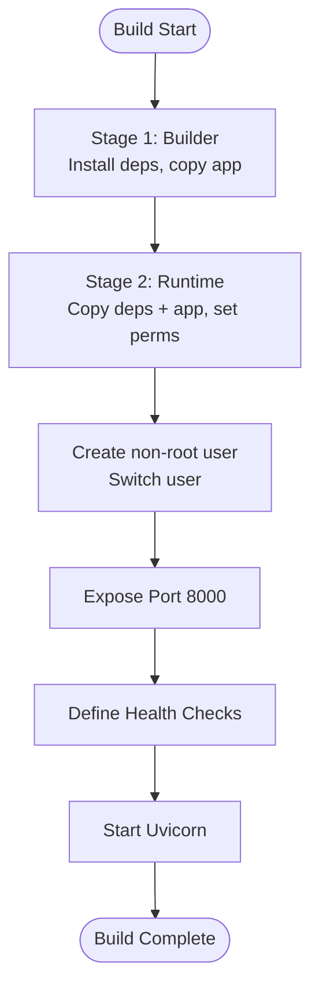
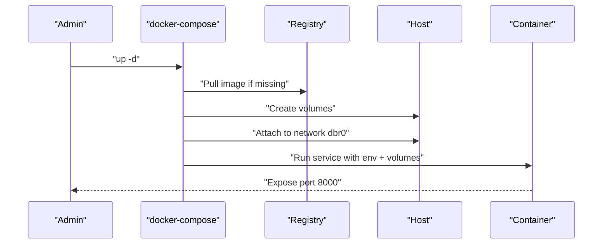
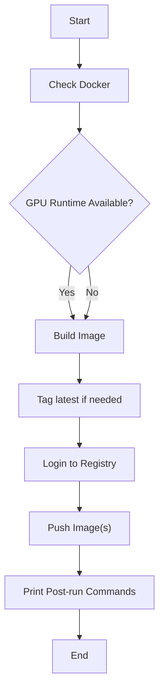
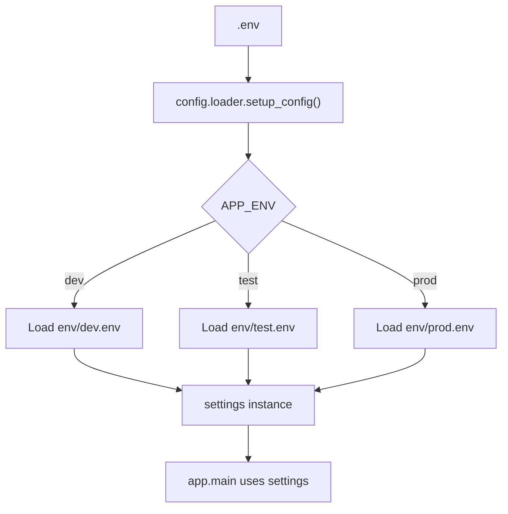
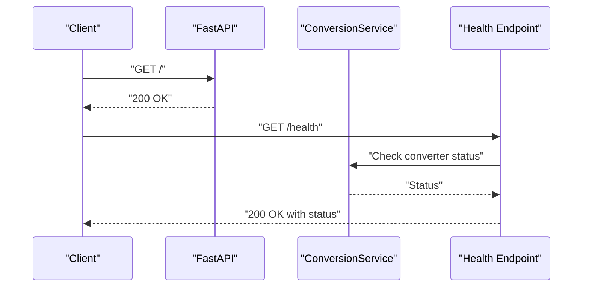
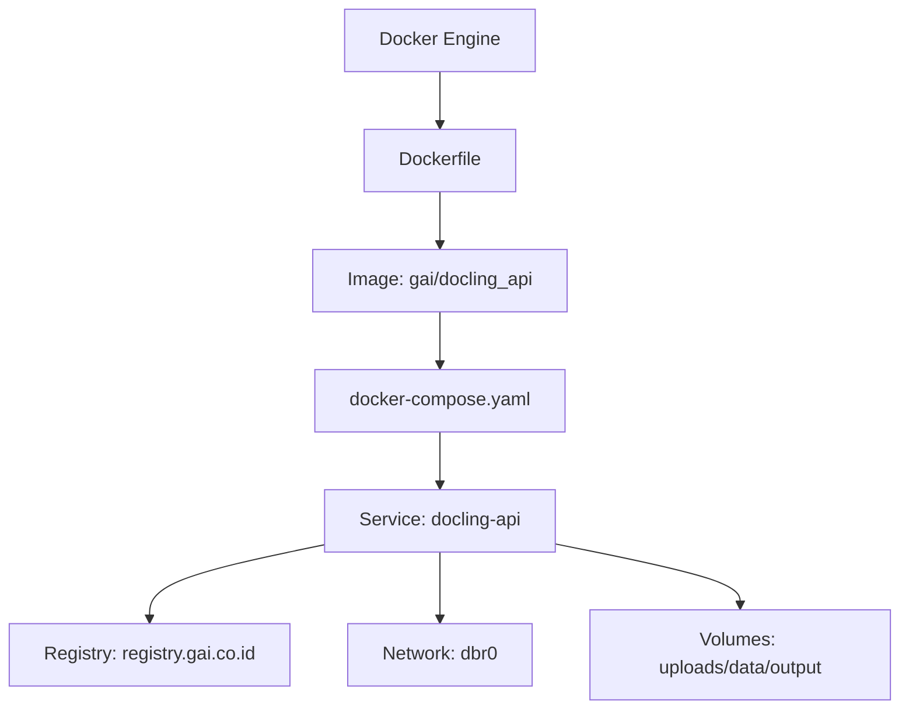

# Deployment Overview

<cite>
**Referenced Files in This Document**
- [Dockerfile](file://Dockerfile)
- [docker-compose.yaml](file://docker-compose.yaml)
- [build_push.sh](file://build_push.sh)
- [run.sh](file://run.sh)
- [.env](file://.env)
- [requirements.txt](file://requirements.txt)
- [config/base.py](file://config/base.py)
- [config/prod.py](file://config/prod.py)
- [config/loader.py](file://config/loader.py)
- [config/context.py](file://config/context.py)
- [app/main.py](file://app/main.py)
- [env/dev.env](file://env/dev.env)
- [env/prod.env](file://env/prod.env)
</cite>

## Table of Contents
1. [Introduction](#introduction)
2. [Project Structure](#project-structure)
3. [Core Components](#core-components)
4. [Architecture Overview](#architecture-overview)
5. [Detailed Component Analysis](#detailed-component-analysis)
6. [Dependency Analysis](#dependency-analysis)
7. [Performance Considerations](#performance-considerations)
8. [Troubleshooting Guide](#troubleshooting-guide)
9. [Conclusion](#conclusion)
10. [Appendices](#appendices)

## Introduction
This document provides a comprehensive deployment overview for the Docling API using containerized strategies. It explains the Docker-based architecture with multi-stage builds for optimal container size and security, environment configuration management via .env files and Docker Compose orchestration for development and production, and the end-to-end deployment process including container building, image pushing to a registry, and service orchestration. It also covers production deployment considerations such as resource allocation, health checks, logging configuration, and monitoring setup, along with scaling strategies, load balancing approaches, high availability configurations, and security hardening measures. Practical examples of deployment commands, configuration templates, and troubleshooting steps are included, alongside CI/CD pipeline integration patterns for automated deployments.

## Project Structure
The repository organizes the application into modular components:
- Application code under app/ with endpoints, services, models, and utilities
- Configuration management under config/ with environment-specific settings
- Environment files under env/ for development, testing, and production
- Containerization assets including Dockerfile, docker-compose.yaml, and build scripts
- Runtime and development helpers such as run.sh and requirements.txt

**Diagram sources**
- [Dockerfile:1-94](file://Dockerfile#L1-L94)
- [docker-compose.yaml:1-42](file://docker-compose.yaml#L1-L42)
- [app/main.py:1-160](file://app/main.py#L1-L160)
- [config/base.py:1-57](file://config/base.py#L1-L57)
- [env/dev.env:1-14](file://env/dev.env#L1-L14)
- [env/prod.env:1-14](file://env/prod.env#L1-L14)

**Section sources**
- [Dockerfile:1-94](file://Dockerfile#L1-L94)
- [docker-compose.yaml:1-42](file://docker-compose.yaml#L1-L42)
- [app/main.py:1-160](file://app/main.py#L1-L160)
- [config/base.py:1-57](file://config/base.py#L1-L57)
- [env/dev.env:1-14](file://env/dev.env#L1-L14)
- [env/prod.env:1-14](file://env/prod.env#L1-L14)

## Core Components
- Multi-stage Docker build: Separates dependency installation and runtime execution into distinct stages to minimize image size and improve security posture.
- GPU-enabled runtime: Uses NVIDIA CUDA runtime base images to enable GPU-accelerated document processing.
- Non-root user: Creates a dedicated non-root user for the runtime container to reduce privilege exposure.
- Health checks: Built-in HTTP health check endpoints and Docker healthcheck directives for readiness and liveness.
- Environment configuration: Centralized configuration loading via pydantic-settings with environment-specific .env files and a selector in .env.
- Volume mounts: Persistent storage for uploads, data, and output directories mapped from host to container.
- Resource allocation: GPU device reservation via compose deploy.resources for container orchestration platforms that support it.

**Section sources**
- [Dockerfile:1-94](file://Dockerfile#L1-L94)
- [docker-compose.yaml:1-42](file://docker-compose.yaml#L1-L42)
- [config/loader.py:1-51](file://config/loader.py#L1-L51)
- [config/base.py:1-57](file://config/base.py#L1-L57)

## Architecture Overview
The deployment architecture combines a multi-stage Docker build with Docker Compose orchestration. The application runs as a single service exposing port 8000, with health checks integrated at both the application and container levels. GPU resources are reserved for accelerated processing, and persistent volumes are mounted for uploads, data, and output.

**Diagram sources**
- [docker-compose.yaml:1-42](file://docker-compose.yaml#L1-L42)
- [Dockerfile:1-94](file://Dockerfile#L1-L94)
- [app/main.py:116-130](file://app/main.py#L116-L130)

## Detailed Component Analysis

### Dockerfile: Multi-stage Build and Runtime Hardening
The Dockerfile implements a two-stage build:
- Builder stage: Installs Python and dependencies, copies application code, and prepares the environment.
- Runtime stage: Copies only necessary runtime libraries and application code, sets up system dependencies, creates a non-root user, exposes port 8000, defines health checks, and starts Uvicorn as the application entrypoint.

Key characteristics:
- Uses NVIDIA CUDA runtime base images for GPU support.
- Minimizes image size by copying only installed packages and application code from the builder stage.
- Creates a non-root user (UID 1000) and switches to it for security.
- Defines health checks using both Docker HEALTHCHECK and an HTTP endpoint.
- Exposes port 8000 and runs Uvicorn with host binding to 0.0.0.0.

**Diagram sources**
- [Dockerfile:1-94](file://Dockerfile#L1-L94)

**Section sources**
- [Dockerfile:1-94](file://Dockerfile#L1-L94)

### docker-compose.yaml: Orchestration and Resource Allocation
The Compose file orchestrates the Docling API service with:
- Image specification and build context.
- Environment variables and .env file inclusion.
- Volume mounts for uploads, data, output, and environment files.
- Restart policy and external network attachment.
- GPU device reservation via deploy.resources.devices for platforms supporting it.
- Health checks aligned with the container’s health directive.

Operational notes:
- The service binds to port 8000 and exposes it.
- Volumes persist uploaded documents and processed outputs.
- The network is external and named dbr0, indicating integration with an existing bridge network.

**Diagram sources**
- [docker-compose.yaml:1-42](file://docker-compose.yaml#L1-L42)

**Section sources**
- [docker-compose.yaml:1-42](file://docker-compose.yaml#L1-L42)

### build_push.sh: Automated Build and Push Pipeline
The script automates building, tagging, and pushing images to a private registry:
- Validates Docker availability and optional GPU runtime support.
- Builds the image with a configurable version tag.
- Tags as latest if the version is not latest.
- Logs into the registry and pushes the image(s).
- Provides helpful post-push commands for pulling and running.

**Diagram sources**
- [build_push.sh:1-73](file://build_push.sh#L1-L73)

**Section sources**
- [build_push.sh:1-73](file://build_push.sh#L1-L73)

### Environment Configuration Management
Environment selection and configuration loading:
- .env selects the environment (dev/test/prod).
- config.loader loads the corresponding env/<env>.env file and validates production safety.
- config.base defines the schema and defaults; config.prod overrides debug and log level.

**Diagram sources**
- [config/loader.py:1-51](file://config/loader.py#L1-L51)
- [config/base.py:1-57](file://config/base.py#L1-L57)
- [config/prod.py:1-6](file://config/prod.py#L1-L6)
- [env/dev.env:1-14](file://env/dev.env#L1-L14)
- [env/prod.env:1-14](file://env/prod.env#L1-L14)

**Section sources**
- [.env:1-1](file://.env#L1-L1)
- [config/loader.py:1-51](file://config/loader.py#L1-L51)
- [config/base.py:1-57](file://config/base.py#L1-L57)
- [config/prod.py:1-6](file://config/prod.py#L1-L6)
- [env/dev.env:1-14](file://env/dev.env#L1-L14)
- [env/prod.env:1-14](file://env/prod.env#L1-L14)

### Application Entrypoint and Health Checks
- app/main.py initializes the FastAPI application, registers middleware, routes, and error handlers.
- It defines a root endpoint and a /health endpoint for operational checks.
- The Dockerfile’s HEALTHCHECK and Compose healthcheck align with the /health endpoint.

**Diagram sources**
- [app/main.py:101-130](file://app/main.py#L101-L130)
- [Dockerfile:90-92](file://Dockerfile#L90-L92)

**Section sources**
- [app/main.py:101-130](file://app/main.py#L101-L130)
- [Dockerfile:90-92](file://Dockerfile#L90-L92)

### Development vs Production Differences
- Development: Higher log verbosity, optional auth bypass, and debug endpoints enabled.
- Production: Lower log verbosity, strict auth enforcement, and debug disabled.

These differences are controlled by environment-specific .env files and configuration classes.

**Section sources**
- [env/dev.env:1-14](file://env/dev.env#L1-L14)
- [env/prod.env:1-14](file://env/prod.env#L1-L14)
- [config/prod.py:1-6](file://config/prod.py#L1-L6)

## Dependency Analysis
The deployment stack depends on:
- Docker engine for building and running containers.
- NVIDIA runtime for GPU acceleration.
- Private registry for image distribution.
- Compose for service orchestration and volume/network management.

**Diagram sources**
- [Dockerfile:1-94](file://Dockerfile#L1-L94)
- [docker-compose.yaml:1-42](file://docker-compose.yaml#L1-L42)

**Section sources**
- [Dockerfile:1-94](file://Dockerfile#L1-L94)
- [docker-compose.yaml:1-42](file://docker-compose.yaml#L1-L42)

## Performance Considerations
- Multi-stage build reduces image size and attack surface.
- Non-root user and minimal system dependencies improve security and stability.
- Health checks enable automatic restarts and observability.
- GPU device reservation ensures predictable compute allocation for accelerated processing.
- Thread pool and converter thread settings influence throughput and memory usage; tune via environment variables in .env files.

[No sources needed since this section provides general guidance]

## Troubleshooting Guide
Common deployment issues and resolutions:
- Docker daemon not running: Verify Docker is installed and started before building/pushing.
- NVIDIA runtime unavailable: The build script warns when GPU runtime is not available; ensure the host has compatible drivers and nvidia-container-toolkit.
- Registry authentication failures: Ensure credentials are configured for the registry before pushing.
- Health check failures: Confirm the /health endpoint responds and that the container’s healthcheck interval and retries are appropriate.
- Volume permission errors: Ensure the non-root user can write to mounted volumes; verify ownership and permissions on host directories.
- GPU scheduling issues: Confirm the Compose platform supports deploy.resources.devices and that the host has sufficient GPU capacity.

**Section sources**
- [build_push.sh:21-31](file://build_push.sh#L21-L31)
- [docker-compose.yaml:23-29](file://docker-compose.yaml#L23-L29)
- [Dockerfile:81-86](file://Dockerfile#L81-L86)

## Conclusion
The Docling API employs a robust, production-ready containerized deployment strategy. The multi-stage Docker build optimizes image size and security, while Docker Compose orchestrates the service with health checks, resource allocation, and persistent volumes. Environment configuration is cleanly separated via .env files and pydantic-settings, enabling safe development and production transitions. With GPU support, health checks, and non-root execution, the deployment is suitable for scalable, secure operations. The provided scripts and templates facilitate automated CI/CD workflows and streamline day-to-day operations.

[No sources needed since this section summarizes without analyzing specific files]

## Appendices

### Deployment Commands and Templates
- Build and push image:
  - Use the provided script to build, tag, and push to the registry with a version argument.
- Run locally with GPU:
  - Use Compose to start the service with GPU reservation and volume mounts.
- Pull and run standalone:
  - Pull the image from the registry and run with appropriate environment and volumes.

**Section sources**
- [build_push.sh:33-58](file://build_push.sh#L33-L58)
- [docker-compose.yaml:1-42](file://docker-compose.yaml#L1-L42)

### CI/CD Integration Patterns
- Build stage: Execute the build script to produce the image.
- Test stage: Optionally run tests inside the container or via Compose.
- Push stage: Tag and push images to the registry with semantic versioning.
- Deploy stage: Deploy using Compose or a container orchestration platform that supports GPU scheduling and health checks.

[No sources needed since this section provides general guidance]