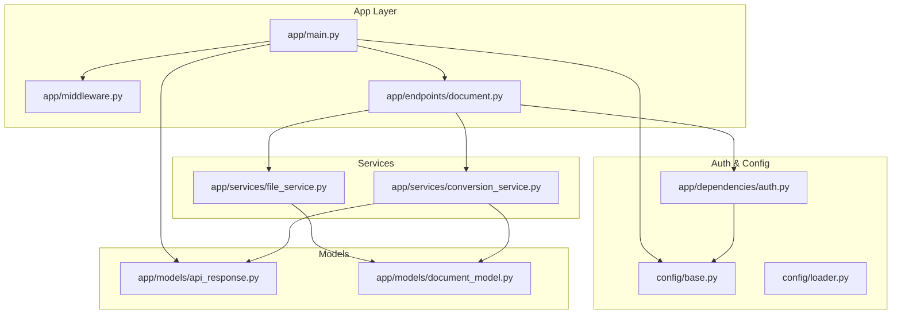
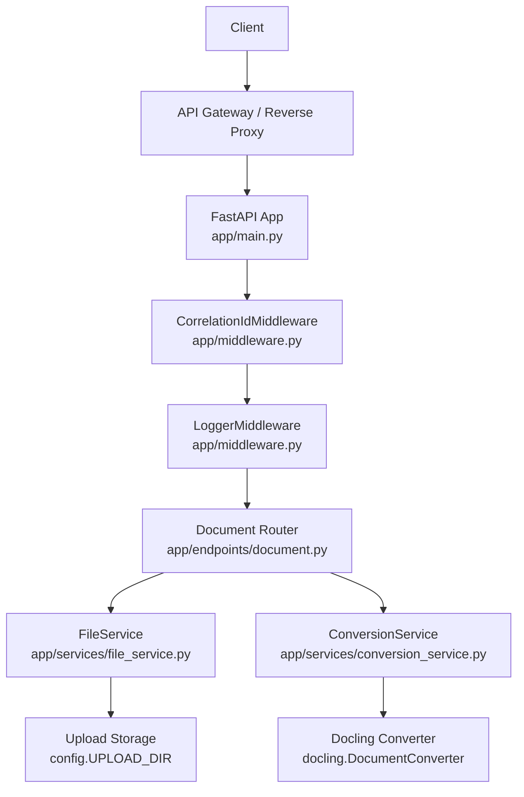
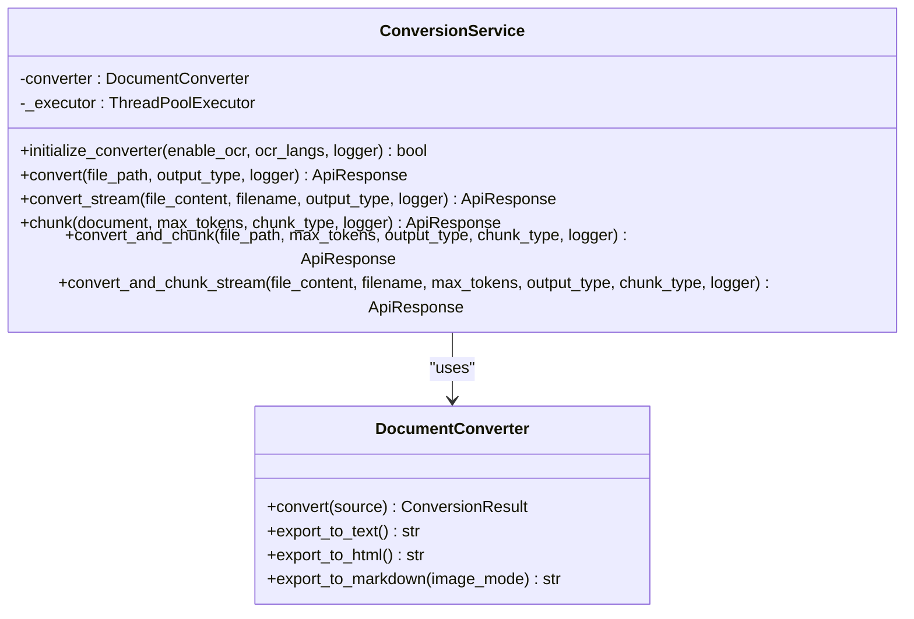
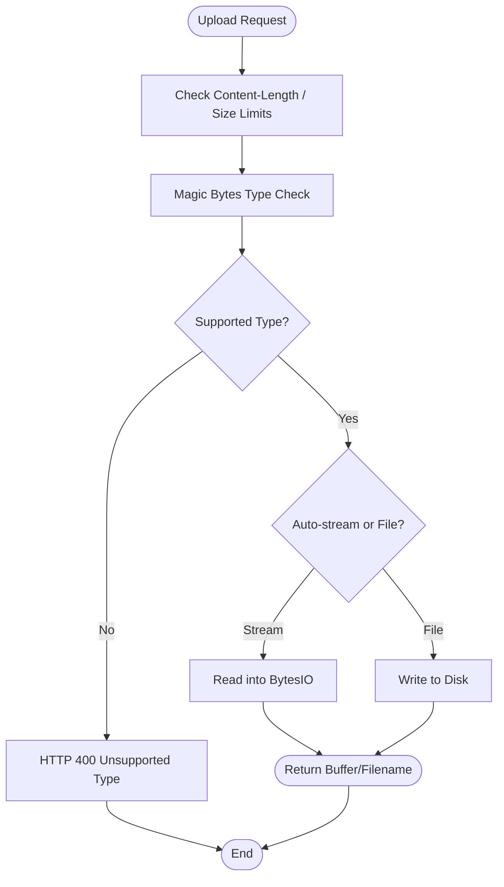
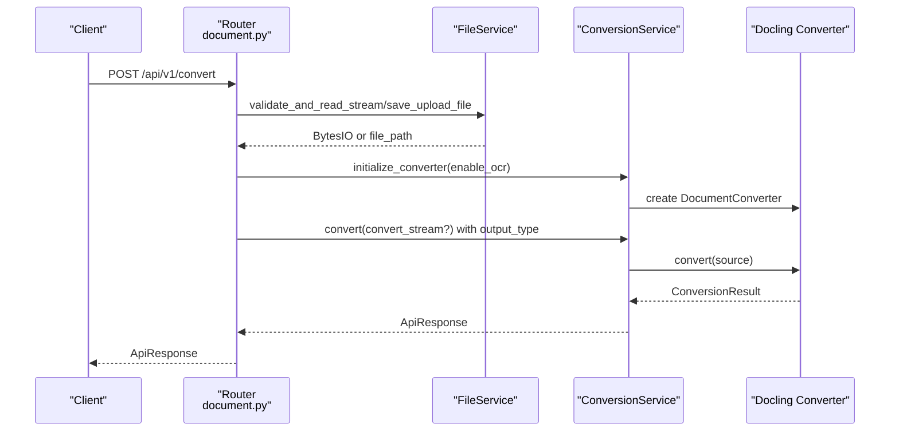
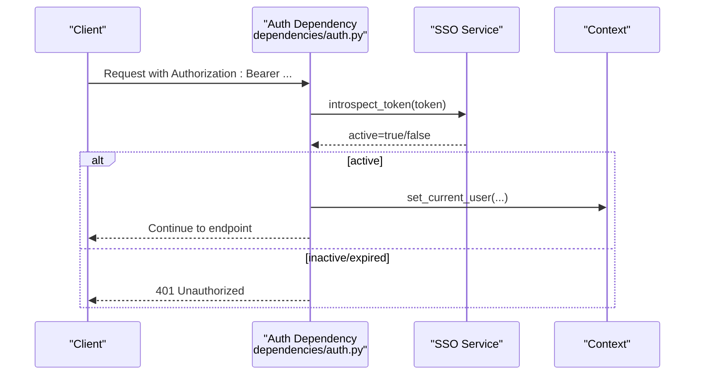
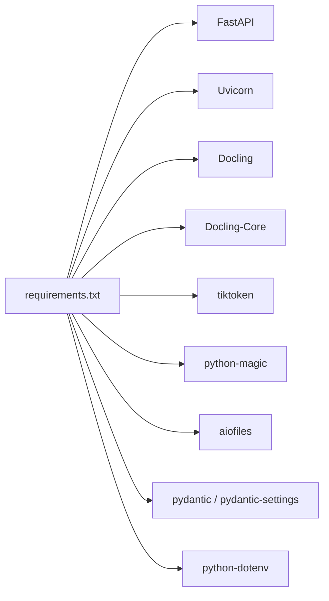

# Project Overview

<cite>
**Referenced Files in This Document**
- [README.md](file://README.md)
- [requirements.txt](file://requirements.txt)
- [app/main.py](file://app/main.py)
- [app/middleware.py](file://app/middleware.py)
- [app/endpoints/document.py](file://app/endpoints/document.py)
- [app/services/conversion_service.py](file://app/services/conversion_service.py)
- [app/services/file_service.py](file://app/services/file_service.py)
- [app/models/api_response.py](file://app/models/api_response.py)
- [app/models/document_model.py](file://app/models/document_model.py)
- [app/dependencies/auth.py](file://app/dependencies/auth.py)
- [config/base.py](file://config/base.py)
- [config/loader.py](file://config/loader.py)
- [app/utils/error.py](file://app/utils/error.py)
</cite>

## Table of Contents
1. [Introduction](#introduction)
2. [Project Structure](#project-structure)
3. [Core Components](#core-components)
4. [Architecture Overview](#architecture-overview)
5. [Detailed Component Analysis](#detailed-component-analysis)
6. [Dependency Analysis](#dependency-analysis)
7. [Performance Considerations](#performance-considerations)
8. [Troubleshooting Guide](#troubleshooting-guide)
9. [Conclusion](#conclusion)

## Introduction
Docling API is a production-ready FastAPI-based document processing service that converts diverse document formats into structured text and tabular content. It integrates tightly with the Docling library ecosystem to extract text, tables, and layout-aware content from PDFs, DOCX, PPTX, XLSX, images, HTML, CSV, Markdown, and ASCIIDOC. The service exposes REST endpoints for conversion, chunking, and resumable uploads, and standardizes responses through a unified ApiResponse model. It is designed for high throughput and reliability, leveraging asynchronous processing, thread pools, and configurable OCR and chunking strategies.

## Project Structure
The project follows a layered architecture:
- Application entrypoint initializes FastAPI, middleware, and global services.
- Endpoints define public routes under a versioned namespace and enforce authentication.
- Services encapsulate conversion, file management, and chunking logic.
- Models define request/response schemas and enumerations.
- Configuration loads environment-specific settings and validates production safety.
- Dependencies provide authentication and request-scoped logging.

**Diagram sources**
- [app/main.py:73-100](file://app/main.py#L73-L100)
- [app/middleware.py:7-45](file://app/middleware.py#L7-L45)
- [app/endpoints/document.py:15-19](file://app/endpoints/document.py#L15-L19)
- [app/services/conversion_service.py:89-132](file://app/services/conversion_service.py#L89-L132)
- [app/services/file_service.py:23-34](file://app/services/file_service.py#L23-L34)
- [app/models/api_response.py:14-40](file://app/models/api_response.py#L14-L40)
- [app/models/document_model.py:9-22](file://app/models/document_model.py#L9-L22)
- [app/dependencies/auth.py:23-56](file://app/dependencies/auth.py#L23-L56)
- [config/base.py:9-57](file://config/base.py#L9-L57)
- [config/loader.py:9-51](file://config/loader.py#L9-L51)

**Section sources**
- [README.md:1-16](file://README.md#L1-L16)
- [requirements.txt:1-15](file://requirements.txt#L1-L15)
- [app/main.py:73-100](file://app/main.py#L73-L100)
- [config/base.py:9-57](file://config/base.py#L9-L57)

## Core Components
- ConversionService: Manages a shared DocumentConverter instance, performs conversions from file paths or in-memory streams, and supports chunking with hierarchical, hybrid, or page-based strategies. It initializes the converter asynchronously and falls back gracefully if initialization fails.
- FileService: Handles file validation, streaming, and resumable uploads with Content-Range support, session tracking, and automatic cleanup of expired sessions and partial files.
- Document endpoints: Provide conversion and chunking APIs with streaming/file-based selection, OCR toggles, and output format controls. They integrate with Authentication and FileService.
- Middleware: Implements pure ASGI middlewares for correlation IDs and request-scoped logging.
- ApiResponse: Standardizes success and error responses with consistent fields and validation.
- Configuration: Loads environment-specific settings and enforces production safety checks.

**Section sources**
- [app/services/conversion_service.py:89-132](file://app/services/conversion_service.py#L89-L132)
- [app/services/file_service.py:23-34](file://app/services/file_service.py#L23-L34)
- [app/endpoints/document.py:101-160](file://app/endpoints/document.py#L101-L160)
- [app/middleware.py:7-45](file://app/middleware.py#L7-L45)
- [app/models/api_response.py:14-40](file://app/models/api_response.py#L14-L40)
- [config/base.py:9-57](file://config/base.py#L9-L57)

## Architecture Overview
Docling API is built on FastAPI and uses ASGI for runtime. The application lifecycle initializes a shared ConversionService singleton and ensures the upload directory exists. Endpoints depend on Authentication and FileService, and delegate conversion to ConversionService. Responses are standardized via ApiResponse.

**Diagram sources**
- [app/main.py:49-71](file://app/main.py#L49-L71)
- [app/middleware.py:7-45](file://app/middleware.py#L7-L45)
- [app/endpoints/document.py:15-19](file://app/endpoints/document.py#L15-L19)
- [app/services/conversion_service.py:89-132](file://app/services/conversion_service.py#L89-L132)
- [app/services/file_service.py:23-34](file://app/services/file_service.py#L23-L34)
- [config/base.py:18](file://config/base.py#L18)

## Detailed Component Analysis

### ConversionService
ConversionService orchestrates document conversion and chunking:
- Initialization: Creates a DocumentConverter configured for multiple formats and OCR options, with accelerator and pipeline settings.
- Conversion: Supports converting from file paths or in-memory streams, exporting to plaintext, HTML, or Markdown.
- Chunking: Provides hierarchical, hybrid, and page-based chunking strategies with token counting.
- Combined operations: Converts and chunks in a single call for both file and stream sources.

**Diagram sources**
- [app/services/conversion_service.py:89-132](file://app/services/conversion_service.py#L89-L132)
- [app/services/conversion_service.py:209-264](file://app/services/conversion_service.py#L209-L264)
- [app/services/conversion_service.py:266-343](file://app/services/conversion_service.py#L266-L343)
- [app/services/conversion_service.py:345-410](file://app/services/conversion_service.py#L345-L410)
- [app/services/conversion_service.py:412-478](file://app/services/conversion_service.py#L412-L478)

**Section sources**
- [app/services/conversion_service.py:28-67](file://app/services/conversion_service.py#L28-L67)
- [app/services/conversion_service.py:133-174](file://app/services/conversion_service.py#L133-L174)
- [app/services/conversion_service.py:175-217](file://app/services/conversion_service.py#L175-L217)
- [app/services/conversion_service.py:266-343](file://app/services/conversion_service.py#L266-L343)
- [app/services/conversion_service.py:345-410](file://app/services/conversion_service.py#L345-L410)
- [app/services/conversion_service.py:412-478](file://app/services/conversion_service.py#L412-L478)

### FileService
FileService manages file uploads and resumable sessions:
- Validation: Validates file type using magic bytes and enforces size limits.
- Streaming: Reads uploads into memory for small files without writing to disk.
- Resumable upload: Tracks sessions, supports Content-Range for out-of-order delivery, and cleans up expired sessions.
- Cleanup: Removes partial files and expired sessions automatically.

**Diagram sources**
- [app/services/file_service.py:35-98](file://app/services/file_service.py#L35-L98)
- [app/services/file_service.py:110-163](file://app/services/file_service.py#L110-L163)
- [app/services/file_service.py:194-220](file://app/services/file_service.py#L194-L220)
- [app/services/file_service.py:222-324](file://app/services/file_service.py#L222-L324)

**Section sources**
- [app/services/file_service.py:35-98](file://app/services/file_service.py#L35-L98)
- [app/services/file_service.py:110-163](file://app/services/file_service.py#L110-L163)
- [app/services/file_service.py:194-220](file://app/services/file_service.py#L194-L220)
- [app/services/file_service.py:222-324](file://app/services/file_service.py#L222-L324)

### Document Endpoints
Public endpoints expose conversion and chunking workflows:
- Conversion: Accepts file uploads or a previously uploaded session ID, supports OCR toggles, and output formats.
- Chunking: Converts and chunks in one call with configurable chunk sizes and strategies.
- Resumable upload: Initializes sessions, appends chunks with optional Content-Range, and returns progress/status.

**Diagram sources**
- [app/endpoints/document.py:101-160](file://app/endpoints/document.py#L101-L160)
- [app/services/file_service.py:110-163](file://app/services/file_service.py#L110-L163)
- [app/services/conversion_service.py:133-174](file://app/services/conversion_service.py#L133-L174)

**Section sources**
- [app/endpoints/document.py:101-160](file://app/endpoints/document.py#L101-L160)
- [app/endpoints/document.py:162-231](file://app/endpoints/document.py#L162-L231)
- [app/endpoints/document.py:238-353](file://app/endpoints/document.py#L238-L353)

### Authentication and Middleware
- Authentication: Enforces Bearer token validation via SSO introspection, with a bypass option for testing.
- Middleware: Adds correlation IDs and request-scoped logging using pure ASGI middlewares for performance.

**Diagram sources**
- [app/dependencies/auth.py:23-56](file://app/dependencies/auth.py#L23-L56)
- [app/dependencies/auth.py:73-90](file://app/dependencies/auth.py#L73-L90)
- [app/dependencies/auth.py:104-128](file://app/dependencies/auth.py#L104-L128)

**Section sources**
- [app/dependencies/auth.py:23-56](file://app/dependencies/auth.py#L23-L56)
- [app/dependencies/auth.py:73-90](file://app/dependencies/auth.py#L73-L90)
- [app/dependencies/auth.py:104-128](file://app/dependencies/auth.py#L104-L128)
- [app/middleware.py:7-45](file://app/middleware.py#L7-L45)
- [app/middleware.py:47-99](file://app/middleware.py#L47-L99)

## Dependency Analysis
- External libraries: FastAPI, Uvicorn, Docling, Docling-Core, tiktoken, python-magic, aiofiles, python-dotenv, pydantic, pydantic-settings.
- Internal dependencies: Endpoints depend on ConversionService and FileService; ConversionService depends on Docling’s DocumentConverter; FileService depends on magic and aiofiles; Auth depends on SSO service; Configuration is loaded via config loader.

**Diagram sources**
- [requirements.txt:1-15](file://requirements.txt#L1-L15)

**Section sources**
- [requirements.txt:1-15](file://requirements.txt#L1-L15)
- [app/services/conversion_service.py:10-25](file://app/services/conversion_service.py#L10-L25)
- [app/services/file_service.py:11-17](file://app/services/file_service.py#L11-L17)

## Performance Considerations
- Thread pool executor: ConversionService uses a shared ThreadPoolExecutor to offload blocking conversion operations, preventing event loop starvation.
- Streaming vs file-based: For small files below a threshold, conversion occurs entirely in memory to reduce disk I/O.
- OCR and pipeline tuning: OCR is configurable per request and controlled by pipeline options; table structure extraction is enabled by default.
- Chunking: Token-based chunking uses tiktoken and supports multiple strategies; chunk size defaults can be tuned via configuration.

[No sources needed since this section provides general guidance]

## Troubleshooting Guide
- Health endpoint: Use the health check to verify converter status and environment.
- Error handling: Custom ErrorResponse is raised for application errors and mapped to standardized ApiResponse with 400 status; unhandled exceptions return 500 with standardized error payload.
- Logging: Correlation IDs and request-scoped logs help trace issues across services.

**Section sources**
- [app/main.py:116-130](file://app/main.py#L116-L130)
- [app/main.py:135-160](file://app/main.py#L135-L160)
- [app/utils/error.py:4-17](file://app/utils/error.py#L4-L17)
- [app/middleware.py:47-99](file://app/middleware.py#L47-L99)

## Conclusion
Docling API delivers a robust, production-grade document processing platform built on FastAPI and the Docling ecosystem. Its layered architecture cleanly separates concerns, enabling scalable conversion and chunking workflows across a wide variety of document formats. The standardized response model, resumable upload support, and strict configuration management make it suitable for enterprise deployments with strong observability and reliability guarantees.