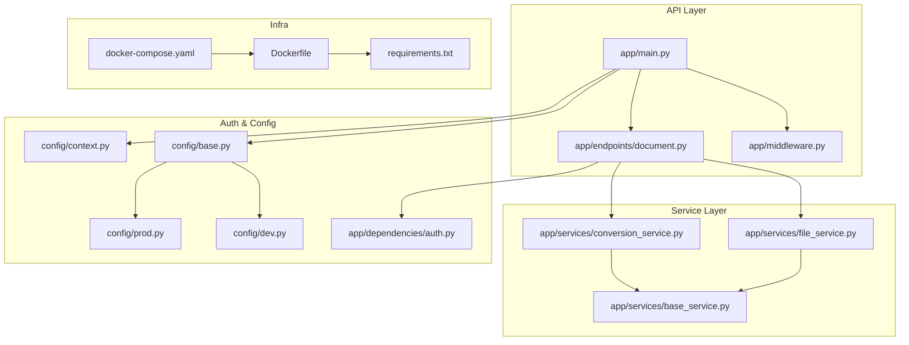
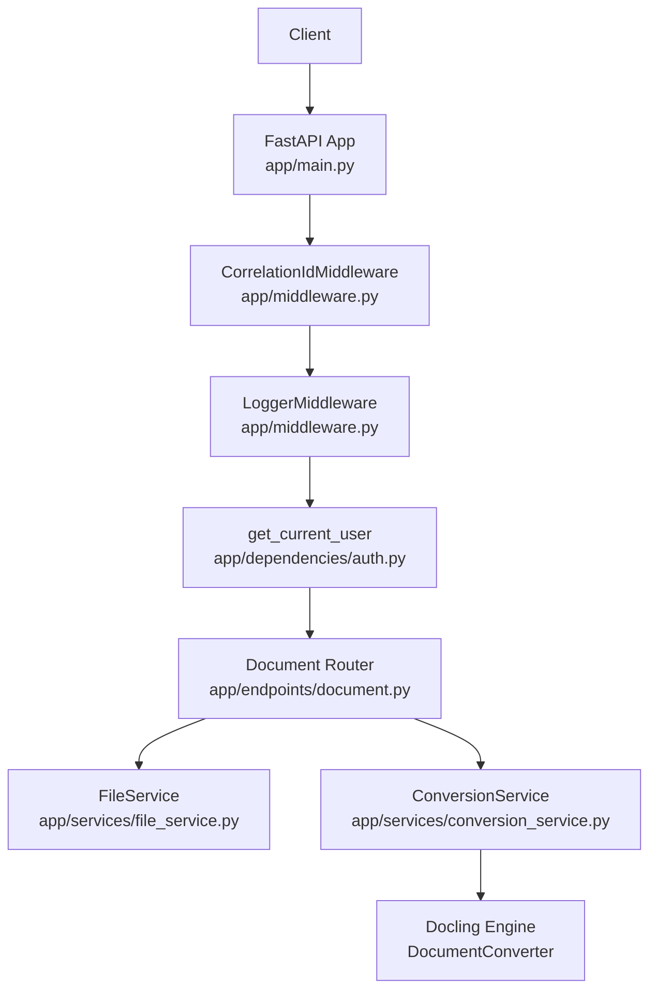
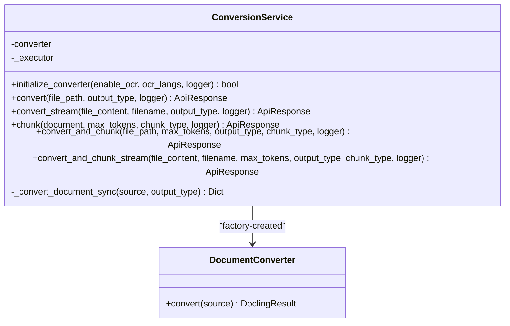
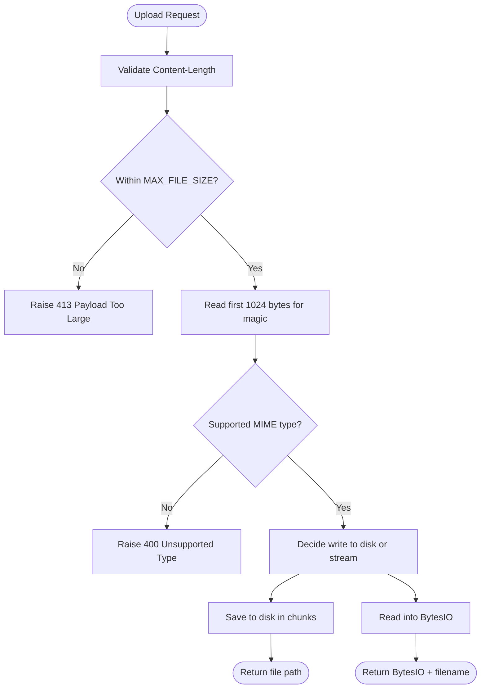
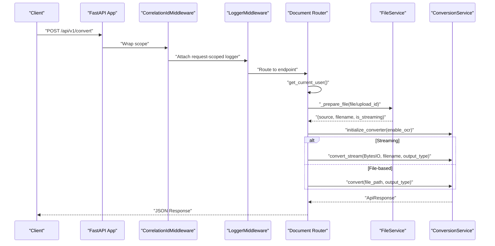
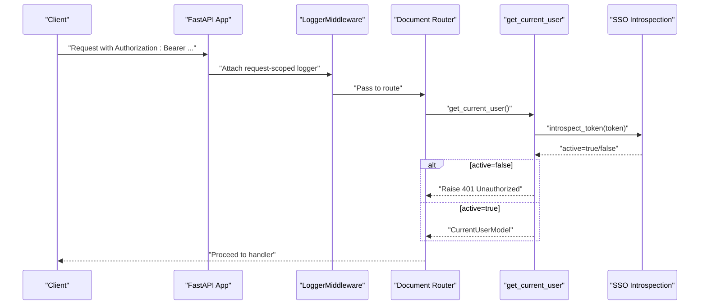
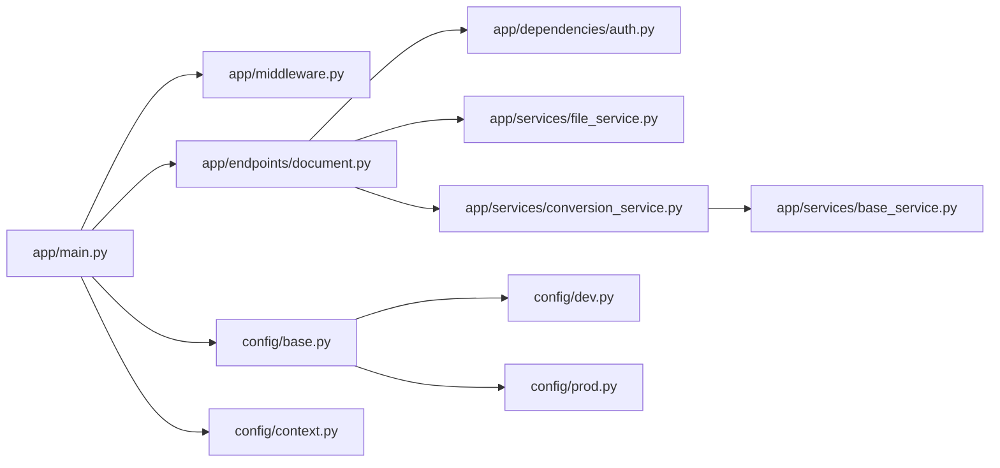

# System Architecture

<cite>
**Referenced Files in This Document**
- [app/main.py](file://app/main.py)
- [app/middleware.py](file://app/middleware.py)
- [app/endpoints/document.py](file://app/endpoints/document.py)
- [app/services/conversion_service.py](file://app/services/conversion_service.py)
- [app/services/file_service.py](file://app/services/file_service.py)
- [app/services/base_service.py](file://app/services/base_service.py)
- [app/dependencies/auth.py](file://app/dependencies/auth.py)
- [config/base.py](file://config/base.py)
- [config/dev.py](file://config/dev.py)
- [config/prod.py](file://config/prod.py)
- [config/context.py](file://config/context.py)
- [Dockerfile](file://Dockerfile)
- [docker-compose.yaml](file://docker-compose.yaml)
- [requirements.txt](file://requirements.txt)
</cite>

## Table of Contents
1. [Introduction](#introduction)
2. [Project Structure](#project-structure)
3. [Core Components](#core-components)
4. [Architecture Overview](#architecture-overview)
5. [Detailed Component Analysis](#detailed-component-analysis)
6. [Dependency Analysis](#dependency-analysis)
7. [Performance Considerations](#performance-considerations)
8. [Troubleshooting Guide](#troubleshooting-guide)
9. [Conclusion](#conclusion)
10. [Appendices](#appendices)

## Introduction
This document describes the Docling API system architecture using a layered pattern: API layer (FastAPI), service layer (business logic), and data layer (file management and conversion engine). It explains how the FastAPI application integrates middleware, dependency injection, and service components, and documents the singleton pattern for ConversionService and the factory pattern for DocumentConverter creation. It also covers request processing flows, technical decisions around ASGI framework selection, thread pool configuration for CPU-intensive operations, memory optimization strategies, system boundaries, and infrastructure requirements for deployment.

## Project Structure
The project follows a feature-based layout under app/ with clear separation of concerns:
- API layer: app/main.py defines the FastAPI application, middleware registration, routers, and exception handlers.
- Endpoints: app/endpoints/document.py exposes document processing and resumable upload APIs.
- Services: app/services/ implements business logic for file handling and document conversion.
- Dependencies: app/dependencies/ provides authentication and logging dependencies.
- Configuration: config/ defines environment-specific settings and context management.
- Infrastructure: Dockerfile and docker-compose.yaml define containerization and GPU-enabled deployment.

**Diagram sources**
- [app/main.py:1-160](file://app/main.py#L1-L160)
- [app/middleware.py:1-99](file://app/middleware.py#L1-L99)
- [app/endpoints/document.py:1-353](file://app/endpoints/document.py#L1-L353)
- [app/services/conversion_service.py:1-478](file://app/services/conversion_service.py#L1-L478)
- [app/services/file_service.py:1-347](file://app/services/file_service.py#L1-L347)
- [app/services/base_service.py:1-29](file://app/services/base_service.py#L1-L29)
- [app/dependencies/auth.py:1-129](file://app/dependencies/auth.py#L1-L129)
- [config/base.py:1-57](file://config/base.py#L1-L57)
- [config/dev.py:1-12](file://config/dev.py#L1-L12)
- [config/prod.py:1-6](file://config/prod.py#L1-L6)
- [config/context.py:1-33](file://config/context.py#L1-L33)
- [Dockerfile:1-94](file://Dockerfile#L1-L94)
- [docker-compose.yaml:1-42](file://docker-compose.yaml#L1-L42)
- [requirements.txt:1-15](file://requirements.txt#L1-L15)

**Section sources**
- [app/main.py:73-100](file://app/main.py#L73-L100)
- [app/endpoints/document.py:15-19](file://app/endpoints/document.py#L15-L19)

## Core Components
- FastAPI Application: Defines routes, middleware, lifespan hooks, and exception handlers. It initializes a singleton ConversionService at startup and exposes health and root endpoints.
- Middleware: Pure ASGI middleware for correlation ID propagation and request-scoped logging.
- Authentication: Token introspection dependency validates Bearer tokens against an SSO provider and stores user context.
- File Service: Handles file upload, validation, streaming, resumable uploads, and cleanup.
- Conversion Service: Factory-based DocumentConverter creation, singleton executor, and async conversion/chunking orchestration.
- Base Service: Provides request-scoped logging with preserved context.

Key implementation references:
- Application lifecycle and singleton initialization: [app/main.py:49-71](file://app/main.py#L49-L71)
- Middleware chain: [app/main.py:83-95](file://app/main.py#L83-L95)
- Endpoint dependencies and conversions: [app/endpoints/document.py:101-160](file://app/endpoints/document.py#L101-L160)
- File handling and resumable uploads: [app/services/file_service.py:35-163](file://app/services/file_service.py#L35-L163)
- Conversion factory and executor: [app/services/conversion_service.py:28-87](file://app/services/conversion_service.py#L28-L87)
- Base service logging: [app/services/base_service.py:11-29](file://app/services/base_service.py#L11-L29)

**Section sources**
- [app/main.py:49-71](file://app/main.py#L49-L71)
- [app/middleware.py:7-45](file://app/middleware.py#L7-L45)
- [app/dependencies/auth.py:23-129](file://app/dependencies/auth.py#L23-L129)
- [app/services/file_service.py:23-347](file://app/services/file_service.py#L23-L347)
- [app/services/conversion_service.py:89-478](file://app/services/conversion_service.py#L89-L478)
- [app/services/base_service.py:6-29](file://app/services/base_service.py#L6-L29)

## Architecture Overview
The system uses a layered architecture:
- API Layer: FastAPI application with ASGI middleware and endpoint routers.
- Service Layer: File and conversion services implementing business logic.
- Data Layer: File system for uploads and the Docling conversion engine.

**Diagram sources**
- [app/main.py:73-100](file://app/main.py#L73-L100)
- [app/middleware.py:7-99](file://app/middleware.py#L7-L99)
- [app/dependencies/auth.py:23-129](file://app/dependencies/auth.py#L23-L129)
- [app/endpoints/document.py:15-19](file://app/endpoints/document.py#L15-L19)
- [app/services/file_service.py:23-347](file://app/services/file_service.py#L23-L347)
- [app/services/conversion_service.py:89-478](file://app/services/conversion_service.py#L89-L478)

## Detailed Component Analysis

### ConversionService: Singleton and Factory Patterns
ConversionService is a singleton instantiated at application startup and stored in app.state. It uses a shared ThreadPoolExecutor and a factory function to create DocumentConverter instances with configurable OCR and pipeline options.

**Diagram sources**
- [app/services/conversion_service.py:89-478](file://app/services/conversion_service.py#L89-L478)

Key implementation references:
- Singleton initialization and executor: [app/main.py:58-64](file://app/main.py#L58-L64), [app/services/conversion_service.py:70-87](file://app/services/conversion_service.py#L70-L87)
- Factory function: [app/services/conversion_service.py:28-67](file://app/services/conversion_service.py#L28-L67)
- Async execution with thread pool: [app/services/conversion_service.py:147-152](file://app/services/conversion_service.py#L147-L152)

**Section sources**
- [app/main.py:58-64](file://app/main.py#L58-L64)
- [app/services/conversion_service.py:28-87](file://app/services/conversion_service.py#L28-L87)
- [app/services/conversion_service.py:147-152](file://app/services/conversion_service.py#L147-L152)

### FileService: Upload, Validation, Streaming, and Resumable Uploads
FileService manages file persistence, type validation, and resumable upload sessions with automatic cleanup.

**Diagram sources**
- [app/services/file_service.py:35-163](file://app/services/file_service.py#L35-L163)

Key implementation references:
- File save and validation: [app/services/file_service.py:35-98](file://app/services/file_service.py#L35-L98)
- Stream validation and read: [app/services/file_service.py:110-163](file://app/services/file_service.py#L110-L163)
- Resumable upload lifecycle: [app/services/file_service.py:194-347](file://app/services/file_service.py#L194-L347)

**Section sources**
- [app/services/file_service.py:35-163](file://app/services/file_service.py#L35-L163)
- [app/services/file_service.py:194-347](file://app/services/file_service.py#L194-L347)

### Endpoints: Document Conversion and Chunking
Endpoints orchestrate file preparation, authentication, and delegate to services. They decide between streaming and file-based conversion based on size and user preference.

**Diagram sources**
- [app/endpoints/document.py:101-160](file://app/endpoints/document.py#L101-L160)
- [app/middleware.py:7-99](file://app/middleware.py#L7-L99)
- [app/dependencies/auth.py:23-129](file://app/dependencies/auth.py#L23-L129)
- [app/services/file_service.py:43-94](file://app/services/file_service.py#L43-L94)
- [app/services/conversion_service.py:133-174](file://app/services/conversion_service.py#L133-L174)

**Section sources**
- [app/endpoints/document.py:101-160](file://app/endpoints/document.py#L101-L160)
- [app/middleware.py:7-99](file://app/middleware.py#L7-L99)
- [app/dependencies/auth.py:23-129](file://app/dependencies/auth.py#L23-L129)
- [app/services/file_service.py:43-94](file://app/services/file_service.py#L43-L94)
- [app/services/conversion_service.py:133-174](file://app/services/conversion_service.py#L133-L174)

### Authentication Middleware and Dependency Injection
Authentication is enforced via a dependency that validates Bearer tokens against an SSO provider. In development, auth can be disabled for testing. Request-scoped logging and correlation IDs propagate through ASGI middleware.

**Diagram sources**
- [app/dependencies/auth.py:23-129](file://app/dependencies/auth.py#L23-L129)
- [app/middleware.py:47-99](file://app/middleware.py#L47-L99)
- [app/endpoints/document.py:18-18](file://app/endpoints/document.py#L18-L18)

**Section sources**
- [app/dependencies/auth.py:23-129](file://app/dependencies/auth.py#L23-L129)
- [app/middleware.py:47-99](file://app/middleware.py#L47-L99)
- [app/endpoints/document.py:18-18](file://app/endpoints/document.py#L18-L18)

## Dependency Analysis
The system exhibits low coupling and high cohesion:
- API layer depends on middleware, endpoints, and configuration.
- Endpoints depend on services and authentication.
- Services encapsulate domain logic and rely on base classes for logging.
- Configuration is environment-driven and decoupled from business logic.

**Diagram sources**
- [app/main.py:17-22](file://app/main.py#L17-L22)
- [app/endpoints/document.py:8-13](file://app/endpoints/document.py#L8-L13)
- [app/services/conversion_service.py:22-25](file://app/services/conversion_service.py#L22-L25)
- [config/base.py:9-57](file://config/base.py#L9-L57)

**Section sources**
- [app/main.py:17-22](file://app/main.py#L17-L22)
- [app/endpoints/document.py:8-13](file://app/endpoints/document.py#L8-L13)
- [app/services/conversion_service.py:22-25](file://app/services/conversion_service.py#L22-L25)
- [config/base.py:9-57](file://config/base.py#L9-L57)

## Performance Considerations
- ASGI Framework Selection: The application uses Uvicorn with pure ASGI middleware for correlation ID and logging, minimizing overhead compared to HTTP middleware.
- Thread Pool Configuration: ConversionService uses a shared ThreadPoolExecutor sized by THREAD_POOL_SIZE and configures Docling’s accelerator threads via CONVERTER_NUM_THREADS. CPU-intensive conversion and chunking are offloaded to threads to keep the event loop responsive.
- Memory Optimization: Streaming conversion avoids writing large files to disk when feasible; MAX_STREAM_SIZE determines auto-streaming thresholds. Resumable uploads write chunks incrementally to reduce peak memory usage.
- GPU Acceleration: The Docker image is built on CUDA runtime and deployed with GPU reservation to accelerate OCR and rendering.

References:
- ASGI and middleware: [app/main.py:83-95](file://app/main.py#L83-L95), [app/middleware.py:7-99](file://app/middleware.py#L7-L99)
- Thread pool and executor: [app/services/conversion_service.py:70-87](file://app/services/conversion_service.py#L70-L87)
- Streaming thresholds: [config/base.py:24-25](file://config/base.py#L24-L25)
- GPU deployment: [Dockerfile:45-64](file://Dockerfile#L45-L64), [docker-compose.yaml:23-29](file://docker-compose.yaml#L23-L29)

**Section sources**
- [app/main.py:83-95](file://app/main.py#L83-L95)
- [app/middleware.py:7-99](file://app/middleware.py#L7-L99)
- [app/services/conversion_service.py:70-87](file://app/services/conversion_service.py#L70-L87)
- [config/base.py:24-25](file://config/base.py#L24-L25)
- [Dockerfile:45-64](file://Dockerfile#L45-L64)
- [docker-compose.yaml:23-29](file://docker-compose.yaml#L23-L29)

## Troubleshooting Guide
- Health Check: Use the /health endpoint to verify application and converter status.
- Logging: Request-scoped logs include correlation IDs and route metadata; inspect logs for detailed error traces.
- Authentication Failures: Missing or invalid Bearer tokens trigger 401 responses; in development, auth can be bypassed via configuration.
- Conversion Errors: ConversionService wraps exceptions and returns structured ApiResponse errors; check processing_time and error messages.
- Upload Issues: FileService validates MIME types and sizes; resumable sessions auto-clean expired entries.

References:
- Health endpoint: [app/main.py:116-130](file://app/main.py#L116-L130)
- Exception handlers: [app/main.py:135-159](file://app/main.py#L135-L159)
- Auth dependency: [app/dependencies/auth.py:23-129](file://app/dependencies/auth.py#L23-L129)
- Conversion error handling: [app/services/conversion_service.py:169-173](file://app/services/conversion_service.py#L169-L173)
- File validation and cleanup: [app/services/file_service.py:35-98](file://app/services/file_service.py#L35-L98), [app/services/file_service.py:175-193](file://app/services/file_service.py#L175-L193)

**Section sources**
- [app/main.py:116-130](file://app/main.py#L116-L130)
- [app/main.py:135-159](file://app/main.py#L135-L159)
- [app/dependencies/auth.py:23-129](file://app/dependencies/auth.py#L23-L129)
- [app/services/conversion_service.py:169-173](file://app/services/conversion_service.py#L169-L173)
- [app/services/file_service.py:35-98](file://app/services/file_service.py#L35-L98)
- [app/services/file_service.py:175-193](file://app/services/file_service.py#L175-L193)

## Conclusion
The Docling API employs a clean layered architecture with FastAPI as the API gateway, robust middleware for observability, and service components that encapsulate file handling and document conversion. The singleton ConversionService and factory-based DocumentConverter creation enable efficient reuse and configuration. The design leverages ASGI for performance, thread pools for CPU-bound tasks, and GPU acceleration for OCR. Configuration is environment-aware, and deployment artifacts support scalable, production-grade operations.

## Appendices

### System Boundaries
- Conversion Engine Module: Docling DocumentConverter and pipeline options.
- File Management Module: FileService handles uploads, validation, streaming, and resumable sessions.
- Authentication Module: SSO-based token introspection and request-scoped user context.

**Section sources**
- [app/services/conversion_service.py:28-67](file://app/services/conversion_service.py#L28-L67)
- [app/services/file_service.py:23-347](file://app/services/file_service.py#L23-L347)
- [app/dependencies/auth.py:23-129](file://app/dependencies/auth.py#L23-L129)

### Infrastructure Requirements and Deployment Topology
- Containerization: Multi-stage Dockerfile with CUDA runtime and non-root user.
- GPU Acceleration: Compose deployment reserves a GPU device.
- Environment Configuration: Separate dev/prod configs with auth toggles and logging levels.
- Scaling: Horizontal scaling via multiple replicas behind a load balancer; each replica uses a shared thread pool and maintains a pre-warmed converter instance.

**Section sources**
- [Dockerfile:1-94](file://Dockerfile#L1-L94)
- [docker-compose.yaml:1-42](file://docker-compose.yaml#L1-L42)
- [config/dev.py:1-12](file://config/dev.py#L1-L12)
- [config/prod.py:1-6](file://config/prod.py#L1-L6)