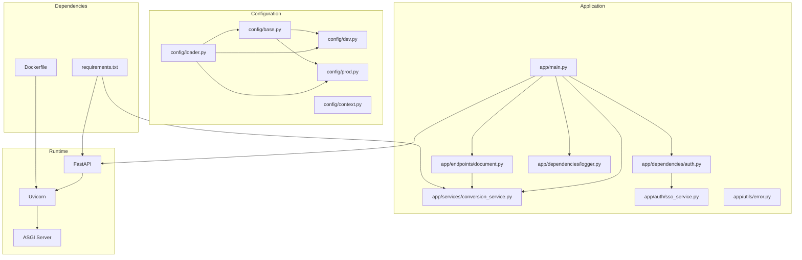
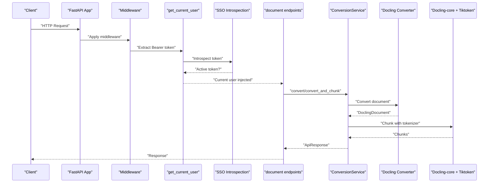
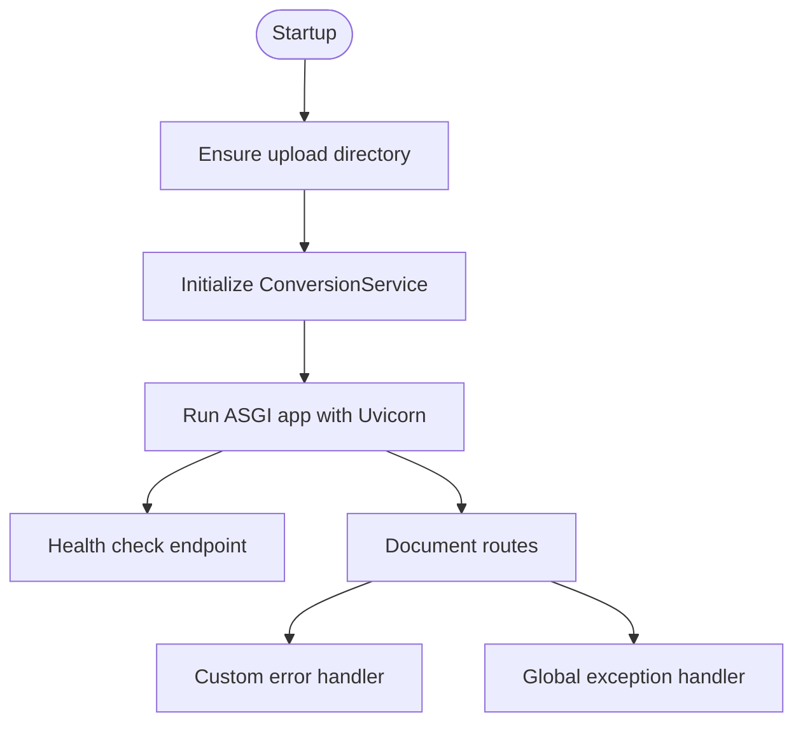
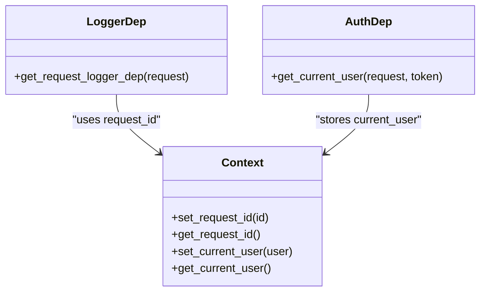
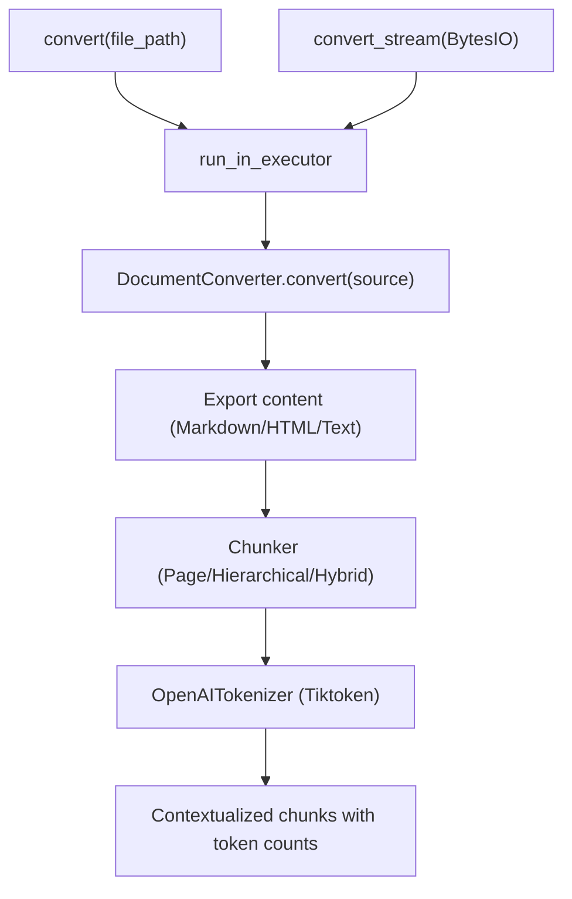
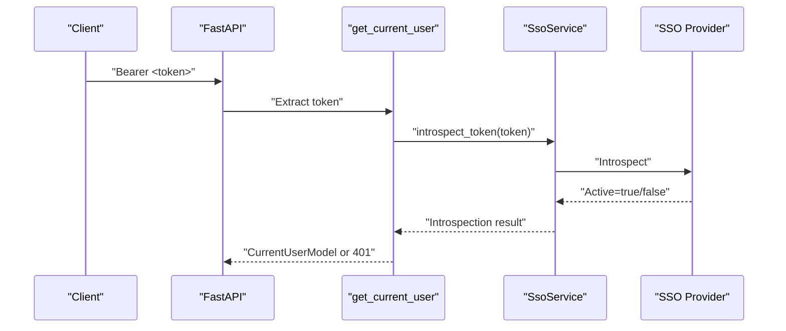
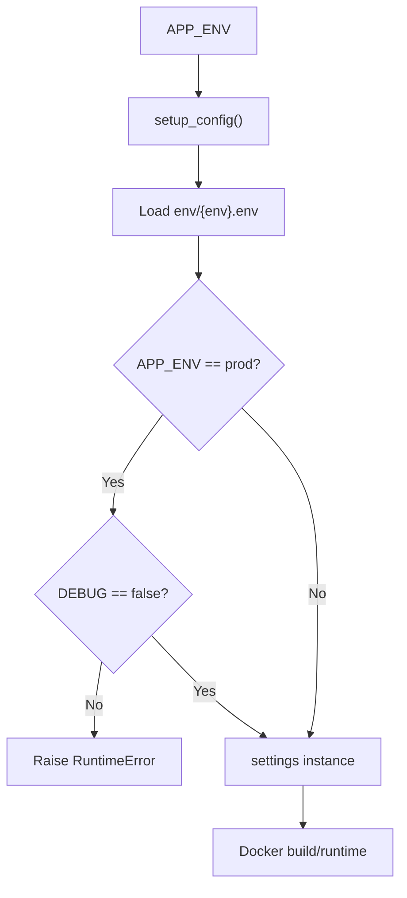
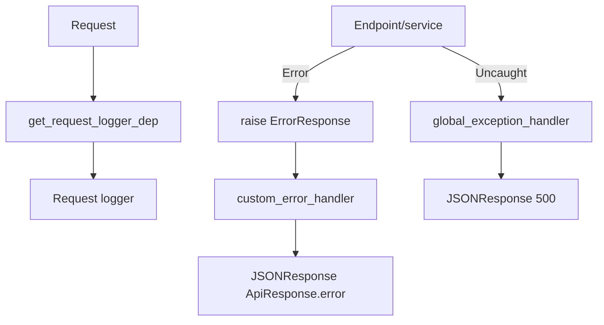
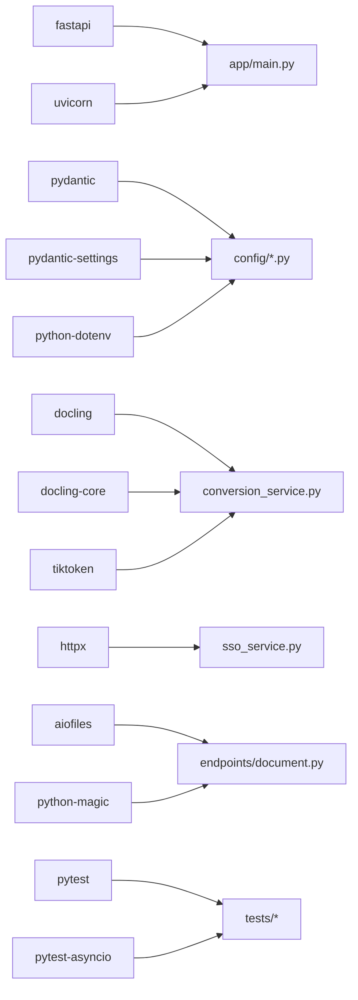

# Technology Stack & Dependencies

<cite>
**Referenced Files in This Document**
- [requirements.txt](file://requirements.txt)
- [Dockerfile](file://Dockerfile)
- [app/main.py](file://app/main.py)
- [config/base.py](file://config/base.py)
- [config/dev.py](file://config/dev.py)
- [config/prod.py](file://config/prod.py)
- [config/loader.py](file://config/loader.py)
- [config/context.py](file://config/context.py)
- [app/dependencies/__init__.py](file://app/dependencies/__init__.py)
- [app/dependencies/auth.py](file://app/dependencies/auth.py)
- [app/dependencies/logger.py](file://app/dependencies/logger.py)
- [app/endpoints/document.py](file://app/endpoints/document.py)
- [app/services/conversion_service.py](file://app/services/conversion_service.py)
- [app/auth/sso_service.py](file://app/auth/sso_service.py)
- [app/utils/error.py](file://app/utils/error.py)
- [pytest.ini](file://pytest.ini)
</cite>

## Table of Contents
1. [Introduction](#introduction)
2. [Project Structure](#project-structure)
3. [Core Components](#core-components)
4. [Architecture Overview](#architecture-overview)
5. [Detailed Component Analysis](#detailed-component-analysis)
6. [Dependency Analysis](#dependency-analysis)
7. [Performance Considerations](#performance-considerations)
8. [Troubleshooting Guide](#troubleshooting-guide)
9. [Conclusion](#conclusion)
10. [Appendices](#appendices)

## Introduction
This document describes the technology stack and dependencies for the document processing API. It covers the Python-based FastAPI application with an ASGI server powered by Uvicorn, the core libraries for document conversion and chunking, token counting, environment configuration, dependency injection, logging, error handling, testing, and external SSO/OAuth2 integrations. It also includes containerization details, runtime performance tuning, and version compatibility considerations.

## Project Structure
The project follows a layered structure:
- Application entrypoint initializes FastAPI with middleware, routers, and lifecycle hooks.
- Configuration is environment-driven with Pydantic settings and dotenv loading.
- Services encapsulate domain logic (document conversion, chunking, file handling).
- Authentication integrates with an SSO provider using token introspection.
- Testing is configured with pytest and asyncio support.

**Diagram sources**
- [app/main.py:73-81](file://app/main.py#L73-L81)
- [app/endpoints/document.py:15-19](file://app/endpoints/document.py#L15-L19)
- [app/services/conversion_service.py:89-96](file://app/services/conversion_service.py#L89-L96)
- [app/dependencies/auth.py:23-26](file://app/dependencies/auth.py#L23-L26)
- [app/dependencies/logger.py:8-19](file://app/dependencies/logger.py#L8-L19)
- [app/auth/sso_service.py:8-16](file://app/auth/sso_service.py#L8-L16)
- [app/utils/error.py:4-16](file://app/utils/error.py#L4-L16)
- [config/base.py:9-57](file://config/base.py#L9-L57)
- [config/dev.py:3-12](file://config/dev.py#L3-L12)
- [config/prod.py:3-6](file://config/prod.py#L3-L6)
- [config/loader.py:9-51](file://config/loader.py#L9-L51)
- [config/context.py:5-33](file://config/context.py#L5-L33)
- [requirements.txt:1-15](file://requirements.txt#L1-L15)
- [Dockerfile:1-94](file://Dockerfile#L1-L94)

**Section sources**
- [app/main.py:73-81](file://app/main.py#L73-L81)
- [config/loader.py:9-51](file://config/loader.py#L9-L51)
- [requirements.txt:1-15](file://requirements.txt#L1-L15)
- [Dockerfile:1-94](file://Dockerfile#L1-L94)

## Core Components
- FastAPI application with lifespan management, middleware, and exception handlers.
- Conversion service integrating Docling for PDF/image/office/text formats, OCR options, and chunking with Docling-core and Tiktoken.
- Environment configuration via Pydantic settings with dev/test/prod variants and dotenv loading.
- Dependency injection for authentication and request-scoped logging.
- SSO integration using token introspection and OAuth2 bearer flow.
- Error handling with a custom exception class and global handlers.
- Testing with pytest and asyncio mode.

**Section sources**
- [app/main.py:49-81](file://app/main.py#L49-L81)
- [app/services/conversion_service.py:28-67](file://app/services/conversion_service.py#L28-L67)
- [config/base.py:9-57](file://config/base.py#L9-L57)
- [config/dev.py:3-12](file://config/dev.py#L3-L12)
- [config/prod.py:3-6](file://config/prod.py#L3-L6)
- [app/dependencies/auth.py:23-26](file://app/dependencies/auth.py#L23-L26)
- [app/dependencies/logger.py:8-19](file://app/dependencies/logger.py#L8-L19)
- [app/auth/sso_service.py:8-16](file://app/auth/sso_service.py#L8-L16)
- [app/utils/error.py:4-16](file://app/utils/error.py#L4-L16)
- [pytest.ini:1-11](file://pytest.ini#L1-L11)

## Architecture Overview
The system is an ASGI application using FastAPI and Uvicorn. Requests pass through middleware, are authenticated via SSO, and are routed to endpoints that delegate to services. The conversion service manages a shared thread pool and a pre-warmed Docling converter. Chunking leverages Docling-core and Tiktoken. Configuration is environment-aware and loaded via dotenv.

**Diagram sources**
- [app/main.py:83-95](file://app/main.py#L83-L95)
- [app/dependencies/auth.py:23-26](file://app/dependencies/auth.py#L23-L26)
- [app/auth/sso_service.py:50-53](file://app/auth/sso_service.py#L50-L53)
- [app/endpoints/document.py:101-160](file://app/endpoints/document.py#L101-L160)
- [app/services/conversion_service.py:133-174](file://app/services/conversion_service.py#L133-L174)
- [app/services/conversion_service.py:266-343](file://app/services/conversion_service.py#L266-L343)

## Detailed Component Analysis

### FastAPI Application and ASGI Server
- Lifespan initializes the conversion service and ensures the upload directory.
- Middleware order: correlation ID first, then logging; CORS applied globally.
- Root and health endpoints expose environment and converter status.
- Global exception handlers manage custom and unhandled errors.

**Diagram sources**
- [app/main.py:49-71](file://app/main.py#L49-L71)
- [app/main.py:116-131](file://app/main.py#L116-L131)
- [app/main.py:135-160](file://app/main.py#L135-L160)

**Section sources**
- [app/main.py:49-81](file://app/main.py#L49-L81)
- [app/main.py:116-160](file://app/main.py#L116-L160)

### Dependency Injection System
- Request-scoped logger dependency provides contextual logging per route.
- Authentication dependency validates Bearer tokens via SSO introspection and stores user context.
- Exported dependency symbols are exposed via package init.

**Diagram sources**
- [app/dependencies/logger.py:8-19](file://app/dependencies/logger.py#L8-L19)
- [app/dependencies/auth.py:23-26](file://app/dependencies/auth.py#L23-L26)
- [config/context.py:5-33](file://config/context.py#L5-L33)

**Section sources**
- [app/dependencies/__init__.py:1-8](file://app/dependencies/__init__.py#L1-L8)
- [app/dependencies/logger.py:8-19](file://app/dependencies/logger.py#L8-L19)
- [app/dependencies/auth.py:23-26](file://app/dependencies/auth.py#L23-L26)
- [config/context.py:5-33](file://config/context.py#L5-L33)

### Document Conversion and Chunking Pipeline
- ConversionService creates and caches a DocumentConverter with configurable OCR and threading.
- Supports file-based and stream-based conversion paths.
- Chunking uses Docling-core chunkers with Tiktoken tokenizer to produce token-limited chunks.
- Combined conversion-and-chunking methods return structured results with timing and metadata.

**Diagram sources**
- [app/services/conversion_service.py:133-174](file://app/services/conversion_service.py#L133-L174)
- [app/services/conversion_service.py:175-217](file://app/services/conversion_service.py#L175-L217)
- [app/services/conversion_service.py:266-343](file://app/services/conversion_service.py#L266-L343)
- [app/services/conversion_service.py:288-291](file://app/services/conversion_service.py#L288-L291)

**Section sources**
- [app/services/conversion_service.py:28-67](file://app/services/conversion_service.py#L28-L67)
- [app/services/conversion_service.py:133-174](file://app/services/conversion_service.py#L133-L174)
- [app/services/conversion_service.py:266-343](file://app/services/conversion_service.py#L266-L343)

### SSO Authentication and OAuth2 Flow
- Authentication uses OAuth2 Bearer tokens validated via SSO introspection.
- When disabled (e.g., dev/test), a mock user is returned for convenience.
- SSO service wraps a client to exchange authorization codes, fetch user info, refresh tokens, and introspect tokens.

**Diagram sources**
- [app/dependencies/auth.py:23-26](file://app/dependencies/auth.py#L23-L26)
- [app/dependencies/auth.py:74-90](file://app/dependencies/auth.py#L74-L90)
- [app/auth/sso_service.py:50-53](file://app/auth/sso_service.py#L50-L53)

**Section sources**
- [app/dependencies/auth.py:23-26](file://app/dependencies/auth.py#L23-L26)
- [app/dependencies/auth.py:38-56](file://app/dependencies/auth.py#L38-L56)
- [app/dependencies/auth.py:74-90](file://app/dependencies/auth.py#L74-L90)
- [app/auth/sso_service.py:8-16](file://app/auth/sso_service.py#L8-L16)

### Environment Configuration and Containerization
- Environment selection via APP_ENV with dotenv loading for dev/test/prod.
- Production guard disables DEBUG to prevent misconfiguration.
- Dockerfile stages build dependencies and run a slimmed runtime image with CUDA runtime and non-root user.
- Health checks and exposed port align with Uvicorn configuration.

**Diagram sources**
- [config/loader.py:9-51](file://config/loader.py#L9-L51)
- [config/base.py:12-14](file://config/base.py#L12-L14)
- [config/prod.py:4-5](file://config/prod.py#L4-L5)
- [Dockerfile:45-94](file://Dockerfile#L45-L94)

**Section sources**
- [config/loader.py:9-51](file://config/loader.py#L9-L51)
- [config/base.py:12-14](file://config/base.py#L12-L14)
- [config/dev.py:4-11](file://config/dev.py#L4-L11)
- [config/prod.py:4-5](file://config/prod.py#L4-L5)
- [Dockerfile:45-94](file://Dockerfile#L45-L94)

### Logging and Error Handling
- Request-scoped logger attaches method, path, and client IP to log records.
- Custom ErrorResponse exception carries error code/message/data.
- Global handlers translate custom exceptions to JSON responses and log errors.

**Diagram sources**
- [app/dependencies/logger.py:8-19](file://app/dependencies/logger.py#L8-L19)
- [app/utils/error.py:4-16](file://app/utils/error.py#L4-L16)
- [app/main.py:135-160](file://app/main.py#L135-L160)

**Section sources**
- [app/dependencies/logger.py:8-19](file://app/dependencies/logger.py#L8-L19)
- [app/utils/error.py:4-16](file://app/utils/error.py#L4-L16)
- [app/main.py:135-160](file://app/main.py#L135-L160)

### Testing Infrastructure
- Pytest configuration enables asyncio mode, sets test discovery, and filters warnings.
- Tests reside under the tests directory and can leverage FastAPI test clients and dependency overrides.

**Section sources**
- [pytest.ini:1-11](file://pytest.ini#L1-L11)

## Dependency Analysis
The application relies on:
- FastAPI and Uvicorn for ASGI server and routing.
- Docling for document conversion and Docling-core for chunking algorithms.
- Tiktoken for token counting during chunking.
- Pydantic and pydantic-settings for typed configuration.
- httpx for HTTP operations (used by SSO client).
- aiofiles and python-magic for async file operations and MIME detection.
- python-dotenv for environment loading.
- pytest and pytest-asyncio for testing.

**Diagram sources**
- [requirements.txt:1-15](file://requirements.txt#L1-L15)
- [app/main.py:5-22](file://app/main.py#L5-L22)
- [app/services/conversion_service.py:10-25](file://app/services/conversion_service.py#L10-L25)
- [app/auth/sso_service.py:3-5](file://app/auth/sso_service.py#L3-L5)
- [app/endpoints/document.py:6-13](file://app/endpoints/document.py#L6-L13)
- [pytest.ini:1-11](file://pytest.ini#L1-L11)

**Section sources**
- [requirements.txt:1-15](file://requirements.txt#L1-L15)
- [app/services/conversion_service.py:10-25](file://app/services/conversion_service.py#L10-L25)
- [app/auth/sso_service.py:3-5](file://app/auth/sso_service.py#L3-L5)
- [app/endpoints/document.py:6-13](file://app/endpoints/document.py#L6-L13)

## Performance Considerations
- Thread pool sizing: Tune THREAD_POOL_SIZE and CONVERTER_NUM_THREADS for CPU-bound workloads.
- Streaming vs file-based conversion: Use MAX_STREAM_SIZE to decide when to stream vs write to disk.
- GPU acceleration: Docling accelerator options can utilize GPU devices; ensure CUDA runtime availability in containers.
- Async I/O: aiofiles and async endpoints minimize blocking during file operations.
- Health checks and readiness: Use the /health endpoint to monitor converter status and environment.

[No sources needed since this section provides general guidance]

## Troubleshooting Guide
- Missing or invalid Bearer token: Ensure Authorization header is present and active via SSO introspection.
- Converter initialization failures: The service attempts a fallback initialization; check logs for detailed errors.
- File size limits: Exceeding MAX_FILE_SIZE triggers HTTP 413; use resumable uploads if needed.
- Configuration errors: Production requires DEBUG=false; otherwise a runtime error is raised.
- Logging: Use request-scoped logger to correlate logs with requests and endpoints.

**Section sources**
- [app/dependencies/auth.py:58-71](file://app/dependencies/auth.py#L58-L71)
- [app/dependencies/auth.py:84-90](file://app/dependencies/auth.py#L84-L90)
- [app/services/conversion_service.py:107-131](file://app/services/conversion_service.py#L107-L131)
- [app/endpoints/document.py:253-257](file://app/endpoints/document.py#L253-L257)
- [config/loader.py:38-40](file://config/loader.py#L38-L40)
- [app/dependencies/logger.py:8-19](file://app/dependencies/logger.py#L8-L19)

## Conclusion
The API combines FastAPI, Uvicorn, and Docling to deliver robust document processing with chunking and token-aware segmentation. Environment-driven configuration, dependency injection, and SSO-based authentication provide a secure and maintainable foundation. Containerization and runtime tuning enable efficient deployment across diverse infrastructures.

[No sources needed since this section summarizes without analyzing specific files]

## Appendices

### Version Compatibility and Upgrade Considerations
- FastAPI and Uvicorn: Align minor versions; ensure ASGI server compatibility and middleware updates.
- Docling and Docling-core: Keep synchronized versions to avoid breaking changes in converters and chunkers.
- Tiktoken: Track upstream changes; pin compatible versions to prevent tokenizer mismatches.
- Pydantic and pydantic-settings: Follow semantic versioning; test configuration parsing after upgrades.
- Python version: The Dockerfile targets Python 3.11; verify third-party wheels availability for that interpreter.

[No sources needed since this section provides general guidance]

### Build and Runtime Tuning
- Multi-stage Docker build: Separates dependency installation from runtime image to reduce size.
- Non-root user: Improves security posture; ensure proper permissions for upload/data/output directories.
- Health checks: Monitor application readiness and converter status.
- Environment-specific tuning: Adjust THREAD_POOL_SIZE, CONVERTER_NUM_THREADS, and MAX_STREAM_SIZE per workload.

**Section sources**
- [Dockerfile:45-94](file://Dockerfile#L45-L94)
- [config/base.py:28-29](file://config/base.py#L28-L29)
- [config/base.py:24-25](file://config/base.py#L24-L25)