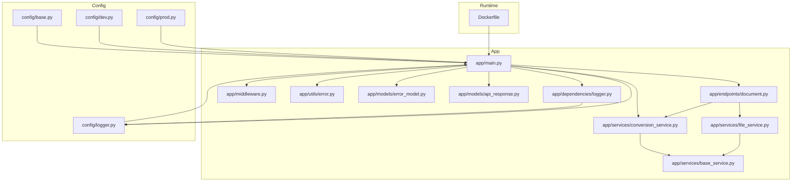
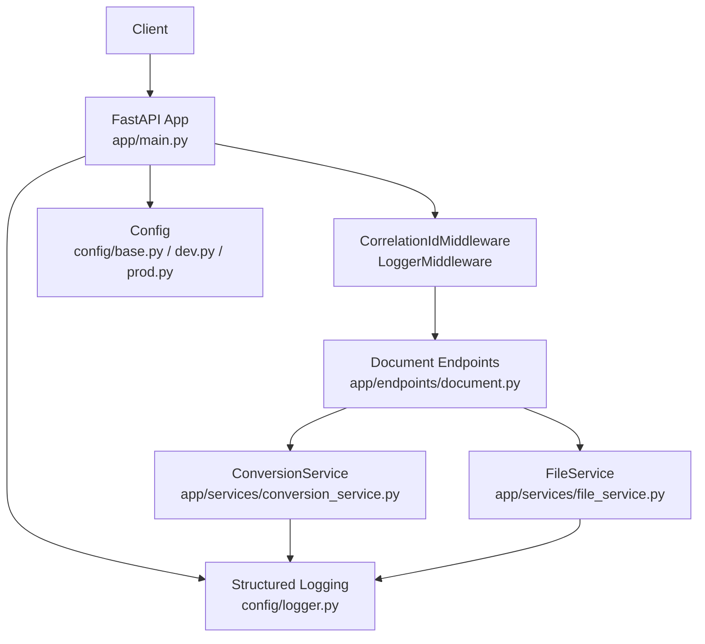
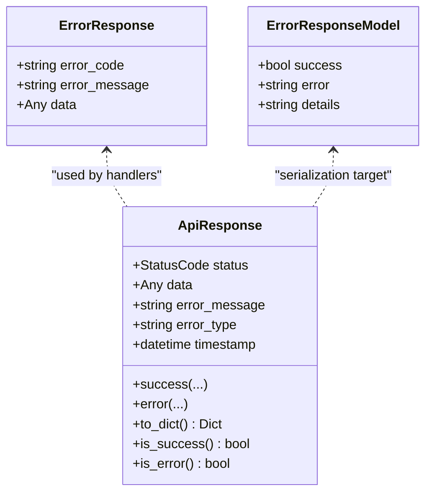
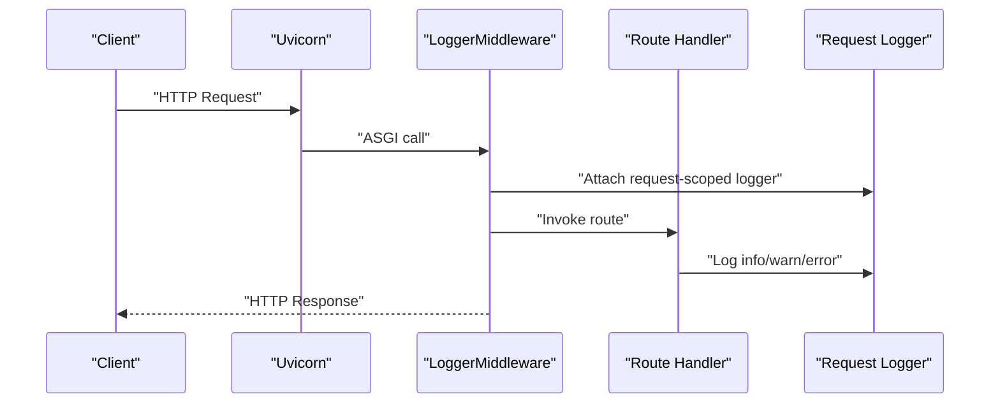
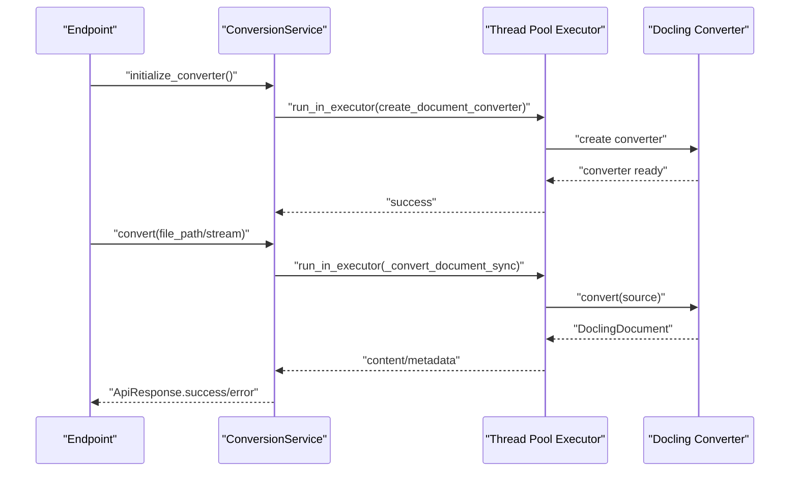
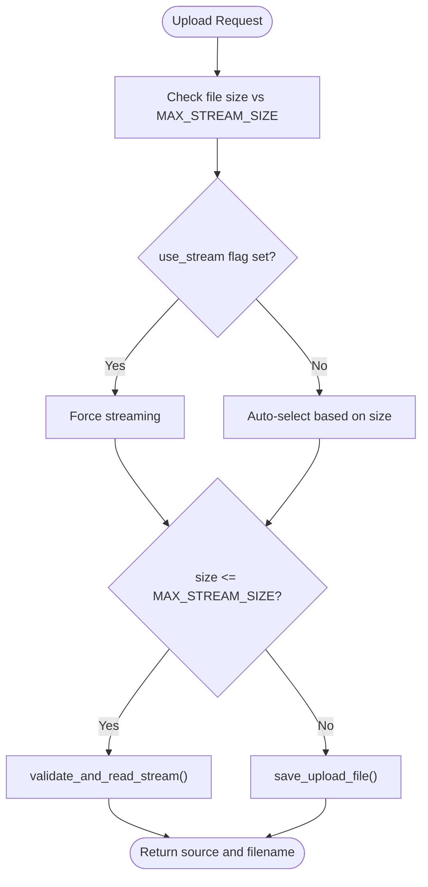
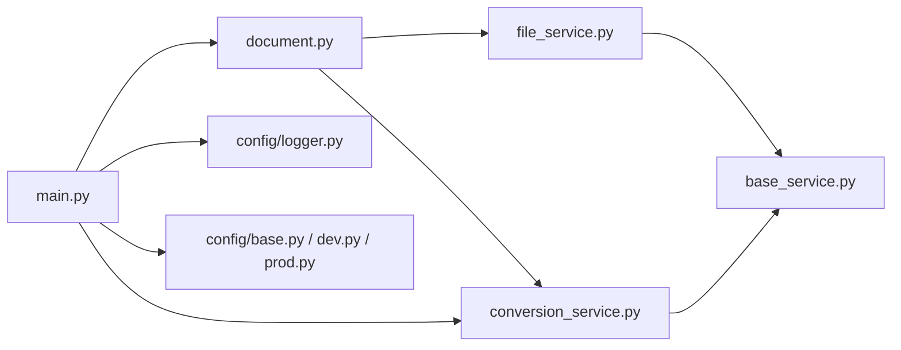

# Troubleshooting & FAQ

<cite>
**Referenced Files in This Document**
- [app/main.py](file://app/main.py)
- [app/middleware.py](file://app/middleware.py)
- [app/dependencies/logger.py](file://app/dependencies/logger.py)
- [config/logger.py](file://config/logger.py)
- [config/base.py](file://config/base.py)
- [config/dev.py](file://config/dev.py)
- [config/prod.py](file://config/prod.py)
- [app/endpoints/document.py](file://app/endpoints/document.py)
- [app/services/file_service.py](file://app/services/file_service.py)
- [app/services/conversion_service.py](file://app/services/conversion_service.py)
- [app/services/base_service.py](file://app/services/base_service.py)
- [app/models/api_response.py](file://app/models/api_response.py)
- [app/models/error_model.py](file://app/models/error_model.py)
- [app/utils/error.py](file://app/utils/error.py)
- [Dockerfile](file://Dockerfile)
</cite>

## Table of Contents
1. [Introduction](#introduction)
2. [Project Structure](#project-structure)
3. [Core Components](#core-components)
4. [Architecture Overview](#architecture-overview)
5. [Detailed Component Analysis](#detailed-component-analysis)
6. [Dependency Analysis](#dependency-analysis)
7. [Performance Considerations](#performance-considerations)
8. [Troubleshooting Guide](#troubleshooting-guide)
9. [Conclusion](#conclusion)
10. [Appendices](#appendices)

## Introduction
This document provides a comprehensive troubleshooting and FAQ guide for the Docling Document Processing API. It focuses on diagnosing and resolving common issues such as document conversion failures, upload interruptions, authentication errors, and performance bottlenecks. It also documents the error classification system, standardized error response formats, structured logging patterns, diagnostic tools, and operational guidance for Docker deployments and integrations.

## Project Structure
The system is organized around a FastAPI application with modular services for file handling and document conversion, robust logging and request context propagation, and environment-specific configuration. Key areas include:
- Application lifecycle and error handling
- Middleware for correlation IDs and request logging
- Logging configuration with structured JSON output
- Document processing endpoints with streaming and resumable upload support
- File service for validation, streaming, and resumable uploads
- Conversion service for Docling-based processing and chunking
- Shared configuration and environment profiles

**Diagram sources**
- [app/main.py:1-160](file://app/main.py#L1-L160)
- [app/middleware.py:1-99](file://app/middleware.py#L1-L99)
- [app/dependencies/logger.py:1-20](file://app/dependencies/logger.py#L1-L20)
- [config/logger.py:1-110](file://config/logger.py#L1-L110)
- [config/base.py:1-57](file://config/base.py#L1-L57)
- [config/dev.py:1-12](file://config/dev.py#L1-L12)
- [config/prod.py:1-6](file://config/prod.py#L1-L6)
- [app/endpoints/document.py:1-353](file://app/endpoints/document.py#L1-L353)
- [app/services/file_service.py:1-347](file://app/services/file_service.py#L1-L347)
- [app/services/conversion_service.py:1-478](file://app/services/conversion_service.py#L1-L478)
- [app/services/base_service.py:1-29](file://app/services/base_service.py#L1-L29)
- [app/models/api_response.py:1-193](file://app/models/api_response.py#L1-L193)
- [app/models/error_model.py:1-13](file://app/models/error_model.py#L1-L13)
- [app/utils/error.py:1-17](file://app/utils/error.py#L1-L17)
- [Dockerfile:1-94](file://Dockerfile#L1-L94)

**Section sources**
- [app/main.py:1-160](file://app/main.py#L1-L160)
- [app/middleware.py:1-99](file://app/middleware.py#L1-L99)
- [config/logger.py:1-110](file://config/logger.py#L1-L110)
- [config/base.py:1-57](file://config/base.py#L1-L57)

## Core Components
- Application lifecycle and error handling:
  - Startup ensures upload directory existence and initializes a singleton conversion service with a shared thread pool.
  - Global exception handlers standardize error responses for typed exceptions and unhandled errors.
- Middleware:
  - CorrelationIdMiddleware generates and propagates X-Request-ID for cross-service tracing.
  - LoggerMiddleware attaches a request-scoped logger and logs request lifecycle events.
- Logging:
  - Structured JSON logging in production with request context and user context filters.
  - Service loggers for non-request operations with preserved context.
- Endpoints:
  - Document conversion and chunking endpoints support streaming and resumable uploads.
  - Automatic selection between streaming and file-based processing based on size thresholds.
- File service:
  - Validates file types and sizes, streams into memory for small files, writes to disk for large files, and manages resumable sessions.
- Conversion service:
  - Initializes Docling converter with configurable OCR and threading options.
  - Converts and chunks documents asynchronously using a shared thread pool.
- Response models:
  - Standardized ApiResponse with success/error semantics and optional pagination fields.
  - Error response model for API error serialization.

**Section sources**
- [app/main.py:25-71](file://app/main.py#L25-L71)
- [app/main.py:133-160](file://app/main.py#L133-L160)
- [app/middleware.py:7-99](file://app/middleware.py#L7-L99)
- [config/logger.py:8-110](file://config/logger.py#L8-L110)
- [app/dependencies/logger.py:1-20](file://app/dependencies/logger.py#L1-L20)
- [app/endpoints/document.py:27-41](file://app/endpoints/document.py#L27-L41)
- [app/endpoints/document.py:101-160](file://app/endpoints/document.py#L101-L160)
- [app/endpoints/document.py:162-231](file://app/endpoints/document.py#L162-L231)
- [app/endpoints/document.py:238-353](file://app/endpoints/document.py#L238-L353)
- [app/services/file_service.py:35-98](file://app/services/file_service.py#L35-L98)
- [app/services/file_service.py:110-163](file://app/services/file_service.py#L110-L163)
- [app/services/file_service.py:194-324](file://app/services/file_service.py#L194-L324)
- [app/services/conversion_service.py:89-132](file://app/services/conversion_service.py#L89-L132)
- [app/services/conversion_service.py:133-174](file://app/services/conversion_service.py#L133-L174)
- [app/services/conversion_service.py:266-343](file://app/services/conversion_service.py#L266-L343)
- [app/models/api_response.py:14-122](file://app/models/api_response.py#L14-L122)
- [app/models/error_model.py:8-13](file://app/models/error_model.py#L8-L13)

## Architecture Overview
The system follows a layered architecture:
- Entry points: FastAPI routes under a single router.
- Orchestration: Endpoints coordinate file preparation and delegate to services.
- Services: FileService handles validation, streaming, and resumable uploads; ConversionService performs conversion and chunking.
- Infrastructure: Middleware, logging, and configuration provide cross-cutting concerns.

**Diagram sources**
- [app/main.py:73-99](file://app/main.py#L73-L99)
- [app/middleware.py:7-99](file://app/middleware.py#L7-L99)
- [app/endpoints/document.py:1-353](file://app/endpoints/document.py#L1-L353)
- [app/services/file_service.py:1-347](file://app/services/file_service.py#L1-L347)
- [app/services/conversion_service.py:1-478](file://app/services/conversion_service.py#L1-L478)
- [config/logger.py:1-110](file://config/logger.py#L1-L110)
- [config/base.py:1-57](file://config/base.py#L1-L57)
- [config/dev.py:1-12](file://config/dev.py#L1-L12)
- [config/prod.py:1-6](file://config/prod.py#L1-L6)

## Detailed Component Analysis

### Error Classification and Response Formats
- Typed application errors:
  - ErrorResponse class encapsulates error_code, error_message, and optional data payload.
- API response model:
  - ApiResponse defines standardized success/error responses with status, data, error_message, error_type, and timestamps.
  - Validation enforces that error_message is only present when status indicates error.
- Error response model:
  - ErrorResponseModel serializes API error responses consistently across endpoints.
- Exception handlers:
  - Custom error handler maps typed ErrorResponse to 400 with ApiResponse.error.
  - Global exception handler maps unhandled exceptions to 500 with standardized error message.

**Diagram sources**
- [app/utils/error.py:4-17](file://app/utils/error.py#L4-L17)
- [app/models/api_response.py:14-122](file://app/models/api_response.py#L14-L122)
- [app/models/error_model.py:8-13](file://app/models/error_model.py#L8-L13)
- [app/main.py:135-160](file://app/main.py#L135-L160)

**Section sources**
- [app/utils/error.py:1-17](file://app/utils/error.py#L1-L17)
- [app/models/api_response.py:14-122](file://app/models/api_response.py#L14-L122)
- [app/models/error_model.py:1-13](file://app/models/error_model.py#L1-L13)
- [app/main.py:135-160](file://app/main.py#L135-L160)

### Logging and Context Propagation
- Request-scoped logging:
  - get_request_logger_dep provides a logger attached to the request with method, path, and client IP.
  - LoggerMiddleware attaches a logger to the ASGI scope and logs request lifecycle.
- Structured JSON logging:
  - JSONFormatter emits JSON logs in production with request_id, user context, module, function, line, and exception details.
  - ContextFilter enriches logs with request_id and user identity when available.
- Service logging:
  - get_service_logger provides non-request loggers with system context for background tasks.

**Diagram sources**
- [app/middleware.py:47-99](file://app/middleware.py#L47-L99)
- [app/dependencies/logger.py:8-19](file://app/dependencies/logger.py#L8-L19)
- [config/logger.py:85-110](file://config/logger.py#L85-L110)

**Section sources**
- [app/dependencies/logger.py:1-20](file://app/dependencies/logger.py#L1-L20)
- [config/logger.py:8-110](file://config/logger.py#L8-L110)
- [app/middleware.py:47-99](file://app/middleware.py#L47-L99)

### Document Conversion Workflow
- Initialization:
  - ConversionService initializes a shared DocumentConverter with OCR and threading options.
- Conversion:
  - convert and convert_stream handle file path and BytesIO inputs respectively.
  - _convert_document_sync executes conversion on a thread pool and returns structured results.
- Chunking:
  - chunk uses hierarchical, page, or hybrid chunkers with tokenization.
- Combined operations:
  - convert_and_chunk and convert_and_chunk_stream combine conversion and chunking with unified timing.

**Diagram sources**
- [app/services/conversion_service.py:89-132](file://app/services/conversion_service.py#L89-L132)
- [app/services/conversion_service.py:133-174](file://app/services/conversion_service.py#L133-L174)
- [app/services/conversion_service.py:219-264](file://app/services/conversion_service.py#L219-L264)

**Section sources**
- [app/services/conversion_service.py:89-132](file://app/services/conversion_service.py#L89-L132)
- [app/services/conversion_service.py:133-174](file://app/services/conversion_service.py#L133-L174)
- [app/services/conversion_service.py:266-343](file://app/services/conversion_service.py#L266-L343)

### Upload and Streaming Decision Logic
- Auto-selection:
  - _should_use_stream decides streaming vs file-based based on use_stream preference or file size vs MAX_STREAM_SIZE.
- FileService:
  - save_upload_file validates size/type and writes to disk.
  - validate_and_read_stream validates and streams into BytesIO for small files.
- Resumable upload:
  - init_upload creates sessions with expiry pruning.
  - append_upload writes chunks with optional Content-Range support and validates on completion.

**Diagram sources**
- [app/endpoints/document.py:27-41](file://app/endpoints/document.py#L27-L41)
- [app/endpoints/document.py:43-94](file://app/endpoints/document.py#L43-L94)
- [app/services/file_service.py:35-98](file://app/services/file_service.py#L35-L98)
- [app/services/file_service.py:110-163](file://app/services/file_service.py#L110-L163)

**Section sources**
- [app/endpoints/document.py:27-41](file://app/endpoints/document.py#L27-L41)
- [app/endpoints/document.py:43-94](file://app/endpoints/document.py#L43-L94)
- [app/services/file_service.py:35-98](file://app/services/file_service.py#L35-L98)
- [app/services/file_service.py:110-163](file://app/services/file_service.py#L110-L163)

## Dependency Analysis
- Coupling and cohesion:
  - Endpoints depend on FileService and ConversionService for orchestration.
  - Services inherit BaseService to preserve request context in logs.
  - Logging is centralized via config/logger.py with request/user context filters.
- External dependencies:
  - Docling for document conversion and chunking.
  - magic for MIME type detection.
  - aiofiles for asynchronous file I/O.
- Configuration:
  - Environment-specific settings override base defaults.

**Diagram sources**
- [app/endpoints/document.py:1-353](file://app/endpoints/document.py#L1-L353)
- [app/services/file_service.py:1-347](file://app/services/file_service.py#L1-L347)
- [app/services/conversion_service.py:1-478](file://app/services/conversion_service.py#L1-L478)
- [app/services/base_service.py:1-29](file://app/services/base_service.py#L1-L29)
- [app/main.py:1-160](file://app/main.py#L1-L160)
- [config/logger.py:1-110](file://config/logger.py#L1-L110)
- [config/base.py:1-57](file://config/base.py#L1-L57)
- [config/dev.py:1-12](file://config/dev.py#L1-L12)
- [config/prod.py:1-6](file://config/prod.py#L1-L6)

**Section sources**
- [app/endpoints/document.py:1-353](file://app/endpoints/document.py#L1-L353)
- [app/services/file_service.py:1-347](file://app/services/file_service.py#L1-L347)
- [app/services/conversion_service.py:1-478](file://app/services/conversion_service.py#L1-L478)
- [app/services/base_service.py:1-29](file://app/services/base_service.py#L1-L29)
- [app/main.py:1-160](file://app/main.py#L1-L160)
- [config/logger.py:1-110](file://config/logger.py#L1-L110)
- [config/base.py:1-57](file://config/base.py#L1-L57)
- [config/dev.py:1-12](file://config/dev.py#L1-L12)
- [config/prod.py:1-6](file://config/prod.py#L1-L6)

## Performance Considerations
- Threading and concurrency:
  - ConversionService uses a shared ThreadPoolExecutor sized by THREAD_POOL_SIZE.
  - Docling converter threads configured via CONVERTER_NUM_THREADS.
- Memory usage:
  - Streaming mode avoids disk writes for files within MAX_STREAM_SIZE.
  - Large files are written to disk; ensure sufficient disk space and permissions.
- Throughput:
  - Pre-warming the converter at startup reduces cold-start latency.
  - Use chunking with appropriate max_tokens to balance memory and processing time.
- Monitoring:
  - Track processing_time and total_chunks in logs and responses.
  - Use health checks to monitor converter readiness.

[No sources needed since this section provides general guidance]

## Troubleshooting Guide

### Error Classification and Response Formats
- Classify errors:
  - Application-level errors: raise ErrorResponse with error_code and error_message; handled by custom error handler.
  - Unhandled exceptions: mapped to 500 with standardized error message.
- Response format:
  - ApiResponse.success for successful outcomes; ApiResponse.error for failures with optional error_type and data.
  - Error responses serialized via ErrorResponseModel.

**Section sources**
- [app/utils/error.py:4-17](file://app/utils/error.py#L4-L17)
- [app/models/api_response.py:14-122](file://app/models/api_response.py#L14-L122)
- [app/models/error_model.py:8-13](file://app/models/error_model.py#L8-L13)
- [app/main.py:135-160](file://app/main.py#L135-L160)

### Diagnostic Procedures and Logging Patterns
- Enable structured logs:
  - In production, logs are JSON with request_id and user context; in development, logs include timestamps and request IDs.
- Trace a request:
  - Use X-Request-ID propagated by CorrelationIdMiddleware to correlate logs across services.
- Inspect logs:
  - Look for info entries indicating conversion/streaming decisions and error entries with exception details.

**Section sources**
- [config/logger.py:23-80](file://config/logger.py#L23-L80)
- [app/middleware.py:7-45](file://app/middleware.py#L7-L45)
- [app/dependencies/logger.py:8-19](file://app/dependencies/logger.py#L8-L19)

### Common Problems and Solutions

#### Document Conversion Failures
- Symptoms:
  - Conversion returns error or raises exception.
- Root causes:
  - Unsupported file type or invalid content.
  - Converter initialization failure or GPU/CUDA issues.
  - Out-of-memory conditions for large documents.
- Diagnostics:
  - Check logs around conversion start and error messages.
  - Verify supported formats and file size limits.
  - Review converter initialization logs and fallback attempts.
- Fixes:
  - Validate file type and size before conversion.
  - Reduce max_tokens or disable OCR to lower memory usage.
  - Ensure CUDA runtime and Docling dependencies are available in container.

**Section sources**
- [app/services/conversion_service.py:107-131](file://app/services/conversion_service.py#L107-L131)
- [app/services/conversion_service.py:258-264](file://app/services/conversion_service.py#L258-L264)
- [app/services/file_service.py:48-64](file://app/services/file_service.py#L48-L64)
- [config/base.py:18-26](file://config/base.py#L18-L26)
- [Dockerfile:4-26](file://Dockerfile#L4-L26)

#### Upload Interruptions and Resumable Upload Issues
- Symptoms:
  - 400/413 errors during upload or resumable chunk append.
  - Session not found or already completed.
- Root causes:
  - File exceeds MAX_FILE_SIZE.
  - Unsupported MIME type.
  - Incorrect Content-Range header or out-of-order chunks.
- Diagnostics:
  - Inspect upload init and chunk append logs for warnings and errors.
  - Verify Content-Range format and total size alignment.
- Fixes:
  - Split large files or switch to streaming mode.
  - Confirm supported formats and correct MIME types.
  - Ensure Content-Range matches session total and write offsets are correct.

**Section sources**
- [app/endpoints/document.py:253-257](file://app/endpoints/document.py#L253-L257)
- [app/endpoints/document.py:296-300](file://app/endpoints/document.py#L296-L300)
- [app/services/file_service.py:194-220](file://app/services/file_service.py#L194-L220)
- [app/services/file_service.py:222-324](file://app/services/file_service.py#L222-L324)
- [config/base.py:18-26](file://config/base.py#L18-L26)

#### Authentication and Authorization Errors
- Symptoms:
  - Requests blocked or unauthorized responses.
- Root causes:
  - SSO/JWT misconfiguration or disabled auth in development.
- Diagnostics:
  - Check DISABLE_AUTH and SSO settings per environment.
- Fixes:
  - Configure SSO credentials and redirect URI in production.
  - Keep DISABLE_AUTH enabled only in development.

**Section sources**
- [config/base.py:39-52](file://config/base.py#L39-L52)
- [config/dev.py:11-12](file://config/dev.py#L11-L12)
- [config/prod.py:3-6](file://config/prod.py#L3-L6)

#### Performance Bottlenecks
- Symptoms:
  - Slow conversions, timeouts, or high memory usage.
- Root causes:
  - Insufficient thread pool size or converter threads.
  - Large tokens or heavy OCR.
  - Disk I/O overhead for large files.
- Diagnostics:
  - Monitor processing_time and total_chunks.
  - Observe CPU/GPU utilization and memory metrics.
- Fixes:
  - Increase THREAD_POOL_SIZE and CONVERTER_NUM_THREADS cautiously.
  - Reduce max_tokens or disable OCR for large batches.
  - Prefer streaming for smaller files; ensure disk performance for large files.

**Section sources**
- [config/base.py:27-33](file://config/base.py#L27-L33)
- [app/services/conversion_service.py:28-67](file://app/services/conversion_service.py#L28-L67)
- [app/services/conversion_service.py:266-343](file://app/services/conversion_service.py#L266-L343)

### Implementation Details of Error Utilities and Logging
- Error utility:
  - ErrorResponse class provides a typed error envelope for application-level errors.
- Error model:
  - ErrorResponseModel defines the serialized error shape returned by endpoints.
- Logging utilities:
  - get_request_logger_dep and get_service_logger create context-aware loggers.
  - JSONFormatter and ContextFilter standardize log output.

**Section sources**
- [app/utils/error.py:4-17](file://app/utils/error.py#L4-L17)
- [app/models/error_model.py:8-13](file://app/models/error_model.py#L8-L13)
- [app/dependencies/logger.py:8-19](file://app/dependencies/logger.py#L8-L19)
- [config/logger.py:85-110](file://config/logger.py#L85-L110)

### Diagnostic Tools and Techniques
- Log analysis:
  - Filter by request_id to trace end-to-end flows.
  - Search for error-level entries and exception fields.
- Performance profiling:
  - Measure processing_time and total_chunks to identify slow operations.
- Memory monitoring:
  - Watch for out-of-memory symptoms during OCR-heavy conversions.
- Health checks:
  - Use /health to confirm converter readiness.

**Section sources**
- [app/main.py:116-130](file://app/main.py#L116-L130)
- [app/services/conversion_service.py:154-158](file://app/services/conversion_service.py#L154-L158)
- [app/services/conversion_service.py:327-330](file://app/services/conversion_service.py#L327-L330)

### Escalation Procedures
- Severity escalation:
  - 4xx errors: investigate client-side issues (invalid inputs, unsupported formats).
  - 500 errors: inspect unhandled exceptions and converter initialization failures.
- Evidence collection:
  - Attach request_id, timestamps, and relevant log excerpts.
- Coordination:
  - Include environment (dev/prod), configuration overrides, and recent changes.

**Section sources**
- [app/main.py:149-159](file://app/main.py#L149-L159)
- [app/services/conversion_service.py:118-131](file://app/services/conversion_service.py#L118-L131)

### System Monitoring, Alerting, and Incident Response
- Monitoring requirements:
  - Track request rate, error rate, and latency percentiles.
  - Monitor processing_time and memory usage trends.
- Alerting thresholds:
  - High error rate (>5% over 5 minutes).
  - Elevated p95 processing_time beyond SLA.
  - Health check failures.
- Incident response:
  - Isolate failing endpoints, scale resources, and roll back recent changes.

[No sources needed since this section provides general guidance]

### Docker Deployment Troubleshooting
- Symptoms:
  - Container fails to start or health checks fail.
- Root causes:
  - Missing CUDA runtime or incompatible drivers.
  - Permissions issues for upload directories.
- Diagnostics:
  - Review Dockerfile stages and HEALTHCHECK.
  - Check container logs for startup errors.
- Fixes:
  - Ensure CUDA runtime matches container base image.
  - Verify upload directory permissions and mount points.

**Section sources**
- [Dockerfile:4-26](file://Dockerfile#L4-L26)
- [Dockerfile:78-86](file://Dockerfile#L78-L86)
- [Dockerfile:90-94](file://Dockerfile#L90-L94)
- [app/main.py:25-46](file://app/main.py#L25-L46)

### Configuration Problems
- Symptoms:
  - Unexpected behavior in dev/prod.
- Root causes:
  - Incorrect environment variables or defaults.
- Diagnostics:
  - Compare settings from base.py, dev.py, and prod.py.
- Fixes:
  - Override environment variables appropriately for each deployment.

**Section sources**
- [config/base.py:12-57](file://config/base.py#L12-L57)
- [config/dev.py:3-12](file://config/dev.py#L3-L12)
- [config/prod.py:3-6](file://config/prod.py#L3-L6)

### Integration Failures
- Symptoms:
  - Clients receive unexpected HTTP status codes or malformed responses.
- Root causes:
  - Misconfigured CORS, authentication, or endpoint parameters.
- Diagnostics:
  - Validate CORS origins and authentication flow.
  - Inspect endpoint forms and headers (Content-Range, use_stream).
- Fixes:
  - Align client headers and form parameters with documented expectations.

**Section sources**
- [app/main.py:88-95](file://app/main.py#L88-L95)
- [app/endpoints/document.py:101-160](file://app/endpoints/document.py#L101-L160)
- [app/endpoints/document.py:162-231](file://app/endpoints/document.py#L162-L231)
- [app/endpoints/document.py:238-353](file://app/endpoints/document.py#L238-L353)

### Performance Optimization and Capacity Planning
- Optimization techniques:
  - Tune THREAD_POOL_SIZE and CONVERTER_NUM_THREADS.
  - Adjust MAX_STREAM_SIZE and MAX_FILE_SIZE to balance memory and disk usage.
  - Use chunking with appropriate max_tokens.
- Resource utilization:
  - Monitor CPU/GPU utilization and memory consumption.
- Capacity planning:
  - Estimate peak concurrent conversions and allocate resources accordingly.

**Section sources**
- [config/base.py:27-33](file://config/base.py#L27-L33)
- [config/base.py:24-26](file://config/base.py#L24-L26)
- [app/services/conversion_service.py:28-67](file://app/services/conversion_service.py#L28-L67)
- [app/services/conversion_service.py:266-343](file://app/services/conversion_service.py#L266-L343)

### FAQ

#### How do I reproduce a conversion failure?
- Steps:
  - Upload a file with unsupported MIME type or exceed MAX_FILE_SIZE.
  - Trigger conversion with invalid parameters (e.g., unsupported output_type).
- Expected outcome:
  - HTTP 4xx with ApiResponse.error containing error_type and details.

**Section sources**
- [app/services/file_service.py:48-64](file://app/services/file_service.py#L48-L64)
- [app/endpoints/document.py:253-257](file://app/endpoints/document.py#L253-L257)
- [app/models/api_response.py:110-122](file://app/models/api_response.py#L110-L122)

#### Why did my upload fail?
- Checkpoints:
  - File size vs MAX_FILE_SIZE.
  - MIME type support.
  - Content-Range correctness for resumable uploads.
- Resolution:
  - Reduce file size or split into chunks.
  - Verify MIME type and Content-Range format.

**Section sources**
- [config/base.py:23-26](file://config/base.py#L23-L26)
- [app/services/file_service.py:194-220](file://app/services/file_service.py#L194-L220)
- [app/services/file_service.py:222-324](file://app/services/file_service.py#L222-L324)

#### How do I debug slow conversions?
- Actions:
  - Inspect processing_time in logs and responses.
  - Reduce max_tokens or disable OCR.
  - Prefer streaming for smaller files.

**Section sources**
- [app/services/conversion_service.py:154-158](file://app/services/conversion_service.py#L154-L158)
- [app/services/conversion_service.py:327-330](file://app/services/conversion_service.py#L327-L330)
- [config/base.py:20-22](file://config/base.py#L20-L22)

#### How do I verify the service is healthy?
- Endpoint:
  - GET /health to check converter status and environment.
- Logs:
  - Look for startup and shutdown messages.

**Section sources**
- [app/main.py:116-130](file://app/main.py#L116-L130)
- [app/main.py:56-64](file://app/main.py#L56-L64)

#### How do I enable structured logs in production?
- Behavior:
  - JSONFormatter is used in production; logs include request_id and user context.
- Verification:
  - Confirm APP_ENV and LOG_LEVEL in environment.

**Section sources**
- [config/logger.py:64-71](file://config/logger.py#L64-L71)
- [config/base.py:13-15](file://config/base.py#L13-L15)

#### How do I configure authentication for production?
- Steps:
  - Set SSO credentials and redirect URI.
  - Disable DISABLE_AUTH in production profile.
- Validation:
  - Ensure SSO endpoints are reachable and clients are registered.

**Section sources**
- [config/base.py:42-52](file://config/base.py#L42-L52)
- [config/prod.py:3-6](file://config/prod.py#L3-L6)

#### How do I troubleshoot Docker deployment issues?
- Checklist:
  - CUDA runtime compatibility.
  - Upload directory permissions.
  - HEALTHCHECK and port exposure.
- Remediation:
  - Rebuild with matching CUDA base image.
  - Fix volume mounts and permissions.

**Section sources**
- [Dockerfile:4-26](file://Dockerfile#L4-L26)
- [Dockerfile:78-86](file://Dockerfile#L78-L86)
- [Dockerfile:90-94](file://Dockerfile#L90-L94)
- [app/main.py:25-46](file://app/main.py#L25-L46)

## Conclusion
This guide consolidates error handling, logging, diagnostics, and operational best practices for the Docling Document Processing API. By leveraging structured logs, standardized error responses, and environment-aware configurations, teams can quickly diagnose and resolve issues across conversion, upload, authentication, and performance domains. Apply the troubleshooting steps and optimization techniques outlined here to maintain reliability and responsiveness in production.

## Appendices

### API Response Reference
- ApiResponse fields:
  - status: 0 for success, 4 for error.
  - data: string, dict, list of dicts, or BaseModel.
  - error_message: present only when status is error.
  - error_type: optional error category.
  - timestamp: UTC timestamp.

**Section sources**
- [app/models/api_response.py:14-40](file://app/models/api_response.py#L14-L40)

### Environment Variables Reference
- Core settings:
  - APP_NAME, APP_ENV, DEBUG, LOG_LEVEL.
  - UPLOAD_DIR, SUPPORTED_FORMATS, MAX_FILE_SIZE, MAX_STREAM_SIZE.
  - THREAD_POOL_SIZE, CONVERTER_NUM_THREADS.
  - ENABLE_TABLE_STRUCTURE, ENABLE_CELL_MATCHING.
  - CORS_ORIGINS.
  - SECRET_KEY, DISABLE_AUTH.
  - SSO_* and JWT settings.

**Section sources**
- [config/base.py:12-57](file://config/base.py#L12-L57)
- [config/dev.py:3-12](file://config/dev.py#L3-L12)
- [config/prod.py:3-6](file://config/prod.py#L3-L6)